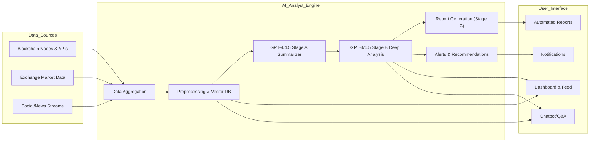
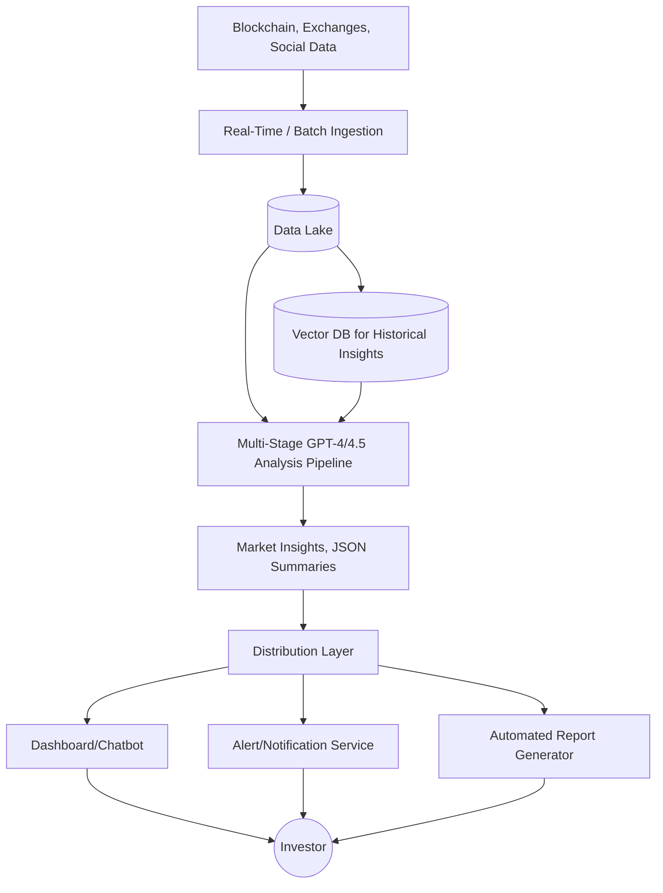
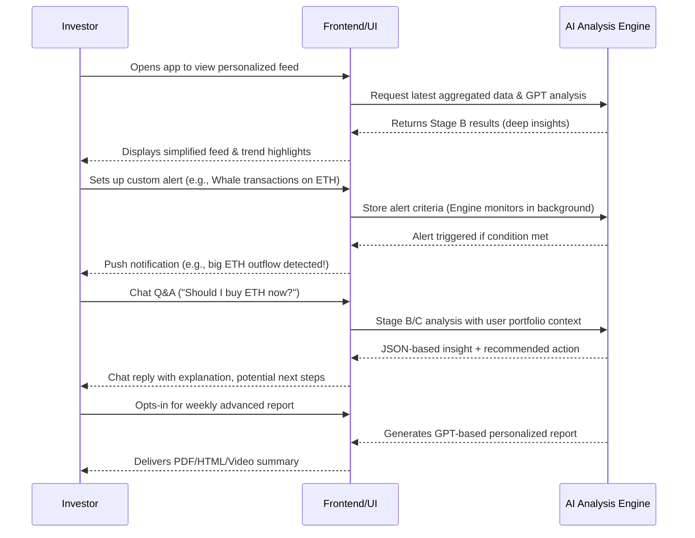

# **AI-Based Cryptocurrency Analyst System Research Report**

## 1. Introduction & Background

Traditional financial market analysts, especially in stock markets, have played a key role in researching assets and providing investment insights for fund managers or individual investors. However, **the cryptocurrency market** operates 24/7 globally and involves multiple complex data sources – from exchange feeds (order books, trading volumes) to **on-chain blockchain data**, **social media sentiment**, and **real-time news**. This constantly changing, data-intensive environment poses significant challenges for human analysts to handle manually.

**Artificial Intelligence (AI) analysts** address this issue by continuously monitoring and analyzing large volumes of data, detecting patterns, providing insights, and even generating user-friendly reports. This document discusses an **AI-based cryptocurrency analyst system**, outlining its key functionalities, AI-specific innovations, UX design for general investors, a high-level GPT-4/4.5 implementation approach, and system architecture. The goal is to demonstrate how an AI analyst can replace or augment human analysts to deliver **fast, data-driven, and personalized** insights in the crypto market.

---

## 2. AI Analyst's Key Functionalities in the Cryptocurrency Market

Below are the essential roles and features an AI analyst can fulfill in the crypto domain:

1. **Real-time Market Trend Detection**  
   - Monitors price movements, trading volume, and order book dynamics at a granular level to identify shifts in momentum or market sentiment as they occur.  
   - Example: “BTC indicates a short-term downward trend; selling pressure building over the last hour.”

2. **Explaining “Hot” Cryptocurrencies**  
   - When a coin experiences a sudden price surge or becomes a social media buzz, the AI explains *why* it’s trending by analyzing triggers such as major news, influencer tweets, or significant whale transactions.

3. **Blockchain-based Abnormal Transaction Detection**  
   - Applies anomaly detection to on-chain data to spot suspicious or large-scale transfers that could precede market moves.  
   - Example: “10,000 ETH transferred from a whale wallet to an exchange, potential sell-off warning.”

4. **Rapid Price Movement Prediction**  
   - Combines order book imbalances, sentiment shifts, liquidity metrics, and more to forecast imminent price swings or heightened volatility.  
   - Example: “A spike in negative social media sentiment + increasing short positions → potential BTC drop in the next few hours.”

5. **New Market Indicators from On-Chain & Social Data**  
   - Develops novel indicators (e.g., *Whale Accumulation Index*, *Social Buzz Score*) by merging on-chain analytics (address activity, transaction patterns) with social media sentiment.

6. **Creation of Investment Sentiment Indicators**  
   - Generates or refines fear/greed indices, bullish/bearish sentiment scores, etc., to give a quick snapshot of overall market psychology.

7. **Personalized Reports & Alerts**  
   - Auto-generates daily/weekly reports and real-time alerts tailored to each user’s portfolio, risk appetite, and favorite coins.

---

## 3. AI-Specific Innovations

1. **24/7 Big-Data Processing**  
   - AI can parse massive volumes of transactions, exchange feeds, and social media content around the clock, spotting patterns with minimal latency.

2. **Integration of Heterogeneous Data Sources**  
   - Collects and correlates disparate data streams: on-chain metrics, social sentiment, news headlines, and technical indicators to form a holistic market view.

3. **Personalized, Conversational Interfaces**  
   - Through a chatbot or voice assistant, the AI can offer one-on-one advice, instantly answering questions such as “Is now a good time to buy ETH?” with context-aware analysis.

4. **Automated Multimedia Content Generation**  
   - Generates user-friendly content in text, audio, or short video format to explain complex crypto market movements in an easily digestible manner.

---

## 4. UX Redesign for General Investors

Unlike traditional fund managers, **general crypto enthusiasts** often prefer simpler, more intuitive interfaces. Recommended UX examples:

1. **Intuitive & Simple Interface**  
   - Replace complex charts with concise “cards” or feed-based designs.  
   - Example alert:  
     > “**ALERT**: 10,000 ETH just moved to an exchange. Possible price drop in the next 15 mins.”

2. **Storytelling-based Explanations**  
   - Present trends in a narrative form rather than purely numeric charts.  
   - Example:  
     > “**Today’s Hot Coin: XYZ** – Big buy interest in Europe after a major feature announcement.”

3. **Interactive Chat-based Q&A**  
   - Users ask direct questions in natural language, e.g., “Should I buy BTC right now?” The AI responds with data-driven reasoning.

4. **Personalized Alerts & Push Notifications**  
   - Targeted notifications for each user’s portfolio, e.g., “ADA holder alert: large withdrawal spike detected.”

5. **Gamification of Market Learning**  
   - Quizzes, prediction games, or “earn rewards for guessing today’s BTC close.”  
   - Encourages user engagement and learning.

6. **Video & Audio Content Generation**  
   - Short daily audio/video briefings summarizing market actions in an easily consumable format.

---

## 5. High-level GPT-4 / GPT-4.5 API Implementation Example

This section shows how **GPT-4 (or GPT-4.5)** can be integrated into a multi-stage analysis pipeline for **advanced** cryptocurrency insights. Key approaches:

- **Multi-Stage Prompting**:  
  - Stage A: Summarize raw market data into a concise JSON structure.  
  - Stage B: Perform deep analysis (risk assessment, short-term forecast) using the summary + historical context.  
  - Stage C: Generate personalized user reports or story-driven narratives for simpler understanding.

- **Chain-of-Thought & Function Calling**:  
  - Instruct GPT to keep its internal reasoning private while returning structured JSON outputs.  
  - Optionally use OpenAI’s *function calling* feature to enforce strict JSON responses or to chain specialized “tools” (e.g., on-chain lookups).

- **Vector DB Integration**:  
  - Store historical data or domain-specific knowledge in a vector database (e.g., Pinecone, Milvus).  
  - Let GPT retrieve relevant context for more accurate, topic-specific analysis.

By carefully designing system prompts, roles, and messages, we ensure GPT-4/4.5 provides **structured, reliable** analyses that can be fed into dashboards, alert systems, or automated trading algorithms.

---

## 6. System Architecture & Data Flow (with Advanced References)

Below is a revised set of Mermaid diagrams and explanations that incorporate the **multi-stage GPT analysis** and advanced features (vector DB, function calling, etc.) referenced in Section 5.

### 6.1 AI Analyst System Architecture

**Key points**:
- **Data Aggregation (D)** collects raw on-chain, exchange, and social data.  
- **Preprocessing & Vector DB (E)** normalizes data, extracts features, and stores historical vectors for GPT retrieval.  
- **GPT-4/4.5 Stage A (F)**: Summarizes raw data → structured JSON.  
- **GPT-4/4.5 Stage B (G)**: Performs advanced market insights, risk analysis, potential function calling.  
- **Report Generation (H)** packages final results for user-friendly formats.  
- **Alerts & Recommendations (I)** triggers real-time signals.  
- The UI components (J, K, L, M) handle dashboards, chat-based interactions, notifications, and scheduled reports.

### 6.2 Data Flow Diagram (Revised)

Here:
- **VectorDB** is explicitly shown, connecting to the Multi-Stage GPT pipeline for **retrieval augmented generation**.  
- The system produces **Insights** in structured form, which then feed the user interface and alerts.

### 6.3 User Interaction & Multi-Stage Analysis Flow

**Note** the references to **Stage B/C** analysis and **background monitoring** for alerts.

---

## 7. Conclusion

An **AI-based cryptocurrency analyst system** can offer unparalleled capabilities for real-time data integration, pattern detection, and personalized recommendations in the ever-evolving crypto market. By leveraging:

- **Advanced GPT-4/4.5 Multi-stage Prompting** for structured insights  
- **Function Calling** and **Vector DB** for robust retrieval and consistent JSON outputs  
- **User-centric UX** with chat-based Q&A, storytelling explanations, simplified feeds, and gamification  

the system can significantly reduce the **information asymmetry** and **analysis overhead** that plague many cryptocurrency investors today. 

Incorporating these advanced features into the overall architecture (Sections 6.1–6.3) ensures the AI analyst not only gathers raw data but also transforms it into actionable, user-friendly intelligence. This approach empowers both novice and experienced investors with **timely, data-driven** insights and a more engaging user experience.

### Future Opportunities

- **Automated Trading**: Integrate with trading bots to execute trades based on AI-driven signals.  
- **Explainable AI (XAI)**: Provide transparent rationales for predictions to enhance trust.  
- **RegTech & Compliance**: Identify market manipulation, fraudulent activities, or suspicious addresses in real-time.  
- **Multi-modal Data**: Extend analysis to images (NFTs), audio (crypto podcasts), or IoT data for an even broader market understanding.

Overall, as AI continues to advance, it will become an increasingly indispensable tool for navigating the complexities of the cryptocurrency world. By combining real-time data pipelines, multi-stage GPT reasoning, and user-focused design, we create a robust, **future-proof** crypto analyst solution.
