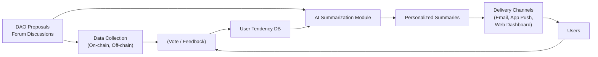
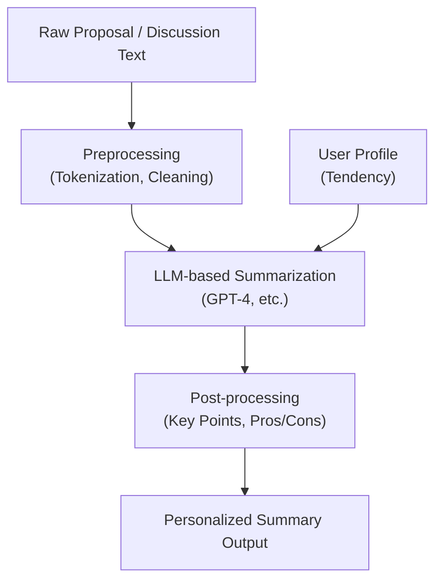
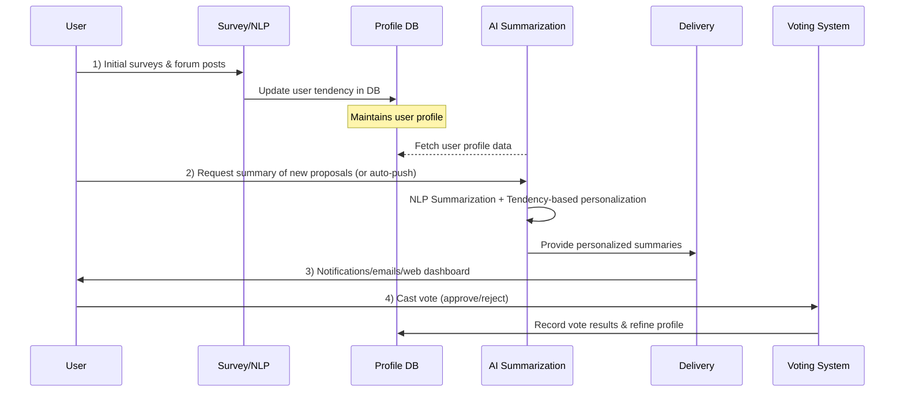

# Research on AI-Powered User Tendency Analysis and Personalized Voting Summaries for DAOs

- Author: Mossland Lab
- Email: lab@moss.land
- Date of Initial Document Creation: February 6, 2025

## Table of Contents
1. **Introduction**
2. **Background and Motivation**
3. **Research Objectives**
4. **Related Work**
5. **User Tendency Analysis Methods**
6. **Criteria for User Tendency**
7. **AI-Powered Summarization and Communication**
8. **System Architecture**
9. **Research Process**
10. **Industry Applications and Latest Trends**
11. **Conclusion**
12. **References**

---

## 1. Introduction
Decentralized Autonomous Organizations (DAOs) have been rapidly expanding thanks to blockchain and smart contract technology. DAOs rely on token holders’ votes to determine the organization’s direction, and governance processes are transparently recorded on-chain. However, in practice, it can be difficult for users to process the vast amount of information in proposals and forum discussions, often leading to low voter turnout or inefficient decision-making [1].

This research aims to **apply AI to summarize DAO proposals, community forums, and user opinions**, and **provide personalized information tailored to individual user tendencies**—thereby improving member participation efficiency and reducing the time needed for decision-making. We also explore the possibility of delegating **voting authority** to an AI agent that votes automatically on behalf of a user or posts opinions in forums. As a first step, we propose a module that **analyzes user preferences** and **pushes personalized summaries** based on those preferences.

---

## 2. Background and Motivation
1. **Information Overload**: DAOs are open organizations, creating a constant stream of new proposals and forum/social channel discussions. It is difficult for participants to read and understand all of this information in a timely manner [2].  
2. **Diverse User Tendencies**: Members differ in their focus on investment vs. community values, short-term vs. long-term results, etc. Presenting the same information to everyone often means critical details are missed or members lose motivation to participate [3].  
3. **Advances in AI**: Large language models (LLMs), such as GPT, have made significant progress in text summarization and natural language processing. If leveraged effectively, this could greatly benefit DAO governance [4].

---

## 3. Research Objectives
- **User Tendency Analysis**: Investigate various methods (surveys, past activity logs, NLP-based opinion analysis) to understand the values and priorities that users hold.  
- **Personalized Summaries**: Based on each user’s tendency, have an AI module summarize proposals and forum discussions, and deliver these summaries via push notifications to improve decision-making efficiency.  
- **Continual Updates**: Update user profiles with ongoing voting outcomes, new community discussions, or emerging trends, ensuring accurate personalization over time.  
- **System Prototype**: Present a system architecture and implementation plan that integrates all of these processes, ultimately enhancing DAO governance.

---

## 4. Related Work
### 4.1 DAO Governance Tools
- Platforms such as **Aragon**, **Tally**, and **Snapshot** provide governance services, some of which display proposals or voting records [3].  
- However, **personalization** and **advanced summarization** remain in their early stages.

### 4.2 AI-based Text Summarization
- OpenAI GPT models (GPT-3.5, GPT-4, etc.) enable **abstractive summarization**, condensing the original content into shorter text [4].  
- **Prompt engineering** allows for customizing summaries according to a user’s preferences [4].

### 4.3 User Tendency Analysis
- Past research has proposed surveys, activity logs, or social media text analysis to derive **personality or value preferences** [2].  
- Sentiment or stance detection in community forums and SNS can predict users’ political or social leanings [1].

---

## 5. User Tendency Analysis Methods
We focus on three major approaches: **(1) Surveys, (2) Past Activity Log Analysis, (3) NLP-based Opinion Mining**.

### 5.1 Surveys
- **Pros**: Directly assess explicit values and self-reported priorities.  
- **Cons**: Users may not answer honestly; there may be a gap between stated preferences and real behavior.

#### Example Survey
```
1. How much risk are you willing to take when investing DAO funds?
   (1) Very low  (2) Low  (3) Moderate  (4) High  (5) Very high

2. Do you prioritize community/social values over financial gains in DAO decisions?
   (1) Strongly disagree  ...  (5) Strongly agree
```

### 5.2 Past Activity & On-chain Data
- **Voting Records**: Checking how a user voted on past proposals can reveal conservative/progressive tendencies, short-term vs. long-term focuses, etc. [1].  
- **Transaction History**: Whether a user stakes tokens for an extended period or trades frequently can indicate short-term vs. long-term orientation.  
- **Forum/Community Activities**: Text mining on user posts to infer how they reason for or against proposals.

### 5.3 NLP-based Opinion Mining
- **Sentiment Analysis**: Determines whether user posts lean positive or negative.  
- **Topic Modeling**: Discovers primary themes (e.g., ROI, tech innovation, ESG) the user cares about.  
- **Keyword Analysis/Stance Detection**: Identifies support or opposition to specific issues (e.g., environmental protection, donations).

---

## 6. Criteria for User Tendency
We prioritize the following three axes [2][3]:

1. **Conservative vs. Progressive**  
   - **Conservative**: Prefers maintaining the status quo and stable execution.  
   - **Progressive**: Embraces innovation and change, willing to take risks for potential breakthroughs.

2. **Economically Driven vs. Socially Driven**  
   - **Economically Driven**: Focuses on financial performance, token price appreciation, etc.  
   - **Socially Driven**: Places greater emphasis on community or ESG values.

3. **Short-Term vs. Long-Term**  
   - **Short-Term**: Prefers quick returns and immediate rewards.  
   - **Long-Term**: Invests in the DAO’s sustainability, even if it takes time.

Additional factors like **risk tolerance** or **centralization preference** may be considered as well.

---

## 7. AI-Powered Summarization and Communication

### 7.1 Summarization Techniques
- **Abstractive Summarization**: Models like GPT-4 can paraphrase and condense key points from original text.  
- **Key Point Extraction**: Structuring major arguments for and against a proposal in bullet-point format.  
- **Personalized Summaries**: Emphasizing stability and risk mitigation for conservative users, highlighting innovation for progressive users, etc.

### 7.2 Delivery Channels
- **Email**: Periodic summaries of important proposals.  
- **Mobile Push Notifications**: Alerts for urgent proposals or votes closing soon.  
- **Web Dashboard**: Personalized proposal lists and summaries when the user visits the DAO governance portal.  
- **Chatbot/AI Assistant**: Interactive Q&A for “What are this week’s major proposals?” and AI replies with custom summaries.

---

## 8. System Architecture
Below are diagrams illustrating the overall architecture, data flow, and the internal design of the AI summarization module.

### 8.1 High-Level Architecture



### 8.2 AI Summarization Module (Internal)



---

## 9. Research Process
Our research is conducted in **three major phases**.

### 9.1 Phase 1: Initial User Profiling
1. **Surveys**: Conduct short questionnaires for new DAO members or periodically to collect baseline preferences.  
2. **Activity Log Analysis**: Inspect voting history, forum posts, etc., to determine actual behavioral tendencies.  
3. **NLP Opinion Analysis**: Apply sentiment/stance detection on text from forums or social media channels.

### 9.2 Phase 2: Personalized Summaries & Voting
1. **Data Collection**: Aggregate proposal and forum data in real time or at regular intervals.  
2. **AI Summarization**: Leverage GPT APIs for compressing and reorganizing content.  
3. **Incorporate User Preferences**: Personalize summaries using data from the user profile DB.  
4. **Delivery**: Provide summaries via email, push notifications, etc.  
5. **Voting**: Users cast informed votes more conveniently.

### 9.3 Phase 3: Profile Updates
1. **Vote Outcomes**: Store whether the user voted for/against/abstained.  
2. **Community/Trend Monitoring**: Reassess user tendencies if new issues arise, possibly via additional surveys.  
3. **Long-Term Learning**: Track any shifts in user preferences over time and keep updating the profiles.

Below is a diagram summarizing the entire process:



---

## 10. Industry Applications and Latest Trends

### 10.1 Real-World DAO AI Adoption
- **Tally**: Some DAOs have submitted proposals like “AI-Powered Governance Enhancement,” aiming to analyze past votes for automated recommendations or insights [2].  
- **Aragon**: Proposed AI summarization features in governance forums; ChatGPT-based summarizations of governance discussions have also appeared [3].

### 10.2 Academic Progress
- **DAO Governance Analysis**: Sharma et al. aggregated a large DAO dataset to study voting rates, proposal statistics, etc. This can provide baseline metrics for user profiling [1].  
- **AI-based Opinion Mining**: Sentiment/topic analysis in online communities is an active field, applicable to DAO governance as well [2].  
- **Personalized Recommendation Systems**: Traditional e-commerce personalization methods are now being examined for DAO proposal recommendations [4].

---

## 11. Conclusion
This research tackles **the challenge of information overload and low participation** in DAO governance by combining **AI-based user tendency analysis** with **personalized voting summaries**. Specifically:

1. **User Tendency Analysis**: We model user preferences on axes such as conservative vs. progressive, economically vs. socially driven, and short-term vs. long-term [1][2][3].  
2. **AI Summarization**: We employ GPT-based models to abstractly summarize proposals and forum discussions, tailoring the content to each user’s profile [4].  
3. **Continuous Profile Updating**: We incorporate voting outcomes and emerging community trends to maintain accurate user profiles and deliver relevant recommendations.

This approach enables DAO members to quickly grasp the crux of proposals and make decisions aligned with their values, thus boosting participation. Future expansions could see **AI agents autonomously voting** or posting in forums on behalf of users. Moreover, the proposed processes and modules could be integrated with existing DAO tooling platforms to form a user-centric, personalized governance service.

---

## 12. References

[1] T. Sharma *et al*., “Future of Algorithmic Organization: Large Scale Analysis of Decentralized Autonomous Organizations (DAOs),” *arXiv preprint* arXiv:2410.13095, 2024.

[2] Y. Quan *et al*., “Decoding Social Sentiment in DAO: A Comparative Analysis of Blockchain Governance Communities,” *arXiv preprint* arXiv:2311.14676, 2024.

[3] **Aragon**, “The Future of DAOs is Powered by AI,” *Aragon Resource Library*, Oct. 2023.

[4] D. J. Parente *et al*., “Quality, Accuracy, and Bias in ChatGPT-Based Summarization of Medical Abstracts,” *Annals of Family Medicine*, vol. 22, no. 5, 2024.
