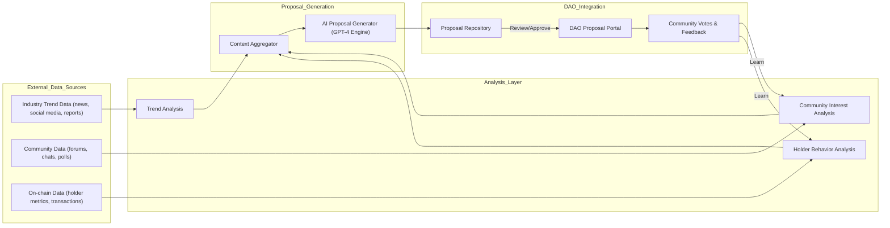
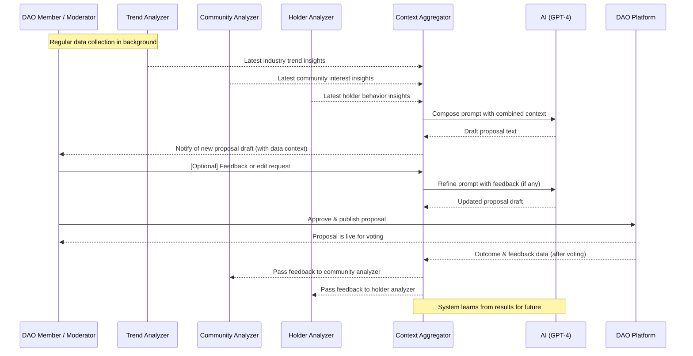

# AI-Driven Automatic DAO Proposal Generation System for Mossland

- Author: Mossland Lab
- Email: lab@moss.land
- Date of Initial Document Creation: March 15, 2025

Mossland is a blockchain-based metaverse project where **Moss Coin (MOC)** serves as the governance token for its DAO. Moss Coin holders can propose and vote on decisions that shape the platform, with approved proposals implemented by the Mossland Foundation and community developers. To enhance this governance process, we envision an **AI-driven proposal generation system** that automatically drafts high-quality DAO proposals by analyzing real-time industry trends, Mossland community interests, and Moss Coin holder behaviors. Such a system leverages AI’s strengths in content creation and data analysis to assist DAO members by reducing manual workload and surfacing data-driven ideas ([The Future of DAOs is Powered by AI | Aragon Resource Library](https://www.aragon.org/how-to/the-future-of-daos-is-powered-by-ai#:~:text=AI%20tools%20can%20be%20used,well%20in%20the%20DAO%20space)). Below, we present detailed user scenarios, a robust system architecture, data flow explanations, implementation considerations (with conceptual Python code using ChatGPT GPT-4 APIs), and supporting diagrams for this AI-driven DAO proposal generator.

## User Scenarios  
To illustrate how different DAO participants interact with the system, we describe several user stories:

- **Casual DAO Member (Alice)**: Alice holds Moss Coins and votes on proposals but rarely writes her own due to time and expertise constraints. *As a DAO member, she wants to see proposals relevant to her interests appear without her manual effort, so that important ideas aren’t missed.* The AI system monitors industry news and community chats, then automatically generates proposals on emerging topics (e.g. a new AR feature that’s trending). When Alice logs into the Mossland DAO portal, she finds a draft proposal about integrating a popular metaverse trend – a topic she cares about – already waiting for discussion. She reads the AI-generated proposal, which clearly explains the idea and its benefits. Feeling empowered, Alice adds a comment and votes on it. The AI has effectively given Alice a voice by turning latent community interests into actionable proposals, increasing her engagement in governance.

- **Active Community Contributor (Bob)**: Bob is an experienced community member who often brainstorms ideas but struggles with writing formal proposals. *As a contributor, he wants help turning raw ideas or observations into well-structured proposals, so that his concepts can be presented professionally to the DAO.* Bob uses the AI system by providing a few bullet points about a potential Mossland event (e.g. a virtual NFT treasure hunt). The AI analyzes Bob’s input along with recent gamer behavior data (many holders have been collecting NFTs) and relevant industry news (rising interest in play-to-earn events). It then generates a polished proposal draft for a “Mossland Treasure Hunt Campaign,” complete with background, detailed plan, and rationale. The proposal follows the standard format and is unbiased in tone ([AI for Content Creation in DAOs & Blockchain](https://aianddaos.com/ai-for-content-creation-and-blockchain/#:~:text=Example%3A%20A%20leading%20DeFi%20DAO,structured%20governance%20proposals)). Bob reviews the draft, finds it aligned with his vision (and even enriched with data he wasn’t aware of), and submits it officially. The AI saved him hours of writing and ensured the proposal meets the DAO’s quality standards.

- **Core Team/Moderator (Carol)**: Carol is a Mossland DAO moderator and core team member overseeing governance. *She wants to ensure the influx of AI-generated proposals remains relevant and beneficial, so that the DAO isn’t spammed or misled.* The AI system helps Carol by only generating proposals when certain data-driven criteria are met – for example, if a trend is strongly relevant to Mossland’s roadmap and community sentiment is positive. Carol receives alerts when the AI drafts a new proposal. For instance, if on-chain data shows a sudden increase in Moss Coin staking (holder behavior) and external news highlights a new staking reward mechanism in the industry, the AI might draft a proposal to adjust Mossland’s staking rewards. Carol examines the draft via an admin dashboard, where the system provides the supporting data it used (trend analytics and holder stats). Satisfied that the proposal is well-justified, Carol approves it to be published for the community. In cases where the draft isn’t suitable, Carol can give feedback to the AI (e.g. “focus more on NFT marketplace impacts”) and request a revision. This human-in-the-loop approach ensures that the AI’s output aligns with Mossland’s governance guidelines and community values.

- **Mossland Foundation Developer (Dave)**: Dave is a developer on the Mossland core team who implements approved proposals. *He wants the proposal content to include clear rationale and potential impact, so that he can plan development accordingly.* When an AI-generated proposal (e.g. introducing a new mini-game) passes a community vote, Dave uses the proposal’s detailed analysis – which cites how it was inspired by industry trends and backed by community interest metrics – to guide the development priorities. The proposal might note, for example, “70% of active users expressed interest in mini-games in forum polls last month, and similar projects saw a 20% user increase after adding mini-games.” Such context (provided by the AI’s data analysis) helps Dave and the team understand the motivation and expected benefits. Knowing the idea has community support and industry validation, the developers confidently allocate resources to build the feature, accelerating Mossland’s roadmap with data-informed decisions.

These scenarios show the AI system benefiting everyone: **regular holders** get proposals aligned to their interests without needing deep expertise, **active contributors** get help turning ideas into formal proposals, **moderators or core teams** maintain quality control and alignment with strategy, and **developers** get well-researched justifications for proposals. Overall, the Mossland DAO becomes more proactive and intelligent – able to adapt to real-time trends and member needs – while keeping humans in control of final decisions.

## System Architecture  

### High-Level Architecture  
At a high level, the AI-driven proposal generation system is composed of several interconnected components. The design follows a modular architecture where each module handles a specific aspect of data collection, analysis, or content generation. This separation of concerns ensures maintainability and allows components to be updated or scaled independently. The **core idea** is to gather insights from multiple sources (external industry data, internal community data, on-chain data) and funnel them through an AI engine that produces proposal drafts. Below are the main components in the system:

- **1. Data Sources (Inputs)**:  
  - **Real-Time Industry Trends Source** – Streams or periodically provides data about industry trends relevant to Mossland. This can include news articles, social media (e.g. trending topics on X/Twitter or Reddit in the AR/VR/gaming space), market research reports, and Google Trends for keywords like “metaverse events” or “NFT marketplace”. For example, if AR treasure hunts are trending in the broader industry, this source captures that information.  
  - **Mossland Community Activity Data** – Feeds in data from Mossland’s community channels: forum posts, Discord/Telegram chats, proposal discussions, and feedback portals. This captures what the community is excited or concerned about. For instance, frequent mentions of “staking rewards” or upvotes on a forum suggestion are picked up here.  
  - **MossCoin Holder Behavior Data** – Gathers on-chain and in-app metrics about Moss Coin holders’ actions. This includes blockchain data (transactions, staking, voting patterns, token holding distribution) and usage data in the Mossland platform (which features are most used by token holders). Sudden shifts in these metrics (e.g. many holders start selling NFTs for Moss Coin, or a drop in active voters) are key indicators of behavior changes.

- **2. Data Processing & Analysis Modules**:  
  - **Trend Analysis Module** – Ingests the industry data and uses AI/ML or rule-based analysis to identify notable trends. It may apply natural language processing (NLP) to news articles to extract keywords, sentiments, and topics. For social media, it could track hashtags or sentiments related to Mossland’s domain (e.g., increasing positivity around “metaverse concerts”). The output is a structured summary of relevant industry trends (e.g. “Rising interest in AR treasure hunts among metaverse projects”).  
  - **Community Interest Analyzer** – Processes community activity to gauge what Mossland users care about most at the moment. Techniques include keyword extraction from forums, clustering of discussion topics, sentiment analysis on chats, and counting the frequency of feature requests or questions. For example, if many users discuss “land sales” in the past week with positive sentiment, the analyzer notes this as a strong community interest.  
  - **Holder Behavior Analyzer** – Interfaces with Mossland’s blockchain ledger (or an analytics subgraph) to interpret holder actions. It might calculate metrics like: growth/decline in active MossCoin holders, average holding time, volume of MossCoin spent on certain features, or typical voting turnout. It can detect patterns (e.g., “Large holders accumulating tokens before an event” or “Low engagement in recent votes”). These insights help tailor proposals to address behavior (e.g., a proposal to improve voter turnout if that is low). This module ensures the system’s decisions are backed by quantitative on-chain evidence.

- **3. Proposal Synthesis Engine**:  
  - **Context Aggregator** – Gathers the outputs from the above analysis modules and composes a coherent **context package** for the AI. This might involve filtering and weighting the insights. For example, it could prioritize a trend if it strongly aligns with a top community interest or downplay an interest if on-chain data doesn’t support its urgency. The aggregator may format the combined data as a prompt or structured input (e.g., a JSON with fields for “trend_insights”, “community_insights”, “holder_insights”) to feed into the proposal generator. It effectively distills *“What’s happening and why it matters”* into a summary the AI can understand.  
  - **AI Proposal Generator (LLM Engine)** – The heart of the system: a Large Language Model (like GPT-4) that generates the proposal text. This component takes the aggregated context and a prompt template as input, then produces a draft proposal. We leverage the ChatGPT API (GPT-4 or newer GPT-4.5 when available) to ensure high-quality natural language output. The prompt provided to the LLM includes instructions on proposal format (e.g., include a title, background, objectives, implementation plan, and justification) and inserts the real-time insights (trends, interests, behaviors) into those sections. Because GPT-4 can handle complex instructions and context length, it can integrate multiple data points into a single coherent narrative. To maintain factual accuracy and relevancy, the system can also supply the LLM with relevant reference data (e.g., statistics from holder analysis) and ask it to incorporate them into the proposal. The AI generator is configured with appropriate parameters (temperature, etc.) to balance creativity with factual consistency, and it follows any style guidelines (for example, Mossland’s proposal tone should be formal and data-driven). *This component is crucial for turning raw data into a persuasive proposal.* (We discuss implementation with code in a later section.)

- **4. Output & Governance Integration**:  
  - **Proposal Database/Repository** – A storage system for generated proposals (drafts and published). Each proposal draft is saved with metadata: timestamps, which data inputs triggered it, and confidence scores or version history if it’s revised. This allows traceability (so one can see *why* the AI made a certain proposal by looking at the supporting data snapshot) and avoids duplicate proposals (the system can check this repository to see if a similar idea was recently proposed).  
  - **DAO Proposal Interface** – Integration with Mossland’s DAO platform to publish proposals. Mossland’s DAO likely has a “voting booth” or governance portal. This interface could be an automated script or service that takes an approved AI draft and creates a proposal on-chain or on the governance dApp. Depending on Mossland’s process, the AI might post the proposal as a forum post first for discussion, or directly create a Snapshot/Tally proposal. This component ensures the AI’s work actually enters the DAO’s decision workflow. It may require appropriate permissions – for example, it might submit proposals under a special “AI Assistant” user account, or send them to moderators for approval.  
  - **User Feedback Loop** – Although proposals are generated automatically, the community’s reaction is invaluable data. This sub-component monitors the outcome of proposals: voting results, discussion sentiment, and whether proposals pass or fail. These results feed back into the analytics modules. For instance, if the community consistently rejects AI proposals about “tokenomics changes” but favors those about “new features,” the system can learn to adjust its focus. Similarly, analyzing which proposals get quorum and support can help the AI fine-tune future proposal content (this could be considered a form of reinforcement learning or at least adaptive heuristics in the system).

**High-Level Architecture Diagram**: The following diagram provides a visual overview of the main components and their interactions (data sources flowing into analysis modules, then to the AI generator, and out to the DAO).  

**Diagrams:**  


*(Diagram: High-level system architecture and data flow. Industry, community, and on-chain data are processed into insights, aggregated into context, then fed to an AI generator (LLM) to produce proposal drafts. Drafts are stored and, upon approval, submitted to the DAO portal. Feedback from voting results loops back to improve the system.)*

### Low-Level Architecture Details  
Drilling down into each part, we detail the inner workings and technologies that could implement the above components:

- **Trend Analysis Module (Low-level)**: This could be implemented as a microservice (e.g., `trend_service`) that periodically calls external APIs and performs NLP. For example, it might use a combination of RSS feeds and social media APIs: a cron job fetches the latest news articles from tech/blockchain news sites and the latest tweets mentioning “Mossland” or related keywords. The service might use Python NLP libraries or models (like spaCy or a transformer model) to extract entities and sentiments from text. It could also use clustering to group similar trend topics. To ensure real-time responsiveness, a streaming setup can be used (e.g., a Twitter stream filtered by keywords feeding into the module). The output is a data structure like `TrendingTopics = [{"topic": "AR treasure hunts", "mentions": 120, "sentiment": 0.8}, {...}]`. The module might maintain a short-term memory of trends to detect when something becomes significantly more popular than before (a spike detection algorithm).  

- **Community Interest Analyzer (Low-level)**: This module might integrate with Mossland’s own systems – for instance, reading from a Discourse forum API or Discord chat logs. It could utilize sentiment analysis (perhaps a fine-tuned BERT model for community text) to gauge positive vs negative discussions. A practical approach is to scan for predefined tags or channels: e.g., look at the “proposals” discussion channel for any new ideas being frequently mentioned. Natural language techniques like TF-IDF or topic modeling (LDA) can summarize the dominant topics of the week. The module also could give weight to community-driven polls or upvotes (if Mossland has a suggestion voting system, those numbers are invaluable). The result might be something like: `CommunityInterests = ["Many users request feature X", "Sentiment about current rewards is low", ...]`. Low-level design includes connecting to various APIs, cleaning data (removing spam or irrelevant chatter), and possibly using a small language model to summarize discussion threads into key takeaways. Ensuring privacy and respect for user content is important – the analysis should focus on aggregate trends, not individual messages.

- **Holder Behavior Analyzer (Low-level)**: This component interfaces with blockchain data. For Mossland, which is on the Klaytn network per the whitepaper, the analyzer could use Klaytn’s API or a subgraph (if Mossland has a TheGraph deployment) to fetch events like transfers, staking, or governance votes. For example, it might query the Mossland token contract to see how many unique addresses interacted in the past month vs previous, or use a voting contract’s logs to see participation counts. Another aspect is analyzing Mossland in-app data (if accessible) – e.g., how many lands or NFTs are being bought with Moss Coin. This likely involves a secure connection to Mossland’s back-end or a database if on-chain doesn’t cover all behaviors. The analyzer might perform computations such as: holder retention rates, whale (large holder) movements, changes in token velocity, etc. The output could be a concise set of indicators: `HolderMetrics = {"active_holders": 5000 (up 10%), "staking_rate": 60% of supply, "recent_large_transfers": 3 (all buys)}`. Low-level, this might be implemented in a data pipeline manner (e.g., using a Python script or an ETL tool that runs queries and updates these metrics daily). It’s important that this module operates efficiently, since blockchain data can be large – caching and incremental updates (processing new blocks only) are used to keep it *real-time* without reprocessing everything each run.

- **Context Aggregator (Low-level)**: The aggregator could be an in-memory process or service that triggers whenever new data from the above modules is available (or on a schedule). It might simply gather the latest outputs and format a prompt, but more sophistication can be added here. For instance, the aggregator can have rules: *only generate a proposal if at least one trend *and* one community interest align*, to avoid creating proposals no one asked for. It could also rank potential proposal ideas by combining signals: e.g., a trending topic with high community interest and strong supporting holder data gets a high score. Low-level, this could be done with a simple Python logic or even a knowledge graph. A knowledge graph might link entities (e.g., “staking rewards” appears in both a trend article and community discussion) and find intersections. However, a simpler approach is to compose a textual context. For example, the aggregator might prepare a context like: *“Trend Insight: AR scavenger hunts are gaining popularity in metaverse projects. Community Insight: 30% of recent forum posts suggest interest in in-game events. Holder Insight: MossCoin transactions spiked 15% during last event, indicating engagement. Possible Proposal: Organize a Mossland AR Treasure Hunt event.”* This would then be fed to the AI generator. Essentially, the aggregator translates raw analysis into an **initial proposal idea and supporting facts**. It may also retrieve relevant historical proposals from the Proposal DB (e.g., if a similar idea was proposed before, include why it failed or how it can be improved – this could be via a vector similarity search on past proposals). By providing the LLM with this structured and rich context, we ensure the generation step is grounded and specific.

- **AI Proposal Generator (Low-level)**: This component uses the OpenAI ChatGPT API (or a similar LLM service). The system prompt given to the model defines its role (e.g., “You are an expert DAO proposal writer for the Mossland metaverse, tasked with writing clear, compelling proposals. You have access to current trends and community data to inform your writing. You output proposals in the standard Mossland DAO format with sections: Title, Background, Proposal Details, Rationale, and Conclusion.”). The user prompt part contains the dynamic data from the aggregator, possibly formatted as a list of bullet points or a brief narrative. We instruct the model to incorporate those points into the proposal draft. For example, if the aggregator suggests an “AR Treasure Hunt” idea, the prompt might say: *“Draft a Mossland DAO proposal for an AR Treasure Hunt event. Use the following information: (1) Industry trend – AR treasure hunts are trending, (2) Community interest – strong demand for in-game events, (3) Holder behavior – past events increased token usage by 15%. Clearly explain the proposal and why it benefits Mossland.”* The model then generates a full proposal text. Low-level considerations: we must handle the token limits (ensuring the prompt plus expected output fit within GPT-4’s limits by trimming unnecessary data). The temperature could be set around 0.7 for balanced creativity. We also use the model’s abilities to format text (it can output in Markdown or plain text which can be directly used in forums). To ensure reliability, we could include a few-shot examples in the prompt (samples of good proposals) if needed, or even fine-tune a custom model on past Mossland proposals (though GPT-4’s few-shot learning might suffice). Additionally, after generation, this module can do a basic validation of the content – e.g., ensure the proposal includes required sections or does not violate any known DAO rules. If the output is not satisfactory (the model might occasionally produce something off-topic), the system can retry with adjusted prompts or log the issue for a human to review.

- **Quality Control & Moderation**: Although not a separate module in the high-level diagram, it’s worth noting how the system maintains quality. The AI output can be passed through an automated content filter (OpenAI’s moderation API or custom checks) to catch inappropriate or irrelevant content. Also, integration with the Proposal Repository allows the system to check for duplicates or conflicts (it could flag “This proposal is similar to one 3 months ago that was rejected”). The architecture might include an admin UI where moderators like Carol (from our user story) can easily compare the new draft against its source data, which fosters transparency and trust in the AI’s suggestions.

- **Proposal Database & Repository (Low-level)**: Technically, this could be a SQL or NoSQL database accessible by the system. It would store each proposal with fields such as: proposal ID, title, content, creation timestamp, source context summary, status (draft, submitted, accepted, rejected), and perhaps references to which data points were used. This audit trail is important for later analysis and for improving the model (e.g., correlating which inputs lead to accepted proposals). The repository might also expose an API for the DAO interface to fetch drafts awaiting publication.

- **DAO Integration Interface (Low-level)**: Depending on how proposals are submitted in Mossland’s DAO (on-chain or off-chain), this component could range from a simple script to a complex service. If Mossland uses an on-chain governance contract (for example, through Luniverse or Klaytn as mentioned in the whitepaper, the interface needs a wallet with the ability to create a proposal transaction. Low-level, it might use web3 libraries to call the smart contract’s `createProposal` function with the proposal text and metadata. If instead proposals start off-chain (like in a forum or Snapshot), the interface could use the forum’s API to create a post, or Snapshot’s API to create a new proposal off-chain for voting. Security is key: the system likely shouldn’t fully autonomously post without at least a sanity check. One implementation is a *proposal queue* – drafts land in a queue awaiting a moderator’s approval click, upon which this interface publishes it. Over time, if trust in the AI grows, more automation can be allowed. The interface also listens for results: once a vote is concluded, it updates the proposal status in the repository (pass/fail) and triggers the feedback loop.

- **Feedback Loop Mechanism**: This might be a scheduled job that periodically analyzes the Proposal Repository and possibly the governance contract to see outcomes. If a proposal failed to meet quorum or was overwhelmingly rejected, the system can label that scenario. Future similar proposals might then be suppressed or phrased differently. Conversely, successful proposals’ characteristics can be noted (e.g., wording, length, data included). This can inform prompt adjustments (for example, the AI might learn to always include an ROI analysis if financial proposals tend to pass with one). Technically, implementing this could involve simple rules at first (update a “success score” for certain keywords) or more advanced ML down the line (training a classifier on proposal metadata vs outcome). The feedback mechanism ensures the system becomes smarter and more aligned with what Mossland stakeholders actually want, reflecting a continuous improvement cycle.

The system architecture, both at high and low levels, emphasizes modular design, data-driven decision making, and human oversight. Each component – from data collection to AI generation – can be developed and improved in isolation, and they communicate via well-defined interfaces (e.g., the aggregator gathering outputs, the AI consuming a formatted prompt). This design is robust and extensible: new data sources can be added (say, a new social platform) or new AI models can be incorporated (a future upgrade might use GPT-5 or a Mossland-specific fine-tuned model) without overhauling the entire system.

## Data Flow  
The data flow describes how information moves through the system, from the moment new data is captured to the point a proposal is generated and posted. Below is a step-by-step walkthrough of the end-to-end process:

1. **Real-Time Data Collection**: The process begins with continuously monitoring data sources. Suppose a significant industry event occurs (e.g., a major game announces an AR feature) – the Trend Analysis module fetches this information (either via webhook trigger or scheduled poll). Simultaneously, community and holder data are being collected: perhaps it’s the end of the day and the system aggregates all forum posts from that day and the latest blockchain block data. This collection is ongoing and can happen in parallel streams for each data type.  

2. **Data Analysis & Insight Extraction**: Each analysis module processes its fresh data. The Trend Analyzer might recognize “AR Treasure Hunt” as a frequently mentioned concept in today’s news articles and determine it’s relevant to Mossland’s domain (maybe using a keyword list related to AR/VR and NFTs to filter relevant trends). The Community Analyzer scans the day’s forum discussions and finds an unusual spike in conversation about “events for token holders” – many community members are talking about wanting interactive events. The Holder Analyzer sees a 5% uptick in the number of MossCoins being held in user wallets (rather than traded), possibly indicating people holding in expectation of something. Each module transforms raw data into **insights**: e.g., *TrendInsight = “AR treasure hunts are trending in metaverse gaming.”*, *CommunityInsight = “High interest in community events (20+ mentions today).”*, *HolderInsight = “MossCoin holding increased by 5% this week.”*

3. **Aggregating Context for Proposal**: The system’s orchestrator or aggregator component wakes up (either on a schedule, say daily, or triggered because a threshold was met – e.g., a trend reached a high significance score). It collects the latest insights from all analyzers. In our example, it now has three pieces of information (trend, community, holder insights). The aggregator evaluates them together. It recognizes a theme: both the industry and the community are pointing toward **in-game events** (one explicitly, one implicitly through “treasure hunt” and “community events”). The holder data, while not explicitly about events, shows increased holding which could imply anticipation. The aggregator decides a proposal around hosting a new Mossland event is warranted. It formulates a draft idea: *“Proposal to host a Mossland AR Treasure Hunt Event to engage holders and align with industry trend.”* It then prepares a detailed prompt containing the key points to support this idea, to guide the AI generator. This prompt might look like a structured text with sections for each insight or a short narrative combining them.  

4. **AI Generation of Proposal Draft**: The AI Proposal Generator (ChatGPT GPT-4) is invoked with the prepared context. The system role message instructs the model on format and tone, and the user message contains the aggregated insights and the specific request (e.g., “Write a Mossland DAO proposal for the idea described.”). The model processes this and composes a draft proposal. For instance, the output could be a well-organized text: 

   *Title*: “Mossland AR Treasure Hunt Event”  
   *Background*: explains the industry trend of AR treasure hunts and mentions Mossland’s opportunity to capitalize on it, referencing the recent buzz in the community about more events.  
   *Proposal Details*: outlines how the event would work in Mossland (perhaps users find virtual treasures at landmarks, etc.), possibly suggesting needed budget or resources.  
   *Rationale*: uses the data – “The community has shown strong interest in interactive events (X mentions in forums), and similar events in other projects have driven engagement. Additionally, many Mossland holders have been accumulating tokens, indicating readiness to participate in such events. This proposal aims to increase community engagement and MossCoin utility, aligning with these trends.”  
   *Conclusion*: wraps up how this will benefit the Mossland ecosystem and potentially increase MossCoin value or user activity.  

   The draft is returned as a structured text to the system. This data flow step is the transformation of *analytic data* into *human-readable proposal content* by the AI. Notably, the AI might also generate multiple options or variations if asked (the system could request 2 different drafts and choose the best).

5. **Review and Refinement**: Once the proposal draft is generated, it flows into a review stage. In an automated scenario, the system itself might quickly verify the draft for compliance (length, presence of required sections, no profanities or leaks of sensitive info). In a semi-automated scenario, a human (like Carol the moderator) is notified. The draft might appear on an admin dashboard or sent via email/Slack for review. Carol reads the proposal and compares it with the input data summary to ensure it’s accurate (the system can display: “This proposal was based on Trend X, Community Y, Holder Z”). If something is off – say the AI misunderstood and included a wrong statistic – Carol can correct it. She might directly edit the text or provide feedback for the AI to regenerate (for example, she could press a “Regenerate with more focus on holder stats” button, which would tweak the prompt and call the API again). This stage is crucial for quality assurance and building trust in the AI’s outputs. In our example, assume the draft looks good and aligns well with expectations.

6. **Proposal Publication**: After approval, the final proposal text is sent to the DAO Proposal Interface component. The data flows from the AI module to the DAO platform. The interface will create the proposal in the Mossland governance system. If Mossland uses off-chain proposals, the system might create a post on the Mossland forum or a Snapshot proposal with the content. If it’s on-chain, the system uses a bot account or asks Carol to click “submit” which triggers a transaction. In any case, the community is now able to see and consider the proposal. The flow is now outward – what was internally generated becomes externally visible to all Mossland DAO members.

7. **Voting and Feedback**: Once the proposal is live, normal DAO governance takes over – users discuss and vote through the established process (which might last days or weeks). During this period, the system can also capture feedback in real-time: for instance, it can analyze forum comments on the proposal to gauge sentiment (this could be fed into the community analyzer for future use, creating a nice feedback loop). After voting concludes, the result (pass or fail, and the vote breakdown) is recorded. This information flows back into the system: the Proposal Repository updates the proposal’s status, and the Feedback Loop mechanism picks up the outcome. If the proposal passed, the system might note what made it successful (topic relevance, strong data support, etc.). If it failed, the system could log potential reasons (perhaps many comments mentioned budget concerns – the system might then learn to include a section addressing budget next time for similar proposals). This closes the loop, feeding outcome data back to improve the trend/community/behavior analysis or prompt strategy next time around.

Throughout this data flow, the key is that **data moves seamlessly between components**: from raw input → processed insight → aggregated context → AI-generated proposal → human/world interface → and back as feedback data. The design ensures each handoff is clear (e.g., the Trend Analyzer outputs to a known format that the Aggregator expects) and uses a mix of push and pull mechanisms (some parts might be event-driven, like new trend triggers, and others are batch, like daily summaries). Real-time aspects, such as immediate reaction to a big trend, can be handled by event triggers that shortcut directly to proposal generation if urgent (for example, if a rival platform announces something huge, the system might generate a proposal within hours to respond, rather than waiting for a daily batch). In steady state, however, a regular cadence (like a weekly proposal generation cycle) could be employed to avoid overwhelming the community. 

The sequence diagram below illustrates an example interaction flow, combining the above steps into an integrated timeline, particularly highlighting the interactions between the user (or moderator) and the system components:

**Diagrams:**  


*(Diagram: Sequence of interactions. The system collects data, generates a proposal draft via the LLM, a user (moderator) reviews it, then publishes to the DAO. Finally, voting results feed back into the system.)*

## Implementation Details  
Implementing this AI-driven system involves stitching together data pipelines, AI model integration, and possibly Web3 interactions. Below we outline a conceptual implementation in Python pseudocode, focusing on key parts: data analysis stubs and the ChatGPT API integration. The code is structured into classes for clarity and follows best practices like modular design and clear separation of online calls (APIs) from processing logic. (For brevity, external API call details and actual ML model code are abstracted.)

**Setup and Data Analysis Modules**: First, we define classes to handle the data gathering and analysis for trends, community, and holder behaviors. Each class has methods to fetch raw data and to process it into insights. In practice, these would call real APIs or databases. Here we provide a skeleton with placeholders for actual data sources:

```python
import openai

# Configure OpenAI API (ensure to set your API key appropriately)
openai.api_key = "YOUR_API_KEY"  # In practice, use an environment variable for security

class TrendAnalyzer:
    def fetch_trends(self):
        # Placeholder: fetch latest industry news or social media data
        # e.g., call news API or Twitter API
        return ["News: Big AR treasure hunt event in XYZ metaverse", 
                "Report: VR gaming up 20% this quarter"]  
    
    def analyze_trends(self, raw_trends):
        # Process raw trends (e.g., simple keyword extraction or ML model)
        insights = []
        for item in raw_trends:
            if "treasure hunt" in item.lower():
                insights.append("AR treasure hunts are trending in metaverse gaming.")
            # ... additional analysis logic ...
        # Summarize or prioritize insights
        return insights  # e.g., ["AR treasure hunts are trending in metaverse gaming."]

class CommunityAnalyzer:
    def fetch_community_data(self):
        # Placeholder: fetch latest forum posts or chat messages
        return ["User1: We should have more token holder events!", 
                "User2: Any plans for treasure hunts in Mossland?"]  
    
    def analyze_interests(self, community_data):
        # Extract key topics from community discussions
        topics = {}
        for message in community_data:
            msg_lower = message.lower()
            if "event" in msg_lower:
                topics["events"] = topics.get("events", 0) + 1
            if "treasure hunt" in msg_lower:
                topics["treasure_hunt"] = topics.get("treasure_hunt", 0) + 1
        # Formulate insights based on frequency or sentiment
        insights = []
        if topics.get("events", 0) > 0:
            insights.append("High community interest in in-game events.")
        if topics.get("treasure_hunt", 0) > 0:
            insights.append("Community specifically mentioned 'treasure hunt' events.")
        return insights

class HolderBehaviorAnalyzer:
    def fetch_holder_data(self):
        # Placeholder: fetch on-chain stats (could be from a blockchain API)
        return {
            "active_holders": 4800,     # number of active holders (e.g., past month)
            "active_holders_prev": 4500,
            "staking_rate": 0.60,       # 60% of supply staked
            "avg_hold_time": 90,        # days
            # ... more metrics ...
        }
    
    def analyze_behavior(self, holder_data):
        insights = []
        # Compare current vs previous to find trends
        delta_holders = holder_data["active_holders"] - holder_data["active_holders_prev"]
        if delta_holders > 0:
            insights.append(f"Active MossCoin holders increased by {delta_holders} in recent period.")
        else:
            insights.append("Active MossCoin holder count is steady or decreasing.")
        # Perhaps look at staking_rate or other metrics for interesting facts
        if holder_data["staking_rate"] > 0.5:
            insights.append(f"Over {int(holder_data['staking_rate']*100)}% of MossCoin supply is staked, showing long-term confidence.")
        return insights
```

In these classes, `fetch_*` methods represent external data access, and `analyze_*` methods represent transforming that data into textual insights. For example, `TrendAnalyzer.analyze_trends` looks for a specific keyword just for illustration; a real implementation might use an NLP model or a service like Google Cloud Natural Language to extract entities and salient topics. The `CommunityAnalyzer` does a simple count of certain words – in reality, one might use more advanced techniques or even a small language model to summarize discussions. The `HolderBehaviorAnalyzer` compares metrics to produce statements about holder trends.

**Aggregating Context and Generating Proposals**: Next, we create a component that aggregates these insights and calls the ChatGPT API to generate the proposal text. We encapsulate this in a `ProposalGenerator` class. This class will assemble the prompt and handle the API call to GPT-4:

```python
class ProposalGenerator:
    def __init__(self, model="gpt-4"):
        self.model = model
    
    def _build_prompt(self, trend_insights, community_insights, holder_insights):
        # Build a prompt string for the LLM from the given insights
        # For clarity, we join each list of insights into a paragraph.
        trend_text = "- " + "\n- ".join(trend_insights) if trend_insights else "No major industry trends identified."
        comm_text = "- " + "\n- ".join(community_insights) if community_insights else "No major community topics identified."
        hold_text = "- " + "\n- ".join(holder_insights) if holder_insights else "No significant holder behavior changes."
        # Instruction for the model on how to format the proposal
        instruction = (
            "You are an AI assistant tasked with drafting a Mossland DAO proposal.\n"
            "Use the insights below to inform the proposal. The proposal should be well-structured with a clear title, background, rationale, and implementation plan.\n"
            "Insights:\n"
            "Industry Trends:\n" + trend_text + "\n"
            "Community Interests:\n" + comm_text + "\n"
            "Holder Behaviors:\n" + hold_text + "\n\n"
            "Draft a proposal that addresses the community interests and leverages the industry trends. Explain why it's beneficial for Mossland and Moss Coin holders."
        )
        return instruction
    
    def generate_proposal(self, trend_insights, community_insights, holder_insights):
        prompt = self._build_prompt(trend_insights, community_insights, holder_insights)
        # Call the ChatGPT model with a system message for role definition and a user message with the prompt
        messages = [
            {"role": "system", "content": "You are an expert DAO proposal writer and Mossland strategist."},
            {"role": "user", "content": prompt}
        ]
        response = openai.ChatCompletion.create(
            model=self.model,
            messages=messages,
            temperature=0.7,
            max_tokens=1000  # assuming proposals fit in 1000 tokens
        )
        # Extract the proposal text from the response
        proposal_text = response['choices'][0]['message']['content']
        return proposal_text
```

In `ProposalGenerator._build_prompt`, we construct a single string that includes all the insights categorized by source. We format each insight as a bullet point under its category. This structured presentation helps the LLM to see clearly which facts come from trends, community, and on-chain data. We then append an instruction telling the AI what to do: draft a proposal that addresses community interests and leverages industry trends, explaining benefits to Mossland. The system message primes the model to act as an expert Mossland proposal writer (this could include more guidelines if needed, such as “be concise” or “use a formal tone”). We set `temperature=0.7` to allow some creativity but keep it focused, and `max_tokens=1000` to ensure the output is long enough for a detailed proposal (this value can be adjusted based on typical proposal length).

This code uses OpenAI’s `ChatCompletion` API for GPT-4. The structure of `messages` follows the chat format: a system role message with context, then a user role message with the actual prompt/instructions. The model will return a message as assistant role, which we extract as the proposal text. 

**Orchestrating the Pipeline**: Finally, we need to tie everything together in a workflow. In a real system, this might be scheduled or triggered by events. For demonstration, we show a simple linear orchestration that could be invoked, for example, once a day:

```python
if __name__ == "__main__":
    # Initialize analyzers and generator
    trend_analyzer = TrendAnalyzer()
    community_analyzer = CommunityAnalyzer()
    holder_analyzer = HolderBehaviorAnalyzer()
    proposal_generator = ProposalGenerator(model="gpt-4")
    
    # Step 1: Data Collection
    raw_trends = trend_analyzer.fetch_trends()
    community_data = community_analyzer.fetch_community_data()
    holder_data = holder_analyzer.fetch_holder_data()
    
    # Step 2: Data Analysis
    trend_insights = trend_analyzer.analyze_trends(raw_trends)
    community_insights = community_analyzer.analyze_interests(community_data)
    holder_insights = holder_analyzer.analyze_behavior(holder_data)
    
    # (Optionally, apply any filtering logic before proposal generation)
    if not trend_insights and not community_insights:
        print("No significant insights to generate a proposal at this time.")
    else:
        # Step 3: Proposal Generation
        draft_proposal = proposal_generator.generate_proposal(trend_insights, community_insights, holder_insights)
        # Step 4: Output the draft proposal (in practice, save to DB or send for review)
        print("AI-Generated Proposal Draft:\n")
        print(draft_proposal)
```

This orchestrator script demonstrates a single cycle: it fetches data, analyzes it, checks if there’s enough to warrant a proposal (if no insights were found, it skips generation), and if yes, generates a proposal draft and prints it out. In a real deployment, instead of printing, the draft would be saved to the Proposal Repository and perhaps automatically sent to a moderator interface or even posted as a draft on a forum for feedback.

**Example Outcome**: Given our placeholder data, the printed draft might look like (for illustration):

```
AI-Generated Proposal Draft:

**Title:** Mossland AR Treasure Hunt Event for Community Engagement

**Background:** The AR gaming industry is seeing a surge in treasure hunt events, with projects like XYZ Metaverse successfully boosting user engagement through interactive AR quests. Mossland’s community has recently expressed high interest in having more in-game events, specifically mentioning "treasure hunt" ideas. Additionally, over 60% of Moss Coin supply is currently staked, indicating that many holders are in it for the long term and would participate in ecosystem activities.

**Proposal:** Launch a Mossland AR Treasure Hunt event. This event would place virtual treasures at various real-world landmarks within the Mossland app, which users can discover and collect. Participants would use Mossland’s AR feature to hunt for Moss Coins or exclusive NFT rewards during a week-long event. The proposal includes allocating a reward pool of X Moss Coins (from the community fund) and Y limited-edition NFTs to incentivize participation.

**Rationale:** 
- *Industry Trend Alignment:* AR treasure hunts are trending in metaverse gaming ([AI for Content Creation in DAOs & Blockchain](https://aianddaos.com/ai-for-content-creation-and-blockchain/#:~:text=Example%3A%20A%20leading%20DeFi%20DAO,structured%20governance%20proposals)) and have proven to increase user activity. By hosting our own, Mossland can attract new users and media attention.
- *Community Demand:* The community has shown excitement for events; over a dozen recent forum posts suggested more engagement opportunities for Moss Coin holders. This event directly answers that call, likely improving community satisfaction.
- *Holder Engagement:* With a large portion of Moss Coin being staked by loyal holders, providing them a fun way to utilize their tokens (entry fees, rewards) will strengthen their connection to the ecosystem and could increase the value of holding MOC long-term.
- *Ecosystem Growth:* An event like this can drive up app usage metrics, potentially increasing Moss Coin’s utility (as users might spend tokens to get hints or buy event-related items) and showcasing Mossland as a lively, user-centric metaverse, which can attract partnerships or sponsorships.

**Implementation:** If approved, the event will be developed by the Mossland team with community input. Planning would start immediately for a launch in Q3. The development involves designing the treasure hunt mechanics, placing virtual assets, and testing the feature. Marketing efforts (social media, crypto forums) will promote the event to maximize participation. The Mossland Foundation will oversee the prize distribution and ensure transparency in winner selection.

**Conclusion:** This AR Treasure Hunt event leverages a popular industry trend and directly responds to Mossland community interests. It aims to reward Moss Coin holders and increase engagement in the Mossland metaverse. By approving this proposal, Mossland DAO will demonstrate our commitment to innovation and community-driven growth, potentially setting the stage for regular interactive events in the future.
```
