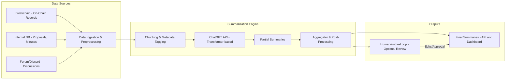
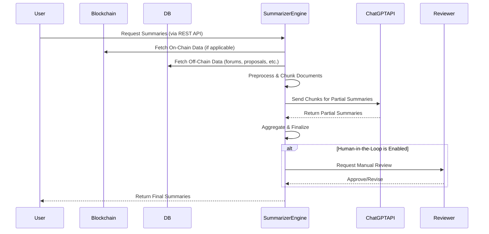

# System Design for DAO-Focused Multi-Document Summarization  
_Leveraging Transformer Models, ChatGPT API, and a Hybrid Architecture_

- Author: Mossland Lab
- Email: lab@moss.land
- Date of Initial Document Creation: February 13, 2025

---

## 1. Introduction
As Decentralized Autonomous Organizations (DAOs) grow in complexity, they generate diverse text data across multiple platforms (on-chain voting records, forums, internal repositories, etc.). Efficiently summarizing these documents is crucial for effective governance, decision-making, and community engagement.

This document proposes a **system design** for a multi-document summarization framework tailored to DAO needs. It emphasizes:
1. **Hybrid Interaction**: Automated summarization with optional human-in-the-loop for validation.  
2. **Data Integration**: Directly ingesting data from blockchain sources and via intermediate databases or APIs.  
3. **Cloud-Based, Distributed Architecture**: Ensuring scalability, fault tolerance, and flexible deployment.  
4. **Visualization & Diagrams**: Using Mermaid to depict both component-level and sequence flows.  
5. **Implementation in Python**: Leveraging `openai`, `FastAPI` (or a similar framework), and standard data processing libraries.

---

## 2. System Overview

### 2.1 High-Level Architecture
The following Mermaid diagram illustrates the core components and data flow of the proposed system:




1. **Data Sources**:  
   - **Blockchain On-Chain Records**: Voting results, transaction metadata.  
   - **Internal DB**: Meeting notes, proposals, archived documents.  
   - **Discussion Platforms**: Forums, Discord, GitHub issues, etc.

2. **Summarization Engine**:  
   - **Data Ingestion & Preprocessing**: Collects raw text, cleans it, and normalizes formatting.  
   - **Chunking & Metadata Tagging**: Splits large documents into manageable parts, attaches metadata (timestamp, author, etc.).  
   - **ChatGPT API (Transformer-based)**: Generates partial summaries for each chunk.  
   - **Aggregator & Post-Processing**: Merges partial summaries, resolves redundancies, and ensures coherence.

3. **Outputs**:  
   - **Final Summaries**: Exposed via a RESTful API or displayed on a DAO dashboard.  
   - **Human-in-the-Loop** (Optional): Domain experts can review, revise, and approve the final summaries.

### 2.2 Sequence Flow
Below is a Mermaid sequence diagram showing how a single summarization request is processed:



---

## 3. Data Flow and Components

### 3.1 Data Ingestion & Preprocessing
1. **Data Acquisition**  
   - Connect to blockchain nodes or explore public blockchain APIs for on-chain records.  
   - Access internal databases or REST APIs for off-chain data (forum threads, proposals, etc.).
2. **Preprocessing**  
   - Remove redundant formatting (HTML tags, markdown artifacts).  
   - Tokenize text using Python libraries (e.g., `spaCy`, `nltk`) or built-in tokenizers from `transformers`.
3. **Metadata Enrichment**  
   - Attach critical info (timestamp, document type, author) for better context.

### 3.2 Chunking & Metadata Tagging
- **Chunking Strategy**:  
  - Split large documents into smaller segments to fit the context window limit of ChatGPT API (e.g., 4,000-8,000 tokens).  
- **Metadata Integration**:  
  - Each chunk retains a reference to its origin (on-chain or off-chain) and relevant identifiers.

### 3.3 Summarization with ChatGPT API
- **Prompt Construction**:  
  - System-level prompt: “You are an expert summarizer for DAO governance documents…”  
  - User-level prompt: Includes the chunk text, context, and formatting instructions.
- **Partial Summaries**:  
  - Each chunk is independently summarized, returning short but coherent summaries.  
  - Summaries are stored for post-processing.

### 3.4 Aggregation & Post-Processing
- **Aggregation**:  
  - Merge partial summaries into a unified final summary, removing overlap and ensuring logical flow.  
- **Normalization**:  
  - Clean up repeated phrases, unify terminology, and maintain consistency in style (e.g., bullet points, paragraphs).  
- **Human Review (Optional)**:  
  - Provide a web-based or CLI-based interface for subject matter experts to approve/edit the final output.

---

## 4. Pseudocode

Below is a simplified Python-like pseudocode showcasing how the system might process multiple documents:

```python
def dao_summarization_pipeline(document_list, chatgpt_model, enable_human_review=False):
    """
    document_list: List[Dict] - [{ "type": "proposal", "content": "...", "metadata": {...}}, ...]
    chatgpt_model: str - e.g., "gpt-4"
    enable_human_review: bool - whether to enable optional human-in-the-loop review
    """

    # 1. Preprocessing
    preprocessed_docs = []
    for doc in document_list:
        cleaned_content = preprocess_text(doc["content"])
        preprocessed_docs.append({
            "type": doc["type"],
            "content": cleaned_content,
            "metadata": doc["metadata"]
        })

    # 2. Chunking & Metadata Tagging
    chunked_docs = []
    for doc in preprocessed_docs:
        chunks = split_into_chunks(doc["content"], max_tokens=3000)
        for i, chunk in enumerate(chunks):
            chunked_docs.append({
                "chunk_id": f"{doc['metadata']['id']}_chunk_{i}",
                "text": chunk,
                "metadata": doc["metadata"]
            })

    # 3. Partial Summaries with ChatGPT API
    partial_summaries = []
    for chunk_doc in chunked_docs:
        prompt_text = create_prompt_from_chunk(chunk_doc["text"], chunk_doc["metadata"])
        summary = call_chatgpt_api(chatgpt_model, prompt_text)
        partial_summaries.append(summary)

    # 4. Aggregation
    final_summary = aggregate_partial_summaries(partial_summaries)

    # 5. Optional Human-in-the-Loop
    if enable_human_review:
        final_summary = human_review_and_edit(final_summary)

    return final_summary
```

### Key Functions
1. **`preprocess_text(text: str) -> str`**  
   - Removes HTML tags, special characters, normalizes spacing.
2. **`split_into_chunks(text: str, max_tokens: int) -> List[str]`**  
   - Splits text into segments that fit the ChatGPT context window.
3. **`create_prompt_from_chunk(chunk: str, metadata: Dict) -> str`**  
   - Crafts an instructive prompt for ChatGPT, referencing relevant metadata.
4. **`call_chatgpt_api(model: str, prompt: str) -> str`**  
   - Sends a completion request to the ChatGPT API; returns the summarized chunk.
5. **`aggregate_partial_summaries(summaries: List[str]) -> str`**  
   - Concatenates and refines multiple partial summaries into a cohesive final summary.
6. **`human_review_and_edit(text: str) -> str`**  
   - Provides a GUI or CLI for domain experts to revise the final text if needed.

---

## 5. Deployment & Architecture Considerations

1. **Cloud-Based API**  
   - Use a containerized approach (e.g., Docker + Kubernetes) to deploy the Summarization Engine.  
   - Ensure auto-scaling for high throughput during DAO governance peaks (e.g., major voting cycles).
2. **Distributed Architecture**  
   - **Load Balancer**: Distribute incoming requests to multiple summarization service instances.  
   - **Message Queue** (optional): For asynchronously processing large sets of documents.  
3. **Security & Access Control**  
   - Integrate blockchain authentication if needed, or standard OAuth for internal DB access.  
   - Encrypt sensitive data, especially if it includes confidential proposal details.
4. **Monitoring & Logging**  
   - Collect logs (prompt requests, partial summary data) for auditing and performance tuning.  
   - Use dashboards (Grafana, Kibana) to track throughput, response times, and error rates.

---

## 6. Conclusion
This system design outlines a **DAO-focused multi-document summarization pipeline** incorporating:
- **Automated Summaries** using ChatGPT API.  
- **Metadata-Aware Chunking** for large documents.  
- **Optional Human Review** to ensure domain correctness and transparency.  
- **Scalable, Cloud-Based Deployment** with distributed components for robust DAO operations.

By integrating on-chain and off-chain data in a single pipeline, DAOs can benefit from concise yet comprehensive summaries, accelerating governance decisions and enhancing community understanding. Future extensions may include multimodal data (images, videos), advanced topic modeling, and tighter blockchain interoperability.

