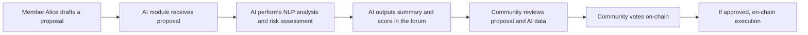
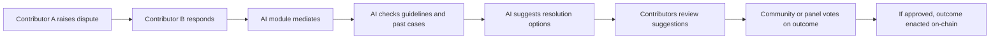
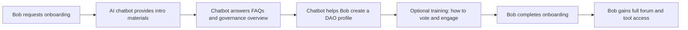
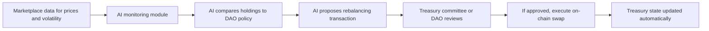
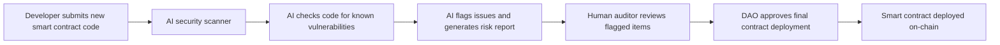

# DAO User Scenario Flow Diagrams

- Author: Mossland Lab
- Email: lab@moss.land
- Date of Initial Document Creation: February 13, 2025

Below are **fictitious but plausible** user scenarios in a DAO (Decentralized Autonomous Organization) context, illustrating **AI-driven processes** that enhance governance and member interactions.

> **Note:** We focus solely on user scenarios and do **not** include experimental or evaluative content.
---

## 1. AI-Assisted Funding Proposal Review

**Scenario Description**  
A DAO member (Alice) submits a funding proposal to the DAO. An AI assistant analyzes the proposal text, checks alignment with the DAO’s objectives, and provides a summary and risk score. The broader community then reviews the AI’s findings and votes on the proposal.

**Key Actors**  
- **Alice (Proposer)**: Submits the funding proposal.  
- **AI Module**: Automates text analysis and risk scoring.  
- **DAO Community**: Reviews and votes on the proposal.  
- **On-Chain Governance Contract**: Executes the final decision automatically if approved.

---

## 2. Automated Dispute Resolution via AI

**Scenario Description**  
Two DAO contributors disagree on task ownership or compensation. They invoke an AI-driven dispute resolution workflow, which references historical conflict data, existing guidelines, and relevant on-chain transactions to recommend possible resolutions.

**Key Actors**  
- **Contributors (A & B)**: Parties involved in the dispute.  
- **AI Module**: Provides resolution suggestions based on guidelines and historical data.  
- **Community/Dispute Panel**: Approves or overrides AI suggestions.  
- **On-Chain Mechanism**: Executes the outcome (e.g., adjusting compensation).

---

## 3. AI-Based Member Onboarding Process

**Scenario Description**  
A new user (Bob) joins the DAO and wants to understand the governance model, current proposals, and how to participate. An AI chatbot guides Bob through essential documents, FAQs, and optional training modules.

**Key Actors**  
- **Bob (New Member)**: Learns how to navigate DAO processes.  
- **AI Chatbot**: Delivers Q&A and training modules.  
- **DAO Governance Tools**: Where Bob eventually participates (voting, proposals, discussions).

---

## 4. Automated Treasury Rebalancing with AI

**Scenario Description**  
A DAO maintains a treasury of digital assets. An AI system monitors market conditions and the DAO’s diversification policy, then suggests or initiates a portfolio rebalance when needed.

**Key Actors**  
- **AI Monitoring Module**: Analyzes treasury allocations vs. targets.  
- **Treasury Committee or DAO**: Validates or adjusts the AI proposal.  
- **On-Chain Execution**: Smart contracts that perform asset swaps or movements.

---

## 5. AI-Powered Bug Detection in Smart Contracts

**Scenario Description**  
Before deploying a new smart contract, the DAO runs the code through an AI security scanner. Potential vulnerabilities are flagged in a risk report for human auditors to finalize before on-chain deployment.

**Key Actors**  
- **Developer**: Writes and submits contract code.  
- **AI Security Scanner**: Automated vulnerability detector.  
- **Human Auditor**: Confirms or refutes AI findings.  
- **DAO**: Governing body finalizing deployment.

---

## 6. Intelligent Community Event Coordination

**Scenario Description**  
The DAO hosts regular community calls. An AI agent compiles agenda items by analyzing trending forum topics, determines the best time slot based on global availability, and auto-generates meeting summaries.

```mermaid
flowchart LR
    A[Forum activity and trending topics] --> B[AI topic analyzer]
    B --> C[AI identifies popular or urgent discussions]
    C --> D[AI checks member availability and time zones]
    D --> E[AI proposes event date and agenda]
    E --> F[Community confirms or adjusts details]
    F --> G[Event conducted via audio video call]
    G --> H[AI creates automatic meeting summary]
    H --> I[Summary posted to DAO forum]
```

**Key Actors**  
- **AI Topic Analyzer**: Gathers and prioritizes discussion items.  
- **Community**: Adjusts time or topics if needed.  
- **DAO Forum**: Where final summaries and agendas are posted.

---

## Concluding Note on Scenarios

These flow diagrams illustrate **potential processes** within a DAO environment, showing how various AI tools can reduce friction, automate repetitive tasks, and offer data-driven governance insights. While entirely fictional, these scenarios reflect **common DAO workflows** and **governance challenges**, demonstrating how AI integration could enhance transparency, efficiency, and participation.
