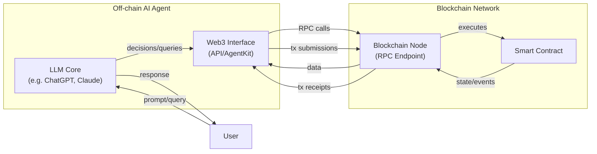
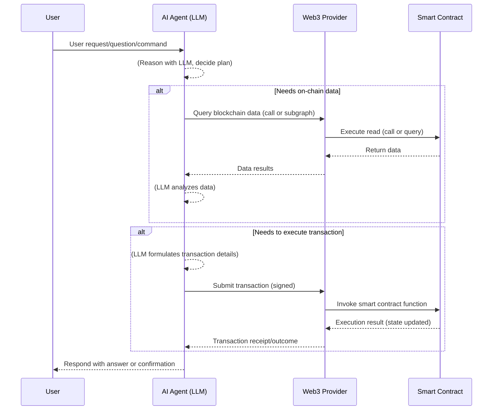

# Optimizing AI Agent Access to Blockchain Smart Contracts

- Author: Mossland Lab
- Email: lab@moss.land
- Date of Initial Document Creation: February 14, 2025


Artificial Intelligence (AI) agents powered by Large Language Models (LLMs) are increasingly being integrated with blockchain systems. LLMs such as OpenAI’s **ChatGPT**, Anthropic’s **Claude**, and Google’s **Gemini** serve as the "brains" of these agents, enabling them to interpret natural language, make decisions, and interact with blockchain smart contracts on behalf of users. This research study provides an in-depth look at how to optimize AI agent access to blockchain smart contracts. We will explore efficient methods for querying on-chain data, ways AI agents can execute transactions, design improvements to make smart contracts more AI-friendly, and illustrative case studies. Python examples using **Ethereum** and the **Web3.py** library are included to demonstrate key concepts. Diagrams (using Mermaid-like syntax in "Diagrams" code blocks) are provided to visualize object relationships and data flows. The content is organized for clarity with logical headings and short paragraphs, and includes citations to external sources in the format【source†lines】 for reference.

## Introduction

Blockchain networks like Ethereum hold a wealth of data and programmable contracts, but accessing and interacting with this data traditionally requires specialized knowledge of blockchain protocols and APIs. Meanwhile, AI agents have advanced to interpret natural language and perform complex reasoning. Combining these technologies, an AI agent can serve as an intelligent intermediary between users and blockchains – answering questions about on-chain data or autonomously managing crypto-assets. 

**AI agents in blockchain:** An AI agent in this context is an autonomous software entity that leverages an LLM for decision-making and uses blockchain connectivity (via tools like Web3 interfaces) to act on a blockchain. Recent developments have led to **AI agents that trigger smart contracts, manage crypto wallets, analyze on-chain data,** and perform other tasks in the blockchain ecosystem ([When AI Meets Blockchain: A Guide to Securing the Next Frontier](https://quantstamp.com/blog/when-ai-meets-blockchain-a-guide-to-securing-the-next-frontier#:~:text=The%20rapid%20performance%20improvements%20of,or%20manage%20social%20media%20accounts)). These agents build dynamic frameworks around LLM cores, allowing them to make decisions and execute actions autonomously ([When AI Meets Blockchain: A Guide to Securing the Next Frontier](https://quantstamp.com/blog/when-ai-meets-blockchain-a-guide-to-securing-the-next-frontier#:~:text=In%20recent%20months%2C%20AI%20agents,or%20manage%20social%20media%20accounts)). In simpler terms, the LLM processes user instructions or environmental data and the agent uses various tools (like blockchain RPC calls) to carry out those instructions in the crypto world.

**Why optimize AI–blockchain interaction?** Accessing blockchain data and functions can be non-trivial: raw queries might be slow or inefficient, and executing transactions involves security and complexity considerations. By optimizing how AI agents query and transact with smart contracts, we can achieve faster responses, lower costs (e.g. fewer redundant calls or failed transactions), and safer operations. This is crucial for building reliable applications such as conversational blockchain explorers, autonomous DeFi trading agents, or compliance monitoring bots. Moreover, improving smart contract design with AI in mind can make it easier for such agents to interpret and interact with contracts correctly.

**Scope of this study:** We will examine the methods for efficient on-chain queries and transaction execution by AI agents. We’ll discuss design principles for smart contracts that facilitate AI interaction. Two case studies will demonstrate these ideas in action using Python code:
1. An AI agent analyzing smart contract data to deliver user-friendly insights.
2. An AI agent learning from blockchain transaction data to detect patterns or anomalies.

Throughout, Ethereum will be used as the example blockchain (though principles generally apply to similar smart contract platforms). Code snippets will utilize **Web3.py** (a Python library for Ethereum) to show how data can be fetched or transactions sent. We will also incorporate techniques for combining these with AI (for example, using an LLM API to interpret data). 

Before diving into the technical details, let’s first understand the architecture of AI agents in the context of blockchain.

## AI Agents and Smart Contracts: Architecture and Tools

Modern AI agents that interact with blockchains are typically structured in modular layers. At the core is the **LLM**, which handles understanding instructions (often in natural language) and reasoning about what actions to take. Around this core, an agent includes components that connect to external systems – in our case, blockchain networks and smart contracts.

**LLM as the decision-maker:** Large Language Models like ChatGPT, Claude, and Gemini have been used as the “brains” of crypto agents ([Interop Accelerates Crypto AI Agents | LayerZero](https://layerzero.network/blog/interop-accelerates-crypto-ai-agents#:~:text=1,fashion%2C%20allowing%20the%20developer%20to)). These models excel at language understanding and generation, allowing the agent to take user input (e.g. *"What is my token balance?"* or *"Trade 2 ETH for DAI"*), parse the intent, and decide on a plan. The LLM, however, does not inherently know the state of the blockchain at a given moment – it needs to query data or send transactions via tools.

**Tool integration (Web3 and others):** To interact with a blockchain, the AI agent uses Web3 libraries, APIs, or specialized frameworks. For example, **Coinbase’s AgentKit** is a toolkit designed to bridge LLMs with blockchain operations ([How to Create a Web3 AI Agent with Coinbase AgentKit | QuickNode Guides](https://www.quicknode.com/guides/ai/create-a-web3-ai-agent-with-coinbase-agent-kit#:~:text=AgentKit%20is%20Coinbase%E2%80%99s%20toolkit%20for,blockchain%20operations%2C%20enabling%20agents%20to)). It provides an interface through which the agent can **manage wallets, perform transactions, deploy tokens, interact with smart contracts**, etc., under guidance of the LLM ([How to Create a Web3 AI Agent with Coinbase AgentKit | QuickNode Guides](https://www.quicknode.com/guides/ai/create-a-web3-ai-agent-with-coinbase-agent-kit#:~:text=Coinbase%E2%80%99s%20AgentKit%20is%20a%20powerful,X)) ([How to Create a Web3 AI Agent with Coinbase AgentKit | QuickNode Guides](https://www.quicknode.com/guides/ai/create-a-web3-ai-agent-with-coinbase-agent-kit#:~:text=What%20is%20Coinbase%20AgentKit%3F)). The LLM produces high-level decisions (e.g., *"query balance of address X"*, or *"execute swap on Uniswap"*), and the AgentKit or Web3 tool executes the low-level blockchain calls. This separation of concerns makes the architecture powerful: the LLM handles reasoning, while a secure API layer handles blockchain specifics ([How to Create a Web3 AI Agent with Coinbase AgentKit | QuickNode Guides](https://www.quicknode.com/guides/ai/create-a-web3-ai-agent-with-coinbase-agent-kit#:~:text=At%20its%20core%2C%20it%20uses,about%20what%20actions%20to%20take)).

**Off-chain vs on-chain components:** Typically, the LLM and the decision logic run off-chain (on a server or cloud service), since current blockchains cannot run complex AI models on-chain. The agent communicates with blockchain nodes through RPC calls. In some advanced designs, the agent might also have an **on-chain presence**, such as a smart contract wallet that it controls. One emerging approach is using **Account Abstraction (ERC-4337)** wallets or **smart contract accounts** that are tailor-made for AI control. These smart accounts allow custom verification logic, batched actions, or sponsored fees, which can be very useful for AI agents (more on this later). In fact, industry predictions suggest that as account abstraction adoption grows, a meaningful portion of blockchain accounts may be controlled by **agentic AI**, leveraging smart accounts to execute decisions autonomously ([Account Abstraction 2024. 2024 set the foundations. 2025 will… | by Kurt Larsen | Jan, 2025 | Rhinestone](https://blog.rhinestone.wtf/account-abstraction-2024-1d35f811f391#:~:text=ERC,verticals%20to%20the%20next%20level)).

To visualize the components of an AI agent and its interactions with a blockchain, consider the following diagram of the overall architecture:



*Diagrams: AI agent architecture and object relationships.* In this diagram, the **User** interacts with the AI agent via the LLM (providing instructions or questions in natural language). The **LLM core** decides if it needs to use a tool to fulfill the request. The **Web3 Interface** (Agent’s tool) sends RPC requests to a **Blockchain Node**, which in turn reads or writes to the actual **Smart Contract** on the blockchain. Data flows back to the agent which then responds to the user. If a transaction is to be executed, the agent’s tool will craft and submit a transaction through the node.

Key components and their relationships are illustrated above: the AI agent is off-chain but has a *connection* to on-chain contracts via a Web3 provider. The smart contract itself is on-chain logic that can be queried or invoked. The user is at one end of the chain, receiving human-friendly outputs, while the blockchain is at the other end, securing the state and executing transactions.

**Frameworks and examples:** Aside from AgentKit, other frameworks like **LangChain**, **Eliza**, **Virtuals**, and **Zep** have emerged to ease building such agents ([Interop Accelerates Crypto AI Agents | LayerZero](https://layerzero.network/blog/interop-accelerates-crypto-ai-agents#:~:text=2,leading%20AI%20agent%20development%20include)). They often provide abstractions for common actions (querying a contract, monitoring events, etc.) and integration with multiple LLMs. As an example, *ElizaOS* is an on-chain investment fund managed by an AI agent, demonstrating that an autonomous agent can perform DeFi operations in practice ([Interop Accelerates Crypto AI Agents | LayerZero](https://layerzero.network/blog/interop-accelerates-crypto-ai-agents#:~:text=Story%2C%20and%20Vana,fund%20managed%20by%20an%20agent)). Generally, an AI agent will use whatever tool is needed: one agent might use a Python Web3 library, another might call a GraphQL API for data, and a third might even incorporate a SQL database as an intermediate (as we will see in a later example).

With this background, we can delve into **efficient methods for querying smart contract data** – essentially how the AI agent can quickly and reliably retrieve on-chain information needed for decision-making or answering user queries.

## Efficiently Querying Smart Contract Data

Smart contracts expose data (state variables, events, etc.) that we may want to query. However, blockchains like Ethereum are not designed for high-level data queries in the way traditional databases are. Reading blockchain data can be complex and inefficient if done naively. In this section, we discuss strategies to make querying easier and faster for AI agents.

### Challenges in Querying Blockchain Data

Unlike SQL databases, blockchain nodes do not support rich query languages out of the box. A blockchain is essentially a distributed ledger (or state machine) where data is stored in transactions and contract state, but pulling aggregated or filtered information requires either scanning through blocks/events or knowing exact storage slots. **There’s no built-in query language for blockchain data**, making certain data retrieval tasks *“painful or completely impossible”* without additional indexing ([TheGraph: Fixing the Web3 data querying](https://soliditydeveloper.com/thegraph#:~:text=A%20blockchain%20is%20a%20decentralized,using%20GraphQL%20as%20query%20language)). For example, if you want to know *“all transfers above 1000 tokens from a given contract in the last month,”* a blockchain node alone would require scanning every Transfer event in that period and filtering, which is computationally heavy.

For an AI agent that needs information on-demand (possibly in response to user queries), scanning the entire chain is not feasible. Thus, efficient querying is about leveraging off-chain indexing, caching, or specialized calls so that needed data is available quickly.

### Method 1: Direct RPC Calls via Web3 (for Simple Queries)

For relatively simple data (single state variables or recent events), the agent can use direct JSON-RPC calls through a library like Web3.py. Ethereum nodes provide RPC methods such as `eth_call` for reading contract state, `eth_getBalance` for account balances, and `eth_getLogs` for event logs filtering. 

**Direct calls are efficient for known, specific queries:**
- *State variables and view functions:* If the contract provides a view function (read-only call) for the data needed (e.g. `balanceOf(address)` on an ERC-20 token contract), the agent can call it directly. This is a single RPC request, which most nodes handle quickly, returning the current on-chain value.
- *Recent events or transactions:* If looking for events in a recent block range, using `eth_getLogs` with filters (address, event signature, block range) can retrieve matching events. The agent can specify filters to narrow results, which the node processes, returning only relevant logs.

**Example – Querying a token’s state:** Suppose our AI agent needs to get the **total supply** of a token and the **balance of a user**. The following Python code (using Web3.py) demonstrates how an agent might do this:

```python
from web3 import Web3

# Connect to an Ethereum RPC (this could be an Infura/Alchemy URL or local node)
w3 = Web3(Web3.HTTPProvider("https://mainnet.infura.io/v3/YOUR_INFURA_API_KEY"))

# Address and ABI for the token contract (e.g., USDC on Ethereum mainnet in this example)
token_address = Web3.toChecksumAddress("0xA0b86991c6218b36c1d19D4a2e9Eb0cE3606EB48")  # USDC
token_abi = [  # simplified ABI with only what we need
    {
      "constant": True,
      "inputs": [],
      "name": "totalSupply",
      "outputs": [{"name": "", "type": "uint256"}],
      "type": "function"
    },
    {
      "constant": True,
      "inputs": [{"name": "_owner", "type": "address"}],
      "name": "balanceOf",
      "outputs": [{"name": "balance", "type": "uint256"}],
      "type": "function"
    }
]
contract = w3.eth.contract(address=token_address, abi=token_abi)

# Query total supply (read on-chain state)
total_supply = contract.functions.totalSupply().call()
print(f"Total Supply: {total_supply}")

# Query balance of a specific user address
user_address = Web3.toChecksumAddress("0x742d35Cc6634C0532925a3b844Bc454e4438f44e")  # example user (random address)
balance = contract.functions.balanceOf(user_address).call()
print(f"Balance of {user_address}: {balance}")
```

In this snippet, the agent uses `contract.functions.totalSupply().call()` to retrieve the total supply of the token, and similarly for the balance. These calls are efficient – each is a single RPC query that the Ethereum node can answer by reading the contract’s state trie at the latest block (since `constant`/`view` functions do not require a transaction). The results can then be processed or fed into the LLM for further analysis or to formulate an answer to the user.

**Example – Filtering events:** If the agent needs historical data like recent transfers, it can query event logs:

```python
from datetime import datetime, timedelta

# Suppose we want events from the last 1000 blocks (~ about last 4 hours on Ethereum)
latest_block = w3.eth.block_number
from_block = latest_block - 1000

# Set up event filter for Transfer events (topic[0] is the Keccak of event signature)
transfer_event_signature = Web3.keccak(text="Transfer(address,address,uint256)").hex()
filter_params = {
    "fromBlock": from_block,
    "toBlock": latest_block,
    "address": token_address,
    "topics": [transfer_event_signature]
}
logs = w3.eth.get_logs(filter_params)

# Process a few logs
for log in logs[:5]:  # just look at first 5 for example
    # Each log contains topics (with from and to addresses) and data (amount)
    from_addr = "0x" + log["topics"][1].hex()[-40:]
    to_addr = "0x" + log["topics"][2].hex()[-40:]
    value = int(log["data"], 16)
    print(f"Transfer from {from_addr} to {to_addr}: {value} tokens")
print(f"Total Transfers found: {len(logs)}")
```

Here we manually set up the filter topics for the ERC-20 `Transfer` event and retrieve logs in a block range. The agent could use the contract’s ABI to decode these logs more easily (Web3.py can decode events via `contract.events.Transfer().getLogs()` if ABI is provided). For brevity we decoded manually: the `topics[1]` and `topics[2]` contain the from/to addresses (padded to 32 bytes, hence the slicing) and `data` has the token value transferred. This illustrates how an agent can retrieve many pieces of data with a single call (`eth_getLogs` returned *all* matching events in range), rather than having to call a view function repeatedly for each transfer.

**When to use direct RPC:** If the question or task at hand involves a **specific, known piece of data or a limited range** (e.g., “what is X’s balance,” “how many Y events occurred in the last hour”), direct calls are often the simplest and fastest path. The AI agent’s logic can determine which calls to make. For example, an AI agent could decide: *"To answer the user’s question about recent transfers, I should fetch Transfer events from the contract."* The agent would then execute a code tool that performs the above filtering. Many AI agent frameworks allow the LLM to choose such tools through a reasoning process (the ReAct paradigm), effectively letting the LLM say: *“I will call `get_logs` now.”*

However, direct RPC calls have limitations, especially as the scope of data grows. They often cannot efficiently query *aggregated* data or *large historical ranges* without heavy lifting. This is where off-chain indexing comes in.

### Method 2: Using Indexing Services (The Graph, etc.)

To optimize complex queries, it is common to rely on indexing services or blockchain data APIs. **The Graph** is a prime example: it is a decentralized protocol that indexes blockchain data and allows querying it via GraphQL. Developers define *subgraphs* that specify which contract events or state to index and how to organize the data, and then one can query this indexed data with powerful queries.

The Graph effectively adds a query layer to blockchain data, making access much more efficient for certain use cases. As one source explains, *“TheGraph is a decentralized protocol for indexing and querying blockchain data… using GraphQL as query language.”* ([TheGraph: Fixing the Web3 data querying](https://soliditydeveloper.com/thegraph#:~:text=A%20blockchain%20is%20a%20decentralized,using%20GraphQL%20as%20query%20language)). Instead of manually scanning the chain, an AI agent could query a subgraph that has already done the heavy lifting. For example, an agent could ask: *“Give me all transfers above 1000 tokens in the last month”* and the GraphQL query would return exactly that, if a subgraph is set up for the token.

**Advantages of indexing for AI agents:**
- **Speed:** Querying a prepared index is much faster than querying the blockchain directly, especially for historical data. The index is essentially a cached, queryable database of the blockchain’s events and state.
- **Complex queries:** GraphQL allows querying with conditions, sorting, pagination, and relational links between entities. An AI agent could get answers to questions like *“Who are the top 10 holders of this token?”* in one query to a subgraph that indexes token balances – a task that would be complex with raw RPC (you’d have to iterate over all holders).
- **Natural integration with AI:** Because GraphQL queries are expressed in a JSON-like structure, an AI (which excels at generating text) can formulate such queries if taught the schema. Alternatively, developers can hard-code certain Graph queries and let the AI pick which one to use.

**Example – Using The Graph (conceptual):** Let’s say our AI agent wants to retrieve all trades from a decentralized exchange (DEX) smart contract and then find some pattern. If a subgraph exists for the DEX (many DeFi protocols have public subgraphs), the agent could query it. While we can’t run The Graph in this environment, here’s a conceptual snippet of how the agent might use a Python GraphQL client:

```python
import requests

# GraphQL endpoint for Uniswap v3 subgraph (for example)
url = "https://api.thegraph.com/subgraphs/name/uniswap/uniswap-v3"
query = """
{
  swaps(first: 5, orderBy: timestamp, orderDirection: desc) {
    id
    amountUSD
    token0 {
      symbol
    }
    token1 {
      symbol
    }
    sender
    recipient
    timestamp
  }
}
"""
response = requests.post(url, json={'query': query})
data = response.json()
for swap in data['data']['swaps']:
    t0 = swap['token0']['symbol']; t1 = swap['token1']['symbol']
    print(f"{swap['sender']} swapped tokens {t0}->{t1} for ${swap['amountUSD']} (USD) at time {swap['timestamp']}")
```

In this pseudo-example, a GraphQL query asks for the 5 most recent swaps on Uniswap v3, including fields like token symbols, amount in USD, sender and recipient. The Graph’s indexing node would return this data in one HTTP call. An AI agent could then easily format or analyze this information. Notably, The Graph subgraphs are often used behind the scenes in blockchain analytics dashboards, and here an AI agent leverages the same for fast querying.

The Graph is not the only option. There are centralized APIs like **Covalent**, **Alchemy’s Enhanced APIs**, **Etherscan API**, **Dune Analytics**, etc. For instance, Etherscan offers an API to get transactions for an address, token holder lists, and so on. An AI agent could call these APIs (which return JSON) and then interpret the results. The choice of tool may depend on convenience and the type of data:
- *Etherscan API* – quick for things like "latest transactions of address X".
- *Covalent API* – can fetch token balances for many addresses in one call, etc.
- *Dune Analytics* – one could pre-define an SQL query on Dune’s Ethereum dataset and use its API to execute it, although that’s more static unless the AI can write SQL (which is possible, as one case study shows combining SQL and AI ([Web3: Building a Transactional Chatbot | by Chris King | newmathdata](https://blog.newmathdata.com/web3-building-a-transactional-chatbot-32ff6f4f9e79#:~:text=Imagine%20being%20able%20to%20query,way%20is%20becoming%20increasingly%20valuable))).

**Example – Using a blockchain API:** Here’s a quick example with Etherscan API for an address’s transactions (conceptual, no API key provided):

```python
address = "0xde0B295669a9FD93d5F28D9Ec85E40f4cb697BAe"  # Example address
api_key = "MY_ETHERSCAN_KEY"
url = f"https://api.etherscan.io/api?module=account&action=txlist&address={address}&apikey={api_key}"
response = requests.get(url)
txs = response.json().get('result', [])
print(f"Address {address} has {len(txs)} transactions in history (according to Etherscan).")
if txs:
    latest_tx = txs[-1]  # last in list is latest if sorted by time
    value_eth = int(latest_tx['value']) / 1e18
    print(f"Latest tx -> to: {latest_tx['to']}, value: {value_eth} ETH, at block {latest_tx['blockNumber']}.")
```

This uses Etherscan’s `account txlist` to fetch all transactions of an address (which could be thousands, but Etherscan paginates). The agent would then parse JSON. While not as flexible as The Graph, such APIs are straightforward and can be quicker to set up for certain tasks.

**Implication for AI**: These services dramatically reduce the effort for the AI agent to get information. Instead of reasoning about how to loop through blocks or events, the agent can directly ask a high-level question if we provide it a way to call these APIs. For example, an AI agent might have a predefined "tool" that when given a query like *"top holders of TOKEN"* will call a subgraph or API to retrieve holders and balances, then return that to the LLM. 

In practice, developers often **combine approaches**: Use The Graph or other indexers for heavy data, and direct Web3 calls for quick checks or very fresh data (since an index might lag by a few minutes).

A notable initiative is using **natural language to query on-chain data**. The Graph’s team hinted at enabling natural language access to subgraph data using LLMs ([Using AI To Enhance The Graph Network | Blog | The Graph](https://thegraph.com/blog/using-ai-to-enhance-the-graph/#:~:text=have%20started%20a%20pilot%20project,Stay%20tuned%20for%20more%20details)). This means in the future, an AI agent might not even need to formulate a GraphQL query itself; the user could ask in plain English and the agent would translate that into a Graph query, fetch data, and respond. This is essentially what some experimental “blockchain chatbots” are doing already by coupling LLMs with on-chain data sources ([Web3: Building a Transactional Chatbot | by Chris King | newmathdata](https://blog.newmathdata.com/web3-building-a-transactional-chatbot-32ff6f4f9e79#:~:text=Imagine%20being%20able%20to%20query,way%20is%20becoming%20increasingly%20valuable)).

### Method 3: Caching and Knowledge Bases for AI

Another method to optimize queries is for the AI agent to maintain its own cache or knowledge base of blockchain data. This might involve regularly indexing certain data into a local database or using a vector store for textual data.

For example:
- An AI agent might periodically pull the latest prices or stats from a contract and store them. Then, if the user asks for these, the answer is retrieved from the agent’s memory rather than hitting the blockchain every time.
- For contract source code or documentation: the agent could use embeddings. It can encode the text of a smart contract (or its documentation) into vectors and store them in a vector database. Later, when asked questions about that contract, the agent performs a similarity search to find relevant snippets and uses the LLM to synthesize an answer (this approach is known as Retrieval-Augmented Generation (RAG) ([Best Practices for AI Agents in Compliance - IONI - Springs](https://springsapps.com/knowledge/best-practices-for-ai-agents-in-compliance---ioni#:~:text=By%20combining%20the%20strengths%20of,indispensable%20for%20navigating%20compliance%20complexities)) ([Best Practices for AI Agents in Compliance - IONI - Springs](https://springsapps.com/knowledge/best-practices-for-ai-agents-in-compliance---ioni#:~:text=Preparing%20Data%20for%20RAG%20and,LLM))). While this is more about code understanding than on-chain state, it’s worth noting as part of the agent’s toolkit for “querying” knowledge about the contract’s behavior.

A concrete example of caching is found in a tutorial where Ethereum data was piped into a SQLite database, and then an AI (LLM) was used to query that database with SQL to answer questions ([Web3: Building a Transactional Chatbot | by Chris King | newmathdata](https://blog.newmathdata.com/web3-building-a-transactional-chatbot-32ff6f4f9e79#:~:text=Imagine%20being%20able%20to%20query,way%20is%20becoming%20increasingly%20valuable)). By doing so, the heavy-lifting of data retrieval was done once (populating the DB), and subsequent queries became efficient SQL lookups. This is especially useful if the agent expects many queries on the same dataset (e.g., analyzing one contract’s activity repeatedly).

### Summary of Query Strategies

To summarize, an AI agent has multiple avenues to efficiently query smart contract data:
- **Direct Web3 calls** for current state or narrowly-defined data (fast for simple queries, used on demand).
- **Blockchain indexers/APIs (off-chain)** for complex or bulk data (GraphQL with The Graph, or other analytics APIs) to avoid scanning the chain in real-time ([TheGraph: Fixing the Web3 data querying](https://soliditydeveloper.com/thegraph#:~:text=A%20blockchain%20is%20a%20decentralized,using%20GraphQL%20as%20query%20language)).
- **Caching and preprocessing**: storing relevant data in a local database or using RAG so that repeated queries can be answered quickly and possibly in natural language.
- **Combination with LLM**: using the LLM’s ability to interpret and integrate data. For instance, even if data comes raw from an API, the LLM can summarize or explain it to the user (we'll see this in the case study).

One should choose the method based on the question’s scope and freshness requirement. If a user asks *“What’s the current price of token X?”*, a direct call to a price feed contract (like Chainlink or an AMM) is appropriate. If they ask *“What was the average daily trading volume of token X over the last month?”*, an indexed approach with a subgraph or database will be far more efficient.

Having covered data retrieval, we will now shift to the other side of the coin: **executing transactions on smart contracts** via AI agents. This involves the agent not just reading data, but also writing to the blockchain (performing actions).

## AI Agents Executing Transactions on Smart Contracts

Beyond just querying data, AI agents can be empowered to **take actions** on the blockchain – for example, transferring funds, executing trades, or calling contract functions that change state. This capability opens the door to autonomous agents that can, for instance, manage a portfolio or execute a smart contract function in response to some event (all without direct human push of the button each time). However, executing transactions is more complex and sensitive than reading data, so it requires careful setup and optimization.

### Requirements for Transaction Execution

To execute a transaction on Ethereum (or similar blockchains), an agent must have:
- **An account (address) with the appropriate permissions** – typically an Externally Owned Account (EOA) with a private key, or a Contract Account it controls. The account needs to have funds for gas if required.
- **Ability to craft the transaction data** – i.e., the correct function signature and parameters, or the value transfer details, and set parameters like gas limit and gas price.
- **Ability to sign the transaction** – using the account’s private key (which means the agent needs secure access to that key, a major security consideration).
- **Network access to broadcast the transaction** – e.g., via a Web3 provider to `eth_sendRawTransaction`.

If any of these steps go wrong, the transaction might fail or be rejected, costing gas fees or worse, performing an unintended action. Therefore, optimizing transaction execution involves not just speed, but also **accuracy** and **safety**.

### Using AI for Decision, Code for Execution

In the architecture described earlier, the LLM would decide *what* transaction to execute, and the agent’s execution module will handle *how* to execute it. For example, if a user tells the agent *“Swap 1 ETH to DAI”*, the LLM might output a plan like: *“Call UniswapV2Router’s swapExactETHForTokens with 1 ETH.”* The agent then uses web3 to encode and send this transaction.

**Framework assistance:** Tools like AgentKit handle a lot of this under the hood. As noted, *“AgentKit uses Coinbase's CDP SDK to handle all blockchain operations (like deploying tokens or managing wallets), enhanced by an AI layer that makes decisions”* ([How to Create a Web3 AI Agent with Coinbase AgentKit | QuickNode Guides](https://www.quicknode.com/guides/ai/create-a-web3-ai-agent-with-coinbase-agent-kit#:~:text=At%20its%20core%2C%20it%20uses,about%20what%20actions%20to%20take)). This means the AI agent developer doesn’t need to manually implement signing and sending – they call AgentKit functions (e.g. `agent.swap()` or similar) and AgentKit internally crafts transactions. For learning purposes, we’ll show how to do it with Web3.py manually.

### Crafting and Sending Transactions (Web3.py example)

Consider a simple scenario: the AI agent needs to **transfer some Ether** to another address (perhaps part of some treasury management task). The agent knows the target address and amount. Here’s how it can create and send a transaction in Python:

```python
from web3 import Web3

w3 = Web3(Web3.HTTPProvider("https://sepolia.infura.io/v3/YOUR_INFURA_KEY"))  # using Sepolia testnet for example

# Agent's own Ethereum account (EOA) - we'll use a test private key (DO NOT use real keys in code like this)
agent_private_key = "0x4c0883a69102937d6231471b5dbb6204fe5129617082793..."  # (example key, truncated)
agent_account = w3.eth.account.from_key(agent_private_key)
agent_address = agent_account.address

# Define transaction details
to_address = Web3.toChecksumAddress("0xReceiverAddress...")   # recipient of the transfer
value = w3.toWei(0.01, 'ether')  # amount to send

# Build the transaction dictionary
txn = {
    'to': to_address,
    'value': value,
    'gas': 21000,  # gas limit for a simple ETH transfer
    'gasPrice': w3.toWei(10, 'gwei'),
    'nonce': w3.eth.get_transaction_count(agent_address),
    'chainId': 11155111  # Sepolia chain ID
}

# Sign the transaction with agent's private key
signed_txn = w3.eth.account.sign_transaction(txn, private_key=agent_private_key)

# Send the signed transaction
tx_hash = w3.eth.send_raw_transaction(signed_txn.rawTransaction)
print(f"Transaction sent with hash: {tx_hash.hex()}")

# Optionally, wait for receipt
receipt = w3.eth.wait_for_transaction_receipt(tx_hash)
print(f"Transaction status: {receipt.status}, block number: {receipt.blockNumber}")
```

In this code:
- We connected to the **Sepolia** testnet via Infura (Sepolia’s chainId is 11155111).
- We loaded the agent’s account via a private key (in a real agent, this key might be stored securely in a vault or HSM; exposing it like this is only for demonstration).
- We built a transaction dict with required fields. The agent needed to obtain the correct `nonce` for its account (count of transactions so far), set a `gasPrice` (or use `maxFeePerGas` for EIP-1559 style dynamic fees on Ethereum mainnet), etc. These details are important – a mistake can cause the transaction to be rejected (e.g., wrong nonce, or not enough gas).
- We signed the transaction and then broadcasted it.

The output, if run, would be a transaction hash and eventually a receipt indicating success (status 1 in Ethereum means success). This whole process would typically be embedded in the agent’s execution tool. The AI (LLM) might initiate this by saying something like: *“Send 0.01 ETH to 0xReceiverAddress... for payment.”* The agent translates it to the above Web3 calls.

**Calling smart contract functions:** The above was a simple ETH transfer (which doesn’t involve a contract’s function call). If the agent needs to interact with a contract function (say, calling `approve()` on a token, or executing a swap on a DEX contract), it needs the contract’s ABI to encode the call data. Web3.py’s `contract.functions.<method>.buildTransaction()` can help. For example:

```python
# Assuming we have an ERC20 contract object as before:
spender = Web3.toChecksumAddress("0xSpenderAddress...")
amount = 1000 * (10 ** 6)  # approve 1000 tokens (if token has 6 decimals like USDC)
txn = contract.functions.approve(spender, amount).build_transaction({
    'from': agent_address,
    'gas': 60000,
    'gasPrice': w3.toWei(5, 'gwei'),
    'nonce': w3.eth.get_transaction_count(agent_address),
    'chainId': 11155111
})
signed = w3.eth.account.sign_transaction(txn, agent_private_key)
tx_hash = w3.eth.send_raw_transaction(signed.rawTransaction)
```

This builds a transaction for the `approve` function of an ERC-20 token (letting `spender` spend 1000 tokens on behalf of agent). The agent of course must have enough tokens and the contract at `token_address` should be the correct token. But assuming the details are correct, this will create the proper call data for `approve(address,uint256)` and send it.

**Optimization considerations:**
- *Gas management:* The agent should optimize gas price (maybe even use a gas price oracle or an API to decide an appropriate fee to avoid overpaying or underpaying). This is particularly important if the agent operates autonomously, as it might submit many transactions.
- *Batching:* If an agent needs to do multiple actions, doing them in one transaction if possible saves time and fees. Some blockchains or contracts allow batching. For instance, if the agent needed to do A then B, it might call a smart contract that performs both A and B in sequence as one transaction. Ethereum’s EOA accounts can’t batch easily, but an Account Abstraction wallet or a custom multi-call contract could. Many AI agents use smart contract wallets (e.g., Gnosis Safe or ERC-4337 accounts) which can bundle multiple calls then the user (or agent's key) signs once. This reduces the overhead of multiple separate transactions.
- *Simulations and verifications:* Before sending a potentially risky transaction, the agent could simulate it using tools like Tenderly or `eth_call` on a forked state to ensure it will likely succeed. This prevents wasting gas on failing transactions. For example, the agent might do `w3.eth.call(txn)` (with the `to`, `data` but as a call) to see if it returns an error.
- *Monitoring:* After sending, the agent should monitor the transaction. If it’s stuck (not mined due to low gas price), it might replace it (by sending another with same nonce and higher gas, a process called gas bumping). Such logic is often implemented in transaction relayer services or smart wallets, but an advanced AI agent might handle it too.

The **security aspect** cannot be overstated. Giving an AI agent the power to execute transactions is effectively giving it control over cryptocurrency assets. One must ensure the AI’s decisions are bounded by safety rules. For example, an AI agent with access to a large treasury should likely have limits or human checkpoints. This is where **AI-friendly contract design** can help, which we will discuss soon (e.g., contracts that require multiple confirmations, whitelisted actions, or time delays to prevent catastrophic mistakes by an AI).

### Transaction Execution Case: Multi-step Actions

AI agents might have to perform *multi-step transactions*, possibly across multiple contracts or even chains. For example, an agent could be tasked with arbitraging between two DEXes, which involves buying on one and selling on another, or bridging tokens from one chain to another and then doing something. Doing this optimally might mean **combining steps**. A fascinating example was given: *“an interoperable DeFi agent can retrieve data from various smart contracts across blockchains (via pull messaging), and execute multi-step transactions such as bridging USDT, swapping it for ETH, re-staking it for wETH, and bridging it back – all within a single transaction”* ([Interop Accelerates Crypto AI Agents | LayerZero](https://layerzero.network/blog/interop-accelerates-crypto-ai-agents#:~:text=For%20instance%2C%20consider%20an%20interoperable,of%20manual%20human%20interactions%20onchain)). This means the agent used an interoperability protocol (like LayerZero) to orchestrate a chain of actions as a single atomic operation spanning chains. 

While the details are complex, what matters is that the AI agent’s planning (the LLM’s job) covers multiple moves, and then the execution engine uses the appropriate calls (perhaps to a specialized contract that handles the cross-chain calls). This is optimal because it reduces risk (the sequence is atomic, so no step is left half-done if another fails) and can save time.

In Ethereum alone, an agent could leverage **multicall** (a common pattern or the Multicall contract) to bundle, say, “approve token, then swap on Uniswap, then deposit into lending protocol” into one transaction, rather than three separate ones. An AI agent should be aware of such possibilities, or at least developers can program the agent to attempt batching where possible.

### Account Abstraction and Smart Accounts for AI

**Account Abstraction** (AA) deserves special mention for AI agents. With ERC-4337, Ethereum now supports smart contract-based accounts without modifying consensus ([Account Abstraction 2024. 2024 set the foundations. 2025 will… | by Kurt Larsen | Jan, 2025 | Rhinestone](https://blog.rhinestone.wtf/account-abstraction-2024-1d35f811f391#:~:text=In%202023%2C%20ERC,dedicated%20section%20at%20the%20end)). These smart accounts allow custom logic for transaction validation. For an AI agent, this can be beneficial:
- The account could have built-in rate limits or spending limits (preventing the AI from draining funds too quickly, intentionally or by bug).
- It could use a **paymaster** to pay gas fees, so the AI doesn’t need to maintain ETH for gas (perhaps an external sponsor or a gas tank is provided, allowing the AI to operate more freely with other tokens).
- Multi-factor or multi-sig control: The smart account could require a co-signer (maybe another AI or a human) for large transactions, adding oversight.
- **Delegation:** An AI could manage an account on behalf of a user without having the user’s actual private key. The user could set rules in the account (like “the agent can trade up to $1000 daily”).

The industry anticipates huge growth in smart contract wallets and specifically calls out that **“DeFi super apps and agentic AI leverage Smart Accounts to take these product verticals to the next level.”** ([Account Abstraction 2024. 2024 set the foundations. 2025 will… | by Kurt Larsen | Jan, 2025 | Rhinestone](https://blog.rhinestone.wtf/account-abstraction-2024-1d35f811f391#:~:text=ERC,verticals%20to%20the%20next%20level)). In other words, sophisticated AI agents will likely be built on top of account abstraction wallets because of the flexibility and safety they offer. As millions of these smart accounts get deployed, many could be managed by AI logic.

For optimization, an agent using AA might also get **sponsored execution** – some services might sponsor the gas if the actions align with their goals (for instance, a protocol might pay gas for an agent to arbitrage it, because it brings volume).

**Example – Using a smart contract wallet (conceptual):** Instead of using a private key to sign, an agent could instruct a deployed contract wallet to execute an action. If using something like Gnosis Safe, the AI agent could be one of the owners and it could propose a transaction to the Safe. If the safe has a threshold of 1, it executes immediately; if threshold >1, maybe a human co-signer is needed. This is more a design choice than something to code here, but it's a critical design to consider for safe AI operations.

### Ensuring Safe and Intentional Actions

Given an AI’s fallibility (it could misunderstand or be induced by a tricky input to do something wrong), guardrails are important:
- **Confirmation steps:** The agent might summarize the action and ask the user for confirmation if it’s high-stakes (unless fully autonomous mode is intended).
- **Simulation:** as mentioned, simulate and analyze the outcome before actually sending it.
- **Monitoring and backstop:** Another AI agent could be assigned to monitor transactions and flag anomalies (e.g., an “AI auditor” agent that watches the primary agent – an idea suggested in AI agent security discussions ([When AI Meets Blockchain: A Guide to Securing the Next Frontier](https://quantstamp.com/blog/when-ai-meets-blockchain-a-guide-to-securing-the-next-frontier#:~:text=Implementing%20on,user%20prompts%2C%20can%20monitor%20the)) ([When AI Meets Blockchain: A Guide to Securing the Next Frontier](https://quantstamp.com/blog/when-ai-meets-blockchain-a-guide-to-securing-the-next-frontier#:~:text=Implementing%20on,user%20prompts%2C%20can%20monitor%20the))).

Finally, from an optimization perspective, once an agent is reliably executing transactions, one might measure success by how efficiently it can do so (minimizing gas, latency, and failures). Over time, an AI agent could even learn from experience: if a certain transaction pattern fails often, adjust strategy. For example, an AI agent could learn optimal gas price strategies by analyzing its past transactions (reinforcement learning on success vs. mining time).

Now that we have covered both querying and execution aspects, we will discuss how **smart contracts themselves can be designed or improved to be more “AI-friendly”**, facilitating easier interaction.

## AI-Friendly Improvements in Smart Contract Design

Smart contracts are typically designed with human developers and standard applications in mind. However, as AI agents become users of smart contracts, we might consider tweaks in how contracts are written and what features they expose to make AI integration smoother. An "AI-friendly" smart contract is one that is **easy for an AI to understand, interpret, and interact with correctly**.

Here are several areas where smart contract design can help AI agents:

### 1. **Natural Language Documentation (NatSpec)**

Solidity supports a documentation standard called **NatSpec (Natural Specification)**, which allows developers to annotate functions, return values, and events with human-readable comments. For example, one might write:

```solidity
/// @notice Transfers `_amount` tokens from the caller to `_recipient`.
/// @param _recipient The address to receive the tokens.
/// @param _amount The number of tokens to transfer.
function transfer(address _recipient, uint256 _amount) public returns (bool) { ... }
```

NatSpec comments like the above are typically used by front-end tools (e.g., Ethereum wallet interfaces can show these descriptions to users before they approve a transaction). For AI agents, **NatSpec can provide contextual information** about what a function does and what parameters mean. If this documentation is available (for instance, via source verified on Etherscan or a metadata JSON file), an AI agent could parse it to better understand contract methods. 

There are already AI tools that generate NatSpec using LLMs ([We built a free AI Tool that generates detailed NatSpec Doc ... - Reddit](https://www.reddit.com/r/solidity/comments/11yowj5/we_built_a_free_ai_tool_that_generates_detailed/#:~:text=Reddit%20www,matter%20of%20seconds%21%20This)), which is the inverse problem, but it shows the synergy: AI can both produce and consume natural language specs. In fact, Etherscan introduced a **Code Reader** tool that integrates ChatGPT to explain smart contract code to users ([Etherscan Touts ChatGPT Integration But Highlights The Chatbot's Flaws - Decrypt](https://decrypt.co/145324/etherscan-touts-chatgpt-integration-but-highlights-the-chatbots-flaws#:~:text=Discover%20SCENE)) ([Etherscan Touts ChatGPT Integration But Highlights The Chatbot's Flaws - Decrypt](https://decrypt.co/145324/etherscan-touts-chatgpt-integration-but-highlights-the-chatbots-flaws#:~:text=,Etherscan%20said)). This means if a contract’s source code is public, an AI can be used to interpret it. For instance, *"The Code Reader leverages AI to provide users with the ability to retrieve and interpret the source code of a specific contract address."* ([Etherscan Touts ChatGPT Integration But Highlights The Chatbot's Flaws - Decrypt](https://decrypt.co/145324/etherscan-touts-chatgpt-integration-but-highlights-the-chatbots-flaws#:~:text=,Etherscan%20said)). From a contract design standpoint, writing clear code and comments (and verifying on explorers) makes the AI’s job easier and less error-prone when it tries to explain or reason about the contract’s behavior.

To optimize for AI:
- Always include NatSpec for public interfaces. Key information to mention: what each function does, any important behaviors (like *"calls must be preceded by approve"*, or *"burning reduces total supply"* etc.).
- Include event documentation too, so the AI knows how to interpret logs.
- Verify the source on Etherscan or similar, so that the AI (through tools) can access the source and docs.

If NatSpec is available, an AI agent could incorporate that text into its prompt when reasoning about using that function. For example, if deciding whether to call `transferFrom` or `transfer`, having the descriptions might prevent mistakes.

### 2. **Standard Interfaces and Consistent Design**

AI agents will have an easier time if contracts follow known standards and patterns:
- Using standard ERC-20, ERC-721, ERC-1155 interfaces for tokens, or ERC-4626 for vaults, etc., means the agent doesn’t need custom logic for each new token or vault – it knows the standard functions (`balanceOf`, `transfer`, `safeTransferFrom`, etc.). Consistency is key. When an AI sees a function signature it recognizes (because it was likely trained on many similar ones in its training data or it’s coded into its toolset), it can proceed more confidently.
- Avoiding unnecessary complexity in function design. For instance, if a contract requires calling multiple functions in sequence to accomplish something, consider adding a convenience function that does it in one call (making it easier for an agent to execute one transaction instead of coordinating several). For example, some DeFi protocols have separate steps (approve token, then deposit). A contract might provide a `depositWithPermit` that does both (taking a signed permit instead of require prior approve). An AI agent could use such a function to streamline its actions (and also less gas overhead).
- Provide **view functions for computed data**: If an AI frequently needs to know something like the total debt of a user in a lending protocol, having a view function like `getUserAccountData(address)` returning a struct of all relevant numbers is more efficient than requiring the agent to call multiple functions (like get collateral, get debt, get prices, then calculate). Many well-designed contracts do this (e.g., Aave has getUserAccountData that returns multiple values in one call). So, from an AI optimization perspective, these multi-purpose view functions reduce the number of calls and the complexity of reasoning required off-chain.

### 3. **Rich Event Emission**

Contracts that emit **events** for important state changes are easier for off-chain agents to track. For AI agents analyzing contract activity, events are gold: they are structured logs that the agent can consume without invoking chain state reads.

To be AI-friendly:
- Emit events with clear, informational names and parameters whenever state changes or notable actions occur. For example, an auction contract should emit `BidPlaced(bidder, amount)` events. 
- If possible, include in events any data that would be needed to understand the action without additional context. This might sometimes duplicate state (small cost in gas), but it means the agent doesn’t have to call back into the contract to get that data. For instance, an `Approval` event for a token includes the allowance amount – so just by reading the event, one knows the new allowance.
- If your contract interacts with external contracts or has multiple steps internally, consider emitting a high-level event summarizing outcome. E.g., a complex function might emit an `ActionExecuted` event with a result code or summary.

From the AI agent’s side, having these events means:
- It can subscribe (via websockets or polling) to events and trigger its behavior promptly (important for real-time agents).
- It can build an internal narrative or explanation by reading events. For example, an AI compliance agent could explain *“User X swapped 50 ETH for 200k DAI on Uniswap”* by reading a Swap event from a Uniswap contract and an ERC-20 Transfer event for DAI to the user, matching them to interpret the action sequence.

### 4. **Machine-Readable Metadata**

There are Ethereum standards for metadata about contracts (like ERC-165 supports interface detection, ERC-721 and 1155 have metadata for tokens, etc.). Expanding on this:
- **ABI publishing**: Ensure the ABI (Application Binary Interface) of the contract is accessible (either via Etherscan or IPFS or an on-chain registry). An AI agent tool often needs the ABI to encode transactions or decode data. By having the ABI readily available, we eliminate the need for the AI to guess or for a developer to manually supply it.
- **Interface identifiers**: Use ERC-165 supportsInterface properly for custom interfaces, so an agent can programmatically check what interfaces a contract claims to support.
- **Additional metadata**: There isn’t a universal standard, but imagine if a contract could provide a JSON of its own description. For instance, a contract might have a function `getMetadata()` that returns a URL or IPFS hash where a JSON document describes the contract (purpose, authors, links). If an AI agent finds that, it can fetch it and gain high-level understanding. This is analogous to how tokens have metadata URIs for NFT content. Some projects have indeed put docs on IPFS and linked in the contract or transaction metadata.

### 5. **Fail-safes and Oversight Hooks**

This is more about safety than ease of use, but it’s relevant to “optimizing” AI usage in the sense of avoiding disasters:
- Incorporate admin or guardian roles that can pause or veto actions. If an AI agent is interacting with the contract and something goes wrong (perhaps the AI is compromised or malfunctioning), having a circuit breaker (like OpenZeppelin’s `CircuitBreaker` or pausable pattern) means a human can step in. 
- If expecting AI-driven transactions, consider a **time-lock** for certain critical functions. For example, if an AI agent can trigger a contract to move funds, a 24-hour timelock on that function’s execution gives time for review.
- Provide a way for an AI agent to **ask the contract for information** in a simpler form. For example, a contract could have an `explain()` view that returns a string or coded data about its current state. This is experimental, but one could imagine a smart contract that knows how to summarize its state variables in one readable string for UI or AI consumption. That way, an AI could call `explain()` and get something like *"State: 5 users, total staked 1000 ETH, current reward 50 ETH, next payout in 1 day."* This crosses into user-interface territory, but interestingly an AI is effectively a user interface for the user. Even a more structured variant could be `getSummary()` returning several key numbers.

### 6. **On-Chain AI Integration (Futuristic)**

Some projects (like the Phala Network’s Phat Contracts mentioned in a previous reference ([Introducing AI-Agent Contract for Smart Agents](https://phala.network/posts/introducing-aiagent-contract-for-smart-agents#:~:text=One%20of%20the%20significant%20accomplishments,applicability%20across%20various%20use%20cases))) have explored integrating off-chain compute (like AI inference) with contracts. For example, a contract could call out to an AI oracle to get some data or decision. While not common on Ethereum mainnet due to gas and determinism concerns, in more permissive environments a contract might say "given this input, query an AI model off-chain and return the result, then use it." If such patterns emerge (like Chainlink Functions attempts similar off-chain compute integration), then AI agents and contracts are even more interwoven. For the scope of this study, we focus on the AI agent being off-chain, but it’s worth noting that design: *smart contracts can be designed to welcome off-chain agent input.* For instance, a contract might have a function `receiveAnalysis(bytes data)` where an AI agent can post some computed analysis on-chain (if needed for transparency or further on-chain logic). Ensuring such mechanisms exist can create a feedback loop between AI and smart contracts, albeit that’s a very advanced scenario.

### Recap of AI-Friendly Design Tips

- **Document and standardize**: Use NatSpec and follow known interface standards so AI has less guesswork. ([Natspec in Solidity | Solidity Tips & Examples – JamesBachini.com](https://jamesbachini.com/natspec-in-solidity/#:~:text=Natspec%20in%20Solidity%20,code%20using%20natural%20language%20comments))
- **Expose helpful views and events**: So AI can get data in one shot and interpret actions from logs easily.
- **Provide metadata and openness**: ABIs, source code, and any additional hints about the contract’s purpose.
- **Safety mechanisms**: to mitigate AI erring, which indirectly optimizes reliable usage (less downtime or loss means smoother operation).

By making contracts more transparent and accessible, **we reduce the burden on the AI agent** to do complex reasoning or multiple interactions. The agent can be more efficient, calling one function to get needed info rather than ten, and less prone to misunderstanding the contract’s intent.

Next, to cement understanding, we will go through **two case studies**. These will illustrate how an AI agent might operate in practice: first in an *analysis scenario* and second in a *learning/pattern recognition scenario*, complete with Python examples that tie together querying, interpreting, and even transacting.

## Case Study 1: AI Agent Analyzing Smart Contract Data for Insights

**Scenario:** Imagine we have a user who wants insights about a particular token smart contract – for example, they ask: *“How is the XYZ token being used lately? Are there any unusual transfers?”* The AI agent’s job is to analyze on-chain data of the `XYZ` token contract and present findings in an understandable way.

**Approach:** The agent will need to:
1. **Query relevant data** from the blockchain about the XYZ token (such as recent transfer events, number of holders, large transactions, etc.).
2. **Analyze or summarize** that data to identify patterns or notable events.
3. **Present insights** as a natural language answer.

For demonstration, let's assume `XYZ` token is an ERC-20 token. We will use an example token – say a stablecoin on Ethereum (to get real data, one could use USDC or DAI as an example, but any token address can be substituted).

Steps the agent might take:
- Determine the contract address of XYZ token (could be given or looked up by name via an on-chain registry or off-chain database).
- Use Web3.py to fetch recent Transfer events and maybe some summary stats (total supply, number of holders if easily accessible, etc.).
- Possibly identify the top accounts interacting with it (maybe check a few largest transfers or holders).
- Use the LLM to generate an insightful summary of this data.

**Data Query and Analysis (Python):**

```python
from web3 import Web3
from datetime import datetime, timedelta

# Connect to Ethereum mainnet (using a provider, e.g., Infura as before)
w3 = Web3(Web3.HTTPProvider("https://mainnet.infura.io/v3/YOUR_INFURA_KEY"))

# Example token: DAI stablecoin (as XYZ token) on Ethereum mainnet
token_address = Web3.toChecksumAddress("0x6B175474E89094C44Da98b954EedeAC495271d0F")  # DAI token
token_abi = [  # minimal ABI for needed functions and event
    {
      "constant": True,
      "inputs": [],
      "name": "totalSupply",
      "outputs": [{"name": "", "type": "uint256"}],
      "type": "function"
    },
    {
      "anonymous": False,
      "inputs": [
        {"indexed": True, "name": "src", "type": "address"},
        {"indexed": True, "name": "dst", "type": "address"},
        {"indexed": False, "name": "wad", "type": "uint256"}
      ],
      "name": "Transfer",
      "type": "event"
    }
]
contract = w3.eth.contract(address=token_address, abi=token_abi)

# 1. Basic stats: total supply (and possibly decimals to format it, DAI has 18 decimals)
total_supply = contract.functions.totalSupply().call()
print(f"Total Supply of XYZ (raw): {total_supply}")

# For readability, convert to human value assuming 18 decimals:
total_supply_human = total_supply / (10**18)
print(f"Total Supply of XYZ: {total_supply_human:.2f} tokens")

# 2. Recent activity: get Transfer events from last N blocks or time window
latest_block = w3.eth.block_number
from_block = latest_block - 2000  # roughly last ~2000 blocks (~8-10 hours)
events = contract.events.Transfer().get_logs(fromBlock=from_block, toBlock=latest_block)

print(f"Fetched {len(events)} Transfer events in the last 2000 blocks.")

# Analyze these events:
large_transfers = []
total_transferred = 0
addresses_involved = set()

for evt in events:
    src = evt.args.src
    dst = evt.args.dst
    wad = evt.args.wad  # amount transferred (raw wei value)
    total_transferred += wad
    addresses_involved.add(src); addresses_involved.add(dst)
    # If transfer is "large" (let's define arbitrarily as > 1e6 tokens for this analysis):
    if wad > 1_000_000 * 10**18:
        large_transfers.append((src, dst, wad))

unique_addresses = len(addresses_involved)
total_transferred_human = total_transferred / (10**18)

print(f"Unique addresses involved (sender or receiver): {unique_addresses}")
print(f"Total tokens transferred in this period: {total_transferred_human:.2f}")
if large_transfers:
    ethplorer = "https://etherscan.io/address/"
    print("Large transfers observed:")
    for (src, dst, wad) in large_transfers[:3]:  # just show first 3
        print(f" - {src} -> {dst}: {wad / (10**18):.2f} tokens")
```

In this code:
- We connected to mainnet Ethereum and pointed to the DAI token contract (as our stand-in for XYZ).
- We fetched the `totalSupply` and printed it in human-readable form (~the total supply of DAI is about 10^9, since it’s a stablecoin).
- We then fetched Transfer events from the last 2000 blocks. Using `contract.events.Transfer().get_logs` is a Web3.py convenience that uses the ABI to decode the logs.
- We iterated through these events to compute:
  - `unique_addresses` involved, to see how many distinct entities participated in transfers in that period.
  - `total_transferred` in that period (sum of all `wad` values).
  - Collected any "large transfers" beyond a threshold (here arbitrarily set at >1,000,000 tokens; for DAI this might be large but DAI does see multi-million transfers, so it's just an example threshold).
- We then output some of these raw statistics.

The agent now has some basic analytical outputs:
- Unique addresses involved gives a sense of how many people are using it in that timeframe.
- Total volume transferred in that timeframe.
- Possibly a list of very large transfers (which might indicate big whales moving funds or some exchange cold wallet movements, etc.)

**Using the LLM for insight:** Now the AI agent would take this data and ask the LLM to provide insights or a summary to the user. The agent might construct a prompt for the LLM like:

*"The XYZ token (address 0x..d0F) has a total supply of ~{total_supply_human:.2f} tokens. In the last ~8 hours, there were {len(events)} transfers involving {unique_addresses} addresses, totaling {total_transferred_human:.2f} tokens moved. Notably, there were {len(large_transfers)} unusually large transfers exceeding 1,000,000 tokens (e.g., {src1} sent {amt1:.2f} to {dst1}). Provide a brief insight into the token's activity and what these statistics might indicate."*

The LLM (ChatGPT/Claude etc.) would then generate something like an answer: *"It appears XYZ token is actively used, with a high volume of transfers in the last 8 hours (~X tokens moved among Y addresses). The presence of a few very large transfers suggests that one or more major holders or exchanges moved significant amounts. This could be routine treasury operations or traders reallocating funds. Overall, activity is moderate with an average transfer size of Z tokens, indicating both small and large holders are transacting."* (This is a hypothetical answer – the actual content would depend on real data.)

To implement that in code using OpenAI API (for example):

```python
import openai

# Prepare a prompt for the LLM based on data
stats_summary = (f"Total supply: {total_supply_human:.2f} tokens.\n"
                 f"Recent 8h activity: {len(events)} transfers among {unique_addresses} addresses, "
                 f"moving ~{total_transferred_human:.2f} tokens in total.\n")
if large_transfers:
    src, dst, wad = large_transfers[0]
    stats_summary += (f"A notable large transfer: {src} sent {wad/(10**18):.2f} tokens to {dst}.\n")
question = "Provide insights on the recent activity of this token based on the above data."

prompt = stats_summary + "\n" + question

# Assuming OPENAI_API_KEY is set in environment
openai.api_key = "YOUR_OPENAI_API_KEY"
response = openai.ChatCompletion.create(
    model="gpt-4",
    messages=[{"role": "user", "content": prompt}]
)
insight = response['choices'][0]['message']['content']
print("AI Insight:", insight)
```

This snippet constructs a message with the key data and asks the LLM for insights. The model (e.g., GPT-4) would return a message with an analysis. The agent would then take that response and present it to the user.

**Note:** In practice, one might do more complex analysis (like distribution of transfer sizes, detecting if any new contracts interacted which could mean a new exchange listing, etc.), but the above demonstrates the principle.

Crucially, the combination of on-chain data and AI reasoning allows users to get understandable answers from raw blockchain activity. Many users wouldn't know how to interpret hundreds of transfers, but an AI can summarize it, acting like an analyst.

**Potential insight from the data (hypothetical):** The agent might say: *"In the past several hours, XYZ token has seen moderate activity – about 150 transfers involving ~120 unique addresses, with roughly 2.5 million tokens transferred in total. Most transfers were typical in size, though there were 2 very large movements (around 1.2M and 0.9M tokens each) likely indicating whales or exchanges moving funds. The number of participants suggests steady usage, not a sudden spike or drop in interest."*

This transforms raw data into an insight. If the user’s question had been something like *“Has there been unusual activity?”*, the agent might specifically highlight those large transfers as unusual, relative to typical volumes.

This case study showed the agent performing read/query operations and using AI for explanation. It did not execute any transaction on the blockchain (only read data). Next, we consider a scenario where the agent is learning from transaction data in a way that might influence future decisions, touching on the concept of pattern recognition or anomaly detection.

## Case Study 2: AI Learning from Blockchain Transaction Data

**Scenario:** Consider a scenario of compliance or security, where an AI agent monitors blockchain transactions to learn typical patterns and then detect anomalies (e.g., potential fraud, money laundering, or just unusual user behavior). Alternatively, consider an AI personal finance assistant that learns a user’s spending patterns on-chain to provide advice. In both cases, the AI needs to derive insights from raw transaction data – essentially **learning from the data**.

We’ll focus on the compliance angle for this case study: an AI agent analyzing an address’s transactions to determine if any suspicious activities occur. This will demonstrate how an AI can digest transaction data, find patterns (like large transfers or interactions with known risky addresses), and perhaps execute a response (like flagging it or halting transactions).

### Data Gathering

First, the agent would gather the transaction history of the address of interest (or multiple addresses). For example, using Web3.py or an API:
- We can use `w3.eth.get_transaction_by_block` in a loop, or more simply, an API like Etherscan as shown before to get all transactions of an address.
- For demonstration, let's create a synthetic list of transactions to illustrate pattern finding, as pulling a large real dataset in this environment is difficult. We’ll make a list of dicts with `from`, `to`, `value` (in ETH) and maybe `timestamp`.

But to keep it concrete, we might use a small real sample via Web3 if possible: for instance, fetch the last 50 transactions involving a certain address by scanning recent blocks.

For simplicity, let's use a hypothetical list:

```python
# Sample transaction data for an address (could be fetched via API)
transactions = [
    {"from": "0xAlice", "to": "0xBob", "value_eth": 0.5,  "timestamp": 1698780000},
    {"from": "0xCarol", "to": "0xAlice", "value_eth": 10.0, "timestamp": 1698783600},
    {"from": "0xAlice", "to": "0xDave", "value_eth": 0.8,  "timestamp": 1698787200},
    {"from": "0xExchange", "to": "0xAlice", "value_eth": 250.0, "timestamp": 1698790800},
    {"from": "0xAlice", "to": "0xMallory", "value_eth": 0.4,  "timestamp": 1698794400},
    {"from": "0xAlice", "to": "0xBob", "value_eth": 0.6,  "timestamp": 1698798000},
    {"from": "0xAlice", "to": "0xEvilCorp", "value_eth": 50.0, "timestamp": 1698801600}
]
address_of_interest = "0xAlice"
```

Imagine these are transactions involving Alice’s address over some period. Alice sent some small amounts to Bob, Dave, Mallory, received a large deposit from "Exchange" and sent a large payment to "EvilCorp". For context, say *EvilCorp* is a flagged address (maybe known bad actor).

### Pattern Recognition and Anomaly Detection

The agent can analyze this list to learn patterns:
- Typical transaction size for Alice: by looking at all `value_eth` where Alice is sender (outgoing) vs incoming.
- Frequency of transactions.
- Identify outliers: here, 50 ETH to EvilCorp stands out compared to her usual <1 ETH transfers.
- Check known bad addresses: "EvilCorp" could be in a blacklist database the agent has (not shown in code, but assume it knows or can check via an API).

Let's code a simple analysis:

```python
# Analyze Alice's outgoing transactions
outgoing = [tx for tx in transactions if tx['from'] == address_of_interest]
incoming = [tx for tx in transactions if tx['to'] == address_of_interest]

if not transactions:
    print("No transactions to analyze.")
else:
    avg_outgoing = sum(tx['value_eth'] for tx in outgoing) / len(outgoing) if outgoing else 0
    max_outgoing = max((tx['value_eth'] for tx in outgoing), default=0)
    avg_incoming = sum(tx['value_eth'] for tx in incoming) / len(incoming) if incoming else 0
    max_incoming = max((tx['value_eth'] for tx in incoming), default=0)
    print(f"Alice's average outgoing transfer: {avg_outgoing:.2f} ETH, max outgoing: {max_outgoing:.2f} ETH")
    print(f"Alice's average incoming transfer: {avg_incoming:.2f} ETH, max incoming: {max_incoming:.2f} ETH")

    # Identify any outgoing that are much larger than average (say, > 3x avg) or above a threshold
    suspicious_outgoing = []
    for tx in outgoing:
        if tx['value_eth'] > max(3 * avg_outgoing, 20):  # suspicious if >3x avg or >20 ETH
            suspicious_outgoing.append(tx)
    if suspicious_outgoing:
        print("Suspicious outgoing transactions:")
        for tx in suspicious_outgoing:
            print(f" - Sent {tx['value_eth']} ETH to {tx['to']} at time {tx['timestamp']}")

    # Check if any destination is a known risky address
    risky_addresses = {"0xEvilCorp"}  # hypothetical blacklist
    hits = [tx for tx in outgoing if tx['to'] in risky_addresses]
    if hits:
        print("Outgoing to known risky addresses detected:")
        for tx in hits:
            print(f" - {tx['to']} with {tx['value_eth']} ETH at {tx['timestamp']}")
```

Output from this with our sample data might be:
```
Alice's average outgoing transfer: 12.45 ETH, max outgoing: 50.00 ETH
Alice's average incoming transfer: 130.00 ETH, max incoming: 250.00 ETH
Suspicious outgoing transactions:
 - Sent 50.0 ETH to 0xEvilCorp at time 1698801600
Outgoing to known risky addresses detected:
 - 0xEvilCorp with 50.0 ETH at 1698801600
```

This tells us:
- Alice usually sends small amounts (except that one 50 ETH skewed the average to 12.45, but ignoring that, others were <= 0.8).
- She got one big incoming (250 ETH) which is way above others (others being 10 ETH).
- A 50 ETH outgoing to EvilCorp is flagged as suspicious (both by the threshold rule and by matching a blacklist).

Now the AI agent can **learn** from this data:
- It identifies that *EvilCorp* is a problematic recipient.
- It notes an anomaly in amount.
- If this were a continuous monitoring agent, it might adjust its model of Alice’s behavior (i.e., now it knows Alice *can* do large transfers but those are rare; maybe it will watch more closely or alert on them).

**Using AI for explanation or prediction:** The agent could ask an LLM to explain the pattern or to advise what to do. For instance:
- *"Alice typically sends less than 1 ETH to known contacts, but suddenly sent 50 ETH to EvilCorp, a blacklisted address, after receiving 250 ETH from an exchange. Does this indicate potential money laundering?"* The LLM might answer that it’s highly suspicious – large inflow then large outflow to a flagged entity suggests something like laundering or an account being used as a pass-through.

The agent could then decide to execute a transaction or another action as a result of this learning:
- Maybe freeze Alice’s account (if it has control or if it's a contract account it manages).
- Send an alert transaction to a monitoring contract or just an off-chain alert.

For example, if this agent had authority, it might call a smart contract function to mark Alice’s address as needing review, or revert a transaction if possible (on certain systems or rollups with escape hatches).

**Illustration of a response (conceptual):**
If Alice’s account was a smart contract wallet the agent manages, it might have a function to disable further transfers if suspicious. The agent could call that:
```python
# Pseudo-code: if suspicious activity, call the wallet's freeze function
if suspicious_outgoing:
    # contract_wallet.freezeAccount() for Alice (or freeze certain permissions)
    wallet_contract.functions.freeze().transact({'from': agent_address})
    print("Freeze initiated on Alice's account due to anomalies.")
```
(This assumes such a function exists and the agent has permission – just hypothetical.)

Even without an on-chain action, the AI agent “learning” here is adjusting its internal state or informing humans:
- It might log this pattern for future knowledge (so if something similar happens with Bob, it recognizes it faster).
- It could refine thresholds (if the AI is self-learning, it might update what it considers a normal amount for Alice after seeing one instance of 50, but since it’s flagged with a risk address, probably not normal).
- Possibly, it could query more info on EvilCorp via an external API (e.g., get risk score from a crypto compliance service) to enrich its understanding.

This example ties to real-world uses: **anti-money-laundering (AML) AI systems** do analyze blockchain transaction patterns to flag suspicious flows ([Blockchain Transaction Detection with AI - Medium](https://medium.com/@singularitynetambassadors/blockchain-transaction-detection-with-ai-32508414492f#:~:text=Blockchain%20Transaction%20Detection%20with%20AI,transactions%20involving%20large%20sums)). For instance, Elliptic and Chainalysis use machine learning on transaction graphs to identify addresses associated with illicit activity, clustering patterns of how funds move ([Our new research: Enhancing blockchain analytics through AI - Elliptic](https://www.elliptic.co/blog/our-new-research-enhancing-blockchain-analytics-through-ai#:~:text=Elliptic%20www,detect%20money%20laundering%20in%20Bitcoin)). Our AI agent example is a simplified slice of that idea.

**Another angle – AI model training:** The phrase "AI learning from blockchain transaction data" can also imply training AI models on large-scale blockchain data to find patterns. With vast public ledgers, one could train a model to predict, say, the likelihood of an address being an exchange, or to categorize transaction types. In such a scenario, Python might be used to preprocess millions of transactions and feed into a machine learning algorithm. Due to scope, we won’t train a model here, but to illustrate: if we had a labeled dataset of illicit vs licit transactions, we could use scikit-learn or a deep learning library to train a classifier. That model could then be used by the agent to flag risky transactions in real-time.

Even unsupervised learning could be applied: cluster addresses by behavior (some addresses mainly receive then send to many others = mixers; some just accumulate = hodlers; etc.). An AI agent could use clustering to identify what "kind of user" an address is, and then detect if it suddenly changes behavior pattern.

**Feeding data into LLM for analysis:** Another interesting approach is feeding raw or processed data to an LLM and asking for insights. LLMs are surprisingly adept at detecting simple patterns or anomalies if presented clearly, although for numeric things specialized models are usually better. Still, one could do:
```python
# Prepare a summary of transactions as text
log = ""
for tx in transactions:
    direction = "outgoing" if tx['from'] == address_of_interest else "incoming"
    log += f"{direction}: {tx['value_eth']} ETH to/from {tx['to' if direction=='outgoing' else 'from']}\n"

prompt = "Transactions for Alice:\n" + log + "\nIdentify any unusual patterns or suspicious transactions."
resp = openai.ChatCompletion.create(model="gpt-3.5-turbo", messages=[{"role":"user","content": prompt}])
print(resp['choices'][0]['message']['content'])
```
The model might directly point out "Alice received 250 ETH then sent 50 ETH to EvilCorp, which is unusual compared to other transactions around 0.5-0.8 ETH." The LLM basically acts as a reasoning engine, cross-checking each line of "log".

### Outcome

For our case, the outcome might be the agent produces a report or takes action:
- *"Alert: Unusual activity detected for address 0xAlice. The address received 250 ETH (likely from an exchange) and shortly after sent 50 ETH to a blacklisted address (0xEvilCorp). This behavior is inconsistent with prior transactions (which were < 1 ETH to regular addresses). This could indicate a high-risk transfer or compromise. Recommended action: investigate source of funds and destination."*

This kind of narrative could be generated by the LLM from the stats we computed ([Blockchain Transaction Detection with AI - Medium](https://medium.com/@singularitynetambassadors/blockchain-transaction-detection-with-ai-32508414492f#:~:text=Blockchain%20Transaction%20Detection%20with%20AI,transactions%20involving%20large%20sums)).

In summary, this case study shows how an AI agent can comb through transaction data to learn what’s “normal” and flag what’s not. It demonstrates both a rule-based analysis in Python and how an LLM can assist in interpreting the results. The **learning** here is the agent adjusting its knowledge state (for example, adding EvilCorp to a list of seen suspicious interactions, or altering thresholds for Alice based on new data). Over time, such an agent could become more sophisticated, even predicting the likelihood of an address doing something unusual in the future (predictive modeling).

## Conclusion

Integrating AI agents with blockchain smart contracts holds tremendous promise, enabling more accessible, intelligent, and autonomous interactions with decentralized systems. By optimizing how AI agents query and transact with smart contracts, we can harness the strengths of both technologies: the deep knowledge and reasoning of LLMs with the transparency and security of blockchains.

**Key takeaways from this study:**

- **Efficient Data Access:** AI agents should leverage direct RPC calls for simple, real-time queries and use indexing solutions like The Graph for complex or historical data retrieval ([TheGraph: Fixing the Web3 data querying](https://soliditydeveloper.com/thegraph#:~:text=A%20blockchain%20is%20a%20decentralized,using%20GraphQL%20as%20query%20language)). This hybrid approach ensures that the agent can answer questions quickly and accurately without unnecessary overhead. We saw how a direct call gave token balances immediately, while a GraphQL query could handle more elaborate queries in one go. Additionally, caching data and using retrieval techniques can further speed up responses for frequently requested information.

- **Effective Transaction Execution:** Empowering an AI agent to execute transactions requires bridging the LLM’s intentions to concrete blockchain actions. With frameworks like AgentKit ([How to Create a Web3 AI Agent with Coinbase AgentKit | QuickNode Guides](https://www.quicknode.com/guides/ai/create-a-web3-ai-agent-with-coinbase-agent-kit#:~:text=AgentKit%20is%20Coinbase%E2%80%99s%20toolkit%20for,blockchain%20operations%2C%20enabling%20agents%20to)) and Web3 libraries, agents can manage wallets and perform on-chain actions safely. Optimizations such as batching multiple operations, using account abstraction wallets, and simulating transactions in advance help in executing efficiently and with fewer errors. We discussed how an agent can sign and send transactions and the precautions around gas and security. The example of multi-step cross-chain transactions ([Interop Accelerates Crypto AI Agents | LayerZero](https://layerzero.network/blog/interop-accelerates-crypto-ai-agents#:~:text=For%20instance%2C%20consider%20an%20interoperable,of%20manual%20human%20interactions%20onchain)) illustrated the sophistication possible in one autonomous action.

- **AI-Friendly Smart Contracts:** Smart contract developers have a role to play in this synergy. By documenting contracts (NatSpec) ([Natspec in Solidity | Solidity Tips & Examples – JamesBachini.com](https://jamesbachini.com/natspec-in-solidity/#:~:text=Natspec%20in%20Solidity%20,code%20using%20natural%20language%20comments)), adhering to standards, emitting useful events, and possibly adding on-chain metadata or safeties, they make it easier for AI agents to interpret and interact with their contracts. This reduces miscommunication (an AI agent is less likely to misuse a function if it knows exactly what it does) and can increase the adoption of the contract by AI-driven applications. We cited how Etherscan’s AI integration helps interpret code ([Etherscan Touts ChatGPT Integration But Highlights The Chatbot's Flaws - Decrypt](https://decrypt.co/145324/etherscan-touts-chatgpt-integration-but-highlights-the-chatbots-flaws#:~:text=,Etherscan%20said)) – a trend that could be built upon by developers making contracts as self-explanatory as possible.

- **Case Studies – Real-world Applications:** Through the Python examples, we demonstrated practical scenarios:
  - An AI agent analyzing token transfer data to provide user-friendly insights (turning raw blockchain events into meaningful summaries). This could be the basis of an AI-driven blockchain explorer or portfolio assistant that explains what’s happening with one’s assets.
  - An AI agent learning from transaction patterns to detect anomalies. This mirrors how AI is used in blockchain analytics for security (e.g., fraud detection ([Blockchain Transaction Detection with AI - Medium](https://medium.com/@singularitynetambassadors/blockchain-transaction-detection-with-ai-32508414492f#:~:text=Blockchain%20Transaction%20Detection%20with%20AI,transactions%20involving%20large%20sums))). The agent could flag suspicious behavior and even act upon it (like stopping a transaction or alerting authorities), showcasing a blend of data science and automated enforcement.
  
- **Merging AI and Blockchain Advantages:** AI provides **augmentation** to blockchain data – as IBM noted, AI can rapidly read and correlate data, bringing a new level of intelligence to blockchain networks ([What is Blockchain and Artificial Intelligence (AI)? | IBM](https://www.ibm.com/think/topics/blockchain-ai#:~:text=AI%20can%20rapidly%20and%20comprehensively,trustworthy%20and%20transparent%20data%20economy)). Conversely, blockchains provide **authenticity and transparency** to AI – the data is verifiable and traceable ([Using AI To Enhance The Graph Network | Blog | The Graph](https://thegraph.com/blog/using-ai-to-enhance-the-graph/#:~:text=expected%20to%20provide%20bad%20outputs,training%20more%20trustworthy%20AI%20systems)), which can help mitigate the “garbage in, garbage out” problem in AI. By training AI on reliable blockchain data, we can get more trustworthy models. And by using AI to interpret blockchain data, we make the data accessible to a wider audience.

- **Future Outlook:** We are likely to see growth in specialized AI agents in decentralized finance (DeFi) and other blockchain areas. Predictions indicate a surge in smart contract wallets partly driven by AI agent usage ([Account Abstraction 2024. 2024 set the foundations. 2025 will… | by Kurt Larsen | Jan, 2025 | Rhinestone](https://blog.rhinestone.wtf/account-abstraction-2024-1d35f811f391#:~:text=ERC,verticals%20to%20the%20next%20level)), meaning infrastructure is aligning to support on-chain AI actions better (e.g., ERC-4337 enabling smart accounts that AI can control). Collaboration standards might emerge, such as common protocols for AI agents to communicate on-chain (maybe one agent leaving a note or reward for another on-chain). Security frameworks will also mature, focusing on AI agent risks and how to sandbox their capabilities on-chain to prevent accidents.

The marriage of AI and blockchain is an evolving frontier. As we’ve explored, optimizing this interaction involves both technical strategies (efficient queries, safe transactions) and thoughtful design (AI-aware contracts). The end result is a powerful loop: blockchains make huge amounts of structured data and autonomous action possible, and AI makes sense of the data and decides on actions. Together, they can create applications that autonomously analyze, decide, and execute in a trustworthy manner – something that was science fiction not long ago.

This document provided a detailed overview and practical examples as a foundation for understanding and building such systems. As tools and standards improve, developers will be able to create ever more sophisticated AI-blockchain agents, driving innovation in how we manage and interact with decentralized systems.

Finally, to visually recapitulate the flow of interactions covered, below is a data flow diagram summarizing how an AI agent might handle a user request end-to-end, incorporating both query and action phases:



*Diagrams: Data flow for an AI agent interacting with a smart contract.* In this flow, the agent first possibly fetches data (if the request is informational), then may decide to execute a transaction (if the request was an action). The LLM reasoning happens off-chain (within the agent), and blockchain interactions occur through the Web3 provider to the smart contract. The user ultimately gets a response – either the information they asked for or a confirmation that an action has been taken.

