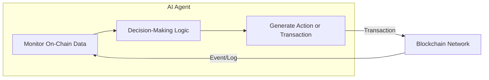
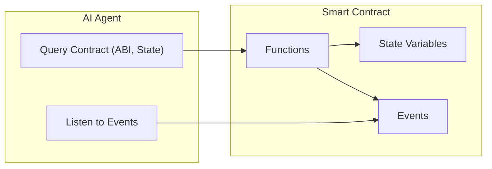
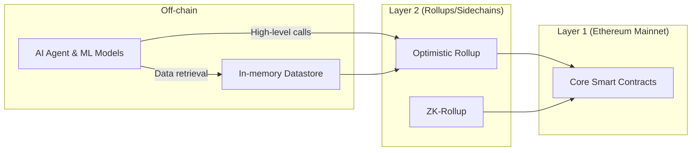

# **Optimizing AI-Agent Interactions with Blockchain Smart Contracts: A Comprehensive Analysis**

- Author: Mossland Lab
- Email: lab@moss.land
- Date of Initial Document Creation: February 14, 2025

## **Table of Contents**

1. [Introduction](#introduction)  
   1.1 [Scope and Purpose](#scope-and-purpose)  
   1.2 [Background](#background)  
   1.3 [Structure of this Document](#structure-of-this-document)

2. [Fundamentals of Blockchain and Smart Contracts](#fundamentals-of-blockchain-and-smart-contracts)  
   2.1 [Blockchain Basics](#blockchain-basics)  
   2.2 [Ethereum as a Use Case](#ethereum-as-a-use-case)  
   2.3 [Key Components of Smart Contracts](#key-components-of-smart-contracts)  
   2.4 [Common Challenges](#common-challenges)

3. [Overview of AI Agents](#overview-of-ai-agents)  
   3.1 [Definition of AI Agents](#definition-of-ai-agents)  
   3.2 [Types and Use Cases](#types-and-use-cases)  
   3.3 [Relevance to Blockchain Interactions](#relevance-to-blockchain-interactions)

4. [High-Level Interaction Model: AI Agents and Smart Contracts](#high-level-interaction-model-ai-agents-and-smart-contracts)  
   4.1 [Data Flow and Transaction Flow](#data-flow-and-transaction-flow)  
   4.2 [Real-Time vs Batch Interactions](#real-time-vs-batch-interactions)  
   4.3 [Mermaid Diagram: End-to-End Overview](#mermaid-diagram-end-to-end-overview)

5. [Optimizing Data Retrieval](#optimizing-data-retrieval)  
   5.1 [JSON-RPC, GraphQL, and Beyond](#json-rpc-graphql-and-beyond)  
   5.2 [Indexing Solutions (The Graph, Custom Indexers)](#indexing-solutions-the-graph-custom-indexers)  
   5.3 [Event-Driven AI Using WebSockets](#event-driven-ai-using-websockets)  
   5.4 [Batch Queries and Caching Techniques](#batch-queries-and-caching-techniques)  
   5.5 [Case Study 1: Large-Scale DeFi Monitoring](#case-study-1-large-scale-defi-monitoring)

6. [Optimizing Transaction Execution](#optimizing-transaction-execution)  
   6.1 [Wallet Management and Security](#wallet-management-and-security)  
   6.2 [Gas Optimization Strategies](#gas-optimization-strategies)  
   6.3 [Layer-2 Solutions and Sidechains](#layer-2-solutions-and-sidechains)  
   6.4 [Real-Time Triggers and Automated Responses](#real-time-triggers-and-automated-responses)  
   6.5 [Case Study 2: AI-Powered Flash Loan Arbitrage Bot](#case-study-2-ai-powered-flash-loan-arbitrage-bot)

7. [AI-Friendly Smart Contract Design](#ai-friendly-smart-contract-design)  
   7.1 [Structured Outputs and Metadata](#structured-outputs-and-metadata)  
   7.2 [Machine-Readable Documentation (NatSpec, ABIs)](#machine-readable-documentation-natspec-abis)  
   7.3 [Event Emissions for AI Integration](#event-emissions-for-ai-integration)  
   7.4 [Mermaid Diagram: Smart Contract Data Flow](#mermaid-diagram-smart-contract-data-flow)

8. [Data Analysis and Information Delivery](#data-analysis-and-information-delivery)  
   8.1 [On-Chain Data Aggregation for AI](#on-chain-data-aggregation-for-ai)  
   8.2 [Predictive Models and Market Forecasting](#predictive-models-and-market-forecasting)  
   8.3 [Natural Language Summaries and Chatbot Interfaces](#natural-language-summaries-and-chatbot-interfaces)  
   8.4 [Real-World Example: DeFi Yield Aggregation](#real-world-example-defi-yield-aggregation)

9. [Data Collection and Learning](#data-collection-and-learning)  
   9.1 [Building Datasets from Blockchain Transactions](#building-datasets-from-blockchain-transactions)  
   9.2 [Graph-Based Learning and Network Analysis](#graph-based-learning-and-network-analysis)  
   9.3 [Smart Contract Security Analysis and Vulnerability Detection](#smart-contract-security-analysis-and-vulnerability-detection)

10. [Extended Real-World Case Studies](#extended-real-world-case-studies)  
    10.1 [Case Study 3: NFT Market Analytics](#case-study-3-nft-market-analytics)  
    10.2 [Case Study 4: AI for DAO Governance](#case-study-4-ai-for-dao-governance)  
    10.3 [Case Study 5: Automated Liquidation Systems in DeFi Lending](#case-study-5-automated-liquidation-systems-in-defi-lending)

11. [Code Examples and Implementation Details](#code-examples-and-implementation-details)  
    11.1 [Reading On-Chain Data (Python & JavaScript)](#reading-on-chain-data-python--javascript)  
    11.2 [Executing Transactions (Ethers.js & web3.py)](#executing-transactions-ethersjs--web3py)  
    11.3 [AI-Friendly Solidity Contract Example](#ai-friendly-solidity-contract-example)  
    11.4 [Extended Python Implementation for Data Analysis](#extended-python-implementation-for-data-analysis)

12. [Security Considerations](#security-considerations)  
    12.1 [Key Management and Secrets Handling](#key-management-and-secrets-handling)  
    12.2 [Preventing Oracle Manipulation](#preventing-oracle-manipulation)  
    12.3 [Protecting AI Models from Spoofed Data](#protecting-ai-models-from-spoofed-data)  
    12.4 [Smart Contract Vulnerability Scanning](#smart-contract-vulnerability-scanning)

13. [Performance and Scalability](#performance-and-scalability)  
    13.1 [Caching and State Channels](#caching-and-state-channels)  
    13.2 [Off-Chain Computations](#off-chain-computations)  
    13.3 [Mermaid Diagram: Layered Architecture for Scalability](#mermaid-diagram-layered-architecture-for-scalability)

14. [Future Outlook: AI + Blockchain Intersections](#future-outlook-ai--blockchain-intersections)  
    14.1 [Cross-Chain and Multi-Chain AI Agents](#cross-chain-and-multi-chain-ai-agents)  
    14.2 [Reinforcement Learning for On-Chain Decision Making](#reinforcement-learning-for-on-chain-decision-making)  
    14.3 [Privacy-Preserving Computations](#privacy-preserving-computations)  
    14.4 [AI-Native Blockchain Protocols](#ai-native-blockchain-protocols)

15. [Conclusion](#conclusion)  
16. [References & Further Reading](#references--further-reading)

---

## **1. Introduction**

### **1.1 Scope and Purpose**
The synergy between **blockchain** and **AI** is reshaping how data is recorded, validated, analyzed, and utilized. AI agents can unlock innovative use cases by swiftly interpreting on-chain data and autonomously interacting with smart contracts. This document provides a **comprehensive guide** to optimizing these interactions.

### **1.2 Background**
Early blockchain solutions often limited themselves to simple transaction and account management, but **smart contracts** revolutionized the landscape by allowing arbitrary code execution on-chain. **AI** has simultaneously evolved from narrow applications (e.g., image recognition) to more flexible, decision-making agents capable of handling decentralized data. Today, bridging these technologies requires a new set of best practices and architectural patterns.

### **1.3 Structure of this Document**
- **Chapters 2–4** establish foundational concepts of blockchain, smart contracts, and AI agents.  
- **Chapters 5–9** delve into retrieval optimization, transaction execution, contract design, data analysis, and learning strategies.  
- **Chapters 10–11** provide extended real-world examples, case studies, and sample code.  
- **Chapters 12–14** focus on security, performance, scalability, and future directions.  
- **Chapters 15–16** summarize the findings and offer references.

---

## **2. Fundamentals of Blockchain and Smart Contracts**

### **2.1 Blockchain Basics**
A blockchain is a **distributed ledger** of transactions managed by a network of nodes. Key properties:
- **Immutability:** Once data is recorded, altering it is prohibitively expensive.  
- **Transparency:** Transaction history is publicly visible on networks like Ethereum.  
- **Consensus Mechanisms:** Proof of Work (PoW), Proof of Stake (PoS), or others ensure agreement on the state.

### **2.2 Ethereum as a Use Case**
Ethereum pioneered **smart contracts** with its Ethereum Virtual Machine (EVM). Developers can deploy code (Solidity, Vyper, etc.) that runs deterministically across a decentralized network.  
- **Account Model:** Two types of accounts — externally owned accounts (EOAs) and contract accounts.  
- **Gas System:** Execution costs are paid in ETH, ensuring finite resource usage.  
- **Tokens:** ERC-20, ERC-721, and other token standards simplify asset creation.

### **2.3 Key Components of Smart Contracts**
- **State Variables:** Persistent data stored on-chain.  
- **Functions:** Logic for reading/writing state.  
- **Events:** Logs emitted for off-chain monitoring.  
- **ABI (Application Binary Interface):** Defines how to interact with a contract’s functions and events.

### **2.4 Common Challenges**
- **Limited Throughput:** Ethereum’s base layer has a limited TPS (transactions per second).  
- **High Gas Fees:** Resource contention can lead to expensive operations.  
- **Complex Data Structures:** Storing large amounts of data on-chain is costly.  
- **Security Risks:** Exploits and vulnerabilities in poorly audited contracts.

---

## **3. Overview of AI Agents**

### **3.1 Definition of AI Agents**
An **AI agent** is a software entity capable of:
- Perceiving its environment (via sensors or data feeds).
- Processing inputs and making decisions (machine learning, rule-based logic).
- Acting upon that environment (executing actions, sending commands).

### **3.2 Types and Use Cases**
- **Reactive Agents:** Respond to immediate environmental changes (e.g., arbitrage bots responding to price fluctuations).  
- **Planning Agents:** Employ forecasting or deeper reasoning to schedule actions (e.g., rebalancing asset portfolios over time).  
- **Learning Agents:** Adapt behavior using machine learning, discovering optimal strategies over repeated interactions (e.g., reinforcement learning in DeFi yield strategies).

### **3.3 Relevance to Blockchain Interactions**
- **Autonomous Execution:** AI agents can sign and submit transactions, free from continuous human oversight.  
- **On-Chain Data Interpretation:** Blockchain events and logs offer real-time data about financial markets, user activities, or governance.  
- **Trustless Environments:** Agents interact with decentralized protocols, ensuring tamper-resistant record-keeping.

---

## **4. High-Level Interaction Model: AI Agents and Smart Contracts**

### **4.1 Data Flow and Transaction Flow**
AI agents can:
1. **Pull** data from the blockchain (e.g., reading contract state).  
2. **Push** transactions onto the blockchain (e.g., invoking a smart contract function).

### **4.2 Real-Time vs Batch Interactions**
- **Real-Time Approach:** The agent monitors on-chain events continuously and executes time-sensitive actions.  
- **Batch Approach:** The agent gathers data in intervals and processes it offline for periodic updates or transactions.

### **Mermaid Diagram: End-to-End Overview**

*Explanation: The AI agent continuously monitors the blockchain for state changes (via logs or queries), applies decision-making logic, and generates transactions in response. The new on-chain state triggers further logs or events that the AI agent can observe in the next cycle.*

---

## **5. Optimizing Data Retrieval**

### **5.1 JSON-RPC, GraphQL, and Beyond**
- **JSON-RPC:** Standard interface (e.g., `eth_call`, `eth_getBalance`) for reading data. Simple but can require multiple calls for large queries.  
- **GraphQL on Ethereum Nodes:** More flexible queries, combining data from multiple endpoints in one request. Minimizes network overhead and is easier for AI-based analytics requiring complex queries.  
- **Custom REST APIs:** Some DApps provide specialized endpoints or indexed data for direct consumption.

### **5.2 Indexing Solutions (The Graph, Custom Indexers)**
- **The Graph:** A decentralized indexing protocol that allows developers to create “subgraphs.” AI agents can fetch structured data via GraphQL queries.  
- **Custom Indexers:** Projects often create their own indexing services (e.g., storing frequently accessed contract data in a dedicated database) and expose it via an API.

### **5.3 Event-Driven AI Using WebSockets**
AI agents can subscribe to Ethereum events (e.g., `Transfer` events in ERC-20) via:
- **WebSockets:** Offers a real-time feed of new blocks and logs, reducing the need for polling.  
- **Push vs Pull:** Shifting from a polling model (`pull`) to an event subscription model (`push`) helps reduce redundant calls and allows instant responses.

### **5.4 Batch Queries and Caching Techniques**
- **Batch Requests:** JSON-RPC supports sending multiple requests in a single call, reducing overhead.  
- **Caching Layers:** AI agents can store frequently accessed data locally, reducing repetitive queries.  
- **Pagination and Filtering:** Retrieve only needed data, especially critical when analyzing large histories.

### **5.5 Case Study 1: Large-Scale DeFi Monitoring**
A DeFi protocol tracks user deposits, borrow balances, and collateral ratios. An AI agent must:
1. **Subscribe** to deposit and withdrawal events.  
2. Periodically **index** all user positions to detect under-collateralized loans.  
3. **Trigger** liquidation transactions if risk thresholds are exceeded.

_Outcome:_ By using The Graph for indexing, the AI agent can swiftly filter loans with dangerous collateral levels, significantly reducing the on-chain queries and providing near-instant detection of risky positions.

---

## **6. Optimizing Transaction Execution**

### **6.1 Wallet Management and Security**
- **Hot vs Cold Wallets:** AI agents often use hot wallets for quick transactions; must secure private keys in secure enclaves or HSMs.  
- **Multisignature / MPC:** For high-stakes operations, threshold signatures or multi-party computation can distribute trust.

### **6.2 Gas Optimization Strategies**
- **EIP-1559 & Dynamic Fees:** AI agents can optimize when to submit transactions based on base fee and priority tips.  
- **Batching Multiple Operations:** Combine multiple contract calls into a single transaction.  
- **Contract-Level Optimizations:** Minimizing on-chain complexity and storing data off-chain when feasible.

### **6.3 Layer-2 Solutions and Sidechains**
- **Rollups (Optimistic / ZK):** Shift heavy computation off Ethereum mainnet.  
- **Polygon / Arbitrum / Optimism:** Popular L2s or sidechains for lower fees and faster confirmations.  
- **Bridges:** If an AI agent’s logic spans multiple ecosystems, bridging tokens/states can be a key step, but also a security risk.

### **6.4 Real-Time Triggers and Automated Responses**
- **Monitoring On-Chain Oracles:** E.g., AI agent detects a rapid price drop from Chainlink or Uniswap oracles, then quickly rebalances.  
- **Transaction Scheduling:** Some protocols allow scheduling future transactions (e.g., Gelato, OpenZeppelin Autotasks).

### **6.5 Case Study 2: AI-Powered Flash Loan Arbitrage Bot**
1. **Data Retrieval:** AI agent retrieves real-time prices from multiple DEXs (e.g., Uniswap, SushiSwap).  
2. **Opportunity Detection:** It identifies mispricing or arbitrage opportunities.  
3. **Execution:** Agent acquires a flash loan, conducts trades, repays the loan, and realizes profits.  
4. **Optimization:** Smart algorithms determine the best order routing and minimal gas usage to ensure net profit after fees.

_Outcome:_ The bot must act quickly, so it relies on event subscription for price changes and immediate transaction submission when a profitable mismatch is found.

---

## **7. AI-Friendly Smart Contract Design**

### **7.1 Structured Outputs and Metadata**
- **JSON or Tuple Returns:** Returning data in structured formats for easy off-chain parsing.  
- **Metadata Storage on IPFS:** Instead of storing large data on-chain, references to IPFS or other decentralized storage can reduce gas costs while maintaining accessibility.

### **7.2 Machine-Readable Documentation (NatSpec, ABIs)**
- **NatSpec Comments:** Provide automated documentation for each function, including parameter descriptions and invariants.  
- **ABI Integration:** AI agents rely on contract ABI for function signatures, data types, event definitions, etc.

### **7.3 Event Emissions for AI Integration**
- **Detailed Event Arguments:** Provide context in events so the AI agent can avoid extra queries.  
- **Event Indexing:** Name your events with descriptive fields (e.g., `event TokensMinted(address indexed to, uint256 amount, string metadata)`).

### **Mermaid Diagram: Smart Contract Data Flow**

*Explanation: The smart contract holds state variables and functions (S1, S2). AI agents query functions or listen to emitted events. When state changes, events are triggered, letting the AI agent respond automatically.*

---

## **8. Data Analysis and Information Delivery**

### **8.1 On-Chain Data Aggregation for AI**
- **Combining On-Chain + Off-Chain Data:** AI systems may unify data from multiple sources: contract logs, price feeds, order books, or even social media sentiment.  
- **Normalization:** Translating raw hex data into structured forms for ML pipelines.

### **8.2 Predictive Models and Market Forecasting**
- **Time-Series Forecasting (ARIMA, LSTM, Transformer):** Predict asset prices or protocol usage.  
- **Anomaly Detection:** Identify suspicious wallet behavior or potential hacks via unsupervised learning.

### **8.3 Natural Language Summaries and Chatbot Interfaces**
- **NLP Integration:** Summarize DeFi positions in human-readable text for end-users.  
- **Conversational Agents:** AI chatbots, powered by LLMs, can answer questions like, “What is my current collateral ratio?” or “Which yield farm had the highest return in the past 24 hours?”

### **Real-World Example: DeFi Yield Aggregation**
- **Aggregator Contracts** (e.g., Yearn-like strategies) track multiple lending protocols.  
- **AI Analysis**: Observes historical APYs, evaluates risk, and suggests rebalancing.  
- **User Interface**: Provides a summary in plain English, “Your best yield option is Protocol X at 5.3% APY. Rebalance recommended to Protocol Y if APY > 6%.”

---

## **9. Data Collection and Learning**

### **9.1 Building Datasets from Blockchain Transactions**
- **Public Archives:** Data providers (e.g., Etherscan, BigQuery on Ethereum) offer historical datasets.  
- **Labeling**: For supervised tasks (e.g., fraud detection), labeled datasets with known malicious or benign addresses are crucial.

### **9.2 Graph-Based Learning and Network Analysis**
- **Transaction Graphs:** Nodes can be addresses or contracts, edges represent token flows.  
- **Graph Neural Networks (GNNs):** Useful for identifying subgraphs that correspond to patterns like Ponzi schemes or wash trading.

### **9.3 Smart Contract Security Analysis and Vulnerability Detection**
- **ML Models for Static Analysis:** Train on thousands of known vulnerabilities (reentrancy, overflow, etc.).  
- **Runtime Monitoring:** Anomaly detection for unusual on-chain execution patterns that could indicate an exploit in progress.

---

## **10. Extended Real-World Case Studies**

### **10.1 Case Study 3: NFT Market Analytics**
1. **Situation**: An NFT marketplace with thousands of transactions daily.  
2. **AI Agent**: Collects transfer logs, price data, and user trends.  
3. **Analysis**: Predicts which collections might surge in demand (using popularity metrics from social media and historical on-chain volume).  
4. **Outcome**: Investors gain insights into undervalued assets. The AI agent can also automate listing or bidding strategies.

### **10.2 Case Study 4: AI for DAO Governance**
1. **Situation**: A DAO (Decentralized Autonomous Organization) with hundreds of governance proposals.  
2. **AI Agent**: Monitors proposals, user sentiment, and on-chain vote data.  
3. **Analysis**: Evaluates each proposal’s potential impact based on tokenomics, historical governance outcomes, and community sentiment.  
4. **Outcome**: The DAO uses an AI-generated “proposal viability score” to inform discussions. An advanced agent could even cast votes automatically based on aligned interests.

### **10.3 Case Study 5: Automated Liquidation Systems in DeFi Lending**
1. **Situation**: A lending platform where users provide collateral for loans.  
2. **AI Agent**: Tracks borrower collateralization, price oracles, and upcoming protocol parameter changes.  
3. **Trigger**: When a borrower’s position nears a liquidation threshold, the AI agent calls the liquidation function.  
4. **Outcome**: Maintains protocol solvency, while profitably rewarding liquidation executors. The AI agent may leverage historical data to predict potential liquidations before they become unprofitable.

---

## **11. Code Examples and Implementation Details**

This chapter provides in-depth examples showcasing how an AI agent can read data from and write data to a blockchain, especially Ethereum. All examples are simplified for demonstration.

### **11.1 Reading On-Chain Data (Python & JavaScript)**

#### **Python (web3.py) Example**
```python
from web3 import Web3

# Connect to an Ethereum node (e.g., Infura)
w3 = Web3(Web3.HTTPProvider("https://mainnet.infura.io/v3/YOUR_INFURA_PROJECT_ID"))

# Sample ERC-20 token contract
token_address = Web3.toChecksumAddress("0x1234567890abcdef1234567890abcdef12345678")
token_abi = [
    {
      "constant": True,
      "inputs": [{"name": "_owner", "type": "address"}],
      "name": "balanceOf",
      "outputs": [{"name": "balance", "type": "uint256"}],
      "type": "function"
    }
]

token_contract = w3.eth.contract(address=token_address, abi=token_abi)

# Example: Reading an account's token balance
owner_address = Web3.toChecksumAddress("0xabcdefabcdefabcdefabcdefabcdefabcdefabcd")
balance = token_contract.functions.balanceOf(owner_address).call()
print(f"Token Balance: {balance}")
```

#### **JavaScript (ethers.js) Example**
```javascript
const { ethers } = require("ethers");

// Connect to Ethereum mainnet via Infura
const provider = new ethers.providers.InfuraProvider("homestead", "YOUR_INFURA_PROJECT_ID");

const tokenAddress = "0x1234567890abcdef1234567890abcdef12345678";
const tokenAbi = [
  "function balanceOf(address) view returns (uint256)"
];

const tokenContract = new ethers.Contract(tokenAddress, tokenAbi, provider);

async function getBalance(ownerAddress) {
  const balanceBN = await tokenContract.balanceOf(ownerAddress);
  console.log("Token Balance:", balanceBN.toString());
}

getBalance("0xabcdefabcdefabcdefabcdefabcdefabcdefabcd");
```

### **11.2 Executing Transactions (Ethers.js & web3.py)**

#### **JavaScript (ethers.js) Transaction Example**
```javascript
const { ethers } = require("ethers");

const provider = new ethers.providers.InfuraProvider("homestead", "YOUR_INFURA_PROJECT_ID");
const privateKey = "0xYOUR_PRIVATE_KEY_HERE";
const wallet = new ethers.Wallet(privateKey, provider);

const erc20Abi = [
  "function transfer(address to, uint256 amount) public returns (bool)"
];
const erc20Address = "0x1234567890abcdef1234567890abcdef12345678";
const tokenContract = new ethers.Contract(erc20Address, erc20Abi, wallet);

async function sendTokens(recipient, amount) {
  const decimals = 18; // Adjust if token has different decimals
  const value = ethers.utils.parseUnits(amount.toString(), decimals);

  const tx = await tokenContract.transfer(recipient, value);
  console.log("Transaction sent:", tx.hash);
  
  // Wait for transaction confirmation
  const receipt = await tx.wait();
  console.log("Transaction mined in block:", receipt.blockNumber);
}

sendTokens("0xabcdefabcdefabcdefabcdefabcdefabcdefabcd", 100);
```

#### **Python (web3.py) Transaction Example**
```python
from web3 import Web3

w3 = Web3(Web3.HTTPProvider("https://mainnet.infura.io/v3/YOUR_INFURA_PROJECT_ID"))

private_key = "0xYOUR_PRIVATE_KEY_HERE"
account = w3.eth.account.from_key(private_key)

token_address = w3.toChecksumAddress("0x1234567890abcdef1234567890abcdef12345678")
token_abi = [
  {
    "constant": False,
    "inputs": [
      {"name": "to", "type": "address"},
      {"name": "amount", "type": "uint256"}
    ],
    "name": "transfer",
    "outputs": [{"name": "", "type": "bool"}],
    "type": "function"
  }
]

token_contract = w3.eth.contract(address=token_address, abi=token_abi)

nonce = w3.eth.getTransactionCount(account.address)
tx_data = token_contract.functions.transfer(
    "0xabcdefabcdefabcdefabcdefabcdefabcdefabcd", 
    w3.toWei(100, 'ether')  # Adjust for actual token decimals
).buildTransaction({
    'nonce': nonce,
    'gas': 200000,
    'gasPrice': w3.toWei('30', 'gwei')
})

signed_tx = account.sign_transaction(tx_data)
tx_hash = w3.eth.sendRawTransaction(signed_tx.rawTransaction)
receipt = w3.eth.waitForTransactionReceipt(tx_hash)

print("Transaction mined:", receipt)
```

### **11.3 AI-Friendly Solidity Contract Example**
```solidity
// SPDX-License-Identifier: MIT
pragma solidity ^0.8.0;

/**
 * @title DataHub
 * @dev Contract designed for AI-friendly interactions
 * @notice This contract stores metadata as JSON strings 
 *         to facilitate structured data retrieval by AI agents.
 */
contract DataHub {
    mapping(uint256 => string) public metadata;

    event DataStored(uint256 indexed id, string metadataJson);

    /**
     * @notice Stores a JSON metadata string for a given ID
     * @param id Unique identifier for the data
     * @param json The JSON metadata string
     */
    function storeData(uint256 id, string memory json) public {
        metadata[id] = json;
        emit DataStored(id, json);
    }

    /**
     * @notice Retrieves the stored data
     * @param id Unique identifier
     * @return dataJson The corresponding JSON metadata
     */
    function getData(uint256 id) public view returns (string memory dataJson) {
        return metadata[id];
    }
}
```

### **11.4 Extended Python Implementation for Data Analysis**
Below is a simplified Python script demonstrating how an AI agent might combine on-chain data retrieval with off-chain analytics, such as anomaly detection.

```python
import pandas as pd
from web3 import Web3
from sklearn.ensemble import IsolationForest

w3 = Web3(Web3.HTTPProvider("https://mainnet.infura.io/v3/YOUR_INFURA_PROJECT_ID"))

def fetch_token_transfers(token_address, start_block, end_block):
    # Pseudo-code for retrieving Transfer events
    # In practice, you'd filter the Transfer events from logs or use The Graph
    events = []
    for block_num in range(start_block, end_block + 1):
        block = w3.eth.getBlock(block_num, full_transactions=True)
        # Inspect transactions/receipts for Transfer logs
        # Append relevant data to events
    return events

def detect_anomalies(events):
    # Convert events to DataFrame
    df = pd.DataFrame(events)
    # For example, consider 'value' as a feature to check anomalies
    model = IsolationForest(contamination=0.01)
    predictions = model.fit_predict(df[['value']])
    anomalous = df[predictions == -1]
    return anomalous

transfer_events = fetch_token_transfers(
    token_address="0x1234567890abcdef1234567890abcdef12345678",
    start_block=10000000,
    end_block=10000100
)

anomalies = detect_anomalies(transfer_events)
print("Anomalous events detected:", anomalies)
```

---

## **12. Security Considerations**

### **12.1 Key Management and Secrets Handling**
- **Hardware Security Modules (HSMs):** For large-scale or enterprise-level AI systems, storing private keys in an HSM or secure enclave is crucial.  
- **Multi-Sig Approaches:** Distribute signing authority among multiple AI sub-agents or team members to minimize compromise risks.

### **12.2 Preventing Oracle Manipulation**
- **Decentralized Oracles:** Rely on aggregated data from multiple sources (e.g., Chainlink).  
- **Off-Chain Verification:** AI agents can cross-verify oracle data with alternative references or historical patterns.

### **12.3 Protecting AI Models from Spoofed Data**
- **Data Provenance Checks:** Validate data sources on-chain, ensuring logs or events truly originated from legitimate contracts.  
- **Consensus Mechanisms:** Use majority voting among multiple AI agent instances to mitigate single-point data manipulation.

### **12.4 Smart Contract Vulnerability Scanning**
- **Static Analysis Tools:** MythX, Slither, etc., can be integrated into an AI workflow.  
- **AI-Enhanced Scanning:** Train ML models on known vulnerabilities to detect new exploit patterns in code.

---

## **13. Performance and Scalability**

### **13.1 Caching and State Channels**
- **Short-Lived Data:** For real-time analytics, keep ephemeral data in a fast, in-memory cache.  
- **State Channels:** Move repeated interactions off-chain for improved throughput and cost savings.

### **13.2 Off-Chain Computations**
- **Rollups / Zero-Knowledge Proofs:** Off-load major computations off-chain, then publish succinct proofs on-chain.  
- **AI Model Hosting:** Keep heavy ML workloads in an off-chain environment, only storing relevant results or final states on-chain.

### **13.3 Mermaid Diagram: Layered Architecture for Scalability**

*Explanation: The AI agent primarily interacts with a Layer-2 environment or caching layer for efficiency. Layer-2 solutions, in turn, settle with Layer-1 smart contracts periodically.*

---

## **14. Future Outlook: AI + Blockchain Intersections**

### **14.1 Cross-Chain and Multi-Chain AI Agents**
- **Bridging Solutions:** Cross-chain bridges allow tokens and data to move among blockchains. AI agents can leverage these to unify data across networks (e.g., Ethereum, BNB Chain, Polygon).  
- **Chain Agnostic Logic:** The AI logic remains the same, but the connectivity layer adapts to each chain’s protocol.

### **14.2 Reinforcement Learning for On-Chain Decision Making**
- **Automated Strategy Optimization:** An AI agent can treat the entire DeFi ecosystem like a dynamic environment, refining its strategies over time to maximize rewards or minimize risks.  
- **Game-Theoretic Interactions:** Agents that learn to collaborate or compete under specific protocol rules, e.g., DAO governance proposals.

### **14.3 Privacy-Preserving Computations**
- **Zero-Knowledge Proofs:** Agents can prove correctness of certain computations without revealing sensitive details.  
- **Secure Multi-Party Computation (MPC):** Multiple AI agents or parties collectively compute a function while keeping inputs private.

### **14.4 AI-Native Blockchain Protocols**
- **On-Chain AI Modules:** Future protocols may integrate AI logic directly at the consensus or execution layer, eliminating the need for extensive off-chain AI operations.  
- **AI for Validation:** Nodes could use AI to detect spam or suspicious transactions prior to block inclusion (though feasibility and overhead are major considerations).

---

## **15. Conclusion**

This document highlights the **synergistic potential** of combining AI and blockchain, with a particular focus on **smart contract** interaction. By **optimizing data retrieval** (via indexing solutions, GraphQL, event subscriptions) and **optimizing transaction execution** (through gas-saving methods, layer-2 usage, and real-time triggers), AI agents become powerful tools for **autonomous and data-driven** operations.

Key takeaways:
- **AI-Friendly Contract Design** is crucial, ensuring structured data outputs and robust event logs.  
- **Security and Performance** demand vigilant approaches, from secure key handling to oracles and bridging solutions.  
- **Future Innovations** lie in cross-chain AI, reinforcement learning, and privacy-preserving computations, which will expand the boundary of what is possible with **AI + blockchain** synergy.

As both AI and blockchain ecosystems evolve, so too will their intersection. By adopting best practices detailed in this guide, developers and organizations can build **trustworthy**, **scalable**, and **intelligent** decentralized applications and services.

---

## **16. References & Further Reading**

1. [Ethereum White Paper](https://ethereum.org/en/whitepaper/)  
2. [The Graph Documentation](https://thegraph.com/docs/)  
3. [web3.js GitHub Repo](https://github.com/ChainSafe/web3.js)  
4. [ethers.js GitHub Repo](https://github.com/ethers-io/ethers.js/)  
5. [Solidity Documentation](https://docs.soliditylang.org/)  
6. [OpenZeppelin Contracts](https://github.com/OpenZeppelin/openzeppelin-contracts)  
7. [NatSpec Format](https://docs.soliditylang.org/en/v0.8.18/natspec-format.html)  
8. [MythX Security Analysis](https://mythx.io/)  
9. [Slither - Static Analysis](https://github.com/crytic/slither)  
10. [Chainlink Oracles](https://chain.link/)  
11. [Optimism Layer-2](https://optimism.io/)  
12. [Arbitrum Layer-2](https://arbitrum.io/)  
13. [Polygon Sidechain](https://polygon.technology/)  
14. [Zero-Knowledge Proofs - ZCash](https://z.cash/technology/)  
15. [Reinforcement Learning Basics](https://www.cs.cmu.edu/~15381/)  
16. [Decentralized Autonomous Organizations (DAOs)](https://ethereum.org/en/dao/)  
17. [Isolation Forest for Anomaly Detection](https://scikit-learn.org/stable/modules/generated/sklearn.ensemble.IsolationForest.html)  

