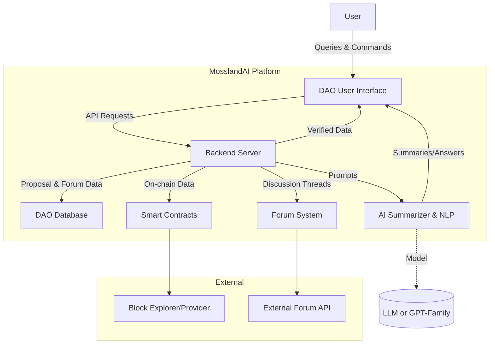
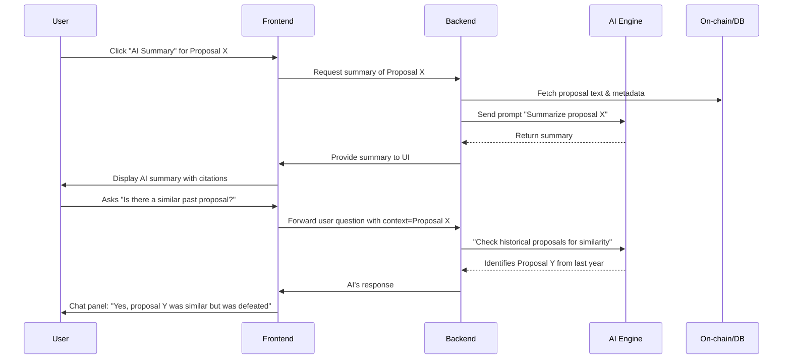
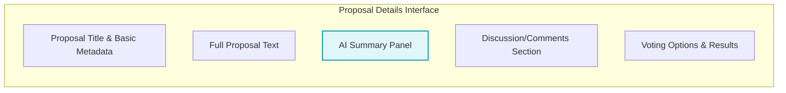

# Optimizing the Interface between AI Agents and DAO Users  

- Author: Mossland Lab  
- Email: lab@moss.land  
- Date of Initial Document Creation: February 12, 2025  

---

## Table of Contents
1. [Introduction](#introduction)  
2. [1. The Role of AI Agents in DAO Environments](#1-the-role-of-ai-agents-in-dao-environments)  
   - 1.1 Core Functionalities of AI Agents in DAOs  
   - 1.2 Distinguishing AI-Powered DAOs from Conventional Systems  
   - 1.3 Key Considerations for User Roles  
3. [2. UI/UX Design Principles for AI-DAO Platforms](#2-uiux-design-principles-for-ai-dao-platforms)  
   - 2.1 Foundational Principles for AI-Augmented DAO Interfaces  
   - 2.2 Strategies for Enhancing User Experience (UX)  
   - 2.3 Observations from Existing DAO Platforms (Aragon, Snapshot, Tally)  
4. [3. Interaction Optimization between AI Agents and Users](#3-interaction-optimization-between-ai-agents-and-users)  
   - 3.1 Best Practices for NLP-Centric Interactions  
   - 3.2 Multi-Modal Interaction: Voice, Chatbots, and Conversational UIs  
   - 3.3 Adaptive UI Systems Driven by User Feedback  
5. [4. Trust, Transparency, and Security Measures](#4-trust-transparency-and-security-measures)  
   - 4.1 Establishing Transparency to Foster User Trust  
   - 4.2 Verification Mechanisms for AI Outputs  
   - 4.3 Privacy Preservation vs. Data Utility  
6. [5. Case Studies and Benchmarking](#5-case-studies-and-benchmarking)  
   - 5.1 SingularityDAO  
   - 5.2 DeepDAO  
   - 5.3 Other Notable AI–Web3 Interaction Models  
7. [6. Proposed UI/UX for MosslandAI](#6-proposed-uiux-for-mosslandai)  
   - 6.1 Conceptual Overview of the Proposed Interface  
   - 6.2 System Diagrams (Mermaid.js)  
   - 6.3 Wireframe Prototype (Textual)  
   - 6.4 Representative Pseudo-Code  
8. [Conclusion and Future Directions](#conclusion-and-future-directions)  
9. [References](#12-references)

---

## Introduction
The integration of **Artificial Intelligence (AI)** with blockchain-based governance structures—known as **Decentralized Autonomous Organizations (DAOs)**—has become an area of significant academic and industry interest. DAOs distribute decision-making power among token holders, delegating executive processes to smart contracts. Nonetheless, human participants can face **information overload**, given the sheer volume of proposals, discussions, and community interactions. Consequently, **AI-driven summarization agents** and conversational interfaces can dramatically streamline governance, potentially revolutionizing user experience and strategic decision-making in these decentralized ecosystems.

This document examines:

1. **Core Functionalities** of AI agents in DAOs, including a comparative analysis of traditional vs. AI-driven mechanisms.  
2. **UI/UX Principles** for designing user-centric, AI-augmented interfaces that reduce cognitive load and improve stakeholder engagement.  
3. **Interaction Optimization** strategies, with a focus on natural language processing (NLP), voice-enabled UIs, and adaptive features to cater to varying user needs and preferences.  
4. **Trust & Security** frameworks to ensure user confidence in AI outputs, bolster transparency, and comply with privacy requirements.  
5. **Case Studies & Benchmarks** from existing AI+DAO applications (e.g., SingularityDAO, DeepDAO) and emergent paradigms such as AI delegation.  
6. A **Proposed UI/UX Model** (complete with diagrams and pseudo-code) for **MosslandAI’s AI-DAO-Summarization** project.

---

## 1. The Role of AI Agents in DAO Environments

### 1.1 Core Functionalities of AI Agents in DAOs
In decentralized organizations, **AI agents** can assume a multitude of functions that simplify or augment the DAO’s governance processes. Research suggests that AI-driven approaches effectively reduce user fatigue and foster more data-informed decisions \[1\]:

1. **Automated Proposal Summarization**  
   - Large volumes of proposals and discussion threads are parsed and summarized into concise outputs, reducing the cognitive burden on voters and delegates.  
   - Early DAO experiments have demonstrated that AI-driven summaries can lower the average reading time for complex proposals \[4\].

2. **Factual Verification & Analytics**  
   - The AI can cross-reference statements against on-chain data or external oracles.  
   - By establishing accurate “fact-checks,” the system heightens the reliability of governance decisions.

3. **Predictive Decision Support**  
   - AI-driven scenario forecasting (e.g., treasury impact, expected ROI) adds a data-driven dimension to proposals.  
   - Similar to algorithmic trading in DeFi, these predictive models can inform more robust governance choices.

4. **Content Generation & Drafting**  
   - By analyzing historically successful proposals, AI can offer structural templates or recommended text.  
   - This automates part of the policy-drafting process and ensures proposals are presented in a standardized, clear format.

5. **Monitoring & Alerts**  
   - 24/7 monitoring of community sentiment, treasury health, and other on/off-chain metrics \[2\].  
   - Automatic alerts if certain risk thresholds or anomalies are detected (e.g., abnormally large token flows).

6. **Conditional Automation**  
   - AI agents can execute specific tasks upon governance approval, analogous to **SingularityDAO**’s AI-driven asset rebalancing.  
   - Such autonomy requires robust fail-safes (e.g., multi-signature confirmation) to mitigate erroneous actions.

In sum, AI agents in DAOs serve as **augmentative, intelligent co-pilots**—expediting mundane tasks, providing real-time analytics, and facilitating data-rich decision-making.

### 1.2 Distinguishing AI-Powered DAOs from Conventional Systems
**Traditional DAO Platforms** (e.g., early Aragon frameworks, direct on-chain governance with no advanced analytics) rely heavily on manual processes:

- Proposals can be lengthy; members must individually read forum posts, aggregator sites, or dashboards.  
- Any data analysis is typically user-driven rather than integrated into the governance interface.

**AI-Powered DAOs**, by contrast:

- Offer **automated summarization** or real-time Q&A, drastically decreasing the “time to information.”  
- Integrate **interactive conversational layers** (text or voice) for retrieving historical data or clarifying terms—improving inclusivity for non-technical stakeholders \[3\].  
- Potentially adapt to new governance events automatically. The AI can highlight unusual patterns or even propose additional guardrails based on user-defined thresholds.

However, these benefits come with heightened complexity around **trust**, **model transparency**, and potential **algorithmic bias**. Thus, the **verification mechanisms** (Section 4.2) and **community oversight** are critical for alignment with decentralized principles.

### 1.3 Key Considerations for User Roles
DAO user bases range from casual participants to highly engaged delegates:

1. **Occasional Voters / Token Holders**  
   - Require **simple, comprehensible** proposals.  
   - Benefit significantly from short AI-generated summaries and interactive guides on *“How to Vote.”*

2. **Delegates / Power Users**  
   - Process large volumes of proposals daily.  
   - Appreciate advanced features like side-by-side proposal comparisons, AI-driven *pros/cons* extraction, or historical references to past related proposals.

3. **Core Team / Facilitators / Admins**  
   - Oversee execution of successful proposals, coordinate strategic directions.  
   - Rely on AI for **data-driven dashboards**, e.g., real-time community sentiment, potential security vulnerabilities, or synergy across multiple proposals.  
   - May also employ AI to handle routine administrative tasks, subject to multi-sig approvals.

---

## 2. UI/UX Design Principles for AI-DAO Platforms

### 2.1 Foundational Principles for AI-Augmented DAO Interfaces
Designing a user interface that seamlessly embeds AI functionalities demands adherence to several **HCI** (Human-Computer Interaction) and **Usability** principles:

- **Clarity & Minimalism**: Especially crucial when presenting AI-generated text. Overly verbose pages dilute the benefits of rapid summarization.  
- **Consistency with DAO Branding**: If the AI agent is integrated into an existing DAO platform, it must reflect the platform’s established color schemes, typography, and navigational paradigms.  
- **System Status Visibility**: Show progress indicators (“Generating summary…”) to reassure users that the system is responding, mitigating confusion or redundant requests.  
- **User Autonomy**: AI suggestions or auto-completions should remain optional. Users require the ability to override or edit AI outputs without friction.  
- **Accessibility**: From alt-text for screen readers to well-structured voice interactions, accessibility fosters inclusivity in governance.  
- **Explainable Output**: Summaries or recommendations should either cite references (e.g., “Extracted from lines 15–20 of the proposal”) or provide quick links to the original source.

### 2.2 Strategies for Enhancing User Experience (UX)
Incorporating AI features into governance interfaces necessitates additional **UX strategies**:

1. **Conversational Design with Guidance**  
   - Provide examples or clickable “quick prompts” (e.g., “Summarize Budget Section”) within the chatbot so that novices need not guess the correct phrasing.  
   - Encourages broader usage by reducing cognitive load.

2. **Progressive Disclosure**  
   - Initially display a **concise** AI summary or Q&A. Offer expansions (e.g., “Show me more details” or “Reveal underlying data”) for advanced users.  
   - This approach keeps the interface streamlined yet flexible.

3. **Feedback Mechanisms**  
   - Simple UI elements (“Was this summary helpful?”) capture user sentiment.  
   - Negative feedback (e.g., “Inaccurate summary”) can trigger re-checks, flagging potential data or model errors.

4. **Role-Based Interfaces**  
   - Consider toggles or role-detection: if the user is recognized as a “delegate” with substantial voting power, the system can automatically present deeper analytics modules.  
   - Typical community members, on the other hand, might prefer smaller, more straightforward summaries.

5. **Visual Aids & Data Visualization**  
   - Where feasible, incorporate charts or timelines (e.g., “Voting evolution over the past 48 hours”).  
   - Even short AI summaries benefit from basic visual representations to highlight crucial numeric insights.

### 2.3 Observations from Existing DAO Platforms (Aragon, Snapshot, Tally)
1. **Aragon**  
   - Historically offers modular apps for proposal creation and voting.  
   - Preliminary experiments with AI-based summarization exist \[3\].  
   - Potential improvement: Embedding real-time AI summaries of forum discussions into the on-chain proposal interface.

2. **Snapshot**  
   - Off-chain, gas-free voting solution. Very popular due to user-friendliness.  
   - Typically minimal text fields and a single-page interface.  
   - An AI assistant could add contextual “tooltips” (e.g., “This proposal requests 300 ETH from the treasury, ~2.5% of total funds”) or summarize external forum links.

3. **Tally**  
   - On-chain platform, offering in-depth breakdowns of each proposal (how delegates vote, treasury states).  
   - Tends toward data-rich dashboards but lacks a built-in summarization engine or interactive Q&A.  
   - Opportunity for improved “quick insights,” especially for large DAOs with frequent proposals.

---

## 3. Interaction Optimization between AI Agents and Users

### 3.1 Best Practices for NLP-Centric Interactions
Natural Language Processing (NLP) is fundamental when building chatbots or voice assistants for DAO governance:

- **Explicit Capability Disclosure**  
  - At the outset, inform users: “I can summarize proposals, retrieve vote counts, or explain governance terms.”  

- **Context Awareness**  
  - Retain state across multiple dialogue turns (e.g., a user referencing “the budget portion” after an initial summary) to avoid repetitive clarifications.  
  - If ambiguous, politely request additional details.

- **Concise Response Format**  
  - Provide direct, minimalistic answers and let users expand if necessary.  
  - Overly detailed or technical responses should be delivered only upon request.

- **Error Recovery**  
  - Implement fallback dialogues when the model fails to parse or respond accurately (e.g., “Could you rephrase your question?”).

- **Continuous Improvement**  
  - Periodically fine-tune the language model with real user queries, ensuring domain-specific jargon or new governance concepts are recognized.

### 3.2 Multi-Modal Interaction: Voice, Chatbots, and Conversational UIs
Recent advancements in speech-to-text and text-to-speech technologies have enabled more **inclusive** user interfaces:

- **Voice Interfaces**  
  - Offer hands-free engagement, valuable during community calls or for individuals with accessibility requirements.  
  - Must handle typical challenges such as background noise, partial transcriptions, or user confirmation steps.

- **Chatbots**  
  - Most straightforward approach: a chat widget pinned on the web interface.  
  - Users can type free-form questions (“What’s the current status of Proposal #15?”) or choose from standard prompts.

- **Conversational UI Design Considerations**  
  - Provide visual affordances (e.g., “Ask me about X,” “Show me the discussion thread.”).  
  - Confirm context transitions (if the user shifts from one proposal to another) to keep queries anchored correctly.

### 3.3 Adaptive UI Systems Driven by User Feedback
In advanced user-centric design, the interface evolves based on **interaction logs** and **explicit feedback**:

- **Personalized Summaries**  
  - If the system detects repeated user interest in budget allocations, it could emphasize that in the default summary.  
  - Conversely, if a user rarely expands the “technical details” section, the UI can keep it collapsed by default.

- **Adaptive Mode Switching**  
  - Delegates may see an “expert mode” interface, replete with advanced analytics.  
  - A newly onboarded member sees a more guided, tutorial-driven interface.

- **Privacy-Compliant Learning**  
  - Employ local storage for user-specific preferences when feasible, allowing “smart adaptation” without tracking private data on centralized servers.

Such adaptive techniques must be carefully tested to avoid unpredictable or disruptive changes, which can degrade user trust.

---

## 4. Trust, Transparency, and Security Measures

### 4.1 Establishing Transparency to Foster User Trust
DAO users are inherently skeptical of “black-box” processes that could bias or distort governance outcomes. **Transparency** is the antidote:

- **Source Citations and Traceability**  
  - Each AI-generated summary statement should be hyperlinked or annotated to show the corresponding location in the proposal text or relevant forum posts.  
  - This addresses potential AI “hallucinations” or out-of-context references.

- **Explainable AI Components**  
  - For complex or risk-laden recommendations, provide a short rationale (e.g., “Because it allocates ~40% of the total treasury to an unverified address.”).  
  - Basic explanation fosters acceptance, even if full neural model interpretability remains challenging.

- **Open Source or Public Documentation**  
  - Publishing AI model details, or at least thoroughly documenting training datasets and alignment objectives, aligns with **decentralized ethos**.  
  - Some DAOs hold community votes on model upgrades or retraining cycles, reinforcing collective ownership.

### 4.2 Verification Mechanisms for AI Outputs
To ensure reliability, particularly for text-generation tasks:

- **Cross-Model Consensus**  
  - Summaries produced by one language model can be reviewed by a second model or a specialized “fact-checker.”  
  - If discrepancies arise, the system flags them for human review or attempts a reconciliation pass.

- **On-Chain & Off-Chain Validation**  
  - For numeric data (e.g., “DAO treasury has 2,000 ETH”), the UI can confirm directly with the blockchain or an official data feed.  
  - Mismatches trigger disclaimers (“AI’s figure conflicts with actual chain data.”).

- **Human-in-the-Loop Approvals**  
  - For auto-generated proposals or delegated votes, final execution could require a small multi-signature council or delegated group to confirm.  
  - This “minimal friction” approach balances automation with fail-safe controls.

- **Audit Trails**  
  - Log all AI-generated outputs, especially if they inform critical decisions.  
  - The DAO can store these logs on decentralized mediums, enabling trustless historical audits.

### 4.3 Privacy Preservation vs. Data Utility
AI thrives on comprehensive data, yet DAO members often value pseudonymity:

1. **Minimize Data Collection**  
   - Rely primarily on publicly available (on-chain) records for preferences or voting patterns.  
   - If additional user data is needed, make it explicitly opt-in.

2. **Client-Side Personalization**  
   - Personal usage patterns can be locally stored rather than on centralized servers.  
   - Reduces the risk of data leaks or privacy breaches while preserving customization.

3. **Anonymization of Interaction Logs**  
   - Summaries or analytics for model improvement should avoid storing raw queries if they contain personal details.  
   - Techniques such as differential privacy can further protect user identity in aggregated data sets.

---

## 5. Case Studies and Benchmarking

### 5.1 SingularityDAO
**SingularityDAO** applies AI-driven asset management to DeFi portfolios. Although it focuses primarily on **dynamic allocation** of cryptocurrency assets, it provides a use case for **AI-empowered autonomy** within a DAO structure:

- **Portfolio Intelligence**: AI autonomously rebalances “Dynasets” based on market signals.  
- **Governance**: Token holders can set constraints or objectives for the AI’s trading strategies.  
- **Applicability** to Governance Summaries: The success of SingularityDAO demonstrates that stakeholders can embrace AI-driven automation if there is transparency regarding model performance and risk.

### 5.2 DeepDAO
**DeepDAO** is a popular analytics aggregator that ranks DAOs by treasury size, membership, proposal volume, and more:

- **Value Proposition**: Merges on-chain data from numerous DAOs, offering rich insights (leaderboards, historical trends).  
- **AI Integration Potential**: While DeepDAO itself does not incorporate a real-time NLP interface, it exemplifies how data transparency can unify disparate information. An **AI-based Q&A** on top of DeepDAO’s dataset could, for instance, answer cross-DAO queries (“Which DAOs had a similar treasury drawdown?”).  
- **Lessons**: The user community values aggregated data visualization, indicating that AI-DAO Summaries can similarly glean user acceptance by highlighting data-driven clarity.

### 5.3 Other Notable AI–Web3 Interaction Models
- **AI Concierges** (e.g., Discord bots): Provide instant community Q&A, basic FAQ responses, or navigational help. Adoption is moderate, but quality depends on data freshness.  
- **AI-Driven Automated Voting Agents**: Still experimental. Projects that allow delegators to cede their voting power to an AI configured with specific preferences exist, but controversy lies in the potential detachment of human oversight.  
- **AI Moderation & Sentiment Analysis**: Some forums apply NLP to detect spam or gauge sentiment. Integrating these analytics into a governance context can highlight how strongly the community feels about certain proposals.

**Key Insight**: Each reference system underlines the **trade-off** between automation efficiency and user trust. A carefully balanced approach with robust oversight mechanisms can support both innovation and security within a DAO environment.

---

## 6. Proposed UI/UX for MosslandAI

### 6.1 Conceptual Overview of the Proposed Interface
For MosslandAI’s **AI-DAO-Summarization** project, we propose an integrated **modular interface** that unites:

- **AI-Enhanced Proposal Pages**: Each proposal page features a collapsible AI-generated summary panel, source-linked for transparency.  
- **Conversational Sidebar (Chatbot)**: Accessible throughout the DAO interface, offering real-time Q&A on proposals, voting states, or historical data.  
- **Adaptive Dashboard**: Where each user—based on optional preferences—receives curated or personalized highlights of upcoming proposals.  
- **Verification & Feedback**: On-screen indicators (checkmarks) confirming data alignment with on-chain sources, plus user-driven feedback for model refinement.

### 6.2 System Diagrams (Mermaid.js)

#### 6.2.1 High-Level Architecture

**Explanation**:  
- The **Backend** orchestrates data retrieval from the blockchain and forums, packaging relevant context for the **AIEngine**.  
- The **AIEngine** (e.g., GPT-4 or custom variant) processes summarization or Q&A tasks.  
- The **UI** merges AI outputs with verified data, ensuring consistency and transparency.

#### 6.2.2 Sequential User Interaction


### 6.3 Wireframe Prototype (Textual)
We envision a **Proposal Page** with the following layout:



- **(A)**: Clear labeling of title, author, and voting deadline.  
- **(B)**: Scrollable region for the raw or unabridged text.  
- **(C)**: The *AI Summary Panel*, collapsible by default.  
- **(D)**: Aggregated major comments or direct link to the forum.  
- **(E)**: On-chain voting mechanism (yes/no/abstain) plus a live results chart.

### 6.4 Representative Pseudo-Code

#### 6.4.1 Summarizing a Proposal

```python
def generate_proposal_summary(proposal_id: str) -> str:
    """
    Retrieves proposal content, merges it with relevant forum discussions,
    and invokes the AI engine to produce a concise summary.
    """
    # 1. Gather proposal data
    proposal_data = db.get_proposal(proposal_id)
    full_text = f"{proposal_data.title}\n{proposal_data.description}"

    # 2. Include a limited set of top discussion comments
    comments = forum_api.fetch_top_comments(proposal_id, limit=5)
    combined_context = f"{full_text}\n\nCommunity Comments:\n"
    for c in comments:
        combined_context += f"- {c.author}: {c.text}\n"

    # 3. AI summarization prompt
    prompt = (
        "You are an AI assisting in a DAO governance system.\n"
        "Please provide a concise summary of the following proposal:\n\n"
        f"{combined_context}\n"
    )

    # 4. Call the AI engine
    summary_text = AIEngine.summarize(prompt, max_length=300)

    # 5. Return the AI's summarized output
    return summary_text
```

#### 6.4.2 Handling User Q&A

```python
def answer_user_question(question: str, proposal_id: Optional[str] = None) -> str:
    """
    Respond to user queries within the DAO context. 
    If a proposal_id is provided, incorporate that proposal's content 
    into the AI context.
    """
    # Prepare context
    context_data = ""
    if proposal_id:
        proposal_data = db.get_proposal(proposal_id)
        context_data += f"Proposal Title: {proposal_data.title}\n"
        context_data += f"Description: {proposal_data.description}\n"

    # Construct prompt
    prompt = (
        "You are an AI assistant in a DAO platform. Answer the user's question.\n"
    )
    if context_data:
        prompt += f"Context:\n{context_data}\n"
    prompt += f"User's question: {question}\nAnswer:"

    # Query AI
    ai_response = AIEngine.complete(prompt, max_length=250)

    # Optionally verify numeric or factual claims
    verified_response = verify_facts(ai_response, proposal_id)

    return verified_response
```

#### 6.4.3 Adaptive Summaries

```python
user_preferences = {
  # user_id -> {"summary_level": "short" or "detailed"}
}

def get_adaptive_summary(user_id: str, proposal_id: str) -> str:
    base_summary = generate_proposal_summary(proposal_id)
    pref = user_preferences.get(user_id, {}).get("summary_level", "short")

    if pref == "short":
        # Possibly truncate the summary to a minimal bullet list
        return truncate_summary(base_summary, max_sentences=3)
    elif pref == "detailed":
        # Provide additional context or extended bullet points
        extended_info = get_additional_analysis(proposal_id)
        return base_summary + "\n\nAdditional Insights:\n" + extended_info
    else:
        return base_summary

def record_summary_feedback(user_id: str, proposal_id: str, feedback: str):
    """
    Adjust user preferences based on feedback (e.g., 'too_long', 'too_short').
    """
    if feedback == "too_long":
        user_preferences.setdefault(user_id, {})["summary_level"] = "short"
    elif feedback == "too_short":
        user_preferences.setdefault(user_id, {})["summary_level"] = "detailed"

    # Log the feedback for further model refinement
    store_feedback_in_db(user_id, proposal_id, feedback)
```

#### 6.4.4 Verification & UI Integration (JS-Like Pseudo-Code)

```javascript
function displaySummaryWithVerification(summaryText, proposalContent) {
  const summaryContainer = document.getElementById("summaryContainer");
  summaryContainer.innerHTML = "";

  // Insert AI summary HTML (with any embedded citation tags)
  const summaryDiv = document.createElement("div");
  summaryDiv.innerHTML = highlightCitations(summaryText);
  
  // Verify extracted numbers
  const numericMatches = summaryDiv.querySelectorAll(".numeric");
  numericMatches.forEach(numElem => {
    const val = numElem.textContent;
    if (!proposalContent.includes(val)) {
      numElem.classList.add("unverified");
      numElem.title = "This value could not be confirmed in the original text.";
    }
  });

  // Add feedback UI
  const feedbackDiv = document.createElement("div");
  feedbackDiv.innerHTML = `
    <p>Was this summary accurate?</p>
    <button id="feedbackYes">Yes</button>
    <button id="feedbackNo">No</button>
  `;
  feedbackDiv.querySelector("#feedbackYes").onclick = () => sendFeedback("helpful");
  feedbackDiv.querySelector("#feedbackNo").onclick = () => sendFeedback("not_helpful");

  summaryContainer.appendChild(summaryDiv);
  summaryContainer.appendChild(feedbackDiv);
}
```

---

## Conclusion and Future Directions
Research and development at the intersection of **AI agents** and **DAO governance** underscores the potential for more **efficient, transparent, and user-friendly** decentralized systems. By:

1. **Embedding AI Summarization** into proposal workflows,  
2. **Offering Conversational UIs** to parse archives and clarify jargon, and  
3. **Maintaining Rigor in Verification & Security** (e.g., user feedback loops, on-chain cross-checking, open-source frameworks),

MosslandAI can significantly enhance community engagement and the overall quality of governance decisions.

**Key areas for future exploration** include:

- **Advanced Alignment Techniques**: Ensuring AI outputs align with community values and ethical constraints.  
- **Scalability**: Handling increasingly large volumes of proposals or complex multi-DAO ecosystems.  
- **Zero-Knowledge Integrations**: Privacy-preserving computations that allow users to query sensitive data without exposing raw content.  
- **Automated Policy Drafting**: Recommender systems that proactively propose new governance policies, subject to robust human oversight.

By carefully orchestrating **user-centric design**, **technical rigor**, and **community trust**, the MosslandAI **AI-DAO-Summarization** initiative can serve as a model for harnessing AI in decentralized governance—a step toward realizing the next generation of transparent, inclusive, and adaptive blockchain-based organizations.

---

## 12. References

[1] T. Sharma *et al*., “Future of Algorithmic Organization: Large Scale Analysis of Decentralized Autonomous Organizations (DAOs),” *arXiv preprint* arXiv:2410.13095, 2024.

[2] Y. Quan *et al*., “Decoding Social Sentiment in DAO: A Comparative Analysis of Blockchain Governance Communities,” *arXiv preprint* arXiv:2311.14676, 2024.

[3] **Aragon**, “The Future of DAOs is Powered by AI,” *Aragon Resource Library*, Oct. 2023.

[4] D. J. Parente *et al*., “Quality, Accuracy, and Bias in ChatGPT-Based Summarization of Medical Abstracts,” *Annals of Family Medicine*, vol. 22, no. 5, 2024.
