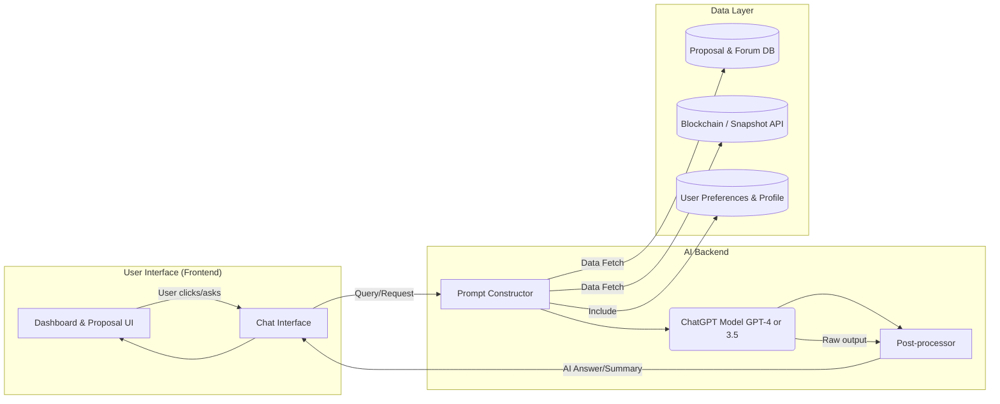

# **User Scenario, Use Case Analysis, and Wireframe Design for MosslandAI’s AI-DAO-Summarization Project**

This document focuses on detailed **user scenario analysis**, **use case definitions**, and **wireframe design** for MosslandAI’s AI-DAO-Summarization project. It offers a comprehensive research-style overview in GitHub Flavored Markdown, highlighting how the AI Agent should interact with different DAO users and what the optimal user interface (UI) might look like.

- Author: Mossland Lab  
- Email: lab@moss.land  
- Date of Initial Document Creation: February 12, 2025

---
## **Table of Contents**

1. [Introduction](#introduction)  
2. [User Scenario Analysis](#user-scenario-analysis)  
   2.1 [General DAO Members](#general-dao-members)  
   2.2 [Delegates / Power Users](#delegates--power-users)  
   2.3 [Core Decision-Makers](#core-decision-makers)  
   2.4 [Synthesis and Observations](#synthesis-and-observations)

3. [Use Case Definitions](#use-case-definitions)  
   3.1 [Use Case 1: On-Demand Proposal Summarization](#use-case-1-on-demand-proposal-summarization)  
   3.2 [Use Case 2: AI-Driven Recommendations & Personalized Voting Guides](#use-case-2-ai-driven-recommendations--personalized-voting-guides)  
   3.3 [Use Case 3: Conversational Exploration of DAO Data](#use-case-3-conversational-exploration-of-dao-data)  
   3.4 [Use Case 4: Real-Time Voting Analytics & Alerts](#use-case-4-real-time-voting-analytics--alerts)  

4. [Wireframe Design & UI/UX Proposals](#wireframe-design--uiux-proposals)  
   4.1 [Key Design Principles](#key-design-principles)  
   4.2 [Dashboard Wireframe](#dashboard-wireframe)  
   4.3 [Proposal Page & Summarization UI](#proposal-page--summarization-ui)  
   4.4 [Voting Guide & Recommendation Interface](#voting-guide--recommendation-interface)  
   4.5 [Conversational Agent Interface (Text & Voice)](#conversational-agent-interface-text--voice)  
   4.6 [Comparison with Existing DAO Platforms](#comparison-with-existing-dao-platforms)  

5. [Technical Flow Diagram (Code Snippet)](#technical-flow-diagram-code-snippet)  
6. [Pseudo Code Examples](#pseudo-code-examples)  
7. [Conclusions and Future Directions](#conclusions-and-future-directions)  
8. [References](#references)  

---

## **Introduction**

As decentralized communities grow, DAOs face an increasing volume of proposals and governance discussions. **AI-driven summarization** and **intelligent recommendation** can help DAO participants overcome information overload, fostering more inclusive and data-driven decisions.

The **MosslandAI AI-DAO-Summarization Project** aims to:
- Summarize large volumes of DAO proposals.
- Provide real-time analytics for voting.
- Offer user-focused AI guidance in governance.

This document pivots away from broad optimization topics and focuses deeply on:
- **User Scenarios**: Who uses this AI assistant, and how?
- **Use Cases**: What are the main functionalities needed?
- **Wireframe Designs**: How should the UI present AI insights in a seamless and intuitive manner?

This approach ensures that the user experience is front and center, leveraging AI in ways that **truly meet user needs**.

<br/>

---
## **User Scenario Analysis**

### 2.1 General DAO Members

**Persona:**  
- Alice, who has basic governance tokens and votes occasionally.  
- She wants **fast, accurate** overviews of each proposal without reading lengthy documents.  
- She may only visit the DAO once a week or less.

**Key Needs:**  
1. Quick Summaries: Short bullet points or a concise textual overview.  
2. Easy Q&A: Ability to ask clarifying questions without diving into forums.  
3. Confidence to Vote: Does not want to miss important nuances.

**Scenario Flow Example:**  
1. Alice logs into MosslandAI’s governance portal.  
2. On the home dashboard, she sees **AI-recommended proposals** that fit her interests (e.g., community events).  
3. She clicks on a proposal, sees an **AI-generated summary** at the top, and optionally asks follow-up questions (e.g., “Does this proposal increase fees?”).  
4. After reading the summary, she **casts her vote**—the interface might show *“AI suggests you may be interested in supporting this due to your past preference for community proposals.”*  
5. She leaves feedback on the AI summary (helpful/not helpful) to improve future recommendations.

This significantly **reduces friction** for casual voters, ensuring they can **participate** and **stay informed** with minimal effort.

<br/>

### 2.2 Delegates / Power Users

**Persona:**  
- Bob, a **delegate** with voting power entrusted by multiple token holders.  
- He needs **in-depth analysis** of multiple proposals and must frequently justify his votes.  
- He tracks multiple DAOs, so **efficiency** is paramount.

**Key Needs:**  
1. Comparative Analysis: Quickly compare two or more similar proposals.  
2. Historical Context: Access related past proposals, outcomes, and forum sentiment.  
3. Voting Impact: Real-time analytics on whether a vote might tip the scales or meet quorum.

**Scenario Flow Example:**  
1. Bob opens the **delegate dashboard** and sees a list of all active proposals across the DAOs he participates in.  
2. He checks which proposals are tagged as “High Impact” by the AI (using user-defined preferences).  
3. The AI has **summaries and community sentiment** for each proposal, as well as any relevant historical data (e.g., a prior attempt that failed).  
4. Bob can ask advanced queries, such as *“Compare the budget aspects of Proposal #10 and Proposal #12”*—the AI fetches relevant data and provides a side-by-side overview.  
5. He **votes** directly from the same screen, with real-time knowledge of potential quorum and how other major delegates are leaning.  
6. If he needs to publish a rationale, the AI can **draft a concise statement** summarizing his reasons, which he can edit and post publicly.

Such features **boost Bob’s productivity** and **ensure** that delegates can provide a more **transparent, data-driven** representation of community interests.

<br/>

### 2.3 Core Decision-Makers

**Persona:**  
- Carol, a **core team member** or governance committee member.  
- She authors proposals and needs to ensure thorough communication and buy-in.  
- She also wants to monitor **community reception** and real-time discussion.

**Key Needs:**  
1. Draft Summaries: AI to refine or generate a “plain English” summary for complex technical proposals.  
2. Sentiment Tracking: See how the community is reacting (forum comments, up/down votes on summary).  
3. Iterative Improvement: Adjust the proposal or add clarifications based on user confusion or pushback.

**Scenario Flow Example:**  
1. Carol uses the AI agent to **draft** a new proposal outline, ensuring it is easily understandable.  
2. Once published, the AI monitors forum comments, summarizing them to Carol with *“80% are supportive, but 20% worry about the budget impact.”*  
3. She can update the proposal’s FAQ or clarify points using the AI’s assistance.  
4. Throughout the voting period, she sees the **AI-driven analytics**: turnout percentage, major delegates’ stances, and potential shortfall for quorum.  
5. If feedback indicates confusion on a certain aspect, Carol quickly updates the proposal and uses the AI to *“Summarize the new changes and broadcast to interested delegates.”*

This ensures **proactive and transparent** communication, reducing the likelihood of **last-minute misunderstandings** that could sink an otherwise good proposal.

<br/>

### 2.4 Synthesis and Observations

From these three main user groups (general, delegates, decision-makers), we observe:

- **Common Need**: Easy, accurate summaries of proposals.  
- **Advanced Needs**: Deeper historical data, comparative analysis, recommendation logic for delegates, and dynamic updates for proposal authors.  
- **Interaction Modality**: A mixture of **dashboard overviews**, **in-context Q&A**, and **voting decision support**.  
- **Scalability**: The system must handle multiple proposals simultaneously, especially for power users.

These user scenarios shape the **functional specification** in the next section.

<br/>

---
## **Use Case Definitions**

### 3.1 Use Case 1: On-Demand Proposal Summarization

1. **Actor**: Any user wanting to understand a proposal quickly.  
2. **Goal**: Transform lengthy text into a concise summary with key points highlighted.  
3. **Trigger**: User clicks a “Summarize” button or asks in a chat: *“Summarize proposal X.”*  
4. **Main Flow**:  
   - The system retrieves proposal text from the database or IPFS.  
   - An AI prompt is constructed specifying summarization length, style, and key items (budget, timeframe, etc.).  
   - The AI model (e.g., GPT-4) returns a summary.  
   - The UI displays the summary in a **clearly delineated** area, with optional feedback buttons (helpful/not helpful).

5. **Output**: A concise textual summary in plain language or bullet points.  

**Notes**:  
- Summaries can be cached for quick retrieval, especially if multiple users request the same proposal.  
- Users should still have access to the **original text** for verification.

<br/>

### 3.2 Use Case 2: AI-Driven Recommendations & Personalized Voting Guides

#### 3.2.1 Personalized Recommendations

1. **Actor**: A user seeking which proposals are most relevant to them.  
2. **Goal**: Filter or rank active proposals by user preference (topic interest, historical votes, etc.).  
3. **Trigger**: User opens the “Recommended Proposals” section on their dashboard, or they request suggestions from the AI.  
4. **Main Flow**:  
   - The system pulls user preference vectors (topic interest: DeFi, NFTs, treasury, etc.).  
   - Each proposal is tagged or vectorized by relevant topics.  
   - Calculate a relevance score via **dot product** or other similarity measure.  
   - Return top N proposals with short reasons: e.g., *“This matches your interest in community development.”*

5. **Output**: A sorted list of proposals with short, context-specific explanation.

#### 3.2.2 Voting Guides

1. **Actor**: A user who wants guidance on how to vote, especially if uncertain.  
2. **Goal**: Provide suggestions (yes/no/abstain) aligned with the user’s known preferences or stances.  
3. **Trigger**: User navigates to the “Voting Guide” or specifically asks: *“How should I vote on proposal #3?”*  
4. **Main Flow**:  
   - The AI references the user’s past votes, or they explicitly stated preferences (e.g., “oppose fee increases”).  
   - The AI compares those preferences to the proposal’s content.  
   - It suggests a likely stance along with bullet-point rationale. For example, *“Proposal #3 would increase fees by 2%; you previously opposed fee hikes, so you may want to vote No.”*  
   - The user can accept or ignore the suggestion.

5. **Output**: A dynamic voting recommendation with a short textual explanation.

**Notes**:  
- Users remain in control; the AI only advises.  
- Helps novices get clarity faster, reduces “analysis paralysis.”  
- Voting suggestion must remain **neutral** from the AI’s perspective, derived from the user’s own prior stances or the community’s majority preference if user data is missing.

<br/>

### 3.3 Use Case 3: Conversational Exploration of DAO Data

1. **Actor**: Any user (especially new or curious participants).  
2. **Goal**: Ask the AI about **any** DAO-related topic in natural language.  
3. **Trigger**: User opens a chatbot panel or uses voice input: *“What is the total treasury?”*, *“How many proposals passed last month?”*  
4. **Main Flow**:  
   - The system **interprets** the query using NLP.  
   - If relevant data is in the on-chain or off-chain database, it retrieves that info.  
   - The AI composes an answer, possibly with references or short disclaimers.  
   - The response is displayed in chat format. If user asked by voice, they could get TTS output.

5. **Output**: A direct, interactive **Q&A** experience, akin to a domain-specific chatbot.

**Notes**:  
- A major improvement over static wiki or documentation.  
- Minimizes user friction; they don’t have to rummage through multiple pages or forums.  
- Potential for advanced queries like: *“List all proposals that changed staking parameters in the last year.”*

<br/>

### 3.4 Use Case 4: Real-Time Voting Analytics & Alerts

1. **Actor**: Voters, delegates, or proposal authors wanting to track active polls.  
2. **Goal**: Provide ongoing updates (Yes/No tallies, turnout, quorum progress), plus alerts when significant events occur (like major delegate votes).  
3. **Trigger**: User opens the “Active Votes” section or specifically requests an update.  
4. **Main Flow**:  
   - The system regularly fetches the latest vote data from the contract or Snapshot API.  
   - Basic calculations: turnout percentage vs quorum requirement, majority side.  
   - The AI can produce a short statement: *“Proposal #2 is 45% yes, 55% no. Quorum is met. Less than 24 hours remain.”*  
   - If the user is a large delegate, it might highlight: *“Your vote could swing the result.”*

5. **Output**: Live dashboards, alerts (push notifications, if applicable), and textual commentary.

**Notes**:  
- This fosters greater **transparency** during the voting window, prompting users to vote early if needed.  
- Encourages more **engagement** by highlighting potential close outcomes or quorum shortfalls.

<br/>

---
## **Wireframe Design & UI/UX Proposals**

### 4.1 Key Design Principles

1. **Clarity & Minimalism**: AI features should not clutter the page. Keep it **clean** and action-oriented.  
2. **Trust & Transparency**: Clearly label AI-generated content. Provide easy access to **original text**.  
3. **Context-Awareness**: Let the user see AI insights in the relevant context (proposal page, voting interface, etc.).  
4. **User Control**: Users can ignore or hide AI suggestions if they prefer.  
5. **Scalability & Consistency**: Designs should be consistent across desktop, mobile, and possible future mediums like VR/AR interfaces (especially relevant for Mossland).

<br/>

### 4.2 Dashboard Wireframe

#### Overview
On login, the user lands on a **Dashboard** summarizing **active proposals**, **AI recommendations**, and **voting guides**:

```
--------------------------------------------------------
|  Welcome, Alice!                                     |
|  Your Latest Governance Highlights                   |
|------------------------------------------------------|
|  [Recommended for You] (AI-based)                    |
|   1) Proposal #14: “Community VR Events”            |
|      - Matches your interest in social proposals     |
|      - Quick summary snippet or link to full summary |
|      [View Proposal]   [Summarize]                  |
|   2) Proposal #10: “Adjust Platform Fees”            |
|      - High forum engagement, ends soon             |
|      [View Proposal]   [Summarize]                  |
|------------------------------------------------------|
|  [Active Votes]                                      |
|   #14: VR Events – 55% Yes, 45% No, 15% Turnout      |
|         AI note: Quorum not met (20% needed)         |
|   #10: Fees – 60% Yes, 40% No, 18% Turnout           |
|         AI note: 2 days left, moderate engagement    |
|------------------------------------------------------|
|  [Voting Guide] (If user hasn't voted yet)           |
|   *Proposal #14* – AI suggests YES (based on past    |
|    votes for community proposals)                    |
|     [Vote Now]                                       |
|   *Proposal #10* – AI neutral (no clear preference)  |
|     [Vote Now]                                       |
|------------------------------------------------------|
|  [Ask the AI Bot] "Type your question..." [mic icon] |
--------------------------------------------------------
```

**Key Elements**:
- **Recommended Proposals**: Summaries or tags explaining *why* recommended.  
- **Active Votes**: Real-time stats with an AI note about quorum or day-left info.  
- **Voting Guide**: If the user set up preferences or the system has enough data, show suggestions.  
- **Chat Prompt**: A persistent bar to quickly ask questions.

<br/>

### 4.3 Proposal Page & Summarization UI

When the user clicks “View Proposal”:

```
---------------------------------------------------------
| Proposal #14: "Community VR Events"  (Voting Open)    |
|-------------------------------------------------------|
| AI Summary: This proposal requests 50,000 MOSS to     |
| host monthly VR gatherings, aiming to improve user    |
| engagement by ~10%. Primary risk: low attendance.     |
| [Helpful? 👍 👎 ]  [Ask a Question]                   |
|-------------------------------------------------------|
| Full Proposal Text (collapsible if long)              |
|  Lorem ipsum... budget 50,000 MOSS... user retention. |
|-------------------------------------------------------|
| Forum Discussion Summary (AI-computed)                |
| - Most members supportive, a few raise budget concerns|
|  [View full comments -> ]                             |
|-------------------------------------------------------|
| Voting Block:                                         |
|  Current Tally: 55% Yes, 45% No (needs 5% more turnout|
|  Time Left: 3 days                                    |
|  [Vote Yes] [Vote No] [Abstain]                       |
|  AI Suggestion: "You have historically supported      |
|  community events. This might align with your past    |
|  votes."                                              |
|-------------------------------------------------------|
| Related Proposals: #9 AR Events (passed last year)    |
|-------------------------------------------------------|
```

**Highlights**:
- **Top-level AI Summary**: Immediately visible.  
- **Feedback**: Thumbs up/down to refine future summarization.  
- **Forum Integration**: High-level sentiment quickly shown.  
- **Voting Section**: Real-time data + an optional AI suggestion.

<br/>

### 4.4 Voting Guide & Recommendation Interface

**Option 1: Single Listing**  
A dedicated page listing all proposals that need the user’s vote, each with an **AI stance** or **confidence score**:

```
-------------------------------------------------------
| Voting Guide                                         |
|------------------------------------------------------|
| 1) Proposal #14 - "Community VR Events"              |
|    AI Suggests: YES  (Matches your preference)       |
|    [Vote Yes] [Vote No] [Abstain]                    |
|------------------------------------------------------|
| 2) Proposal #10 - "Adjust Platform Fees"             |
|    AI Suggests: NO (You typically oppose fee hikes)  |
|    [Vote Yes] [Vote No] [Abstain]                    |
|------------------------------------------------------|
```

**Option 2: Inline on Each Proposal**  
Recommendations appear on each proposal page. This is more contextual but might be repeated across proposals.

Either way, the system clarifies that the user **retains full control** and can see the AI’s rationale upon request (e.g., “Why does the AI suggest NO?”).

<br/>

### 4.5 Conversational Agent Interface (Text & Voice)

A floating **chat panel** or **pop-up**:

```
---------------------------------------------------------
| AI Assistant                                          |
|-------------------------------------------------------|
| [User] : "Explain the treasury status right now."     |
|-------------------------------------------------------|
| [AI]    : "The DAO treasury holds ~500,000 MOSS.      |
|           Current runway is estimated at 8 months     |
|           given typical spend rates."                 |
| [👍 👎 ]                                              |
|-------------------------------------------------------|
| [User] : "How many proposals passed last month?"      |
|-------------------------------------------------------|
| [AI]    : "Five proposals passed out of seven total.  |
|           Three were about product development, two   |
|           about event funding."                       |
| [👍 👎 ]                                              |
|-------------------------------------------------------|
|  [Type your question...] [mic icon]                   |
---------------------------------------------------------
```

**Features**:
- **Persistent** across pages, enabling quick Q&A.  
- **Contextual**: If the user is on a proposal page, the AI knows which proposal to reference automatically.  
- **Voice Input**: Microphone icon to speak queries (converted to text).

<br/>

### 4.6 Comparison with Existing DAO Platforms

- **Snapshot**:  
  - Simple proposal listing and voting.  
  - **No built-in AI** for summarization or Q&A.  
  - Our design adds dynamic summaries, real-time analytics, and personalized guides.

- **Aragon**:  
  - Good at on-chain governance execution.  
  - Lacks integrated recommendation engines or advanced summarization.  
  - We improve the **usability** side, particularly for less technical participants.

By combining real-time data, advanced NLP, and a structured UI, MosslandAI can significantly **boost user engagement** and **decision quality** compared to these existing solutions.

<br/>

---
## **Technical Flow Diagram (Code Snippet)**

Below is a sample **flowchart** code snippet illustrating how the UI, AI backend, and data layer interact. The key change is quoting subgraph titles to avoid parsing errors:



**Diagram Explanation**:
1. The **Frontend** (Dashboard, Proposal UI, Chat Interface) sends a **query** to the AI Backend whenever the user requests a summary, Q&A, or recommendation.  
2. The **Prompt Constructor** retrieves data from the DAO’s databases and the blockchain (plus user preferences for personalization).  
3. The **Language Model** (GPT-4 / GPT-3.5) generates a response.  
4. A **Post-Processor** can reformat or validate certain outputs before returning them to the UI.  

---
## **Pseudo Code Examples**

### Example: Summarizing a Proposal

```pseudo
function summarizeProposal(proposalId):
    text = Database.getProposalText(proposalId)
    prompt = "Summarize the proposal below. Focus on objectives, budget, " +
             "and key risks in under 200 words:\n\n" + text

    if length(text) < 4000:
        model = GPT_4
    else:
        model = GPT_3_5_TURBO_16K  # or chunk if needed

    summary = callLLM(model, prompt)
    return summary
```

1. **Retrieve** the proposal text.  
2. **Construct** a prompt with instructions (e.g., bullet points, word limit).  
3. **Invoke** the LLM and return the final text.

<br/>

### Example: Generating Personalized Recommendations

```pseudo
function recommendProposalsForUser(userId):
    prefs = UserPreferencesDB.get(userId)  # e.g., {tech: 0.8, fees: -0.2, community: 0.9}
    activeProps = ProposalsDB.query("status=active")
    scored = []

    for prop in activeProps:
        vector = prop.topicVector  # e.g., {tech: 0.7, fees: 0, community: 1}
        score = dotProduct(prefs, vector)
        scored.push( (prop.id, score) )

    # Sort descending by score
    scored.sortByScore()
    topProps = scored.take(5)

    # Generate short explanation for each top proposal
    results = []
    for (propId, s) in topProps:
        explanation = generateExplanation(propId, userId)
        results.push( { proposal: propId, reason: explanation } )

    return results
```

1. **User Preferences**: Weighted interests or derived from vote history.  
2. **Proposal Topic Vectors**: Derived from text classification (NLP tags).  
3. **Matchmaking**: A simple dot product to measure alignment.  
4. **Return** top proposals plus a short text reason.

<br/>

---
## **Conclusions and Future Directions**

### **Key Points from This Analysis**:

1. **User-Centric Approach**  
   - Each major user type (casual member, delegate, core team) has distinct needs.  
   - Designing a universal interface without personalization often leads to **information overload**.

2. **AI-Driven Enhancement**  
   - Summaries, Q&A, real-time analytics, and recommendation systems can **transform** the governance experience.  
   - Minimizing friction: *One-click summaries*, *in-context Q&A*, *live turnout analytics*.

3. **Wireframe Designs**  
   - Focus on **clean dashboards**, **proposal pages with top-level AI summaries**, and **chat-based interactions**.  
   - Ensure **transparency**: label AI content, keep original references accessible.

4. **Technical Feasibility**  
   - Modern LLMs (GPT-4 / GPT-3.5) can handle complex summarization and contextual queries.  
   - Must address context-window limits, caching repeated queries, and explicit user feedback loops.  
   - Integration with on-chain data is crucial for **real-time** analytics.

### **Future Research**:

- **Cross-DAO Dashboards**: Delegates often participate in multiple DAOs. The system could unify proposals from multiple sources, with aggregated AI analysis.  
- **Multi-Language Support**: Expanding beyond English to serve a global user base, given the rising international DAO scene.  
- **Advanced Delegate Features**: Weighted comparisons, automated rationale generation, or sentiment-based debate analysis.  
- **Ethical & Governance Implications**: Evaluating whether AI suggestions shift power dynamics or inadvertently bias community decisions. Proper disclaimers and transparent algorithms can mitigate these concerns.

<br/>

---
## **References**

- [1] Snapshot.org Documentation. *Basic voting flow*.  
- [2] Aragon.org. *Platform overview*.  
- [3] OpenAI. *GPT-4 technical report*.  
- [4] Various DAO Whitepapers (MakerDAO, Compound, etc.) on *governance structures and participation*.  
