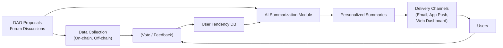
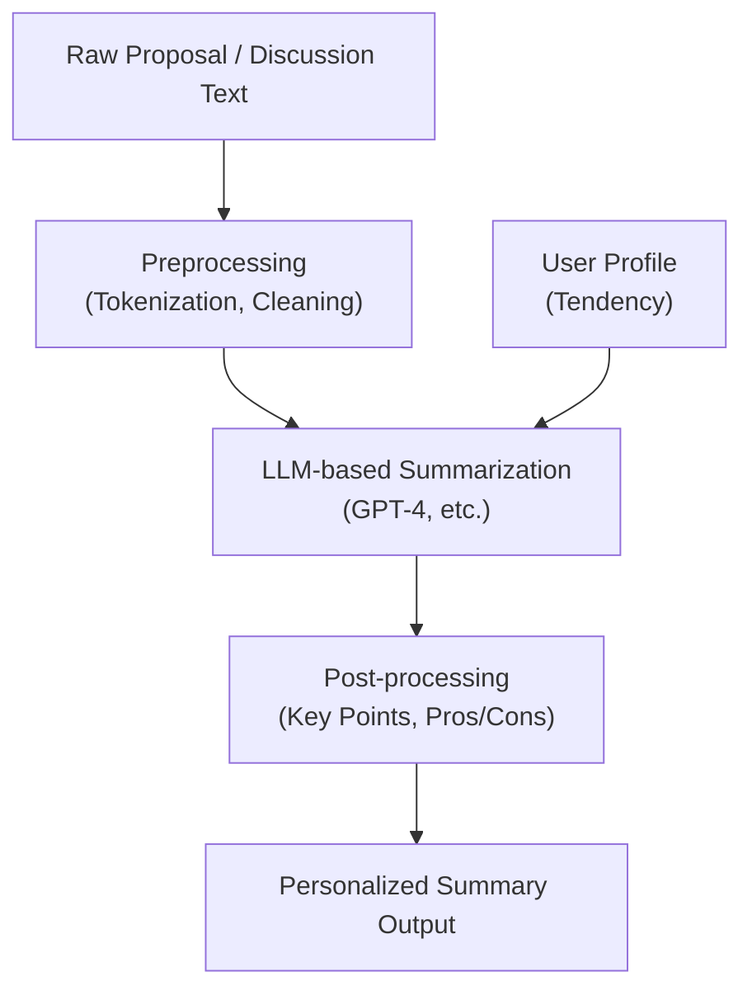
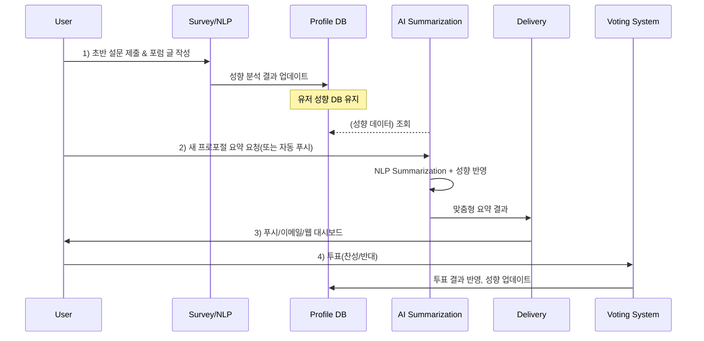

# AI를 활용한 DAO 성향 분석 및 맞춤형 투표 요약 모듈 연구

- 작성자: 모스랜드랩 Mossland Lab
- 이메일: lab@moss.land
- 최초 작성일: 2025년 2월 6일

## 목차
1. **개요 (Introduction)**
2. **연구 배경 (Background and Motivation)**
3. **연구 목표 (Research Objectives)**
4. **관련 연구 (Related Work)**
5. **유저 성향 분석 기법 (User Tendency Analysis Methods)**
6. **유저 성향 기준 정의 (Criteria for User Tendency)**
7. **AI 기반 요약 및 전달 방식 (AI-Powered Summarization and Communication)**
8. **시스템 구성도 (System Architecture)**
9. **연구 프로세스 (Research Process)**
10. **산업 적용 사례 및 최신 동향 (Industry Applications and Research Trends)**
11. **결론 (Conclusion)**
12. **참고문헌 (References)**

---

## 1. 개요 (Introduction)
블록체인 기술과 스마트 컨트랙트의 발전으로 탈중앙화 자율 조직(Decentralized Autonomous Organizations, 이하 DAO)이 빠르게 성장하고 있습니다. DAO는 토큰 홀더들의 투표를 통해 조직 운영 방향이 결정되며, 거버넌스 프로세스가 투명하게 블록체인 상에 기록됩니다. 그러나 실제로는 투표안(Proposal)과 포럼(Forum)에 쏟아지는膨대한 정보량으로 인해 유저들이 모든 내용을 효율적으로 파악하기가 어려워, 저조한 투표 참여율이나 비효율적인 의사결정이 발생하기도 합니다 [1].

본 연구는 **AI를 활용하여 DAO에 올라오는 제안, 커뮤니티 포럼, 유저 의견 등을 요약**하고, **개별 유저의 성향에 맞춘 맞춤형 정보를 제공**함으로써, 구성원의 참여 효율을 높이고 판단 시간을 단축시키는 방안을 모색합니다. 더 나아가, AI 에이전트가 **유저의 투표 대리**를 맡아 자동으로 투표하거나 포럼에서 의견을 제시할 수도 있는 가능성을 탐색합니다. 이번 연구에서는 그 첫걸음으로, **유저의 성향을 분석**하고, 이를 기반으로 **맞춤형 요약 정보를 푸시**해주는 모듈을 설계·개발하는 방법을 제시합니다.

---

## 2. 연구 배경 (Background and Motivation)
1. **정보 과부하 (Information Overload)**: DAO는 개방형 조직이므로 매일 새로운 제안이 올라오고, 포럼이나 소셜 채널에서 많은 토론이 발생합니다. 구성원들은 모든 정보를 제때 읽고 이해하기 어렵습니다 [2].  
2. **다양한 유저 성향 (Diverse User Tendencies)**: 구성원마다 투자를 중시하는지, 혹은 커뮤니티 가치를 중시하는지, 단기적인 성과를 보는지, 혹은 장기적인 관점에서 발전을 바라보는지 등 차이가 큽니다. 모든 구성원에게 동일한 형태로 정보를 제공하면, 중요한 내용을 놓치거나 참여 의지를 잃기 쉽습니다 [3].  
3. **AI 기술의 발전 (Advances in AI)**: 최근 GPT 계열과 같은 대형 언어 모델(LLM)의 발전으로 텍스트 요약과 자연어 처리 성능이 크게 향상되었습니다. 이를 효율적으로 응용한다면, DAO 거버넌스에서도 높은 가치 창출이 가능할 것으로 보입니다 [4].

---

## 3. 연구 목표 (Research Objectives)
- **유저 성향 분석**: 설문조사, 과거 활동 기록, NLP 기반 의견 분석 등 다양한 방법을 통해 유저가 어떤 가치를 선호하는지 파악합니다.  
- **맞춤형 요약 모듈**: 유저 성향에 따라 AI가 제안(Proposal)과 커뮤니티 토론을 요약하고, 푸시 알림 등을 통해 제공함으로써, 의사결정 효율을 높입니다.  
- **성향 업데이트**: 유저의 투표 결과, 새로운 트렌드·토론 내용을 통해 정기적으로 성향을 업데이트하여 지속적으로 정확한 맞춤형 정보를 제공할 수 있도록 합니다.  
- **시스템 프로토타입 제시**: 전체 프로세스를 연결하는 시스템 아키텍처와 모듈 간 연동 방식을 제시하고, 궁극적으로 DAO의 거버넌스 효율 향상을 입증하고자 합니다.

---

## 4. 관련 연구 (Related Work)
### 4.1 DAO 거버넌스 도구
- **Aragon**, **Tally**, **Snapshot** 등 다양한 DAO 툴링 플랫폼이 존재하며, 이들 중 일부는 거버넌스 제안을 정리하거나, 투표 기록 분석 기능을 제공합니다 [3].  
- 하지만 **개인화(Personalization)** 기능이나 **정교한 요약(Summarization)** 기능은 아직 초기 단계입니다.

### 4.2 AI 기반 텍스트 요약
- OpenAI의 GPT 모델 계열(GPT-3.5, GPT-4 등)을 활용하면, **추상적 요약(Abstractive Summarization)**까지 가능해집니다 [4].  
- 특히 **Prompt Engineering** 기법을 통해, 특정 유저의 성향을 반영한 요약 문장을 생성하는 방식이 연구되고 있습니다 [4].

### 4.3 사용자 성향 분석
- 설문조사, 과거 로그, 소셜 미디어 글 분석 등을 통해 **사용자의 성향(Personality, Value Preference)**을 도출하는 연구가 활발합니다 [2].  
- 온라인 커뮤니티나 SNS에서 특정 키워드 사용 빈도나 감성 분석을 통해 **정치적·사회적 성향**을 예측하는 시도도 진행되고 있습니다 [1].

---

## 5. 유저 성향 분석 기법 (User Tendency Analysis Methods)
유저 성향 분석은 크게 **(1)설문조사, (2)과거 활동 기록 분석, (3)NLP 기반 의견 분석**으로 나눌 수 있습니다.

### 5.1 설문조사 (Survey-Based Analysis)
- **장점**: 직접적인 질문을 통해 사용자의 명시적 가치관을 파악할 수 있음.  
- **단점**: 사용자가 정확하게 답하지 않거나, 실제 행동과 괴리가 있을 수 있음.

#### 설문 예시
```
1. 당신은 DAO 재정을 투자할 때, 어느 정도의 위험을 감수할 의향이 있습니까?
   (1) 매우 낮음   (2) 낮음   (3) 보통   (4) 높음   (5) 매우 높음

2. DAO 의사결정 시, 커뮤니티나 사회적 가치가 재무적 이익보다 중요합니까?
   (1) 전혀 동의하지 않음   ...   (5) 매우 동의함
```

### 5.2 과거 활동 기록 분석 (Past Activity & On-chain Record)
- **투표 기록**: 유저가 과거 어떤 제안에 찬성/반대했는지 살펴보면, 보수적/진보적 성향, 단기 이익 지향 등 파악 가능 [1].  
- **거래 내역**: 유저가 보유 토큰을 얼마나 오랫동안 스테이킹했는지, 짧게 트레이딩하는지 등을 통해 단·장기 관점을 가늠할 수 있음.  
- **포럼/커뮤니티 활동**: 발언의 빈도, 찬반 논리 등을 텍스트 마이닝하여 유저 의견 성향을 파악.

### 5.3 NLP 기반 의견 분석 (NLP-Based Opinion Mining)
- **텍스트 감성 분석(Sentiment Analysis)**: 유저가 작성한 글이 긍정/부정 어느 쪽 성향인지.  
- **토픽 모델링(Topic Modeling)**: 주로 어떤 주제(재무적 이익, 기술 혁신, ESG 등)에 관심이 많은지.  
- **키워드 분석/스탠스 감지**: 특정 이슈(환경 보호, 기부 등)에 대해 찬성하는지 반대하는지 추출.

---

## 6. 유저 성향 기준 정의 (Criteria for User Tendency)
본 연구에서는 다음 세 가지 축을 우선적으로 정의합니다 [2][3]:

1. **보수적(Conservative) vs. 진보적(Progressive)**  
   - **보수적**: 현재 운영 방식을 크게 바꾸지 않고 안정성을 추구.  
   - **진보적**: 새로운 시도와 혁신을 적극 지지하며, 리스크를 감수해도 변화를 선호.

2. **경제적 이익(Economically Driven) vs. 사회적 가치(Socially Driven)**  
   - **경제적 이익 추구**: 재무적 성과, 토큰 가치 상승 등에 초점을 맞춤.  
   - **사회적 가치 중시**: 커뮤니티, 공익, ESG 가치 등을 더 중요하게 생각.

3. **단기적 성과(Short-Term) vs. 장기적 비전(Long-Term)**  
   - **단기 성과 중시**: 빠른 이익, 즉각적 보상에 관심이 높음.  
   - **장기 성과 중시**: 시간이 걸리더라도 DAO의 지속가능한 성장에 집중.

이 외에도 **위험 감수도(Risk Tolerance)**, **중앙화 선호도** 등 추가 축을 고려할 수 있습니다.

---

## 7. AI 기반 요약 및 전달 방식 (AI-Powered Summarization and Communication)

### 7.1 요약 기법 (Summarization Techniques)
- **추상적 요약(Abstractive Summarization)**: GPT-4 등 대형 언어 모델을 사용해, 원문의 핵심 정보를 새로 문장화.  
- **키포인트 요약(Key Point Extraction)**: 제안의 핵심 주장, 찬성 논리, 반대 논리를 항목별로 정리.  
- **유저 성향 기반 맞춤형 요약(Personalized Summaries)**: 보수적인 성향의 유저에게는 리스크와 안정성을, 진보적인 성향에는 혁신성과 기회를 강조.

### 7.2 전달 채널 (Delivery Channels)
- **이메일(Email)**: 중요한 제안 요약을 주기적으로 발송.  
- **모바일 앱 푸시 노티(Push Notification)**: 긴급하거나 마감이 임박한 투표 건에 대해 바로 알림.  
- **웹 대시보드(Web Dashboard)**: DAO 거버넌스 포털에 접속했을 때, 개인화된 제안 목록 및 요약을 표시.  
- **챗봇/AI 어시스턴트(Interactive Chatbot)**: “이번 주 DAO 주요 제안 알려줘” 라고 물으면, AI가 성향 기반 요약 제공.

---

## 8. 시스템 구성도 (System Architecture)

아래 그림들은 본 연구에서 제안하는 전체 아키텍처와 데이터 흐름, 그리고 AI 요약 모듈의 내부 구조를 간략히 나타낸 다이어그램입니다.

### 8.1 전체 아키텍처 개요



### 8.2 AI 요약 모듈 내부 구조



---

## 9. 연구 프로세스 (Research Process)
본 연구는 **아래 세 단계**로 구성됩니다.

### 9.1 1단계: 유저 성향 분석 (Initial User Profiling)
1. **설문조사**: DAO 가입 시 혹은 정기적으로 간단한 설문을 실시해 기초 성향 정보 수집.  
2. **과거 활동 기록 분석**: 투표 이력, 포럼 글을 수집·분석하여, 실제 행동 양상을 통해 성향 추정.  
3. **NLP 의견 분석**: 사용자의 텍스트(포럼, SNS 등)에서 감성·주제·스탠스 정보를 추출.

### 9.2 2단계: 맞춤형 요약 및 투표 과정 (Personalized Summaries & Voting)
1. **프로포절/포럼 데이터 수집**: 실시간 혹은 일정 주기로 내용 파싱.  
2. **AI 요약 모듈**: GPT API 호출로 문서 요약 및 재구성.  
3. **성향 반영**: 유저 프로필 DB를 참조하여, 요약 문구를 개인화.  
4. **전달**: 이메일, 푸시 등으로 유저에게 발송.  
5. **투표 진행**: 유저가 더 쉽게 내용 이해 후 투표.

### 9.3 3단계: 성향 업데이트 (Updating Profiles)
1. **투표 결과 반영**: 유저가 실제로 찬성/반대/기권했는지 기록.  
2. **커뮤니티 동향 반영**: 새로운 이슈 등장 시 추가 설문 등을 통해 성향 재평가.  
3. **장기적 학습**: 유저 성향에 변화가 있는지 추세를 분석하고, 프로필 업데이트.

아래 다이어그램은 전체 프로세스를 요약합니다.



---

## 10. 산업 적용 사례 및 최신 동향 (Industry Applications and Research Trends)

### 10.1 실제 DAO에서의 AI 활용
- **Tally**: 특정 DAO에서 AI 도입을 제안하는 “AI-Powered Governance Enhancement” 프로포절이 제출되었으며, 과거 투표 기록을 분석해 자동 추천/분석을 제공하려는 시도가 있음 [2].  
- **Aragon**: 거버넌스 포럼에 AI 요약 기능에 대한 제안이 올라오고 있으며, ChatGPT 등을 이용해 거버넌스 토론을 요약한 사례도 나타남 [3].

### 10.2 학계 동향
- **DAO 지배구조 분석**: (Sharma et al.) 대규모 DAO 데이터 셋을 활용해 투표 참여율, 제안 통계 등을 분석한 연구. 이는 성향 파악에 활용될 수 있는 기초자료를 제공 [1].  
- **AI 기반 의견 분석**: 온라인 커뮤니티에서 발생하는 토론의 감정·주제 분석이 활발히 연구되고 있으며, DAO 거버넌스에도 적용 가능 [2].  
- **개인화 추천 시스템**: 전통적 커머스 분야의 개인화 추천 방식이 DAO 투표 제안 추천에도 적용될 수 있다는 연구가 진행 중 [4].

---

## 11. 결론 (Conclusion)
본 연구는 **DAO 거버넌스에서 발생하는 정보 과부하와 낮은 참여도** 문제를 해결하기 위해, **AI 기반 유저 성향 분석**과 **맞춤형 투표 요약**을 결합한 모듈을 제안하였습니다. 구체적으로,

1. **유저 성향 분석**: 설문조사, 과거 기록 분석, NLP를 통해 **보수적 vs. 진보적, 경제적 이익 vs. 사회적 가치, 단기 vs. 장기** 등 축을 정의하여 프로파일링 [1][2][3].  
2. **AI 요약 모듈**: GPT 계열 모델을 활용해 제안·포럼 내용을 추상적으로 요약하고, 유저 성향에 맞게 정보를 재구성하여 개인화 [4].  
3. **지속적 성향 업데이트**: 투표 결과와 커뮤니티 트렌드를 반영해 사용자의 변화를 추적, 정교한 맞춤형 정보 제공.  

이로써 DAO 구성원들은 제안의 핵심을 빠르게 파악할 수 있고, 본인의 가치관에 맞춰 결정할 수 있어 참여 효율을 높일 수 있습니다. 향후에는 **AI 에이전트가 유저를 대신해 투표**하거나 **포럼에서 발언**하는 기능까지 확장할 여지가 있습니다. 또한, 본 연구에서 제안된 프로세스와 모듈은 다른 DAO 툴링과 결합하여 하나의 서비스 형태로 제공될 수 있습니다.

---

## 12. 참고문헌 (References)
[1] T. Sharma *et al*., “Future of Algorithmic Organization: Large Scale Analysis of Decentralized Autonomous Organizations (DAOs),” *arXiv preprint* arXiv:2410.13095, 2024.  

[2] Y. Quan *et al*., “Decoding Social Sentiment in DAO: A Comparative Analysis of Blockchain Governance Communities,” *arXiv preprint* arXiv:2311.14676, 2024.  

[3] **Aragon**, “The Future of DAOs is Powered by AI,” *Aragon Resource Library*, Oct. 2023.  

[4] D. J. Parente *et al*., “Quality, Accuracy, and Bias in ChatGPT-Based Summarization of Medical Abstracts,” *Annals of Family Medicine*, vol. 22, no. 5, 2024.
