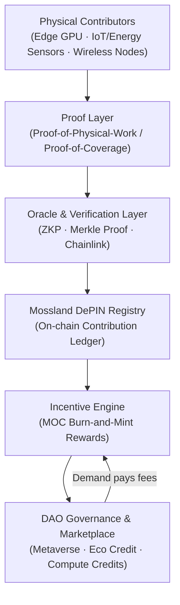

# AI × DePIN: Decentralized Physical Infrastructure for Mossland's AI and Energy Systems

**Author:** Mossland Lab  
**Email:** [lab@moss.land](mailto:lab@moss.land)  
**Date of Initial Document Creation:** 2026-07-04  
**Status (as of mid-2026):** Research proposal / conceptual design. The "Mossland Energy & Compute DePIN" described below is forward-looking design and has not yet been implemented as of 2026-07.  

---

## Abstract
The convergence of artificial intelligence and **Decentralized Physical Infrastructure Networks (DePIN)** — token-incentivized networks that crowdsource the deployment and operation of real-world hardware such as GPUs, sensors, wireless radios, and energy meters — has become one of the defining infrastructure themes of the mid-2020s.  
This research surveys the 2026 state of representative DePIN networks (compute/GPU, wireless/sensor, and data) and the surging AI-compute demand driving them, then proposes a **Mossland Energy & Compute DePIN** in which **MossCoin (MOC)** rewards verified physical contributions.  
By binding DePIN's cryptographic **proof-of-physical-work** and **proof-of-coverage** primitives to Mossland's existing DigitalTwin, EcoAI, and GreenLedger research, we frame a coherent path from raw sensor and GPU contributions to on-chain, verifiable, and economically incentivized infrastructure.

---

## 1. Introduction
Modern AI is bottlenecked by physical resources: GPU compute for training and inference, high-fidelity real-world data, and the energy that powers both. Historically these have been concentrated inside a handful of hyperscalers. DePIN offers an alternative supply model — instead of a single operator building infrastructure top-down, a token protocol pays a distributed crowd to deploy and operate hardware, then verifies their physical contribution on-chain.

As of 2026, the DePIN sector spans compute, wireless, storage, sensor, and energy sub-categories, with Messari counting more than 650 distinct projects and a combined tracked token market capitalization of roughly **$18.9 billion** (CoinMarketCap, May 2026). Messari projects the addressable market could reach **$3.5 trillion by 2028**. Crucially, by 2026 the sector has matured enough to separate genuine revenue-generating networks from pure token-emission schemes, with distributed compute and storage showing the clearest end-user demand.

Within the Mossland ecosystem, AI and blockchain are already tightly coupled through services such as **AI-Driven DAO**, digital-twin building analytics, and sustainable-AI infrastructure. This document asks a focused question: *how should Mossland use MOC to incentivize verified physical contributions — energy, sensor data, and edge compute — as a first-party DePIN?* We connect the answer directly to sibling research: [DigitalTwin](../DigitalTwin/) (building and IoT sensor data), [EcoAI](../EcoAI/EcoAI_EN.md) (energy optimization), and [GreenLedger](../DigitalTwin/GreenLedger/GreenLedger_EN.md) (verified energy/carbon to tokenized Eco Credits).

---

## 2. System Overview

The **Mossland Energy & Compute DePIN** connects physical contributors (edge GPUs, IoT/energy sensors, wireless nodes) to a verification and incentive layer that mints MOC-denominated rewards for cryptographically proven work.

| Module | Description | Core Technology |
| ------ | ----------- | --------------- |
| **1. Physical Contributor Nodes** | Edge GPUs, IoT/energy sensors, and wireless radios that supply compute, data, and coverage | NVIDIA edge GPUs, LoRaWAN/5G, IoT meters |
| **2. Proof Layer** | Verifies that claimed physical work actually occurred | Proof-of-Physical-Work, Proof-of-Coverage, Proof-of-Spacetime |
| **3. Oracle & Verification Layer** | Bridges off-chain proofs on-chain while preserving privacy | zk-SNARKs, Merkle Proof, Chainlink Functions |
| **4. Mossland DePIN Registry** | Immutable ledger of verified contributions per node | Layer-2 smart contracts (Polygon / Arbitrum) |
| **5. Incentive Engine** | Converts verified work into MOC rewards via burn-and-mint | Burn-and-Mint Equilibrium tokenomics |
| **6. DAO Governance & Marketplace** | Governs parameters and trades compute/Eco Credits | MOC / DAO Voting / Safe Multisig |

---

## 3. Methodology

### 3.1 The DePIN Landscape Driving AI (as of 2026)

AI-compute demand is the dominant growth driver across the DePIN category. Representative networks, verified as of 2026:

| Network | Category | What It Does | 2026 Status |
| ------- | -------- | ------------ | ----------- |
| **io.net** | GPU compute | Aggregates distributed GPU clusters with inter-GPU networking for training | Solana-native compute layer scaling for AI workloads |
| **Render** | GPU rendering/inference | Decentralized GPU rendering; **Dispersed Compute** subnet (2025) for AI inference | Processed **63M+ frames**; NVIDIA H100/B200 operator access |
| **Akash** | GPU compute | Reverse-auction "supercloud" GPU marketplace | H100 at **$1.20–1.80/hr** vs AWS's **$4.50–5.50** |
| **Helium** | Wireless/sensor | Crowdsourced 5G + LoRaWAN via Proof-of-Coverage | ~**600k** Mobile sign-ups (early 2026); Q2'25 transfer **2,721 TB**, +138.5% QoQ |
| **Grass** | Data | Monetizes idle bandwidth to gather web data for AI training | **3M+** users |
| **Bittensor** | Machine intelligence | Incentive market of specialized subnets | **128 subnets**; dTAO upgrade (Feb 2025) |
| **Filecoin** | Storage | Verifiable decentralized storage | Proof-of-Replication / Proof-of-Spacetime; enterprise archiving deals |

The broader edge-AI market — the natural home for DePIN edge inference — was projected at roughly **$30.0 billion in 2026**, growing to **$118.7 billion by 2033** at a ~21.7% CAGR.

### 3.2 Proof-of-Physical-Work and Proof-of-Coverage

The core technical challenge of any DePIN is verifying that a contributor actually performed the physical service it claims. This is solved by **Proof-of-Physical-Work (PoPW)** primitives:

* **Proof-of-Coverage (PoC):** Helium's mechanism to validate that a wireless node genuinely covers a claimed location and time.
* **Proof-of-Replication / Proof-of-Spacetime (PoRep / PoSt):** Filecoin's proofs that data is stored uniquely and continuously over time.
* **Verified inference / rendering receipts:** compute networks attest that a workload ran on the claimed hardware.

For Mossland, the analogous primitive is **Proof-of-Verified-Energy** — building on GreenLedger's zk-based hashing of AI/IoT energy data — extended with **Proof-of-Edge-Inference** receipts for edge GPU contributions.

### 3.3 Token-Incentive Design (Burn-and-Mint Flywheel)

As of 2026, the prevailing DePIN incentive pattern is the **Burn-and-Mint Equilibrium (BME) flywheel**: contributors are paid in newly minted tokens for verified supply, while demand-side users burn tokens (via fiat-denominated usage credits) to consume the service. When real demand grows, burn pressure offsets emission, aligning token value with genuine utility rather than speculation. The Mossland Incentive Engine adopts this pattern with MOC: verified physical work mints rewards; consumption of Mossland compute and Eco Credits burns MOC.

### 3.4 Edge Inference at the Contribution Layer

Beyond supplying raw GPU time, Mossland's edge contributors can run **edge inference** directly — executing quantized models (see EcoAI's INT8 quantization work) close to the sensors that produce data. This reduces latency and backhaul energy, and each inference job produces a verifiable receipt that the Proof Layer converts into an on-chain contribution record.

---

## 4. Technical Architecture

* **Contribution Clients:** lightweight agents on edge GPUs and IoT gateways that package work + proofs
* **Verification:** zk-SNARK circuits for private proofs; Merkle roots for tamper-evident batching
* **Oracle Bridge:** Chainlink Functions to commit off-chain proofs to Layer-2 contracts
* **Settlement:** Layer-2 (Polygon / Arbitrum) DePIN Registry + Incentive Engine
* **Treasury & Governance:** Safe Multisig wallets under Mossland DAO control

---

## 5. Blockchain Integration

The Mossland Energy & Compute DePIN is designed as a native extension of the **MossCoin (MOC)** economy.

* **MOC as the settlement asset:** verified physical contributions mint MOC rewards; consumers of Mossland compute, sensor data, and Eco Credits pay in (and burn) MOC, closing the burn-and-mint loop.
* **DAO governance:** the Mossland DAO sets emission schedules, proof thresholds, and reward curves, and governs the Registry via on-chain voting — extending the governance patterns already explored in Mossland's AI-Driven DAO research.
* **Metaverse tie-in:** the same edge GPUs that render and simulate Mossland's metaverse can, when idle, contribute to the compute DePIN — turning latent metaverse infrastructure into a revenue-generating physical network.
* **Cross-ecosystem credits:** [GreenLedger](../DigitalTwin/GreenLedger/GreenLedger_EN.md) Eco Credit Tokens (ECTs) become the "energy" complement to compute credits, both settling against MOC in the DAO marketplace.

---

## 6. Expected Contributions

1. **First-party physical supply:** Mossland gains verifiable, MOC-incentivized access to edge compute, energy data, and coverage without depending solely on hyperscalers.
2. **Verifiable sustainability:** Proof-of-Verified-Energy links [EcoAI](../EcoAI/EcoAI_EN.md) optimization and [GreenLedger](../DigitalTwin/GreenLedger/GreenLedger_EN.md) credits to on-chain proofs.
3. **Digital-twin data as DePIN:** [DigitalTwin](../DigitalTwin/) building/IoT sensor streams become an incentivized, tokenized data network.
4. **Aligned tokenomics:** burn-and-mint design ties MOC value to real infrastructure utility rather than emissions alone.
5. **Metaverse-to-infrastructure synergy:** idle metaverse GPUs monetized as decentralized compute.

---

## 7. Conclusion

**AI × DePIN** reframes Mossland's physical footprint — buildings, sensors, edge GPUs, and energy meters — as a coordinated, cryptographically verifiable, MOC-incentivized network. By adopting the proof-of-physical-work and burn-and-mint patterns proven across the 2026 DePIN landscape, and by binding them to Mossland's DigitalTwin, EcoAI, and GreenLedger research, the proposed **Mossland Energy & Compute DePIN** offers a credible path to sustainable, decentralized AI and energy infrastructure.

Future work includes prototyping the Proof-of-Edge-Inference receipt format, integrating GreenLedger's ZK energy proofs into the shared verification layer, and modeling MOC burn-and-mint parameters against realistic contributor and demand curves.

---

## References

1. VaaSBlock — [DePIN in 2026: What Is Actually Working (and What Is Not)](https://www.vaasblock.com/news/depin-decentralized-physical-infrastructure-helium-io-net-2026/)
2. KuCoin — [The Top AI DePIN Projects Reshaping Decentralized Infrastructure (2025–2026)](https://www.kucoin.com/blog/top-ai-depin-projects-2025-2026-decentralized-infrastructure)
3. KuCoin — [DePIN Crypto Sector 2026: How Decentralized Physical Infrastructure Surpassed Oracles](https://www.kucoin.com/blog/en-depin-crypto-sector-2026-how-decentralized-physical-infrastructure-surpassed-oracles)
4. Frontiers in Blockchain — [Decentralized Physical Infrastructure Networks (DePIN) Tokenomics](https://www.frontiersin.org/journals/blockchain/articles/10.3389/fbloc.2025.1644115/full)
5. Messari — [State of DePIN 2025 / DePIN Assets](https://messari.io/assets/depin)
6. BlockEden.xyz — [DePIN March 2026 Reality Check: 650+ Projects, ~$19B Market Cap](https://blockeden.xyz/blog/2026/03/21/depin-march-2026-reality-check-650-projects-19b-market-cap-revenue/)
7. Grand View Research — [Edge AI Market Size, Share & Forecast Report, 2026–2033](https://www.grandviewresearch.com/industry-analysis/edge-ai-market-report)
8. MosslandAI Repository — [https://github.com/mossland/MosslandAI](https://github.com/mossland/MosslandAI)
