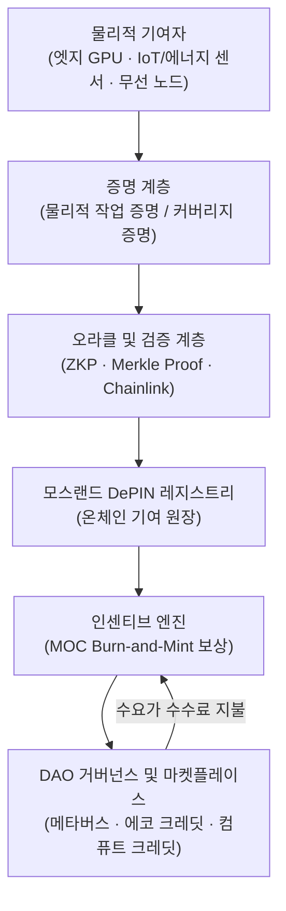

# AI × DePIN: 모스랜드 AI·에너지 시스템을 위한 탈중앙화 물리 인프라

**Author:** Mossland Lab  
**Email:** [lab@moss.land](mailto:lab@moss.land)  
**Date of Initial Document Creation:** 2026-07-04  
**Status (2026년 중반 기준):** 연구 제안 / 개념 설계. 아래에서 설명하는 "모스랜드 에너지·컴퓨트 DePIN"은 미래 지향적 설계이며 2026-07 현재 아직 구현되지 않았습니다.  

---

## 초록 (Abstract)
인공지능과 **탈중앙화 물리 인프라 네트워크(Decentralized Physical Infrastructure Networks, DePIN)** — GPU, 센서, 무선 라디오, 에너지 계량기 같은 실물 하드웨어의 배치와 운영을 토큰 인센티브로 크라우드소싱하는 네트워크 — 의 융합은 2020년대 중반을 규정하는 핵심 인프라 주제 중 하나가 되었습니다.  
본 연구는 대표적 DePIN 네트워크(컴퓨트/GPU, 무선/센서, 데이터)의 2026년 현황과 이를 견인하는 폭증하는 AI 컴퓨트 수요를 조망한 뒤, **모스코인(MOC)** 이 검증된 물리적 기여에 보상을 지급하는 **모스랜드 에너지·컴퓨트 DePIN** 을 제안합니다.  
DePIN의 암호학적 **물리적 작업 증명(proof-of-physical-work)** 과 **커버리지 증명(proof-of-coverage)** 프리미티브를 모스랜드의 기존 DigitalTwin·EcoAI·GreenLedger 연구와 결합함으로써, 원시 센서·GPU 기여로부터 온체인으로 검증 가능하고 경제적으로 인센티브화된 인프라에 이르는 일관된 경로를 제시합니다.

---

## 1. 서론 (Introduction)
현대 AI는 물리적 자원에 병목이 걸려 있습니다. 학습·추론을 위한 GPU 컴퓨트, 고품질 실세계 데이터, 그리고 이 둘을 구동하는 에너지가 그것입니다. 역사적으로 이들은 소수의 하이퍼스케일러에 집중되어 왔습니다. DePIN은 이에 대한 대안적 공급 모델을 제시합니다. 단일 사업자가 하향식으로 인프라를 구축하는 대신, 토큰 프로토콜이 분산된 다수에게 하드웨어 배치·운영의 대가를 지급하고 그 물리적 기여를 온체인으로 검증합니다.

2026년 기준 DePIN 부문은 컴퓨트, 무선, 스토리지, 센서, 에너지 하위 범주를 아우르며, Messari 집계로 650개 이상의 프로젝트와 약 **189억 달러**(CoinMarketCap, 2026년 5월)의 합산 추적 토큰 시가총액을 기록합니다. Messari는 도달 가능 시장이 **2028년까지 3.5조 달러**에 이를 수 있다고 전망합니다. 특히 2026년에 이르러 이 부문은 실질적 수익을 창출하는 네트워크와 순수 토큰 발행 스킴을 구분할 만큼 성숙했으며, 분산 컴퓨트와 스토리지가 가장 뚜렷한 최종 사용자 수요를 보이고 있습니다.

모스랜드 생태계에서 AI와 블록체인은 이미 **AI-Driven DAO**, 디지털 트윈 건물 분석, 지속가능 AI 인프라 같은 서비스를 통해 긴밀히 결합되어 있습니다. 본 문서는 한 가지 집중된 질문을 던집니다. *모스랜드는 MOC를 사용해 검증된 물리적 기여 — 에너지, 센서 데이터, 엣지 컴퓨트 — 를 어떻게 자사(first-party) DePIN으로서 인센티브화해야 하는가?* 그 답을 형제 연구에 직접 연결합니다: [DigitalTwin](../DigitalTwin/)(건물·IoT 센서 데이터), [EcoAI](../EcoAI/EcoAI_EN.md)(에너지 최적화), [GreenLedger](../DigitalTwin/GreenLedger/GreenLedger_EN.md)(검증된 에너지/탄소를 토큰화된 에코 크레딧으로).

---

## 2. 시스템 개요 (System Overview)

**모스랜드 에너지·컴퓨트 DePIN** 은 물리적 기여자(엣지 GPU, IoT/에너지 센서, 무선 노드)를, 암호학적으로 증명된 작업에 대해 MOC 기반 보상을 발행하는 검증·인센티브 계층에 연결합니다.

| 모듈 | 설명 | 핵심 기술 |
| ---- | ---- | --------- |
| **1. 물리적 기여자 노드** | 컴퓨트·데이터·커버리지를 공급하는 엣지 GPU, IoT/에너지 센서, 무선 라디오 | NVIDIA 엣지 GPU, LoRaWAN/5G, IoT 계량기 |
| **2. 증명 계층** | 주장된 물리적 작업이 실제로 발생했는지 검증 | 물리적 작업 증명, 커버리지 증명, Proof-of-Spacetime |
| **3. 오라클 및 검증 계층** | 프라이버시를 보존하며 오프체인 증명을 온체인에 연결 | zk-SNARK, Merkle Proof, Chainlink Functions |
| **4. 모스랜드 DePIN 레지스트리** | 노드별 검증된 기여의 불변 원장 | Layer-2 스마트 컨트랙트 (Polygon / Arbitrum) |
| **5. 인센티브 엔진** | 검증된 작업을 burn-and-mint 방식으로 MOC 보상으로 변환 | Burn-and-Mint Equilibrium 토크노믹스 |
| **6. DAO 거버넌스 및 마켓플레이스** | 파라미터를 관리하고 컴퓨트/에코 크레딧을 거래 | MOC / DAO 투표 / Safe Multisig |

---

## 3. 방법론 (Methodology)

### 3.1 AI를 견인하는 DePIN 지형 (2026년 기준)

AI 컴퓨트 수요는 DePIN 범주 전반의 지배적 성장 동인입니다. 2026년 기준으로 검증된 대표 네트워크는 다음과 같습니다:

| 네트워크 | 범주 | 역할 | 2026년 현황 |
| -------- | ---- | ---- | ----------- |
| **io.net** | GPU 컴퓨트 | 학습용 GPU 간 네트워킹으로 분산 GPU 클러스터를 결집 | AI 워크로드를 위한 Solana 네이티브 컴퓨트 계층 |
| **Render** | GPU 렌더링/추론 | 탈중앙 GPU 렌더링; AI 추론용 **Dispersed Compute** 서브넷(2025) | 누적 **6,300만+ 프레임** 처리; NVIDIA H100/B200 운영자 접근 |
| **Akash** | GPU 컴퓨트 | 역경매 방식 "슈퍼클라우드" GPU 마켓플레이스 | H100 시간당 **$1.20–1.80** (AWS **$4.50–5.50** 대비) |
| **Helium** | 무선/센서 | 커버리지 증명을 통한 크라우드소싱 5G + LoRaWAN | 모바일 가입 약 **60만**(2026년 초); 2025 2분기 전송 **2,721 TB**, 전분기比 +138.5% |
| **Grass** | 데이터 | 유휴 대역폭을 AI 학습용 웹 데이터 수집에 활용 | 사용자 **300만+** |
| **Bittensor** | 머신 인텔리전스 | 특화 서브넷의 인센티브 시장 | **128개 서브넷**; dTAO 업그레이드(2025년 2월) |
| **Filecoin** | 스토리지 | 검증 가능한 탈중앙 스토리지 | Proof-of-Replication / Proof-of-Spacetime; 기업 아카이빙 계약 |

DePIN 엣지 추론의 자연스러운 무대인 광의의 엣지 AI 시장은 **2026년 약 300억 달러**로 전망되며, 연평균 약 21.7%의 성장률로 **2033년 1,187억 달러**에 이를 것으로 예측됩니다.

### 3.2 물리적 작업 증명과 커버리지 증명

모든 DePIN의 핵심 기술 과제는 기여자가 주장한 물리적 서비스를 실제로 수행했는지 검증하는 것입니다. 이는 **물리적 작업 증명(Proof-of-Physical-Work, PoPW)** 프리미티브로 해결됩니다:

* **커버리지 증명(PoC):** 무선 노드가 주장한 위치·시간을 실제로 커버함을 검증하는 Helium의 메커니즘.
* **복제 증명 / 시공간 증명(PoRep / PoSt):** 데이터가 고유하게, 그리고 시간에 걸쳐 지속적으로 저장됨을 보이는 Filecoin의 증명.
* **검증된 추론/렌더링 영수증:** 컴퓨트 네트워크가 워크로드가 주장된 하드웨어에서 실행되었음을 증명.

모스랜드의 대응 프리미티브는 **검증된 에너지 증명(Proof-of-Verified-Energy)** 으로, GreenLedger의 AI/IoT 에너지 데이터에 대한 zk 기반 해싱을 토대로 하며, 엣지 GPU 기여를 위한 **엣지 추론 증명(Proof-of-Edge-Inference)** 영수증으로 확장됩니다.

### 3.3 토큰 인센티브 설계 (Burn-and-Mint 플라이휠)

2026년 기준 지배적인 DePIN 인센티브 패턴은 **Burn-and-Mint Equilibrium(BME) 플라이휠**입니다. 기여자는 검증된 공급에 대해 새로 발행된 토큰으로 보상을 받고, 수요 측 사용자는 (법정화폐 표시 이용 크레딧을 통해) 토큰을 소각하여 서비스를 소비합니다. 실질 수요가 늘면 소각 압력이 발행을 상쇄하여, 토큰 가치를 투기가 아닌 실제 유용성에 정렬시킵니다. 모스랜드 인센티브 엔진은 이 패턴을 MOC로 채택합니다. 검증된 물리적 작업은 보상을 발행하고, 모스랜드 컴퓨트·에코 크레딧의 소비는 MOC를 소각합니다.

### 3.4 기여 계층에서의 엣지 추론

원시 GPU 시간을 공급하는 것을 넘어, 모스랜드 엣지 기여자는 데이터를 생성하는 센서 가까이에서 양자화 모델(EcoAI의 INT8 양자화 연구 참조)을 실행하여 **엣지 추론**을 직접 수행할 수 있습니다. 이는 지연과 백홀 에너지를 줄이며, 각 추론 작업은 증명 계층이 온체인 기여 기록으로 변환하는 검증 가능한 영수증을 생성합니다.

---

## 4. 기술 아키텍처 (Technical Architecture)

* **기여 클라이언트:** 작업 + 증명을 패키징하는 엣지 GPU·IoT 게이트웨이 상의 경량 에이전트
* **검증:** 프라이빗 증명을 위한 zk-SNARK 회로; 변조 감지를 위한 Merkle 루트 배칭
* **오라클 브리지:** 오프체인 증명을 Layer-2 컨트랙트에 커밋하는 Chainlink Functions
* **정산:** Layer-2 (Polygon / Arbitrum) 상의 DePIN 레지스트리 + 인센티브 엔진
* **트레저리 및 거버넌스:** 모스랜드 DAO 통제하의 Safe Multisig 지갑

---

## 5. 블록체인 통합 (Blockchain Integration)

모스랜드 에너지·컴퓨트 DePIN은 **모스코인(MOC)** 경제의 네이티브 확장으로 설계됩니다.

* **정산 자산으로서의 MOC:** 검증된 물리적 기여는 MOC 보상을 발행하고, 모스랜드 컴퓨트·센서 데이터·에코 크레딧의 소비자는 MOC로 지불(및 소각)하여 burn-and-mint 루프를 닫습니다.
* **DAO 거버넌스:** 모스랜드 DAO는 발행 스케줄, 증명 임계값, 보상 곡선을 설정하고 온체인 투표로 레지스트리를 관리하며, 이는 모스랜드 AI-Driven DAO 연구에서 탐구된 거버넌스 패턴을 확장합니다.
* **메타버스 연계:** 모스랜드 메타버스를 렌더링·시뮬레이션하는 동일한 엣지 GPU는 유휴 시 컴퓨트 DePIN에 기여할 수 있어, 잠재 메타버스 인프라를 수익 창출 물리 네트워크로 전환합니다.
* **생태계 간 크레딧:** [GreenLedger](../DigitalTwin/GreenLedger/GreenLedger_EN.md)의 에코 크레딧 토큰(ECT)은 컴퓨트 크레딧에 대응하는 "에너지" 보완재가 되며, 둘 다 DAO 마켓플레이스에서 MOC로 정산됩니다.

---

## 6. 기대 기여 (Expected Contributions)

1. **자사 물리적 공급:** 모스랜드는 하이퍼스케일러에만 의존하지 않고 검증 가능한 MOC 인센티브 기반의 엣지 컴퓨트·에너지 데이터·커버리지에 접근합니다.
2. **검증 가능한 지속가능성:** 검증된 에너지 증명이 [EcoAI](../EcoAI/EcoAI_EN.md) 최적화와 [GreenLedger](../DigitalTwin/GreenLedger/GreenLedger_EN.md) 크레딧을 온체인 증명에 연결합니다.
3. **DePIN으로서의 디지털 트윈 데이터:** [DigitalTwin](../DigitalTwin/) 건물·IoT 센서 스트림이 인센티브화·토큰화된 데이터 네트워크가 됩니다.
4. **정렬된 토크노믹스:** burn-and-mint 설계가 MOC 가치를 발행량만이 아닌 실제 인프라 유용성에 결합합니다.
5. **메타버스-인프라 시너지:** 유휴 메타버스 GPU를 탈중앙 컴퓨트로 수익화합니다.

---

## 7. 결론 (Conclusion)

**AI × DePIN** 은 모스랜드의 물리적 발자국 — 건물, 센서, 엣지 GPU, 에너지 계량기 — 을 조율되고, 암호학적으로 검증 가능하며, MOC로 인센티브화된 네트워크로 재구성합니다. 2026년 DePIN 지형 전반에서 입증된 물리적 작업 증명과 burn-and-mint 패턴을 채택하고 이를 모스랜드의 DigitalTwin·EcoAI·GreenLedger 연구에 결합함으로써, 제안된 **모스랜드 에너지·컴퓨트 DePIN** 은 지속가능한 탈중앙 AI·에너지 인프라로 가는 신뢰할 만한 경로를 제시합니다.

향후 과제로는 엣지 추론 증명 영수증 포맷의 프로토타이핑, GreenLedger의 ZK 에너지 증명을 공유 검증 계층에 통합, 그리고 현실적인 기여자·수요 곡선에 대한 MOC burn-and-mint 파라미터 모델링이 포함됩니다.

---

## 참고문헌 (References)

1. VaaSBlock — [DePIN in 2026: What Is Actually Working (and What Is Not)](https://www.vaasblock.com/news/depin-decentralized-physical-infrastructure-helium-io-net-2026/)
2. KuCoin — [The Top AI DePIN Projects Reshaping Decentralized Infrastructure (2025–2026)](https://www.kucoin.com/blog/top-ai-depin-projects-2025-2026-decentralized-infrastructure)
3. KuCoin — [DePIN Crypto Sector 2026: How Decentralized Physical Infrastructure Surpassed Oracles](https://www.kucoin.com/blog/en-depin-crypto-sector-2026-how-decentralized-physical-infrastructure-surpassed-oracles)
4. Frontiers in Blockchain — [Decentralized Physical Infrastructure Networks (DePIN) Tokenomics](https://www.frontiersin.org/journals/blockchain/articles/10.3389/fbloc.2025.1644115/full)
5. Messari — [State of DePIN 2025 / DePIN Assets](https://messari.io/assets/depin)
6. BlockEden.xyz — [DePIN March 2026 Reality Check: 650+ Projects, ~$19B Market Cap](https://blockeden.xyz/blog/2026/03/21/depin-march-2026-reality-check-650-projects-19b-market-cap-revenue/)
7. Grand View Research — [Edge AI Market Size, Share & Forecast Report, 2026–2033](https://www.grandviewresearch.com/industry-analysis/edge-ai-market-report)
8. MosslandAI Repository — [https://github.com/mossland/MosslandAI](https://github.com/mossland/MosslandAI)
