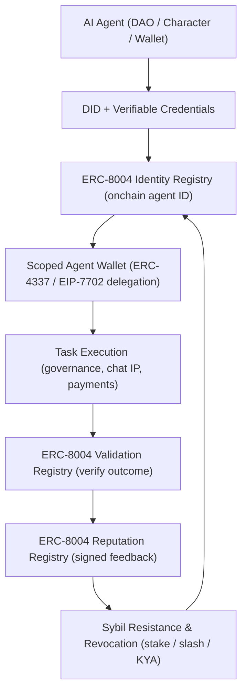

# AgentIdentity: Onchain AI-Agent Identity and Reputation for Mossland

**Author:** Mossland Lab  
**Email:** [lab@moss.land](mailto:lab@moss.land)  
**Date of Initial Document Creation:** 2026-07-04  
**Status (as of 2026-07):** Research proposal / conceptual design. The Mossland-specific registries, wallet scoping, and reputation logic described below are forward-looking design and have not yet been implemented as of 2026-07.  

---

## Abstract
As autonomous AI agents begin to hold assets, execute transactions, and vote inside decentralized ecosystems, the missing primitive is **verifiable onchain identity** — a way to prove *who* (or *what*) an agent is, *what* it is permitted to do, and *how trustworthy* it has been.  
This document proposes **AgentIdentity**, a framework that gives every Mossland AI agent a portable onchain identifier, a set of scoped permissions, and a task-derived reputation, by composing three maturing 2026 standards: **ERC-8004 (Trustless Agents)**, **W3C Decentralized Identifiers (DIDs) and Verifiable Credentials (VCs)**, and account-abstraction delegation (**ERC-4337 / EIP-7702**).  
The result is an identity and reputation layer for Mossland's DAO agents, ownable Character AI personas, and scoped agent wallets that build directly on Mossland's existing gasless ERC-20 work.

---

## 1. Introduction
Through 2025 and into 2026, AI agents matured from chat interfaces into economic actors that own wallets, pay for services, and participate in governance. This shift exposes a structural gap: communication protocols such as Anthropic's **Model Context Protocol (MCP)** and Google's **Agent-to-Agent (A2A)** let agents *talk*, but they do not answer the harder trust questions — how one agent discovers another, prices its counterparty risk, and clears obligations against it without a centralized gatekeeper.

Within Mossland, three services make this gap urgent:
- **DAO AI agents** that summarize proposals and even draft governance actions (see [../AI-DAO-Summarization/](../AI-DAO-Summarization/)) must be attributable and accountable when they act.
- **Character AI chatbot personas** (see [../Character_AI_Chatbot/Character_AI_Chatbot_Platform_Research.md](../Character_AI_Chatbot/Character_AI_Chatbot_Platform_Research.md)) become far more valuable when they are **ownable, Web3-native IP** with a persistent onchain identity rather than rows in a private database.
- **Scoped agent wallets** that transact on a user's behalf need bounded, revocable authority — a natural extension of Mossland's gasless ERC-20 research (see [../erc20-gas-sponsorship-poc/](../erc20-gas-sponsorship-poc/)).

**AgentIdentity** addresses these needs by combining:
- Onchain **agent registration** and discovery (ERC-8004 Identity Registry)
- **Reputation accrual** from completed, verifiable tasks (ERC-8004 Reputation + Validation)
- **Sybil resistance** via staking, proof-of-personhood/agenthood, and slashing
- **Scoped delegation and revocation** through account abstraction

This work pairs naturally with Mossland's agentic-payments research (see [../AgenticPayments/AgenticPayments_EN.md](../AgenticPayments/AgenticPayments_EN.md)): identity answers *who may act*, while payments answer *how value settles*.

---

## 2. System Overview

| Module | Description | Core Technology |
| ------ | ----------- | --------------- |
| **1. Identity Registry** | Assigns each agent a portable, censorship-resistant onchain ID resolving to a registration file of endpoints and capabilities | ERC-8004 Identity (ERC-721 + URIStorage) |
| **2. Credential Layer** | Binds the agent to its owner and its constraints via self-controlled DIDs and issuer-signed VCs ("Know Your Agent") | W3C DID v1.1, Verifiable Credentials |
| **3. Scoped Agent Wallet** | Grants bounded, time-limited, revocable authority for an agent to act for a user | ERC-4337 session keys, EIP-7702 delegation |
| **4. Validation Registry** | Independently verifies an agent's completed work (0–100 outcome) before reputation is granted | ERC-8004 Validation, ZK / stake-secured re-execution |
| **5. Reputation Registry** | Records signed client feedback, scores, tags, and revocation status for portable, composable reputation | ERC-8004 Reputation |
| **6. Sybil & Revocation Guard** | Deters fake agents and revokes bad actors via staking, proof-of-personhood, and slashing | Stake/slash, Human Passport-style attestations |

---

## 3. Architecture and Methodology

### 3.1 Agent Registration and Identity
Every Mossland agent is issued a **W3C Decentralized Identifier (DID)** — a self-issued, self-controlled identifier whose public key material proves ownership, requiring no central certificate authority (DID v1.1 reached Candidate Recommendation at the W3C in March 2026). The agent then registers onchain in the **ERC-8004 Identity Registry**, which mints an ERC-721-based handle (with URIStorage) resolving to a registration file describing the agent's endpoints and capabilities.

ERC-8004 ("Trustless Agents"), authored by Marco De Rossi, Davide Crapis, Jordan Ellis, and Erik Reppel, remains a Draft Standards-Track ERC as of 2026, yet its reference registries were **deployed to Ethereum mainnet on 2026-01-29**, with tens of thousands of agents registered in the first weeks — evidence that the identity primitive is already usable in production while standardization continues.

### 3.2 Credentials, Ownership, and "Know Your Agent"
On top of the DID, **Verifiable Credentials (VCs)** — cryptographically signed by an issuer's DID — encode claims about the agent: who owns it, which Mossland DAO authorized it, its spending caps, and its allowed action scopes. This realizes the "**Know Your Agent (KYA)**" pattern highlighted across the 2026 identity literature: linking an agent to its owner, defining its constraints, and establishing clear liability. For Character AI personas, the owner's VC turns a persona into **ownable, transferable Web3-native IP**.

### 3.3 Scoped Delegation via Account Abstraction
An agent should never hold a user's root key. Instead, Mossland uses account abstraction to grant **scoped, revocable authority**:
- **ERC-4337** (final since March 2023) supplies smart-account **session keys** — time-limited, scope-limited signing keys with spending limits and atomic batching, authorized once by the user without exposing the main key.
- **EIP-7702** (activated in Ethereum's Pectra upgrade, May 2025) lets an ordinary externally owned account (EOA) set a delegation pointer to contract code, gaining smart-account features while the private key owner can **change or remove the delegation at any time**.

This directly extends Mossland's gasless ERC-20 research: the same Alchemy Smart Account / Gas Manager pattern that sponsors gas can host the session key that scopes an agent's spend.

### 3.4 Reputation Accrual from Completed Tasks
When an agent completes a task, the outcome is first checked by the **ERC-8004 Validation Registry**, where validator contracts return a 0–100 result using stake-secured re-execution or zero-knowledge proofs. Only validated work feeds the **Reputation Registry**, where clients submit signed ratings; the chain stores scores, tags, and revocation status while detailed evidence is referenced off-chain for composability. Reputation is therefore **earned, portable, and hard to forge**.

### 3.5 Sybil Resistance and Revocation
Because minting agents is cheap, AgentIdentity layers Sybil defenses:
- **Staking + slashing:** to vouch for or register an agent, a party stakes MOC; misbehavior burns the stake.
- **Proof-of-personhood / proof-of-agenthood:** owner uniqueness is attested (e.g., Human Passport-style stamps secured over $512M in capital flow across 120+ projects as of March 2026), extended toward verifying the legitimacy of the AI entity itself.
- **Revocation:** an owner can revoke a DID, flip an agent's revocation flag in the Reputation Registry, or remove an EIP-7702 delegation — instantly cutting off a compromised agent.

| Property | Mechanism | Failure Handling |
| -------- | --------- | ---------------- |
| Identity | ERC-8004 Identity Registry + DID | Re-issue DID; deregister handle |
| Authorization | ERC-4337 session key / EIP-7702 delegation | Revoke delegation instantly |
| Reputation | ERC-8004 Reputation + Validation | Flip revocation flag; discount score |
| Sybil resistance | MOC stake + proof-of-agenthood | Slash stake; blacklist owner DID |

---

## 4. Blockchain Integration (Mossland Ecosystem)

AgentIdentity is designed to run natively on Mossland's blockchain and **MossCoin (MOC)** economy:

- **MOC as the trust bond:** Registration, staking, and validation deposits are denominated in MOC. Honest agents earn; dishonest agents are slashed, tying reputation to real economic weight.
- **DAO governance:** Each AI agent operating in Mossland DAO workflows (proposal summarization, drafting, voting assistance) carries an onchain identity and a reputation score, so the DAO can weight, rate-limit, or suspend agents by their track record — a concrete upgrade to the [AI-DAO Summarization](../AI-DAO-Summarization/) research line.
- **Character AI as ownable IP:** A Character persona registered under ERC-8004 with an owner VC becomes a **metaverse-native, tradeable asset** whose interaction history and reputation travel with it, monetizable in MOC (see [Character AI Chatbot Platform Research](../Character_AI_Chatbot/Character_AI_Chatbot_Platform_Research.md)).
- **Scoped agent wallets + gasless UX:** Building on the [ERC-20 gas sponsorship PoC](../erc20-gas-sponsorship-poc/), a user delegates a bounded budget to an agent wallet; the agent transacts gaslessly within scope, and settlement can flow through Mossland's agentic-payments rails (see [AgenticPayments](../AgenticPayments/AgenticPayments_EN.md)).

---

## 5. Expected Contributions

1. **Verifiable agent identity:** Every Mossland AI agent gains a portable, censorship-resistant onchain ID rather than an opaque database record.
2. **Trust from track record:** Reputation is accrued only from independently validated tasks, making it portable and hard to game.
3. **Safe delegation:** Scoped, revocable account-abstraction permissions let agents act for users without custody of root keys.
4. **Sybil-resistant participation:** MOC staking, proof-of-agenthood, and slashing raise the cost of fake agents in DAO and marketplace contexts.
5. **Ownable AI IP:** Character personas become Web3-native, tradeable assets with persistent identity and reputation.
6. **Ecosystem synergy:** Integrates cleanly with Mossland's DAO, gasless ERC-20, and agentic-payments research.

---

## 6. Conclusion

**AgentIdentity** proposes the identity and reputation layer that Mossland's AI agents need as they graduate from assistants into economic actors. By composing **ERC-8004** for onchain identity, reputation, and validation, **W3C DIDs/VCs** for owner-bound credentials, and **ERC-4337 / EIP-7702** for scoped, revocable delegation — all anchored to **MOC** — Mossland can let agents register, earn reputation from real work, resist Sybil attacks, and be revoked when they misbehave.

This turns autonomous agents from an accountability risk into a governable, ownable, and economically aligned part of the Mossland metaverse and DAO.

---

## References

1. Ethereum Improvement Proposals — [ERC-8004: Trustless Agents](https://eips.ethereum.org/EIPS/eip-8004)
2. Forbes — [AI Agents Gain Trust Via Ethereum: ERC-8004 On Mainnet (2026-02-05)](https://www.forbes.com/sites/digital-assets/2026/02/05/ai-agents-gain-trust-via-ethereum-erc-8004-on-mainnet/)
3. QuickNode — [ERC-8004: A Developer's Guide to Trustless AI Agent Identity](https://blog.quicknode.com/erc-8004-a-developers-guide-to-trustless-ai-agent-identity/)
4. W3C — [Decentralized Identifiers (DIDs) v1.1](https://www.w3.org/TR/did-1.1/)
5. arXiv — [AI Agents with Decentralized Identifiers and Verifiable Credentials](https://arxiv.org/abs/2511.02841)
6. ethereum.org — [Pectra: EIP-7702 guidelines](https://ethereum.org/roadmap/pectra/7702/)
7. Turnkey — [Account abstraction on Ethereum: From ERC-4337 to EIP-7702](https://www.turnkey.com/blog/account-abstraction-erc-4337-eip-7702)
8. human.tech — [Human Passport: Proof of Personhood and Sybil Resistance for Web3](https://human.tech/blog/human-passport-proof-of-personhood-and-sybil-resistance-for-web3)
9. Coinbase — [Google Agentic Payments Protocol + x402](https://www.coinbase.com/developer-platform/discover/launches/google_x402)
10. MosslandAI Repository — [https://github.com/mossland/MosslandAI](https://github.com/mossland/MosslandAI)
