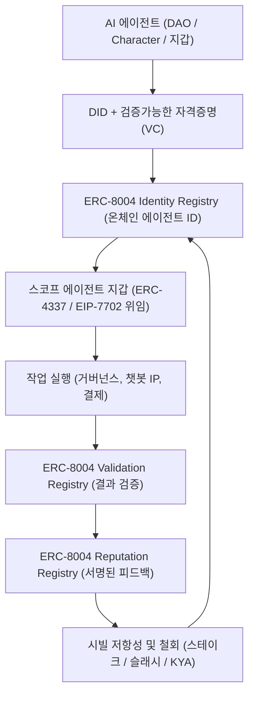

# AgentIdentity: Mossland을 위한 온체인 AI 에이전트 신원 및 평판 체계  
**(AgentIdentity: Onchain AI-Agent Identity and Reputation for Mossland)**

**저자:** Mossland Lab  
**이메일:** [lab@moss.land](mailto:lab@moss.land)  
**문서 최초 작성일:** 2026-07-04  
**상태 (2026-07 기준):** 연구 제안 / 개념 설계. 아래에 기술된 Mossland 전용 레지스트리, 지갑 권한 스코핑, 평판 로직은 향후 설계안이며 2026-07 시점에는 아직 구현되지 않았다.  

---

## 초록 (Abstract)
자율 AI 에이전트가 자산을 보유하고, 트랜잭션을 실행하며, 탈중앙 생태계 안에서 투표까지 하기 시작하면서 가장 결여된 요소는 **검증 가능한 온체인 신원(verifiable onchain identity)** 이다. 즉 에이전트가 *누구/무엇*인지, *무엇을* 할 권한이 있는지, *얼마나* 신뢰할 수 있는지를 증명할 방법이다.  
본 문서는 2026년 성숙 단계에 접어든 세 가지 표준 — **ERC-8004(Trustless Agents)**, **W3C 분산 식별자(DID) 및 검증가능한 자격증명(VC)**, 그리고 계정 추상화 위임(**ERC-4337 / EIP-7702**) — 을 결합하여, 모든 Mossland AI 에이전트에게 이식 가능한 온체인 식별자, 범위가 한정된 권한, 작업 기반 평판을 부여하는 **AgentIdentity** 프레임워크를 제안한다.  
그 결과는 Mossland의 DAO 에이전트, 소유 가능한 Character AI 페르소나, 그리고 기존 가스리스 ERC-20 연구 위에 구축되는 스코프 지갑을 위한 신원·평판 계층이다.

---

## 1. 서론 (Introduction)
2025년을 거쳐 2026년에 이르면서 AI 에이전트는 단순 대화 인터페이스에서 지갑을 소유하고, 서비스 비용을 지불하며, 거버넌스에 참여하는 경제 주체로 진화했다. 이 변화는 구조적 공백을 드러낸다: Anthropic의 **Model Context Protocol(MCP)** 과 Google의 **Agent-to-Agent(A2A)** 같은 통신 프로토콜은 에이전트가 *대화*하게 해주지만, 더 어려운 신뢰 문제 — 한 에이전트가 다른 에이전트를 어떻게 발견하고, 상대방 위험을 어떻게 평가하며, 중앙 게이트키퍼 없이 의무를 어떻게 정산하는가 — 는 답하지 못한다.

Mossland 내부에서 이 공백을 시급하게 만드는 세 가지 서비스가 있다:
- **DAO AI 에이전트** 는 제안을 요약하고 거버넌스 액션 초안까지 작성하는데(참고: [../AI-DAO-Summarization/](../AI-DAO-Summarization/)), 행동 시 귀속과 책임 추적이 가능해야 한다.
- **Character AI 챗봇 페르소나** (참고: [../Character_AI_Chatbot/Character_AI_Chatbot_Platform_Research.md](../Character_AI_Chatbot/Character_AI_Chatbot_Platform_Research.md)) 는 비공개 DB의 한 행이 아니라 지속적 온체인 신원을 가진 **소유 가능한 Web3 네이티브 IP** 가 될 때 훨씬 큰 가치를 가진다.
- **스코프 에이전트 지갑** 은 사용자를 대신해 거래할 때 제한적이고 철회 가능한 권한이 필요하며, 이는 Mossland의 가스리스 ERC-20 연구(참고: [../erc20-gas-sponsorship-poc/](../erc20-gas-sponsorship-poc/))의 자연스러운 확장이다.

**AgentIdentity** 는 다음을 결합하여 이 요구를 해결한다:
- 온체인 **에이전트 등록** 및 발견 (ERC-8004 Identity Registry)
- 완료되고 검증 가능한 작업으로부터의 **평판 축적** (ERC-8004 Reputation + Validation)
- 스테이킹, 인격/에이전트 증명(proof-of-personhood/agenthood), 슬래싱을 통한 **시빌 저항성(Sybil resistance)**
- 계정 추상화를 통한 **범위 한정 위임 및 철회**

본 연구는 Mossland의 에이전틱 결제 연구(참고: [../AgenticPayments/AgenticPayments_KR.md](../AgenticPayments/AgenticPayments_KR.md))와 자연스럽게 짝을 이룬다: 신원은 *누가 행동할 수 있는가* 에 답하고, 결제는 *가치가 어떻게 정산되는가* 에 답한다.

---

## 2. 시스템 개요 (System Overview)

| 모듈 | 설명 | 주요 기술 구성 |
| ---- | ---- | -------------- |
| **1. Identity Registry** | 각 에이전트에 이식 가능하고 검열 저항적인 온체인 ID를 부여하고, 엔드포인트·기능이 담긴 등록 파일로 연결 | ERC-8004 Identity (ERC-721 + URIStorage) |
| **2. Credential Layer** | 자기 통제 DID와 발급자 서명 VC로 에이전트를 소유자·제약조건에 결속("Know Your Agent") | W3C DID v1.1, Verifiable Credentials |
| **3. 스코프 에이전트 지갑** | 사용자를 대신할 제한적·시간한정·철회 가능한 권한 부여 | ERC-4337 세션 키, EIP-7702 위임 |
| **4. Validation Registry** | 평판 부여 전에 에이전트의 완료 작업을 독립적으로 검증(0–100 결과) | ERC-8004 Validation, ZK / 스테이크 기반 재실행 |
| **5. Reputation Registry** | 서명된 클라이언트 피드백·점수·태그·철회 상태를 기록하여 이식·조합 가능한 평판 형성 | ERC-8004 Reputation |
| **6. 시빌·철회 가드** | 스테이킹, 인격 증명, 슬래싱으로 가짜 에이전트를 억제하고 악성 행위자를 철회 | 스테이크/슬래시, Human Passport형 인증 |

---

## 3. 아키텍처 및 방법론 (Architecture and Methodology)

### 3.1 에이전트 등록 및 신원
모든 Mossland 에이전트에는 **W3C 분산 식별자(DID)** 가 발급된다. 이는 공개키 자료로 소유권을 증명하는 자기 발급·자기 통제 식별자로, 중앙 인증기관(CA)이 필요 없다(DID v1.1은 2026년 3월 W3C에서 Candidate Recommendation 단계에 도달). 이후 에이전트는 **ERC-8004 Identity Registry** 에 온체인 등록되며, 이 레지스트리는 에이전트의 엔드포인트와 기능을 기술한 등록 파일로 연결되는 ERC-721 기반 핸들(URIStorage 포함)을 발행한다.

ERC-8004("Trustless Agents")는 Marco De Rossi, Davide Crapis, Jordan Ellis, Erik Reppel이 저술했으며 2026년 기준 여전히 Draft Standards-Track ERC 상태이다. 그러나 참조 레지스트리는 **2026-01-29 이더리움 메인넷에 배포** 되었고 초기 몇 주 만에 수만 개의 에이전트가 등록되었다 — 표준화가 진행되는 동안에도 신원 프리미티브가 이미 프로덕션에서 사용 가능함을 보여준다.

### 3.2 자격증명, 소유권, 그리고 "Know Your Agent"
DID 위에서 **검증가능한 자격증명(VC)** — 발급자 DID로 암호학적으로 서명됨 — 은 에이전트에 관한 주장을 인코딩한다: 소유자가 누구인지, 어느 Mossland DAO가 승인했는지, 지출 한도와 허용 액션 범위는 무엇인지 등. 이는 2026년 신원 문헌 전반에서 강조된 "**Know Your Agent(KYA)**" 패턴 — 에이전트를 소유자와 연결하고, 제약을 정의하며, 명확한 책임을 확립 — 을 실현한다. Character AI 페르소나의 경우, 소유자의 VC는 페르소나를 **소유·양도 가능한 Web3 네이티브 IP** 로 전환한다.

### 3.3 계정 추상화를 통한 범위 한정 위임
에이전트는 절대 사용자의 루트 키를 보유해서는 안 된다. 대신 Mossland는 계정 추상화를 사용해 **범위 한정·철회 가능한 권한** 을 부여한다:
- **ERC-4337** (2023년 3월 Final)은 스마트 계정 **세션 키** 를 제공한다 — 시간·범위가 제한된 서명 키로, 지출 한도와 원자적 배칭을 갖추며 메인 키 노출 없이 사용자가 한 번 승인한다.
- **EIP-7702** (2025년 5월 이더리움 Pectra 업그레이드에서 활성화)는 일반 외부소유계정(EOA)이 컨트랙트 코드를 가리키는 위임 포인터를 설정해 스마트 계정 기능을 얻게 하되, 개인키 소유자는 **언제든 위임을 변경하거나 제거** 할 수 있다.

이는 Mossland의 가스리스 ERC-20 연구를 직접 확장한다: 가스를 스폰서하는 동일한 Alchemy Smart Account / Gas Manager 패턴이 에이전트의 지출을 스코핑하는 세션 키를 호스팅할 수 있다.

### 3.4 완료 작업으로부터의 평판 축적
에이전트가 작업을 완료하면 그 결과는 먼저 **ERC-8004 Validation Registry** 에서 검증되며, 검증자 컨트랙트는 스테이크 기반 재실행 또는 영지식 증명을 사용해 0–100 결과를 반환한다. 검증된 작업만이 **Reputation Registry** 로 전달되어 클라이언트가 서명된 평점을 제출하고, 체인은 점수·태그·철회 상태를 저장하는 한편 상세 근거는 조합성을 위해 오프체인으로 참조한다. 따라서 평판은 **획득되고, 이식 가능하며, 위조하기 어렵다.**

### 3.5 시빌 저항성 및 철회
에이전트 발행 비용이 저렴하기 때문에 AgentIdentity는 시빌 방어를 계층화한다:
- **스테이킹 + 슬래싱:** 에이전트를 보증하거나 등록하려면 MOC를 스테이킹하며, 부정행위 시 스테이크가 소각된다.
- **인격 증명 / 에이전트 증명:** 소유자 유일성을 인증하며(예: Human Passport형 스탬프는 2026년 3월 기준 120개+ 프로젝트에서 $512M 이상의 자본 흐름을 보호), AI 개체 자체의 정당성 검증으로 확장된다.
- **철회:** 소유자는 DID를 폐기하거나, Reputation Registry에서 에이전트의 철회 플래그를 전환하거나, EIP-7702 위임을 제거하여 침해된 에이전트를 즉시 차단할 수 있다.

| 속성 | 메커니즘 | 실패 처리 |
| ---- | -------- | --------- |
| 신원 | ERC-8004 Identity Registry + DID | DID 재발급; 핸들 등록 해제 |
| 권한 부여 | ERC-4337 세션 키 / EIP-7702 위임 | 위임 즉시 철회 |
| 평판 | ERC-8004 Reputation + Validation | 철회 플래그 전환; 점수 할인 |
| 시빌 저항성 | MOC 스테이크 + 에이전트 증명 | 스테이크 슬래시; 소유자 DID 블랙리스트 |

---

## 4. 블록체인 통합 (Mossland 생태계)

AgentIdentity는 Mossland 블록체인과 **MossCoin(MOC)** 경제 위에서 네이티브로 동작하도록 설계된다:

- **신뢰 담보로서의 MOC:** 등록, 스테이킹, 검증 예치금은 MOC로 표시된다. 정직한 에이전트는 보상을 얻고 부정직한 에이전트는 슬래시되어 평판이 실제 경제적 무게에 결속된다.
- **DAO 거버넌스:** Mossland DAO 워크플로(제안 요약, 초안 작성, 투표 보조)에서 동작하는 각 AI 에이전트는 온체인 신원과 평판 점수를 가지므로, DAO는 실적에 따라 에이전트에 가중치를 두거나, 속도를 제한하거나, 정지시킬 수 있다 — [AI-DAO Summarization](../AI-DAO-Summarization/) 연구 라인의 구체적 업그레이드이다.
- **소유 가능한 IP로서의 Character AI:** 소유자 VC와 함께 ERC-8004로 등록된 Character 페르소나는 상호작용 이력과 평판을 함께 지니는 **메타버스 네이티브·거래 가능 자산** 이 되며 MOC로 수익화된다(참고: [Character AI Chatbot Platform Research](../Character_AI_Chatbot/Character_AI_Chatbot_Platform_Research.md)).
- **스코프 에이전트 지갑 + 가스리스 UX:** [ERC-20 가스 스폰서십 PoC](../erc20-gas-sponsorship-poc/) 위에서 사용자는 제한된 예산을 에이전트 지갑에 위임하고, 에이전트는 범위 내에서 가스리스로 거래하며, 정산은 Mossland의 에이전틱 결제 레일을 통해 흐를 수 있다(참고: [AgenticPayments](../AgenticPayments/AgenticPayments_KR.md)).

---

## 5. 기대 기여 (Expected Contributions)

1. **검증 가능한 에이전트 신원:** 모든 Mossland AI 에이전트가 불투명한 DB 레코드가 아니라 이식 가능하고 검열 저항적인 온체인 ID를 갖는다.
2. **실적 기반 신뢰:** 평판은 독립 검증된 작업으로부터만 축적되어 이식 가능하고 조작이 어렵다.
3. **안전한 위임:** 범위 한정·철회 가능한 계정 추상화 권한으로 에이전트가 루트 키 없이 사용자를 대신한다.
4. **시빌 저항적 참여:** MOC 스테이킹, 에이전트 증명, 슬래싱이 DAO·마켓플레이스에서 가짜 에이전트 비용을 높인다.
5. **소유 가능한 AI IP:** Character 페르소나가 지속적 신원·평판을 갖춘 Web3 네이티브·거래 가능 자산이 된다.
6. **생태계 시너지:** Mossland의 DAO, 가스리스 ERC-20, 에이전틱 결제 연구와 깔끔하게 통합된다.

---

## 6. 결론 (Conclusion)

**AgentIdentity** 는 Mossland의 AI 에이전트가 보조 도구에서 경제 주체로 진화함에 따라 필요한 신원·평판 계층을 제안한다. 온체인 신원·평판·검증을 위한 **ERC-8004**, 소유자 결속 자격증명을 위한 **W3C DID/VC**, 범위 한정·철회 가능한 위임을 위한 **ERC-4337 / EIP-7702** 를 결합하고 이 모두를 **MOC** 에 결속함으로써, Mossland는 에이전트가 등록하고, 실제 작업으로 평판을 얻고, 시빌 공격에 저항하며, 부정행위 시 철회될 수 있게 한다.

이는 자율 에이전트를 책임성 리스크에서, 통제 가능하고 소유 가능하며 경제적으로 정렬된 Mossland 메타버스·DAO의 구성원으로 전환한다.

---

## 참고문헌 (References)

1. Ethereum Improvement Proposals — [ERC-8004: Trustless Agents](https://eips.ethereum.org/EIPS/eip-8004)
2. Forbes — [AI Agents Gain Trust Via Ethereum: ERC-8004 On Mainnet (2026-02-05)](https://www.forbes.com/sites/digital-assets/2026/02/05/ai-agents-gain-trust-via-ethereum-erc-8004-on-mainnet/)
3. QuickNode — [ERC-8004: A Developer's Guide to Trustless AI Agent Identity](https://blog.quicknode.com/erc-8004-a-developers-guide-to-trustless-ai-agent-identity/)
4. W3C — [Decentralized Identifiers (DIDs) v1.1](https://www.w3.org/TR/did-1.1/)
5. arXiv — [AI Agents with Decentralized Identifiers and Verifiable Credentials](https://arxiv.org/abs/2511.02841)
6. ethereum.org — [Pectra: EIP-7702 guidelines](https://ethereum.org/roadmap/pectra/7702/)
7. Turnkey — [Account abstraction on Ethereum: From ERC-4337 to EIP-7702](https://www.turnkey.com/blog/account-abstraction-erc-4337-eip-7702)
8. human.tech — [Human Passport: Proof of Personhood and Sybil Resistance for Web3](https://human.tech/blog/human-passport-proof-of-personhood-and-sybil-resistance-for-web3)
9. Coinbase — [Google Agentic Payments Protocol + x402](https://www.coinbase.com/developer-platform/discover/launches/google_x402)
10. MosslandAI Repository — [https://github.com/mossland/MosslandAI](https://github.com/mossland/MosslandAI)
