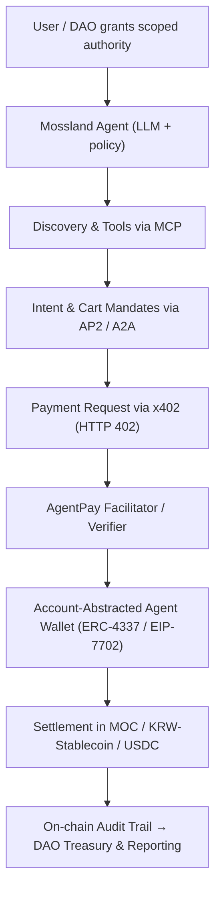

# AgentPay: Autonomous AI-Agent Payments for the Mossland Ecosystem

**Author:** Mossland Lab  
**Email:** [lab@moss.land](mailto:lab@moss.land)  
**Date of Initial Document Creation:** 2026-07-04  
**Status (as of mid-2026):** Research proposal / conceptual design. The Mossland-specific components described below (MOC settlement adapter, KRW-stablecoin rail, DAO agent treasury policy) are forward-looking design and have not yet been implemented as of 2026-07.  

---

## Abstract
As AI agents graduate from answering questions to *acting* — booking, buying, and settling on a user's behalf — they need a native way to move value without a human clicking "Pay." **AgentPay** is Mossland Lab's reference architecture for **autonomous AI-agent payments**, assembling the emerging 2026 agentic-commerce stack: discovery and tool access via **MCP**, intent and authorization via **AP2 / A2A**, onchain payment requests via **x402**, and settlement in **stablecoins** through **account-abstracted agent wallets**. This document maps that stack onto the Mossland ecosystem — settling agent transactions in **MOC/MossCoin** and a **KRW-pegged stablecoin**, reviving Mossland's machine-to-machine (M2M) economy vision, and letting **DAO AI agents** transact under cryptographic, on-chain-auditable mandates.

---

## 1. Introduction
For a decade the web assumed a human at the keyboard: a person reads a page, decides, and authorizes a card charge. Agentic AI breaks that assumption. When an autonomous agent must pay an API for data, tip another agent for a task, or purchase a metaverse asset, the classic checkout flow — accounts, sessions, redirect-based 3-D Secure — is a poor fit for a machine actor operating at millisecond cadence.

Three problems must be solved simultaneously for agents to pay safely (as framed by Google's AP2): **authorization** (proving the user granted the agent authority to spend), **authenticity** (proving a payment request reflects genuine user intent), and **accountability** (establishing who is responsible if something goes wrong). In 2026 a coherent set of open standards has converged to answer these questions, and adoption is real rather than theoretical: as of March 2026, Coinbase's **x402** had processed over 119 million transactions on Base and 35 million on Solana, and Anthropic's **MCP** counted more than 10,000 active public servers.

Mossland is unusually well-positioned to adopt this stack. The ecosystem already couples AI and blockchain across its **AI-Driven DAO**, its metaverse economy, and its **MOC** token utility. AgentPay proposes to make Mossland a place where agents — user agents, service agents, and DAO agents — discover services, negotiate, pay, and settle autonomously, with every step anchored to an auditable on-chain record.

This document cross-references sibling Mossland research: the tool/context layer in [Anthropic's Model Context Protocol](../model-context-protocol/Anthropic_MCP.md), the settlement-currency design in [Stablecoin Research](../Stablecoin_Research/) (in particular the [KRW-Pegged Stablecoin for Mossland](../Stablecoin_Research/KRW_Pegged_Stablecoin_for_Mossland.md)), the gasless-transaction primitive in the [ERC-20 Gas Sponsorship PoC](../erc20-gas-sponsorship-poc/), and the autonomous-agent governance work in [AI-DAO Summarization](../AI-DAO-Summarization/).

---

## 2. System Overview

The agentic-commerce stack layers four open standards. Discovery and capability access happen through **MCP**; intent and human-authorization are captured as cryptographically signed **AP2 mandates** exchanged over **A2A**; the actual pay-per-request handshake uses **x402**'s HTTP 402 flow; and value settles in **stablecoins** from an **account-abstracted agent wallet**.

| Module | Description | Core Technology |
| ------ | ----------- | --------------- |
| **1. Discovery & Tool Layer** | Agents find services, read capabilities, and call tools through a standard interface | Anthropic **MCP** (open standard, donated to the Linux Foundation's Agentic AI Foundation, Dec 2025) |
| **2. Intent & Mandate Layer** | Captures user intent and authorization as tamper-proof signed contracts; routes agent-to-agent messages | Google **AP2** (Intent Mandate + Cart Mandate) over **A2A**; AP2 donated to the FIDO Alliance in 2026 |
| **3. Payment-Request Layer** | Turns any HTTP resource into a pay-per-call endpoint via the 402 status code and payment headers | Coinbase **x402** (X402 Foundation under Linux Foundation, launched Apr 2, 2026); CAIP-2 chain IDs |
| **4. Agent Wallet Layer** | Scoped, time-bound, gas-abstracted signing keys so an agent spends without exposing a master key | **ERC-4337** smart accounts + **EIP-7702** delegation (Pectra, May 2025); session keys |
| **5. Settlement Layer** | Final value transfer in a price-stable unit suitable for machine commerce | **Stablecoins** (USDC via Circle CPN, KRW-pegged stablecoin) and **MOC** for in-ecosystem utility |
| **6. Audit & Governance Layer** | Records mandates, receipts, and spend against DAO-approved policy for accountability | On-chain receipts, Safe multisig treasury, DAO policy contracts |

---

## 3. Architecture and Methodology

### 3.1 Discovery and Tool Access (MCP)
Before an agent can pay for something, it must find it and understand how to use it. MCP standardizes this: tool creators expose **MCP servers** describing their resources, and any MCP-compliant agent can enumerate and invoke them, collapsing the M×N integration problem to M+N. In AgentPay, a Mossland service (a data oracle, an NFT minting endpoint, a metaverse rental) advertises both its capabilities *and* its pricing terms through an MCP server. As of 2026, MCP is supported across ChatGPT, Gemini, Cursor, Microsoft Copilot, and VS Code, making it a safe foundation for interoperable discovery. See [Anthropic's Model Context Protocol](../model-context-protocol/Anthropic_MCP.md) for the protocol details.

### 3.2 Intent, Authorization, and Mandates (AP2 / A2A)
AP2 introduces **Mandates** — cryptographically signed, tamper-proof records of what the user actually authorized. An **Intent Mandate** captures the open-ended request ("rent a virtual billboard under 50,000 KRW for the weekend"); a **Cart Mandate** is signed once the agent has assembled the exact items and final price, guaranteeing "what you see is what you pay for." These mandates travel between agents over the **A2A** protocol. Crucially, AP2 v0.2 added *Human-Not-Present* flows, letting an agent execute a pre-authorized purchase autonomously — the exact capability a DAO treasury agent needs to operate on a schedule.

### 3.3 The Payment Handshake (x402)
x402 revives the long-dormant **HTTP 402 "Payment Required"** status code. When an agent requests a paid resource without payment, the server returns `402` with a `PAYMENT-REQUIRED` header describing the price, network (via CAIP-2 identifiers), and accepted tokens. The agent constructs a signed payment payload, retries with a `PAYMENT-SIGNATURE` header, and a **facilitator** verifies and settles the transfer onchain. x402 is blockchain-agnostic (EVM chains and Solana), charges zero protocol fees, and supports all ERC-20 tokens — which lets AgentPay slot MOC or a KRW-stablecoin in as the settlement asset with no protocol change.

### 3.4 The Agent Wallet (ERC-4337 / EIP-7702)
An autonomous agent must sign transactions without a human, yet must never hold unlimited authority. Account abstraction solves this. **ERC-4337** smart-contract accounts and **EIP-7702** (activated with Ethereum's Pectra upgrade in May 2025) provide **session keys**: scoped, time-bound, spend-capped keys that let an agent transact within strict limits without exposing a master key. Combined with **gas sponsorship**, the agent can transact even holding no native gas token — the pattern prototyped in Mossland's [ERC-20 Gas Sponsorship PoC](../erc20-gas-sponsorship-poc/), which lets a user (or agent) transfer ERC-20 value while a paymaster covers gas.

### 3.5 Settlement (Stablecoins + MOC)
Machine commerce needs a price-stable unit of account. Global on-chain stablecoin volume exceeded **$8.9 trillion in H1 2025**, and by 2026 settlement rails had matured — Visa's stablecoin settlement reached a ~$7B annualized run rate (April 2026) and Circle launched **CPN Managed Payments** for USDC cross-border flows. AgentPay uses stablecoins for value stability while retaining **MOC** for in-ecosystem, utility-native flows (NFT purchases, P2E rewards, metaverse services). For KRW-denominated agent commerce it settles in a **KRW-pegged stablecoin**, drawing directly on the design work in [Stablecoin Research](../Stablecoin_Research/).

---

## 4. Mossland Ecosystem Integration

AgentPay is not a generic wrapper — it is designed to make Mossland's specific assets and community first-class citizens of the agent economy.

- **MOC / MossCoin utility.** Because x402 accepts any ERC-20, MOC becomes a native settlement token for agent-to-agent payments inside Mossland: agents pay MOC for metaverse rentals, NFT mints, and P2E-linked services, deepening MOC's utility beyond human-initiated transactions.
- **KRW-pegged stablecoin rail.** For price-stable, KRW-denominated commerce (the natural unit for much of Mossland's user base), agents settle in the KRW-pegged stablecoin analyzed in [Stablecoin Research](../Stablecoin_Research/KRW_Pegged_Stablecoin_for_Mossland.md), giving agents a low-volatility rail alongside MOC.
- **Reviving the M2M (machine-to-machine) vision.** Mossland's long-standing ambition to connect real and virtual worlds implies a machine economy in which devices, avatars, and services transact autonomously. AgentPay operationalizes that M2M vision with 2026-era standards: IoT devices, metaverse NPCs, and service bots become paying and paid participants.
- **DAO AI agents that transact.** Building on the [AI-DAO Summarization](../AI-DAO-Summarization/) work, a Mossland DAO can delegate a treasury agent scoped authority — via AP2 mandates and EIP-7702 session keys — to subscribe to data feeds, pay contributors, or acquire assets within DAO-approved limits, with every mandate and receipt recorded on-chain for governance review.
- **Gasless agent transactions.** The [ERC-20 Gas Sponsorship PoC](../erc20-gas-sponsorship-poc/) lets agents transact in MOC or stablecoins without holding a native gas balance, removing a key friction for autonomous, high-frequency machine payments.

| Mossland Asset | Role in AgentPay | Settlement Behavior |
| -------------- | ---------------- | ------------------- |
| **MOC / MossCoin** | In-ecosystem utility currency for agents | ERC-20 settlement via x402; gas sponsored by paymaster |
| **KRW-Pegged Stablecoin** | Price-stable rail for KRW-denominated agent commerce | Stablecoin settlement; low volatility |
| **DAO Treasury Agent** | Autonomous spender under DAO policy | AP2 mandates + EIP-7702 session keys, on-chain audit |
| **Metaverse Services / NFTs** | Priced, discoverable agent-purchasable goods | Advertised via MCP; paid via x402 |

---

## 5. Expected Contributions

1. **A concrete agent-payments blueprint for Mossland** — mapping MCP → AP2/A2A → x402 → stablecoin/MOC settlement onto Mossland's existing infrastructure.
2. **Expanded MOC utility** — enabling MOC as a machine-native settlement asset, not only a human-initiated one.
3. **A KRW-stablecoin agent rail** — a low-volatility settlement path for the Korean-language user base, integrated with existing Stablecoin Research.
4. **Autonomous, accountable DAO spending** — cryptographically bounded, on-chain-auditable agent treasuries.
5. **Revival of the M2M machine economy** — turning Mossland's real-and-virtual-world vision into transactable, interoperable agent commerce.

---

## 6. Conclusion

The agentic-commerce stack that crystallized in 2025–2026 — MCP for discovery, AP2/A2A for intent, x402 for the payment handshake, account abstraction for agent wallets, and stablecoins for settlement — turns "an AI that can pay" from a demo into deployable infrastructure. **AgentPay** adapts that stack to Mossland's strengths: MOC as native utility, a KRW-pegged stablecoin for stable value, gasless transactions from prior PoC work, and DAO agents that transact under cryptographic mandate. In doing so it revives Mossland's machine-to-machine vision for an era in which agents, not only humans, are economic actors — and positions the Mossland ecosystem to interoperate with the broader open agentic economy rather than remain a walled garden.

---

## References

1. Coinbase — [Introducing x402: a new standard for internet-native payments](https://www.coinbase.com/developer-platform/discover/launches/x402)
2. Cryptonews — [Coinbase & Linux Foundation Debut x402: HTTP-Native Standard](https://cryptonews.com/news/coinbase-linux-foundation-x402-http-payment-standard/)
3. Google Cloud — [Announcing Agent Payments Protocol (AP2)](https://cloud.google.com/blog/products/ai-machine-learning/announcing-agents-to-payments-ap2-protocol)
4. Google Blog — [Google donates the Agent Payments Protocol to the FIDO Alliance](https://blog.google/products-and-platforms/platforms/google-pay/agent-payments-protocol-fido-alliance/)
5. Linux Foundation — [A2A Protocol Surpasses 150 Organizations in First Year](https://www.linuxfoundation.org/press/a2a-protocol-surpasses-150-organizations-lands-in-major-cloud-platforms-and-sees-enterprise-production-use-in-first-year)
6. Anthropic — [Donating the Model Context Protocol and establishing the Agentic AI Foundation](https://www.anthropic.com/news/donating-the-model-context-protocol-and-establishing-of-the-agentic-ai-foundation)
7. EIP-7702 — [Set Code for EOAs (Ethereum Improvement Proposals)](https://eips.ethereum.org/EIPS/eip-7702)
8. CoinDesk — [Visa expands stablecoin settlement network as volume hits $7 billion run rate](https://www.coindesk.com/business/2026/04/29/visa-expands-stablecoin-settlement-network-as-volume-hits-usd7-billion-run-rate)
9. AlphaPoint — [USDC Stablecoin Payments: The Enterprise Guide to Compliant Settlement in 2026](https://alphapoint.com/blog/usdc-stablecoin-payments-the-enterprise-guide-to-faster-compliant-settlement-in-2026/)
10. MosslandAI Repository — [https://github.com/mossland/MosslandAI](https://github.com/mossland/MosslandAI)
