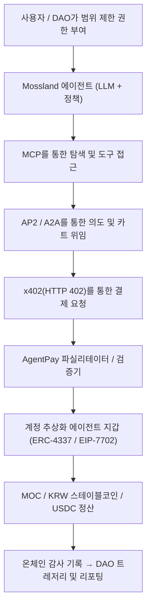

# AgentPay: Mossland 생태계를 위한 자율 AI 에이전트 결제 시스템  
**(AgentPay: Autonomous AI-Agent Payments for the Mossland Ecosystem)**

**저자:** Mossland Lab  
**이메일:** [lab@moss.land](mailto:lab@moss.land)  
**문서 최초 작성일:** 2026-07-04  
**상태 (2026년 중반 기준):** 연구 제안 / 개념 설계. 아래에서 기술하는 Mossland 전용 구성요소(MOC 정산 어댑터, KRW 스테이블코인 레일, DAO 에이전트 트레저리 정책)는 미래 지향적 설계이며 2026-07 기준 아직 구현되지 않았다.  

---

## 초록 (Abstract)
AI 에이전트가 질문에 답하는 단계를 넘어 사용자를 대신해 예약·구매·정산을 *직접 수행*하기 시작하면서, 사람이 "결제" 버튼을 누르지 않고도 가치를 이동시킬 네이티브 수단이 필요해졌다. **AgentPay**는 **자율 AI 에이전트 결제**를 위한 Mossland Lab의 레퍼런스 아키텍처로, 2026년에 부상한 에이전트 커머스 스택을 조합한다: **MCP**를 통한 탐색 및 도구 접근, **AP2 / A2A**를 통한 의도 및 권한 부여, **x402**를 통한 온체인 결제 요청, 그리고 **계정 추상화(account abstraction) 에이전트 지갑**을 통한 **스테이블코인** 정산이다. 본 문서는 이 스택을 Mossland 생태계에 매핑하여, 에이전트 트랜잭션을 **MOC/MossCoin**과 **KRW 연동 스테이블코인**으로 정산하고, Mossland의 사물 간(M2M) 경제 비전을 부활시키며, **DAO AI 에이전트**가 암호학적이고 온체인 감사가 가능한 위임(mandate) 하에 거래하도록 한다.

---

## 1. 서론 (Introduction)
지난 10년간 웹은 키보드 앞의 사람을 전제해 왔다. 사람이 페이지를 읽고, 결정하고, 카드 결제를 승인한다. 에이전트 AI는 이 전제를 깨뜨린다. 자율 에이전트가 데이터를 위해 API에 비용을 지불하거나, 작업의 대가로 다른 에이전트에게 지불하거나, 메타버스 자산을 구매해야 할 때, 계정·세션·리다이렉트 기반 3-D Secure로 이어지는 고전적 결제 흐름은 밀리초 단위로 동작하는 기계 행위자에게 적합하지 않다.

에이전트가 안전하게 결제하려면 (Google의 AP2가 정의한 대로) 세 가지 문제를 동시에 해결해야 한다: **권한 부여(authorization)** — 사용자가 에이전트에게 지출 권한을 부여했음의 증명, **진정성(authenticity)** — 결제 요청이 실제 사용자 의도를 반영함의 증명, **책임성(accountability)** — 문제 발생 시 책임 주체의 확정이다. 2026년에는 이 질문들에 답하기 위한 일관된 오픈 표준 집합이 수렴했고, 그 채택은 이론이 아닌 실제다. 2026년 3월 기준 Coinbase의 **x402**는 Base에서 1억 1,900만 건, Solana에서 3,500만 건 이상의 트랜잭션을 처리했고, Anthropic의 **MCP**는 1만 개 이상의 활성 공개 서버를 기록했다.

Mossland은 이 스택을 채택하기에 매우 유리한 위치에 있다. 이 생태계는 이미 **AI 기반 DAO**, 메타버스 경제, **MOC** 토큰 유틸리티 전반에서 AI와 블록체인을 결합하고 있다. AgentPay는 사용자 에이전트, 서비스 에이전트, DAO 에이전트가 서비스를 탐색하고, 협상하고, 지불하고, 자율적으로 정산하되 모든 단계가 감사 가능한 온체인 기록에 고정되는 곳으로 Mossland을 만드는 것을 목표로 한다.

본 문서는 Mossland의 관련 연구를 상호 참조한다: 도구/컨텍스트 계층인 [Anthropic의 Model Context Protocol](../model-context-protocol/Anthropic_MCP.md), 정산 통화 설계인 [스테이블코인 연구](../Stablecoin_Research/)(특히 [Mossland을 위한 KRW 연동 스테이블코인](../Stablecoin_Research/KRW_Pegged_Stablecoin_for_Mossland.md)), 가스리스 트랜잭션 프리미티브인 [ERC-20 가스 스폰서십 PoC](../erc20-gas-sponsorship-poc/), 그리고 자율 에이전트 거버넌스 연구인 [AI-DAO Summarization](../AI-DAO-Summarization/)이다.

---

## 2. 시스템 개요 (System Overview)

에이전트 커머스 스택은 네 가지 오픈 표준을 계층화한다. 탐색과 역량 접근은 **MCP**를 통해 이루어지고, 의도와 사람의 권한 부여는 암호학적으로 서명된 **AP2 위임(mandate)**으로 포착되어 **A2A**를 통해 교환되며, 실제 요청당 결제 핸드셰이크는 **x402**의 HTTP 402 흐름을 사용하고, 가치는 **계정 추상화 에이전트 지갑**에서 **스테이블코인**으로 정산된다.

| 모듈 | 설명 | 주요 기술 구성 |
| ---- | ---- | -------------- |
| **1. 탐색 및 도구 계층** | 에이전트가 표준 인터페이스로 서비스를 찾고 역량을 읽고 도구를 호출 | Anthropic **MCP** (오픈 표준, 2025년 12월 Linux Foundation의 Agentic AI Foundation에 기부됨) |
| **2. 의도 및 위임 계층** | 사용자 의도와 권한 부여를 위변조 불가 서명 계약으로 포착; 에이전트 간 메시지 라우팅 | Google **AP2** (의도 위임 + 카트 위임) over **A2A**; AP2는 2026년 FIDO Alliance에 기부됨 |
| **3. 결제 요청 계층** | 402 상태 코드와 결제 헤더로 임의의 HTTP 리소스를 호출당 결제 엔드포인트로 전환 | Coinbase **x402** (Linux Foundation 산하 X402 Foundation, 2026-04-02 출범); CAIP-2 체인 ID |
| **4. 에이전트 지갑 계층** | 마스터 키 노출 없이 지출하도록 범위·시간 제한·가스 추상화된 서명 키 | **ERC-4337** 스마트 계정 + **EIP-7702** 위임(Pectra, 2025년 5월); 세션 키 |
| **5. 정산 계층** | 기계 커머스에 적합한 가격 안정 단위로의 최종 가치 이전 | **스테이블코인** (Circle CPN 기반 USDC, KRW 연동 스테이블코인) 및 생태계 내 유틸리티용 **MOC** |
| **6. 감사 및 거버넌스 계층** | 책임성을 위해 DAO 승인 정책 대비 위임·영수증·지출을 기록 | 온체인 영수증, Safe 멀티시그 트레저리, DAO 정책 컨트랙트 |

---

## 3. 아키텍처 및 방법론 (Architecture and Methodology)

### 3.1 탐색 및 도구 접근 (MCP)
에이전트가 무언가에 결제하기 전에, 먼저 그것을 찾고 사용 방법을 이해해야 한다. MCP는 이를 표준화한다. 도구 제작자는 자신의 리소스를 기술하는 **MCP 서버**를 노출하고, MCP 규격을 준수하는 모든 에이전트가 이를 열거하고 호출할 수 있어, M×N 통합 문제를 M+N으로 축소한다. AgentPay에서 Mossland 서비스(데이터 오라클, NFT 민팅 엔드포인트, 메타버스 임대)는 MCP 서버를 통해 자신의 역량 *및* 가격 조건을 광고한다. 2026년 기준 MCP는 ChatGPT, Gemini, Cursor, Microsoft Copilot, VS Code 전반에서 지원되어 상호운용 가능한 탐색의 안전한 기반이 된다. 프로토콜 세부사항은 [Anthropic의 Model Context Protocol](../model-context-protocol/Anthropic_MCP.md)을 참조하라.

### 3.2 의도, 권한 부여, 위임 (AP2 / A2A)
AP2는 **위임(Mandate)** — 사용자가 실제로 승인한 내용에 대한 암호학적으로 서명된 위변조 불가 기록 — 을 도입한다. **의도 위임(Intent Mandate)**은 개방형 요청("주말 동안 5만 원 이하로 가상 광고판을 임대해줘")을 포착하고, **카트 위임(Cart Mandate)**은 에이전트가 정확한 품목과 최종 가격을 구성한 후 서명되어 "보이는 대로 지불한다"를 보장한다. 이 위임들은 **A2A** 프로토콜을 통해 에이전트 간에 전달된다. 결정적으로 AP2 v0.2는 *Human-Not-Present(사람 부재)* 흐름을 추가하여, 에이전트가 사전 승인된 구매를 자율적으로 실행하도록 한다 — 이는 DAO 트레저리 에이전트가 정해진 일정에 따라 작동하는 데 필요한 바로 그 역량이다.

### 3.3 결제 핸드셰이크 (x402)
x402는 오랫동안 잠들어 있던 **HTTP 402 "Payment Required"** 상태 코드를 부활시킨다. 에이전트가 결제 없이 유료 리소스를 요청하면, 서버는 가격, 네트워크(CAIP-2 식별자), 허용 토큰을 기술하는 `PAYMENT-REQUIRED` 헤더와 함께 `402`를 반환한다. 에이전트는 서명된 결제 페이로드를 구성해 `PAYMENT-SIGNATURE` 헤더와 함께 재시도하고, **파실리테이터(facilitator)**가 이체를 검증하고 온체인 정산한다. x402는 블록체인 비종속적(EVM 체인 및 Solana)이며, 프로토콜 수수료가 0이고, 모든 ERC-20 토큰을 지원한다 — 이는 AgentPay가 프로토콜 변경 없이 MOC나 KRW 스테이블코인을 정산 자산으로 끼워 넣을 수 있게 한다.

### 3.4 에이전트 지갑 (ERC-4337 / EIP-7702)
자율 에이전트는 사람 없이 트랜잭션에 서명해야 하지만, 결코 무제한 권한을 가져서는 안 된다. 계정 추상화가 이를 해결한다. **ERC-4337** 스마트 컨트랙트 계정과 **EIP-7702**(2025년 5월 이더리움 Pectra 업그레이드로 활성화)는 **세션 키(session key)**를 제공한다: 범위·시간·지출 상한이 제한된 키로, 마스터 키 노출 없이 엄격한 한도 내에서 에이전트가 거래하게 한다. **가스 스폰서십**과 결합하면 에이전트는 네이티브 가스 토큰을 보유하지 않고도 거래할 수 있다 — 이는 Mossland의 [ERC-20 가스 스폰서십 PoC](../erc20-gas-sponsorship-poc/)에서 프로토타입화한 패턴으로, 페이마스터가 가스를 부담하는 동안 사용자(또는 에이전트)가 ERC-20 가치를 이전하게 한다.

### 3.5 정산 (스테이블코인 + MOC)
기계 커머스에는 가격이 안정적인 계정 단위가 필요하다. 글로벌 온체인 스테이블코인 거래량은 **2025년 상반기에 8.9조 달러**를 초과했고, 2026년까지 정산 레일이 성숙했다 — Visa의 스테이블코인 정산은 연환산 약 70억 달러 규모(2026년 4월)에 도달했고, Circle은 USDC 국경 간 흐름을 위한 **CPN Managed Payments**를 출시했다. AgentPay는 가치 안정성을 위해 스테이블코인을 사용하되, 생태계 내 유틸리티 네이티브 흐름(NFT 구매, P2E 보상, 메타버스 서비스)을 위해 **MOC**를 유지한다. KRW 표시 에이전트 커머스에는 [스테이블코인 연구](../Stablecoin_Research/)의 설계를 직접 활용하여 **KRW 연동 스테이블코인**으로 정산한다.

---

## 4. Mossland 생태계 통합 (Mossland Ecosystem Integration)

AgentPay는 범용 래퍼가 아니라 — Mossland의 고유 자산과 커뮤니티를 에이전트 경제의 일급 시민으로 만들도록 설계되었다.

- **MOC / MossCoin 유틸리티.** x402가 모든 ERC-20을 허용하므로, MOC는 Mossland 내 에이전트 간 결제의 네이티브 정산 토큰이 된다. 에이전트는 메타버스 임대, NFT 민팅, P2E 연동 서비스에 MOC를 지불하며, 사람 주도 트랜잭션을 넘어 MOC 유틸리티를 심화한다.
- **KRW 연동 스테이블코인 레일.** 가격 안정적인 KRW 표시 커머스(Mossland 사용자 기반 상당수의 자연스러운 단위)를 위해, 에이전트는 [스테이블코인 연구](../Stablecoin_Research/KRW_Pegged_Stablecoin_for_Mossland.md)에서 분석한 KRW 연동 스테이블코인으로 정산하여 MOC와 함께 저변동성 레일을 제공한다.
- **M2M(사물 간) 비전의 부활.** 현실과 가상 세계를 연결하려는 Mossland의 오랜 야망은 기기, 아바타, 서비스가 자율적으로 거래하는 기계 경제를 내포한다. AgentPay는 2026년 시대의 표준으로 그 M2M 비전을 실현한다: IoT 기기, 메타버스 NPC, 서비스 봇이 지불하고 지불받는 참여자가 된다.
- **거래하는 DAO AI 에이전트.** [AI-DAO Summarization](../AI-DAO-Summarization/) 연구를 기반으로, Mossland DAO는 트레저리 에이전트에게 — AP2 위임과 EIP-7702 세션 키를 통해 — 범위 제한 권한을 위임하여 DAO 승인 한도 내에서 데이터 피드 구독, 기여자 지불, 자산 취득을 수행하게 하며, 모든 위임과 영수증은 거버넌스 검토를 위해 온체인에 기록된다.
- **가스리스 에이전트 트랜잭션.** [ERC-20 가스 스폰서십 PoC](../erc20-gas-sponsorship-poc/)는 에이전트가 네이티브 가스 잔액을 보유하지 않고도 MOC나 스테이블코인으로 거래하게 하여, 자율적이고 고빈도인 기계 결제의 핵심 마찰을 제거한다.

| Mossland 자산 | AgentPay에서의 역할 | 정산 방식 |
| ------------- | ------------------- | --------- |
| **MOC / MossCoin** | 에이전트용 생태계 내 유틸리티 통화 | x402를 통한 ERC-20 정산; 페이마스터가 가스 부담 |
| **KRW 연동 스테이블코인** | KRW 표시 에이전트 커머스용 가격 안정 레일 | 스테이블코인 정산; 저변동성 |
| **DAO 트레저리 에이전트** | DAO 정책 하의 자율 지출자 | AP2 위임 + EIP-7702 세션 키, 온체인 감사 |
| **메타버스 서비스 / NFT** | 가격이 매겨진, 탐색 가능한 에이전트 구매 대상 재화 | MCP로 광고; x402로 결제 |

---

## 5. 기대 기여 (Expected Contributions)

1. **Mossland을 위한 구체적 에이전트 결제 청사진** — MCP → AP2/A2A → x402 → 스테이블코인/MOC 정산을 Mossland 기존 인프라에 매핑.
2. **MOC 유틸리티 확장** — MOC를 사람 주도가 아닌 기계 네이티브 정산 자산으로 가능하게 함.
3. **KRW 스테이블코인 에이전트 레일** — 기존 스테이블코인 연구와 통합된, 한국어 사용자 기반을 위한 저변동성 정산 경로.
4. **자율적이고 책임 가능한 DAO 지출** — 암호학적으로 한정되고 온체인 감사가 가능한 에이전트 트레저리.
5. **M2M 기계 경제의 부활** — Mossland의 현실·가상 세계 비전을 거래 가능하고 상호운용 가능한 에이전트 커머스로 전환.

---

## 6. 결론 (Conclusion)

2025~2026년에 결정화된 에이전트 커머스 스택 — 탐색을 위한 MCP, 의도를 위한 AP2/A2A, 결제 핸드셰이크를 위한 x402, 에이전트 지갑을 위한 계정 추상화, 정산을 위한 스테이블코인 — 은 "결제할 수 있는 AI"를 데모에서 배포 가능한 인프라로 전환한다. **AgentPay**는 이 스택을 Mossland의 강점에 맞춘다: 네이티브 유틸리티로서의 MOC, 안정적 가치를 위한 KRW 연동 스테이블코인, 이전 PoC 작업에서 나온 가스리스 트랜잭션, 그리고 암호학적 위임 하에 거래하는 DAO 에이전트다. 이를 통해 사람뿐 아니라 에이전트도 경제 행위자가 되는 시대를 위해 Mossland의 사물 간 비전을 부활시키고, Mossland 생태계가 담장 안 정원(walled garden)에 머무르지 않고 더 넓은 개방형 에이전트 경제와 상호운용하도록 자리매김한다.

---

## 참고 문헌 (References)

1. Coinbase — [Introducing x402: a new standard for internet-native payments](https://www.coinbase.com/developer-platform/discover/launches/x402)
2. Cryptonews — [Coinbase & Linux Foundation Debut x402: HTTP-Native Standard](https://cryptonews.com/news/coinbase-linux-foundation-x402-http-payment-standard/)
3. Google Cloud — [Announcing Agent Payments Protocol (AP2)](https://cloud.google.com/blog/products/ai-machine-learning/announcing-agents-to-payments-ap2-protocol)
4. Google Blog — [Google donates the Agent Payments Protocol to the FIDO Alliance](https://blog.google/products-and-platforms/platforms/google-pay/agent-payments-protocol-fido-alliance/)
5. Linux Foundation — [A2A Protocol Surpasses 150 Organizations in First Year](https://www.linuxfoundation.org/press/a2a-protocol-surpasses-150-organizations-lands-in-major-cloud-platforms-and-sees-enterprise-production-use-in-first-year)
6. Anthropic — [Donating the Model Context Protocol and establishing the Agentic AI Foundation](https://www.anthropic.com/news/donating-the-model-context-protocol-and-establishing-of-the-agentic-ai-foundation)
7. EIP-7702 — [Set Code for EOAs (Ethereum Improvement Proposals)](https://eips.ethereum.org/EIPS/eip-7702)
8. CoinDesk — [Visa expands stablecoin settlement network as volume hits $7 billion run rate](https://www.coindesk.com/business/2026/04/29/visa-expands-stablecoin-settlement-network-as-volume-hits-usd7-billion-run-rate)
9. AlphaPoint — [USDC Stablecoin Payments: The Enterprise Guide to Compliant Settlement in 2026](https://alphapoint.com/blog/usdc-stablecoin-payments-the-enterprise-guide-to-faster-compliant-settlement-in-2026/)
10. MosslandAI Repository — [https://github.com/mossland/MosslandAI](https://github.com/mossland/MosslandAI)
