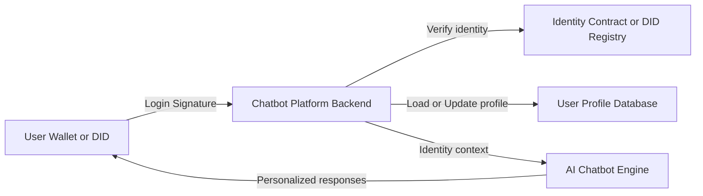
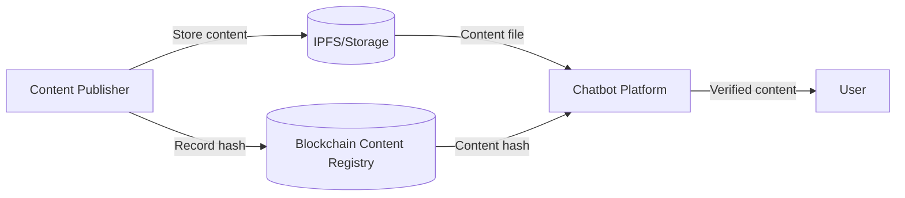
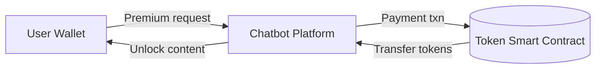
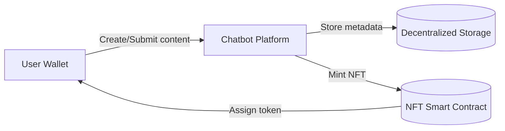
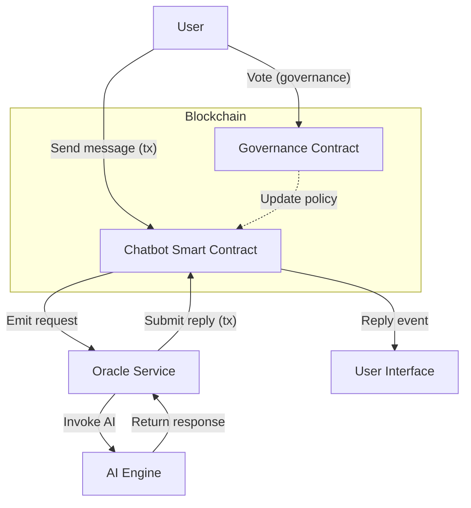

# Innovative Blockchain Integrations for Character AI Chatbot Platforms

- Author: Mossland Lab
- Email: lab@moss.land
- Date of Initial Document Creation: April 15, 2025

As generative AI chatbots become popular in entertainment and education, integrating blockchain can address trust, monetization, and ownership challenges. Blockchain’s decentralized identity and verification capabilities are proving invaluable as AI takes on a bigger role in content creation ([Blockchain and generative AI: A perfect pairing?](https://kpmg.com/us/en/articles/2023/blockchain-artificial-intelligence.html#:~:text=Blockchain%E2%80%99s%20ability%20to%20decentralize%20identity,bigger%20role%20in%20content%20generation)). Below we present several innovative approaches to combining blockchain and cryptocurrency with character AI chatbot platforms, spanning both hybrid (partially centralized) and fully on-chain solutions.

## Idea 1: Decentralized Identity and Reputation Management

**Introduction:** This idea leverages decentralized identity (DID) technology to manage user logins and profiles. Instead of traditional accounts, users authenticate with a crypto wallet or DID, allowing them to own and control their digital identity without relying on a central authority ([AI & Blockchain: Digital Identity 2024](https://www.rapidinnovation.io/post/ai-and-blockchain-fusion-advancing-digital-identity-in-2024#:~:text=The%20concept%20of%20decentralized%20identity,verified%20in%20a%20decentralized%20manner)). This enhances privacy (no centralized storage of personal data) and interoperability, so the same identity can be recognized across multiple chatbot applications. The platform can also issue verifiable credentials or **soulbound** tokens to the user’s blockchain identity as proof of achievements or roles (e.g. a token for completing an educational module), building a portable reputation system.

**Technical Architecture:** The system comprises a user-held identity (wallet/DID), a blockchain identity registry, and the chatbot platform backend:
1. **Decentralized Login:** The user signs a login challenge with their private key (from a crypto wallet or DID app). The chatbot platform backend verifies this signature via a smart contract or DID registry on the blockchain, confirming the user’s identity. ([AI & Blockchain: Digital Identity 2024](https://www.rapidinnovation.io/post/ai-and-blockchain-fusion-advancing-digital-identity-in-2024#:~:text=The%20concept%20of%20decentralized%20identity,verified%20in%20a%20decentralized%20manner))
2. **Profile Linking:** Upon verification, the platform retrieves or initializes the user’s profile. Core identity data (e.g. a user ID or NFT representing the profile) is stored on-chain, while extended profile data (preferences, progress) can be kept off-chain in a database keyed by the user’s DID. This hybrid approach ensures scalability and privacy for detailed data.
3. **Reputation Tokens:** The platform can issue non-transferable reputation tokens to the user’s address for milestones or trust scores. For example, a learner might earn a certificate token after finishing a course, which the chatbot can check on-chain in future sessions to tailor content.
4. **Consistent Persona:** Using the blockchain identity, users maintain a consistent persona across sessions and even across different chatbot applications. No central login is needed, and impersonation is prevented because only the owner of the private key can use the identity ([AI-generated content needs blockchain before trust in digital media collapses](https://cointelegraph.com/news/ai-generated-content-needs-blockchain#:~:text=End,trillion%20by%202032%2C%20securing%20and)).

### Diagrams:

## Idea 2: Verifiable Data Provenance and Content Authenticity

**Introduction:** Ensuring the authenticity of information and media generated by the chatbot is crucial for trust, especially in education or when dealing with facts. In this idea, every important piece of content is registered on a blockchain to provide a tamper-proof origin and history. For example, educational material or storyline assets can be hashed and recorded on-chain, which acts like a digital fingerprint. This approach means AI-generated content can be permanently linked to its source, giving creators proof of origin and consumers a way to validate authenticity ([AI-generated content needs blockchain before trust in digital media collapses](https://cointelegraph.com/news/ai-generated-content-needs-blockchain#:~:text=Blockchain%20can%20authenticate%20digital%20assets,of%20its%20creation%20and%20modification)). It helps combat misinformation by letting the chatbot (and the user) verify that content has not been altered and indeed comes from a trusted source.

**Technical Architecture:** We use a **content registry smart contract** on the blockchain, combined with off-chain storage (for the content itself) and verification logic in the chatbot platform:
1. **Content Registration:** When new authoritative content is created (e.g. a lesson module or a piece of lore in a game), the platform or content creator calculates its hash and stores that hash in a blockchain registry contract. The full content (text, image, etc.) is stored in decentralized storage like IPFS or a secure cloud, with the hash as an identifier.
2. **Authenticity Verification:** When the chatbot needs to present this content to a user, it first retrieves the content from off-chain storage and recomputes its hash. It then queries the blockchain registry to find the expected hash published by the trusted source.
3. **Tamper-Proof Delivery:** If the hashes match, the chatbot knows the content is authentic and unmodified. The content is then delivered to the user with a cryptographic assurance (the platform could display a “verified” badge). Every piece of AI-generated media thus comes with a verifiable on-chain record of its creation, providing a tamper-proof history ([AI-generated content needs blockchain before trust in digital media collapses](https://cointelegraph.com/news/ai-generated-content-needs-blockchain#:~:text=Blockchain%20can%20authenticate%20digital%20assets,of%20its%20creation%20and%20modification)).
4. **User-Generated Content Logging:** For user-specific AI-generated outputs (like a custom story ending or an AI-crafted design), the platform can similarly hash and record these on-chain (possibly as an NFT or just a hash timestamp). This gives the user provable ownership and timestamp for the content, and assures any future viewer that it’s the original version.
5. **Hybrid Storage:** The heavy content remains off-chain (to keep blockchain usage efficient), while the blockchain stores small integrity proofs. In a fully on-chain scenario, critical conversation logs or certificates could be stored or hashed on-chain for auditability. More commonly, the system is hybrid: the chatbot integrates with blockchain for verification, ensuring content integrity without overloading the chain with data.

### Diagrams:

## Idea 3: Tokenized Interaction Economy and Micropayments

**Introduction:** Here we introduce a platform-specific cryptocurrency token to facilitate payments and rewards within the chatbot ecosystem. Users could use tokens to pay for premium features or exclusive content, and conversely earn tokens through engagement (e.g. learning accomplishments or contributing community content). This creates a self-contained economy that incentivizes participation. For instance, a student might earn tokens by completing lessons, then spend those tokens to unlock advanced modules or one-on-one tutoring from a AI-powered character. Similarly, in an entertainment context, players could buy narrative upgrades or tip community bot creators using tokens. Projects like SingularityNET demonstrate this model, where users purchase AI services using a native utility token ([SingularityNET price today, AGIX to USD live price, marketcap and chart | CoinMarketCap](https://coinmarketcap.com/currencies/singularitynet/#:~:text=SingularityNET%20is%20a%20blockchain,accessible%20AI%20marketplace)).

**Technical Architecture:** The token economy is enabled by smart contracts and integrated wallets in a hybrid fashion:
1. **Utility Token Contract:** The platform deploys a token smart contract (e.g. ERC-20 on Ethereum or a sidechain) which defines the total supply and governs transfers. Users obtain the token by purchasing it (fiat on-ramp or crypto exchange) or via rewards for their activity.
2. **User Wallet and Balance:** Each user’s wallet (external or an in-app custodial wallet) holds their token balance. The chatbot client could have a built-in wallet interface, allowing users to manage tokens. When a user initiates a paid interaction (say, asking the chatbot for a detailed personalized story that costs a small fee), the app prepares a transaction.
3. **Payment Flow:** The chatbot platform backend either prompts the user to confirm a blockchain transaction or uses an off-chain microtransaction system that periodically settles on-chain. In a simple on-chain flow, the platform’s backend calls the token smart contract to transfer a required number of tokens from the user’s address to the platform (or creator’s address). This could be done by a direct wallet transaction or via a pre-approved smart contract function. Once the transfer is confirmed on-chain, the premium content is unlocked for the user.
4. **Reward Distribution:** Conversely, when a user earns tokens (for example, completing a quiz successfully in an educational bot), the platform triggers the token contract to mint or transfer reward tokens to the user’s address from a reserve. This transaction is recorded on-chain, transparently showing the reward logic.
5. **Scalability and Settlement:** To handle high-volume interactions (like many small Q&A payments), the system can use a layer-2 network or state channels. The platform might keep an off-chain ledger of token credits and debits for each user and periodically settle the net totals on-chain. This hybrid approach avoids frequent gas fees while still ultimately relying on the blockchain for trust and token custody.
6. **Monetization and Governance:** The token can also double as a governance or profit-sharing mechanism (see Idea 5). For example, holders of the token could vote on platform changes or receive a share of the platform’s revenue, aligning incentives between the users and developers.

### Diagrams:

## Idea 4: NFT-Based Ownership of Characters and Content

**Introduction:** In this idea, non-fungible tokens (NFTs) are used to represent unique characters, assets, or creations from the chatbot platform, enabling true user ownership and a secondary market. For entertainment chatbots, a user might mint their customized AI character or a story as an NFT, proving it’s a one-of-a-kind item they own. In educational scenarios, important achievements or created study notes could be issued as NFT certificates to the user. Putting these items on-chain means ownership is transparent and transferable (if desired), and content creators can get provable credit. For example, an AI-generated character could exist on the blockchain as an NFT so its creator can verify ownership without third-party control ([Alethea AI: Revolutionizing AI Crypto with iNFTs](https://coin360.com/learn/alethea-ai-artificial-liquid-intelligence#:~:text=,relying%20on%20a%20third%20party)). Users could collect rare narrative moments as NFTs, or trade character upgrades in a marketplace, fostering a community economy around the chatbot content.

**Technical Architecture:** The platform integrates an NFT minting service and links it with the chatbot’s content generation:
1. **Asset Definition:** Certain chatbot outputs or user-driven creations are defined as mintable assets. This could include a character profile (the personality configuration of an AI character), an important piece of artwork or dialogue generated by the AI, or a certificate of completion in a learning quest. Each asset, when minted, will have associated metadata (JSON describing the content, image, or attributes) stored off-chain (often on IPFS or a similar decentralized storage) and a unique token ID on-chain.
2. **Minting Process:** When a user decides to “mint” an asset, the chatbot platform prepares the metadata and uploads it to IPFS/storage. The platform then calls an NFT smart contract (following standards like ERC-721 or ERC-1155) to mint a new token pointing to that metadata URI, assigning ownership to the user’s blockchain address. This transaction creates a permanent public record of the item. For example, a teacher bot could mint an NFT diploma for a student upon course completion, or a game bot could mint an NFT of a user's personalized sidekick character.
3. **Ownership and Usage:** Once minted, the NFT is in the user’s wallet. The platform’s backend can detect that token (for example, by reading the user’s wallet on login) and unlock corresponding content: if the user owns a character NFT, the platform could allow them to summon that character in any compatible game or even import it into other supported platforms. Because the ownership is on-chain, the user isn’t tied to one platform—interoperability is possible (the NFT could be used in metaverse worlds or resold). Ownership is provable and not dependent on the chatbot company’s database ([Alethea AI: Revolutionizing AI Crypto with iNFTs](https://coin360.com/learn/alethea-ai-artificial-liquid-intelligence#:~:text=,relying%20on%20a%20third%20party)).
4. **Content Marketplace:** The system can include a marketplace where users buy/sell/trade these NFTs. A smart contract can handle safe trading and even enforce royalties (e.g., a percentage goes back to the original creator on each resale). This way, a popular educational content pack or a beloved character can be monetized by its creator via resale value.
5. **Hybrid Storage and Security:** The actual content (images, model parameters, lengthy text) is stored off-chain (IPFS or cloud) due to size, with the NFT storing a hash or link. The blockchain thus holds the critical ownership and reference, while the heavy lifting of content delivery remains off-chain. To ensure longevity, the metadata could include multiple mirrors or content hashes. If certain NFTs (like diplomas) should not be transferable, they can be made soulbound (non-transferable) tokens – still using blockchain for authenticity but locked to the original owner for trust reasons.

### Diagrams:

## Idea 5: Decentralized Governance and On-Chain Execution

**Introduction:** This idea pushes the platform toward decentralization by involving the community in governance and moving critical logic on-chain. By introducing a governance token or using NFTs as voting shares, the platform’s users can democratically influence development priorities, content guidelines, or feature releases. For example, the community could vote on which new character personas to add (entertainment scenario) or vote to approve trusted contributors’ content updates (educational scenario). Alethea AI’s model is an example that aims to democratize AI ownership and governance using blockchain ([Alethea AI: Revolutionizing AI Crypto with iNFTs](https://coin360.com/learn/alethea-ai-artificial-liquid-intelligence#:~:text=The%20primary%20mission%20of%20Alethea,within%20the%20AI%20crypto%20ecosystem)). In parallel, we can move parts of the chatbot’s operation on-chain for transparency. A fully on-chain chatbot agent would have its state or decision rules in a smart contract, with external oracles supplying AI computation. This means every interaction is recorded on the ledger, and the bot’s behavior is auditable and not solely controlled by a central server. While full on-chain AI execution is challenging with today’s technology, even partial steps (like on-chain moderation logic or content filters, and using oracles for heavy ML tasks) can increase trust and community control.

**Governance Architecture:** The governance layer uses smart contracts (e.g., a DAO contract) to manage proposals and voting:
1. **Governance Token Distribution:** The platform distributes governance tokens (or use the utility token from Idea 3) to stakeholders – for instance, active users, creators, or early backers. Alternatively, each user might get one vote via an NFT membership token. This defines the voting power.
2. **Proposal Creation:** A user with sufficient stake or reputation submits a proposal via the governance smart contract. Proposals could range from changing the token reward rates, to adding a new content category, to adjusting the AI’s parameters (if those are exposed as configurable).
3. **Voting Period:** Token holders cast votes (on-chain transactions to the governance contract) for a certain period. The voting could implement quadratic voting, weight by reputation, or other mechanisms to ensure fairness. The blockchain tallies votes transparently.
4. **Execution of Decisions:** If a proposal passes, the governance contract either executes an on-chain action or issues a signal for off-chain action. On-chain actions might include unlocking a budget (in tokens) for developers or changing a parameter in another smart contract (for example, update a content filter list stored on-chain). Off-chain actions (like retraining an AI model with new data) would be carried out by the team but guided by the recorded vote outcome. The key is that the decision process is transparent and cannot be easily censored or ignored without reputation cost.
5. **Continuous Moderation:** Governance tokens could also let the community curate content: e.g., voting to flag or remove inappropriate user-generated scenarios. This decentralized moderation can complement AI moderation by providing a human-in-the-loop, with all decisions and rationales logged on-chain for accountability.

**On-Chain Chatbot Execution:** In a fully on-chain approach, the chatbot itself (or a simplified version of it) operates via smart contract and oracle:
- The **Chatbot smart contract** would hold the conversation state and a method to request a response for a given user message. When a user sends a message, they actually call this contract (a transaction) with their input.
- An **oracle service** (a trusted off-chain component or a network like Chainlink) listens for these requests. When the contract logs a new message event, the oracle fetches it and sends it to an AI engine (which could be a cloud AI service or a decentralized compute network running an ML model).
- The AI engine generates a reply. The oracle then submits the reply back to the smart contract in another transaction.
- The smart contract records the reply (and possibly emits an event that contains the reply text). The user’s interface picks up the reply from the event or by calling a view function on the contract. This completes one round of interaction.
- Because each message and reply are on-chain, anyone could verify the history or even fork the conversation. The contract could enforce certain rules (for example, refuse to record a reply that contains banned content, if those rules are encoded on-chain or determined by a decentralized filter).
- This setup is censorship-resistant and server-independent: as long as the blockchain and oracle network run, the chatbot can operate. However, it is also slower and incurs transaction costs, so it might be used only for specific high-integrity use cases (like an AI advisor whose advice must be publicly auditable).
- **Hybrid On-Chain AI:** More realistically, a hybrid approach might keep most chatbot operations off-chain but use on-chain logic for crucial checkpoints. For example, an educational chatbot could record final exam answers on-chain (so they can be verified and certified), or a storytelling bot could put major plot choices to a token-holder vote via smart contract. The oracle mechanism can be invoked selectively for those parts.

### Diagrams:

Each of these integration ideas offers a **modular adoption path** – a platform could implement just one or a combination of them. For example, a learning-oriented chatbot might use decentralized identity (Idea 1) and NFTs for certificates (Idea 4), but not fully on-chain chat. On the other hand, a community-driven game bot might emphasize token rewards (Idea 3) and on-chain governance (Idea 5) to let players co-create the experience. By mixing and matching blockchain components, developers can enhance trust, transparency, and user engagement in character AI chatbot platforms in innovative ways. 
