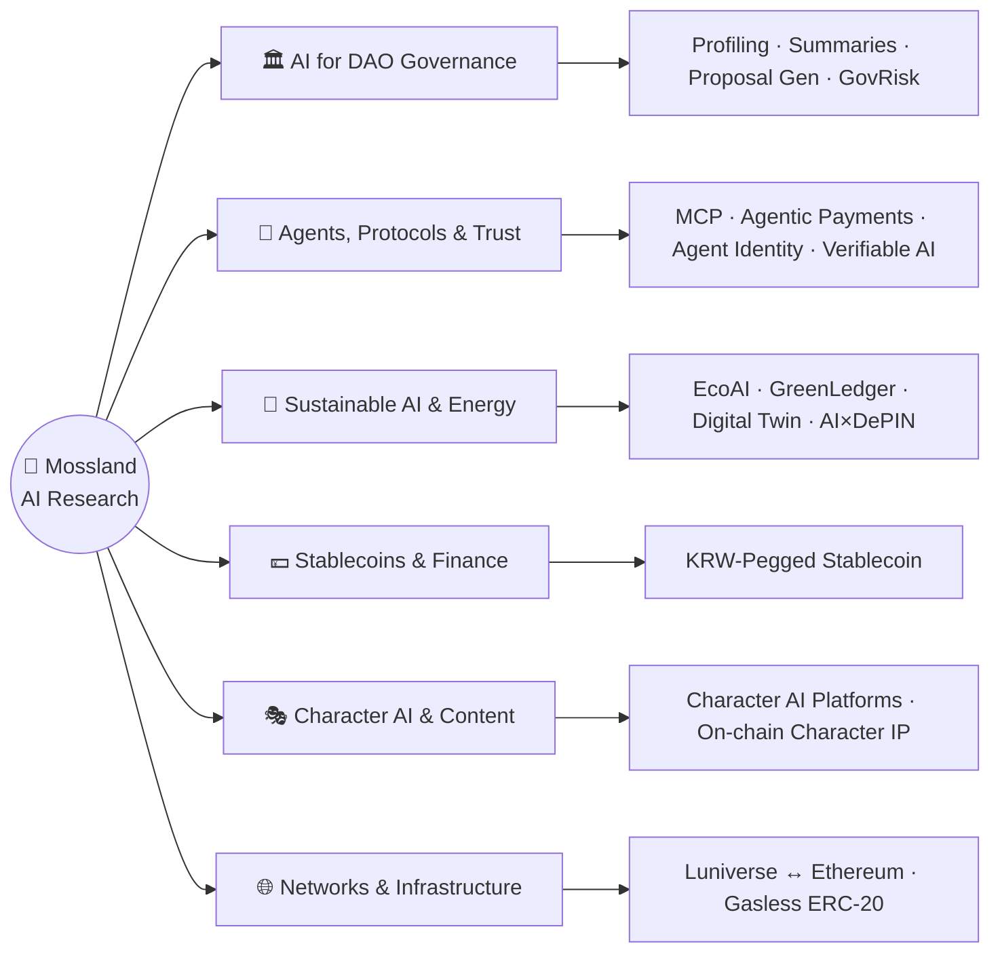

# 🌿 Mossland AI Research

> Research at the intersection of **AI and Web3** — decentralized governance, autonomous agents, sustainable infrastructure, and the token economy of the Mossland ecosystem.

Welcome to the **Mossland AI Research** repository. As of mid-2026, our work spans six pillars — from AI tooling for DAO governance and autonomous on-chain agents, to sustainable/green AI, digital twins, stablecoins, character AI, and blockchain network infrastructure. Each study is grounded in the **Mossland ecosystem** (MOC / Mosscoin utility, DAO governance, and the metaverse) and most are published in both **Korean and English**.

---

## 🗺️ Research Map

### ✨ New in 2026

Four new research tracks explore the emerging **agentic** stack — how autonomous AI agents transact, prove their work, and carry identity on-chain:

| New Track | In one line | Docs |
| --- | --- | --- |
| **Agentic Payments** | Autonomous agent payments via MCP × x402/AP2 × stablecoins, settled in MOC | [KR](./AgenticPayments/AgenticPayments_KR.md) · [EN](./AgenticPayments/AgenticPayments_EN.md) |
| **AI × DePIN** | Token-incentivized physical infrastructure for Mossland's AI & energy systems | [KR](./AI-DePIN/AI_DePIN_KR.md) · [EN](./AI-DePIN/AI_DePIN_EN.md) |
| **Verifiable AI** | TEE · zkML · opML · C2PA proofs so on-chain AI outputs are machine-checkable | [KR](./VerifiableAI/VerifiableAI_KR.md) · [EN](./VerifiableAI/VerifiableAI_EN.md) |
| **Onchain Agent Identity** | ERC-8004 identity, reputation & scoped delegation for AI agents | [KR](./AgentIdentity/AgentIdentity_KR.md) · [EN](./AgentIdentity/AgentIdentity_EN.md) |

---

## 🏛️ AI for DAO Governance

AI tooling that makes decentralized governance more legible, participatory, and efficient.

| Topic | Focus | Docs |
| --- | --- | --- |
| **User Profiling & DAO Summary** | Personalized summaries from voting behavior and preferences | [KR](./AI-DAO-Summarization/AI_Based_User_Profiling_DAO_Summary_System.md) · [EN](./AI-DAO-Summarization/AI_Based_User_Profiling_DAO_Summary_System_EN.md) |
| **Recent DAO AI Case Study** | How AI has been integrated into real DAO decision-making | [KR](./AI-DAO-Summarization/Recent_DAO_AI_Case_Study.md) · [EN](./AI-DAO-Summarization/Recent_DAO_AI_Case_Study_EN.md) |
| **User-Centric Proposal Summarization** | Tailored summaries of proposals and forum debate | [Folder](./AI-DAO-Summarization/User_Centric_Summarization_of_DAO_Proposals/) |
| **AI Agent ↔ DAO Interface** | Conversational, adaptive UIs for governance | [Interface](./AI-DAO-Summarization/Optimizing_AI_Agent_DAO_User_Interface.md) · [Use Cases](./AI-DAO-Summarization/Optimizing_AI_Agent_DAO_User_Interface/MosslandAI_AI_DAO_Summarization_Use_Cases.md) |
| **Multi-Document Summarization** | Consolidating on-chain records + community text | [Design](./AI-DAO-Summarization/DAO_Multi_Doc_Summarization_System_Design.md) |
| **DAO User Scenario Flows** | Flow diagrams of AI-driven governance journeys | [Diagrams](./AI-DAO-Summarization/DAO_User_Scenario_Flow_Diagrams.md) |
| **AI Crypto Analyst System** | Automated market/token analysis for DAO participants | [Report](./AI-DAO-Summarization/AI_Based_Cryptocurrency_Analyst_System_Research_Report.md) |
| **AI-Driven Proposal Generation** | Drafting proposals from trends, sentiment & on-chain signals | [System](./AI-DAO-Summarization/AI_Driven_DAO_Proposal_Generation_System.md) |
| **AI-GovRisk** | Predicting proposal risk & success, with improvement suggestions | [KR](./GovernanceRisk/AI-GovRisk_KR.md) · [EN](./GovernanceRisk/AI-GovRisk_EN.md) |

---

## 🤖 AI Agents, Protocols & Trust

The infrastructure for autonomous AI agents — how they connect to tools, pay, prove, and identify themselves.

| Topic | Focus | Docs |
| --- | --- | --- |
| **Model Context Protocol (MCP)** | Open standard connecting AI models to tools, data & context | [Research](./model-context-protocol/Anthropic_MCP.md) |
| **Agentic Payments** ✨ | Autonomous agent payments (MCP × x402/AP2 × stablecoins), settled in MOC | [KR](./AgenticPayments/AgenticPayments_KR.md) · [EN](./AgenticPayments/AgenticPayments_EN.md) |
| **Onchain Agent Identity** ✨ | ERC-8004 identity, reputation & scoped ERC-4337/EIP-7702 delegation | [KR](./AgentIdentity/AgentIdentity_KR.md) · [EN](./AgentIdentity/AgentIdentity_EN.md) |
| **Verifiable AI** ✨ | TEE attestation, zkML/opML proofs & C2PA provenance for on-chain AI | [KR](./VerifiableAI/VerifiableAI_KR.md) · [EN](./VerifiableAI/VerifiableAI_EN.md) |
| **AI Agent ↔ Smart Contracts** | Efficient on-chain query, execution & contract design for agents | [Access](./AI-DAO-Summarization/Optimizing_AI_Agent_Access_to_Blockchain_Smart_Contracts/Optimizing_AI_Agent_Access_to_Blockchain_Smart_Contracts.md) · [Interaction](./AI-DAO-Summarization/Optimizing_AI_Agent_Access_to_Blockchain_Smart_Contracts/Optimizing_AI_Agent_Blockchain_Interaction.md) |

---

## 🌱 Sustainable AI, Digital Twin & Energy

Green AI infrastructure and physical-world systems, tied to verifiable on-chain incentives.

| Topic | Focus | Docs |
| --- | --- | --- |
| **EcoAI** | Energy-optimized, sustainability-aware AI infrastructure (RL scheduling, Green Proof) | [KR](./EcoAI/EcoAI_KR.md) · [EN](./EcoAI/EcoAI_EN.md) |
| **GreenLedger** | Blockchain-verified energy traceability + tokenized Eco Credits (with Aetherion Co.) | [KR](./DigitalTwin/GreenLedger/GreenLedger_KR.md) · [EN](./DigitalTwin/GreenLedger/GreenLedger_EN.md) |
| **Digital Twin & HVAC** | Digital-twin foundations for buildings and energy systems | [Folder](./DigitalTwin/README.md) · [HVAC Primer](./DigitalTwin/commercial-building-hvac-basics-for-digital-twin-engineers.md) |
| **AI × DePIN** ✨ | Token-incentivized physical infrastructure (compute, sensors, energy) for AI | [KR](./AI-DePIN/AI_DePIN_KR.md) · [EN](./AI-DePIN/AI_DePIN_EN.md) |

---

## 💴 Stablecoins & On-Chain Finance

Feasibility, regulation, and design for a KRW-pegged stablecoin in the Mossland economy.

| Topic | Focus | Docs |
| --- | --- | --- |
| **KRW-Pegged Stablecoin** | Structure, Korean/global regulation (as of 2026), and Mossland integration | [Index](./Stablecoin_Research/README.md) · [Design](./Stablecoin_Research/KRW_Pegged_Stablecoin_for_Mossland.md) · [Overview](./Stablecoin_Research/krw-stablecoin-overview.md) · [Applications](./Stablecoin_Research/krw-stablecoin-applications.md) · [Leverage](./Stablecoin_Research/krw-stablecoin-leverage-market.md) · [CBDC vs. SC](./Stablecoin_Research/krw-cbdc-stablecoin-comparison.md) |

---

## 🎭 Character AI & Web3 Content

Persona-driven AI as interactive content, intellectual property, and Web3-native assets.

| Topic | Focus | Docs |
| --- | --- | --- |
| **Character AI Platform Research** | Architecture, ecosystem & future of character-based AI chatbots | [Research](./Character_AI_Chatbot/Character_AI_Chatbot_Platform_Research.md) |
| **On-chain Character AI Integrations** | Decentralized identity, monetization & ownership for character AI | [Ideas](./Character_AI_Chatbot/Innovative_Blockchain_Integration_Ideas_for_Character_AI.md) |

---

## 🌐 Blockchain Networks & Infrastructure

The networks and on-chain plumbing underneath Mossland's applications.

| Topic | Focus | Docs |
| --- | --- | --- |
| **Luniverse ↔ Ethereum** | Luniverse network overview and Ethereum transition considerations | Overview: [KR](./LuniverseNetwork/luniverse-network-overview.md) · [EN](./LuniverseNetwork/luniverse-network-overview_en.md) — Transition: [KR](./LuniverseNetwork/luniverse-ethereum-transition-considerations.md) · [EN](./LuniverseNetwork/luniverse-ethereum-transition-considerations_en.md) |
| **Gasless ERC-20 (Gas Sponsorship PoC)** | Gasless token transfers on Sepolia (Alchemy Account Kit + Gas Manager) | [Overview](./erc20-gas-sponsorship-poc/README.md) · [Env Setup](./erc20-gas-sponsorship-poc/docs/01-erc20-gas-sponsorship-env.md) · [PoC](./erc20-gas-sponsorship-poc/docs/02-erc20-gas-sponsorship-poc.md) |

---

## 🔗 Ecosystem Integration

Cross-cutting threads that tie the research areas together:

- **AI & Metaverse Applications** — innovating user experiences within Mossland's virtual environments.
- **Mosscoin (MOC) Utility Expansion** — AI agents that grow the practical use of MOC, from tokenized AI prompts to agent-settled machine-to-machine payments.
- **Verifiable, Sustainable, Autonomous** — the 2026 agenda: agents that can prove their work (Verifiable AI), pay for it (Agentic Payments), identify themselves (Agent Identity), and run on accountable green infrastructure (EcoAI, GreenLedger, AI × DePIN).

---

## 📚 Previous AI Research Initiatives

A rich history of pioneering projects:

- [MossCoin AI NFT Research](https://github.com/mossland/MossCoin_AI_NFT_Research) — NFT tokenization of AI-generated prompts.
- [MossCoin for Machine](https://github.com/mossland/MossCoinForMachine) — machine-to-machine interactions using Mosscoin.
- [Mossland XR](https://github.com/mossland/MosslandXR) — AI with Extended Reality for immersive metaverse experiences.

---

## 🤝 Get Involved

We welcome contributions from developers, researchers, and enthusiasts passionate about decentralized AI innovation.
For collaboration or inquiries, contact **[lab@moss.land](mailto:lab@moss.land)**.

Let's build the future of decentralized AI together!
