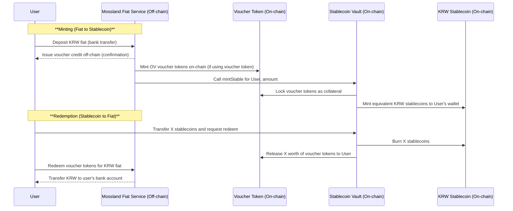
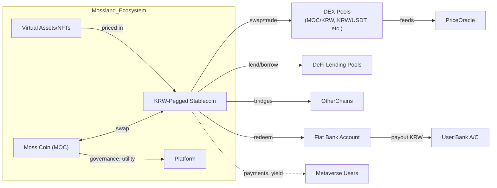

# Designing a KRW-Pegged Stablecoin for Mossland: Insights from KRWO, DeFi Integration, and Regulatory Considerations

- Author: Mossland Lab
- Email: lab@moss.land
- Date of Initial Document Creation: April 24, 2025

## KRWO Stablecoin and GimSwap DApp – Structure and Mechanics

**KRWO Stablecoin Issuance:** KRWO is a Korean Won (KRW)-pegged stablecoin that maintains a 1:1 value with the KRW through full fiat collateralization ([GIM SWAP | KRWO](http://gimswap.com/en#:~:text=%23%23%20KRWO%20is%20a%20KRW,exchanged%201%3A1%20for%20Korean%20Won)). Its issuance is uniquely backed by **Open(Voucher)** gift cards (OV vouchers) provided by Open(Asset) Co., Ltd. Each OV voucher represents a claim on an equivalent amount of KRW in the real world, functioning essentially as a KRW-backed gift certificate. Users obtain OV vouchers by depositing KRW into the Open(Voucher) service (via bank transfer), receiving vouchers of equal face value (e.g. a ₩10,000 deposit yields a ₩10,000 OV voucher) ([What is KRWO? | GimSwap Docs](https://docs.gimswap.com/gimswap-guide/what-is-krwo#:~:text=Open%28Voucher%29%2C%20operated%20by%20Open%28Asset%29%20Co,directly%20into%20their%20bank%20account)). These vouchers can be **redeemed** back for KRW 1:1 at any time, crediting the user’s bank account with the corresponding fiat amount ([What is KRWO? | GimSwap Docs](https://docs.gimswap.com/gimswap-guide/what-is-krwo#:~:text=Open%28Voucher%29%2C%20operated%20by%20Open%28Asset%29%20Co,directly%20into%20their%20bank%20account)). This off-chain voucher system provides the fiat collateral foundation for KRWO.

**Blockchain Integration of Vouchers:** The Open(Voucher) system bridges into the blockchain by converting OV vouchers into **OV tokens** (on-chain representations of the same vouchers) ([What is KRWO? | GimSwap Docs](https://docs.gimswap.com/gimswap-guide/what-is-krwo#:~:text=Integration%20with%20Blockchain)). OV tokens carry the same value as their off-chain counterparts and can move freely on-chain. KRWO stablecoins are then minted by locking these OV tokens in a smart contract. In practice, the conversion rate is fixed (for example, if 10,000 KRW = 1 OV voucher, then 1 OV token can collateralize 10,000 KRWO) ([What is KRWO? | GimSwap Docs](https://docs.gimswap.com/gimswap-guide/what-is-krwo#:~:text=OV%20vouchers%20are%20fully%20compatible,Won%20in%20the%20blockchain%20ecosystem)). **Figure 1** illustrates this issuance flow: a user deposits KRW to receive an OV voucher off-chain, the voucher is tokenized on-chain, and then KRWO is minted against that collateral.

 ([What is KRWO? | GimSwap Docs](https://docs.gimswap.com/gimswap-guide/what-is-krwo)) *Figure 1: KRWO issuance mechanism – KRW cash is converted to an off-chain Open(Voucher), which is tokenized on-chain and locked to mint KRWO stablecoins (1:1 pegged to KRW). The process is fully collateralized, and KRWO can be burned to redeem the underlying voucher, and ultimately fiat KRW, ensuring parity.* ([GIM SWAP | KRWO](http://gimswap.com/en#:~:text=Since%20the%20exchange%20rate%20between,no%20excess%20issuance%20of%20KRWO)) ([What is KRWO? | GimSwap Docs](https://docs.gimswap.com/gimswap-guide/what-is-krwo#:~:text=OV%20vouchers%20are%20fully%20compatible,Won%20in%20the%20blockchain%20ecosystem))

When a user supplies an OV token to the KRWO contract, new KRWO tokens are **minted** and the OV collateral is locked (escrowed) in the contract. Conversely, when a user redeems KRWO, the stablecoin is **burned** and an equivalent OV token is released back to the user ([GIM SWAP | KRWO](http://gimswap.com/en#:~:text=Since%20the%20exchange%20rate%20between,no%20excess%20issuance%20of%20KRWO)). This strict mint/burn mechanism guarantees that every KRWO in circulation is always backed by an equal amount of KRW via the corresponding OV voucher. There is no excess issuance: the supply of KRWO expands and contracts only with deposits or withdrawals of the fiat-backed vouchers ([GIM SWAP | KRWO](http://gimswap.com/en#:~:text=Since%20the%20exchange%20rate%20between,no%20excess%20issuance%20of%20KRWO)). In effect, **KRWO is an asset-backed stablecoin** that bridges real-world currency into Web3, eliminating exchange rate volatility for KRW users ([GIM SWAP | KRWO](http://gimswap.com/en#:~:text=%23%23%20KRWO%20is%20a%20KRW,exchanged%201%3A1%20for%20Korean%20Won)). Holders of KRWO can at any time swap their tokens for OV vouchers (and then redeem those for KRW), ensuring convertibility at par with fiat ([What is KRWO? | GimSwap Docs](https://docs.gimswap.com/gimswap-guide/what-is-krwo#:~:text=,KRW)). This design makes KRWO function as a stable proxy for Korean Won in the blockchain ecosystem.

**GimSwap DApp and DeFi Services:** GimSwap is the decentralized application that facilitates KRWO’s on-chain operations and provides a suite of DeFi services around the stablecoin. At its core, GimSwap operates as an **automated market maker (AMM) decentralized exchange (DEX)** for swapping KRWO and other tokens. It offers a “Get KRWO” on-ramp feature, liquidity pools, and integration with the Open(Voucher) service:
- *On-Ramp Integration:* GimSwap’s **Get KRWO** interface streamlines the process of obtaining KRWO by integrating with Open(Asset)’s voucher service. Users can connect their crypto wallet, initiate a KRW deposit via the Open(Voucher) platform (with a one-time KYC/signup), and upon deposit confirmation, GimSwap automatically swaps the credited OV tokens into KRWO ([How to Get KRWO | GimSwap Docs](https://docs.gimswap.com/gimswap-guide/how-to-get-krwo#:~:text=1,if%20no%20OV%20is%20detected)) ([How to Get KRWO | GimSwap Docs](https://docs.gimswap.com/gimswap-guide/how-to-get-krwo#:~:text=1)). This seamless flow allows anyone with a Korean bank account to mint KRWO directly into their wallet ([GIM SWAP | KRWO](http://gimswap.com/en#:~:text=,Voucher%29%20on%20GimSwap)). For users without local bank access, GimSwap also supports acquiring KRWO purely on-chain via swaps – e.g. using other cryptocurrencies on a DEX to trade for KRWO ([How to Get KRWO | GimSwap Docs](https://docs.gimswap.com/gimswap-guide/how-to-get-krwo#:~:text=Obtain%20KRWO%20via%20DEX)).
- *Swaps and Liquidity Pools:* Once issued, KRWO can be freely traded on GimSwap and other DEXes. GimSwap has liquidity pools pairing KRWO with assets like **KLAY (Klaytn’s native coin)** and **USDT (Tether USD)** ([What is Liquidity Pool? | GimSwap Docs](https://docs.gimswap.com/gimswap-guide/what-is-liquidity-pool#:~:text=,a%20variety%20of%20Web3%20services)). These pools enable users to swap between KRWO and other major crypto assets. By providing liquidity (staking KRWO and a counterpart asset in a pool), users facilitate stable trading and **earn a share of trading fees** as rewards ([What is Liquidity Pool? | GimSwap Docs](https://docs.gimswap.com/gimswap-guide/what-is-liquidity-pool#:~:text=Rewards%20for%20Liquid%20Providers)). Notably, significant liquidity in pairs like KLAY-KRWO and KRWO-USDT helps stabilize KRWO’s price on the open market ([What is Liquidity Pool? | GimSwap Docs](https://docs.gimswap.com/gimswap-guide/what-is-liquidity-pool#:~:text=Liquidity%20provision%20plays%20a%20critical,differences%20between%20KRW%20and%20KRWO)). If KRWO’s market price deviates from ₩1, arbitrageurs can trade via these pools to profit from the difference, which in turn pushes the price back toward the peg ([What is Liquidity Pool? | GimSwap Docs](https://docs.gimswap.com/gimswap-guide/what-is-liquidity-pool#:~:text=Arbitrage%20and%20Stability)). For example, if KRWO > 1 KRW on exchanges, arbitrageurs can deposit KRW for OV vouchers, mint KRWO at 1:1, and sell KRWO until the price equilibrates. If KRWO < 1 KRW, they can buy cheap KRWO and redeem for KRW profit, similarly restoring the peg. GimSwap’s pools thus provide the liquidity and market mechanism for KRWO’s **peg stability via arbitrage** ([What is Liquidity Pool? | GimSwap Docs](https://docs.gimswap.com/gimswap-guide/what-is-liquidity-pool#:~:text=Arbitrage%20and%20Stability)).
- *Transparency and Security:* GimSwap’s smart contracts are open-source and were audited (e.g. by CertiK) ([GIM SWAP | KRWO](http://gimswap.com/en#:~:text=and%20Decentralization)) to ensure security and trust. The contracts are immutable, providing transparency in how KRWO is minted and how the DEX operates. Users can verify that the total KRWO supply does not exceed the locked OV collateral on-chain at any time. This trust model – combined with the regulatory compliance of Open(Asset) holding the actual KRW reserves – makes KRWO one of the “safest types of stablecoins” in design ([GIM SWAP | KRWO](http://gimswap.com/en#:~:text=Is%20KRWO%20a%20stablecoin%3F)), avoiding the pitfalls of algorithmic or under-collateralized stablecoins.

**GimSwap DeFi Services Summary:** In summary, GimSwap functions as the bridge between **Web2 (traditional finance)** and **Web3 (DeFi)** for the KRWO stablecoin. It provides the interface to **mint/redeem KRWO** (via Open(Voucher) connectivity) and offers DeFi services like swapping and liquidity provision. Through growing liquidity pools, GimSwap enhances KRWO’s utility across various Web3 services ([What is Liquidity Pool? | GimSwap Docs](https://docs.gimswap.com/gimswap-guide/what-is-liquidity-pool#:~:text=KRWO%20staked%20on%20liquidity%20pools,a%20variety%20of%20Web3%20services)). As more users participate and additional pools are established, KRWO can be integrated into a wider range of decentralized finance applications (yield farming, lending, etc.), all while remaining firmly anchored to its fiat value ([What is Liquidity Pool? | GimSwap Docs](https://docs.gimswap.com/gimswap-guide/what-is-liquidity-pool#:~:text=,a%20variety%20of%20Web3%20services)). This model demonstrates a practical blueprint for fiat-backed stablecoins: a clear collateral backing (gift card vouchers redeemable for fiat), an on-chain issuance and redemption mechanism, and an AMM platform to facilitate usage and maintain stability.

## Regulatory Environment for Stablecoins – South Korea and Global

Issuing a KRW-pegged stablecoin involves navigating complex regulatory landscapes. Mossland (or any issuer) must consider **South Korean laws** as well as global regulations to ensure legal compliance and stability of their stablecoin initiative.

**South Korea’s Regulatory Climate:** As of 2024-2025, South Korea has been actively tightening crypto oversight, especially in the wake of incidents like TerraUSD’s collapse. In July 2023, the National Assembly passed the **Virtual Asset User Protection Act**, establishing rules for crypto custodianship, unfair trading, and giving regulators enforcement powers ([South Korea passes crypto legislation to protect consumers - Ledger Insights - blockchain for enterprise](https://www.ledgerinsights.com/korea-crypto-legislation-protect-consumers/#:~:text=On%20Friday%20South%20Korea%E2%80%99s%20National,into%20force%20in%20July%202024)). While this act focused on exchange and user protections, regulators signaled that **stablecoin issuance and disclosure requirements** would be the next focus ([South Korea passes crypto legislation to protect consumers - Ledger Insights - blockchain for enterprise](https://www.ledgerinsights.com/korea-crypto-legislation-protect-consumers/#:~:text=legislation%20adheres%20to%20the%20principle,tokens%2C%20including%20the%20disclosures%20required)). Indeed, by late 2024 the Financial Services Commission (FSC) was prioritizing stablecoin regulations as a “second stage” of crypto legislation ([South Korea plans to regulate cross-border stablecoin transactions](https://cointelegraph.com/news/south-korea-to-regulate-cross-border-stablecoin-transactions#:~:text=Furthermore%2C%20the%20Financial%20Services%20Commission,Virtual%20Asset%20User%20Protection%20Act)). Notably, the FSC indicated it would first set up a legal framework for **won-pegged stablecoins**, before addressing foreign currency-pegged ones ([South Korea plans to regulate cross-border stablecoin transactions](https://cointelegraph.com/news/south-korea-to-regulate-cross-border-stablecoin-transactions#:~:text=Stablecoin%20regulations%20will%20also%20reportedly,applied%20to%20foreign%20currency%20stablecoins)). This implies Mossland’s KRW stablecoin would squarely fall under upcoming Korean law. We can expect requirements such as: full fiat reserve backing, redemption at par value on demand, regular audits or reporting of reserves, and possibly issuer licensing.

South Korea is also considering applying traditional **foreign exchange regulations** to stablecoin flows ([South Korea plans to regulate cross-border stablecoin transactions](https://cointelegraph.com/news/south-korea-to-regulate-cross-border-stablecoin-transactions#:~:text=South%20Korea%E2%80%99s%20government%20plans%20to,pegged%20stablecoins)). If a KRW-backed stablecoin is used in cross-border transactions, it could trigger FX controls or reporting (to prevent evasion of capital controls). As a result, Mossland might need to design its stablecoin system to restrict or monitor direct fiat-out conversions for non-residents, or comply with any cap on how much KRW can leave the country via stablecoin. Korean regulators are consulting with counterparts in Japan and the EU to align stablecoin rules internationally ([South Korea plans to regulate cross-border stablecoin transactions](https://cointelegraph.com/news/south-korea-to-regulate-cross-border-stablecoin-transactions#:~:text=Furthermore%2C%20the%20Financial%20Services%20Commission,Virtual%20Asset%20User%20Protection%20Act)). It’s worth noting that **currently no explicit law** in Korea bans private KRW stablecoins, and projects like KRWO (OpenAsset) have operated via partnerships, likely under existing e-money or prepaid payment instrument regulations. However, future laws may require the issuer to obtain a license (e.g. as an Electronic Financial Institution or a trust) to hold KRW deposits and issue a token against them. In Japan, for example, after Terra’s collapse the government temporarily banned stablecoin issuance by non-banks in 2022, then allowed issuance in 2023 under a new framework limited to licensed banks and trust companies ([South Korea plans to regulate cross-border stablecoin transactions](https://cointelegraph.com/news/south-korea-to-regulate-cross-border-stablecoin-transactions#:~:text=The%20Japanese%20government%20issued%20rules,it%20%208%20in%202023)). Korea may adopt a similar stance: allowing only regulated financial institutions or specially approved entities to issue KRW stablecoins. Mossland might thus need to partner with a licensed custodian (such as a bank or fintech) or even form a joint venture to meet regulatory requirements, rather than issuing the stablecoin purely as an unregulated tech company.

Other legal considerations in Korea include **AML/KYC compliance** – since converting KRW to a stablecoin could be a channel for money laundering if not controlled, Mossland would need to implement KYC for anyone directly redeeming or minting the stablecoin. The Open(Voucher) model already enforces KYC for KRW deposits; Mossland’s stablecoin would similarly require users to verify identity to load or unload fiat. Consumer protection rules may also mandate clear disclosure that the stablecoin is **not government-issued currency** but a private token redeemable under certain terms, and that it’s not insured by the government (unlike bank deposits). Clarity on the redemption process (timeframe, fees, etc.) would likely be required by regulators to ensure users aren’t misled about the stability or liquidity of the token.

**Global Stablecoin Regulations:** Globally, stablecoins have come under regulatory scrutiny and a patchwork of rules is emerging:
- **United States:** While the US has yet to pass comprehensive stablecoin-specific legislation, regulators strongly emphasize that issuers maintain 100% reserves and robust redemption rights. US regulators (e.g. the President’s Working Group on Financial Markets) have recommended that stablecoin issuers be regulated similar to banks or licensed entities to protect consumers. In practice, major USD stablecoins (USDC, USDT) operate under state money transmitter licenses or trust charters and provide regular attestations of reserves. A Mossland KRW stablecoin serving US users might need to register as a Money Services Business (MSB) and comply with US Treasury/FinCEN rules. Moreover, proposed bills in Congress could require issuers of payment stablecoins to obtain a banking charter or equivalent – an indication of where regulation is heading.
- **European Union:** The EU’s **Markets in Crypto-Assets (MiCA)** regulation (effective 2024) provides one of the most concrete frameworks. Under MiCA, a fiat-pegged stablecoin (called an “e-money token” if pegged to a single currency) can **only be issued by authorized credit institutions or electronic money institutions (EMIs)** ([MiCA Phase 1: ARTs and EMTs (Incl. Stablecoins) Need EU Authorization](https://www.dechert.com/knowledge/onpoint/2024/6/mica-phase-one--issuers-of-arts-and-emts-subject-to-authorizatio.html#:~:text=institutions%20must%20notify%20their%20competent,to%20the%20competent%20supervisory%20authority)). This means a company must be licensed (similar to a bank or e-money issuer) to offer a fiat-backed token in the EU. Issuers must publish a detailed whitepaper disclosing how the token works, the rights of holders, reserve composition, and risks ([MiCA Phase 1: ARTs and EMTs (Incl. Stablecoins) Need EU Authorization](https://www.dechert.com/knowledge/onpoint/2024/6/mica-phase-one--issuers-of-arts-and-emts-subject-to-authorizatio.html#:~:text=,credit%20institutions%29%20to)). They are required to maintain full reserves and holders have a direct claim to redeem at par at any time ([Regulation of E-Money and E-Money Tokens under MiCAR - Deloitte](https://www2.deloitte.com/dl/en/pages/legal/articles/micar-e-geld-token-crypto.html#:~:text=Deloitte%20www2,for%20redemption%20at%20par%20value)). Importantly, interest cannot be paid to stablecoin holders (to prevent them from being investment products rather than payment tools). If Mossland wanted its KRW stablecoin to circulate in the EU, it would likely need to partner with or become an EMI in Europe and comply with these stringent rules. Otherwise, unlicensed stablecoins could be barred from exchanges available in the EU or face other restrictions. (MiCA also imposes extra rules for significant stablecoins that reach large user thresholds, potentially limiting transaction volume if a non-euro stablecoin becomes “too popular” in Europe, to protect monetary sovereignty.)
- **Other Jurisdictions:** Many countries are following similar approaches. **Japan** (as noted) now allows stablecoins under bank or trust supervision. **Singapore** treats stablecoins as digital payment tokens and is developing tailored regulations (likely focusing on capital and liquidity requirements for issuers). **US (state level)**: Some states like New York require a BitLicense or trust charter to issue coins like USD-backed tokens. **Global bodies**: The Financial Stability Board (FSB) has issued recommendations for stablecoins to be subject to prudential supervision, and the BIS has guidelines to ensure stablecoins do not undermine financial stability.

For Mossland, the key legal considerations boil down to:
- **Licensing & Oversight:** Ensure the issuing entity for the KRW stablecoin is appropriately licensed in relevant jurisdictions (or partnered with those who are). In Korea, that could mean complying with forthcoming FSC guidelines or working with a bank. Internationally, it means observing rules like MiCA in the EU and any US requirements.
- **Reserve Management:** The KRW reserves (or equivalent assets backing the stablecoin) should be held in a secure manner – ideally segregated trust accounts – to protect holders. Regular audits or public attestations would be needed to bolster trust.
- **Redemption Rights:** Legally enforceable terms that holders can redeem 1 KRW stablecoin for 1 KRW fiat (perhaps via the voucher system or directly) are crucial. This likely necessitates robust KYC and a compliance program to vet users during redemption, to align with AML laws.
- **Consumer Disclosures:** Clearly informing users of what the stablecoin is and isn’t (not legal tender, subject to certain risks, etc.) as required by law.
- **Cross-Border Use:** If Mossland’s metaverse user base is global, they may need to geo-fence or restrict certain regions unless they comply with local laws there (for example, disallow direct fiat redemption for US persons if not registered in US).

In summary, **Mossland’s path to a KRW-pegged stablecoin must be charted alongside regulators**. The KRWO example shows that it’s feasible by working with a regulated voucher issuer. Looking ahead, Korean authorities are actively developing a framework for stablecoins ([South Korea plans to regulate cross-border stablecoin transactions](https://cointelegraph.com/news/south-korea-to-regulate-cross-border-stablecoin-transactions#:~:text=Stablecoin%20regulations%20will%20also%20reportedly,applied%20to%20foreign%20currency%20stablecoins)), so engaging with them early (possibly via a sandbox or pilot program) could ensure Mossland’s stablecoin is legally sound. Globally, aligning with best practices (100% reserve, transparency, KYC/AML, licensed issuers) will mitigate legal risks and increase acceptance of the stablecoin across exchanges and DeFi platforms.

## Integration of a KRW-Pegged Stablecoin into Mossland’s Metaverse

Mossland’s metaverse is a digital ecosystem blending virtual reality (VR), augmented reality (AR), and NFTs tied to real-world entertainment and properties ([MOSSLAND : HYPER-CONNECTING REAL AND VIRTUAL WORLD](https://www.moss.land/en#:~:text=Mossland%20is%20a%20blockchain,MOC)). Currently, Mossland uses its native Moss Coin (MOC) as the medium of exchange within this world ([MOSSLAND : HYPER-CONNECTING REAL AND VIRTUAL WORLD](https://www.moss.land/en#:~:text=Mossland%20is%20an%20open,games%2C%20and%20participate%20in%20events)). Introducing a KRW-pegged stablecoin into this environment could significantly enhance the platform’s economy by providing a **stable unit of value** for transactions. We examine several integration points and use cases:

**1. Virtual Real Estate Transactions:** In Mossland, users can purchase and trade virtual real estate and location-based NFTs (analogous to a Monopoly/Pokémon GO style real-estate game) ([What is Mossland - CoinCheckup](https://coincheckup.com/coins/moss-coin/about#:~:text=What%20is%20Mossland%20,of%20Monopoly%20and%20Pokemon%20Go)). These assets often have real-world parallels and thus real economic value. Pricing and transacting such assets in a stablecoin pegged to the local currency (KRW) would make the marketplace more accessible and predictable. Sellers and buyers would not need to worry about crypto volatility affecting the value of a property between listing and sale. For example, a virtual building could be listed for **₩100,000** (100k units of the stablecoin) which will reliably represent roughly the same value day to day. In contrast, if it were priced in MOC or ETH, the fiat value could swing widely with market conditions. A KRW stablecoin thereby serves as a stable **quote currency** and **payment currency** for Mossland’s virtual real estate market, much like USD stablecoins are used in NFT marketplaces to denominate prices in dollars.

**2. NFT Marketplace and Virtual Goods:** Beyond land, Mossland features various NFTs (e.g., virtual items, characters, or collectibles like the CyberTHUG Gecko Club NFTs mentioned on the platform ([MOSSLAND : HYPER-CONNECTING REAL AND VIRTUAL WORLD](https://www.moss.land/en#:~:text=2022))). Using the stablecoin for buying/selling these NFTs simplifies the user experience – especially for users more familiar with fiat currency. A user can think, “this rare AR accessory costs ₩5,000” and pay with 5,000 stablecoin units, which feels intuitive. It lowers the mental barrier of converting fiat to an in-game value. Moreover, it enables **straightforward fiat on-ramps**: a user could deposit ₩5,000 via bank transfer, receive 5,000 stablecoin, and purchase an NFT in one go. This is much easier to grok than depositing fiat to buy MOC, then worrying if MOC’s price moved. The stablecoin effectively becomes **digital cash for the metaverse**, enabling commerce of virtual goods with minimal friction.

**3. In-World Services and Microtransactions:** Mossland’s metaverse may host events, games, or services (for example, mini-games where users spend tokens to participate, or AR challenges with entry fees, etc.). A KRW-pegged stablecoin could be the ideal vehicle for these microtransactions:
- **Stability:** For small payments (like ₩100 for a game or ₩500 for an event ticket), stability is crucial – users won’t want to deal with a token that might double or halve in value unexpectedly.
- **Divisibility:** The stablecoin can be made divisible to handle very small denominations of KRW (cents), facilitating **micropayments** that mirror real-world pricing.
- **Reward and Loyalty Systems:** The platform could reward users in stablecoin for certain achievements (if it wants to give real value rewards) or conversely charge stablecoin for premium features. Since it’s fiat-pegged, users can easily comprehend the value of rewards or costs (e.g., a user earns 100 stablecoin for completing a quest – they know it’s roughly ₩100 in value).

**4. DeFi Functions in the Metaverse:** As Mossland grows, it could incorporate DeFi elements that leverage the stablecoin:
   - **Lending/Borrowing:** Users might want to borrow funds against their virtual assets (for instance, take a loan with a virtual property NFT as collateral). A KRW stablecoin would be a logical currency to lend/borrow, as it’s stable. Lenders would be more comfortable providing loans in a currency that won’t fluctuate, and borrowers can repay knowing the amount won’t skyrocket relative to their income. Mossland could partner with or build a lending protocol where MOC or NFT holdings are used as collateral to borrow KRW stablecoins, which can then be spent in the ecosystem or cashed out.
   - **Yield Farming and Staking:** The stablecoin could be deployed in yield-generating DeFi strategies and the yield funneled back to Mossland users. For example, Mossland might integrate a savings account feature – users deposit their KRW stablecoins and earn interest or rewards (perhaps by the system deploying those funds into external DeFi protocols or simply via revenue share from transaction fees). This would be akin to a **metaverse bank account** in KRW stablecoin terms. Any DeFi earnings could be paid in stablecoin or even in MOC as a reward, blending the two tokens’ roles.
   - **Decentralized Exchange within Mossland:** If Mossland has an internal exchange or trading post, liquidity pools involving the stablecoin can enable smooth swaps between MOC and the stablecoin, or between the stablecoin and other partner tokens. This is similar to GimSwap’s approach – by ensuring a liquid MOC/KRW-stable pool, users can convert between speculative token (MOC) and stable token easily. It also allows the **value of MOC to be discovered in KRW terms** organically within the platform (important for users who want to cash out earnings from gameplay, etc.).

**5. Easier Fiat On/Off Ramps for Users:** Perhaps one of the biggest advantages is that a KRW-pegged stablecoin can serve as a **fiat gateway** for Mossland’s ecosystem. New users could enter the metaverse economy by simply purchasing stablecoins with KRW (through a bank transfer or credit card) without needing to understand cryptocurrency volatility. Likewise, when users want to exit, they can redeem the stablecoin for fiat. This makes Mossland’s economy more accessible to mainstream users and not just crypto enthusiasts. Essentially, the stablecoin could reduce the barrier between real money and the metaverse:
   - **Example:** A user who wants to buy a virtual property for ₩50,000 could directly pay ₩50,000 to Mossland (or a partner payment processor) and receive 50,000 units of the stablecoin to their wallet, then execute the purchase. The experience could be as straightforward as an in-app purchase in a traditional game, but powered by crypto under the hood.
   - The stablecoin thus acts as the **transactional currency**, while MOC and other tokens can play more specialized roles (see next section). This two-tier token system can lead to a more robust economy – one token for stability and trade, another for investment, governance, or utility.

Incorporating a KRW-pegged stablecoin into Mossland aligns with the project’s vision of **“hyper-connecting real and virtual worlds”** ([MOSSLAND : HYPER-CONNECTING REAL AND VIRTUAL WORLD](https://www.moss.land/en#:~:text=HYPER)). It literally brings a representation of real-world currency into the virtual world, enabling an integrated economic system that mirrors real life (prices in KRW) while leveraging blockchain benefits (transparency, decentralization, smart contract programmability). By using a stablecoin, Mossland can foster greater trust and participation: users confident that 1 stablecoin will always be 1 KRW are more likely to transact freely and engage in commerce, rather than hold back due to fear of token price crashes.

## Complementing Moss Coin (MOC) with a Stablecoin: Delineating Functional Roles

Moss Coin (MOC) is the existing native token of Mossland’s platform, powering its metaverse economy and representing the value of participation in that ecosystem ([MOSSLAND : HYPER-CONNECTING REAL AND VIRTUAL WORLD](https://www.moss.land/en#:~:text=Mossland%20is%20an%20open,games%2C%20and%20participate%20in%20events)). Introducing a KRW-pegged stablecoin does not aim to replace MOC, but to **complement it by clearly separating the roles of a **utility/governance token** and a **stable transactional currency**. Here’s how the two can coexist and reinforce each other:

- **MOC as a Utility and Governance Token:** MOC’s primary functions can be refined to serve governance, staking, and ecosystem value capture:
  - *Governance:* Mossland has introduced a governance framework (Agora DAO) where the community can vote on proposals ([MOSSLAND : HYPER-CONNECTING REAL AND VIRTUAL WORLD](https://www.moss.land/en#:~:text=Agora)). MOC can be used as the governance token – holders stake MOC to propose or vote on changes (e.g. new features, economic parameters, usage of treasury funds). This gives MOC intrinsic value through decision-making power.
  - *Platform Utility and Access:* MOC could grant certain privileges or access within the metaverse. For instance, holding MOC might be required to create content, mint NFTs, or access premium areas. It can also be a reward token for contributions to the ecosystem (developers in Mossland’s open-source metaverse could be rewarded in MOC for their work). By using MOC this way, its value correlates with the growth and success of the platform (demand rises as more people want those governance and utility rights).
  - *Value Accrual:* If Mossland has revenue streams (like fees from marketplace trades, land sales, etc.), part of those could be used to buy back or distribute MOC to stakers, tying MOC’s value to the platform’s economic activity. This turns MOC into an investment-like token reflecting Mossland’s prosperity, akin to how some metaverse projects use their token (similar to equity or membership shares in the ecosystem).

- **KRW Stablecoin as a Transactional Currency:** The stablecoin, on the other hand, is optimized for *medium of exchange* and *store of value* within the Mossland economy:
  - *Medium of Exchange:* All everyday transactions (buying land, items, tickets, etc.) can be denominated in the stablecoin. This means prices remain stable and understandable. The stablecoin would become the de facto “currency” circulating among users for commerce. Its supply would expand as more fiat flows into Mossland’s economy and contract if users cash out, maintaining a one-to-one backing with KRW at all times.
  - *Store of Value:* Users who earn value in the metaverse (say by selling an NFT or winning a tournament) might want to keep that value without exposure to crypto-market swings. Holding the KRW stablecoin allows them to preserve their earnings in terms of fiat value. They could later decide to convert to MOC or cash out to a bank, but meanwhile their purchasing power in the metaverse is stable. This encourages a healthy economy because users don’t feel pressured to immediately spend or convert for fear of devaluation.
  - *On/Off-Ramp Vehicle:* As described earlier, the stablecoin serves for converting fiat to digital and back. MOC is traded on exchanges and has a floating value; it’s not ideal as a direct fiat gateway (new users might not want to directly buy a volatile token just to participate). The stablecoin fills this role, potentially even integrating with payment processors or exchange listings as a KRW-backed asset.

- **Interplay Between MOC and Stablecoin:** Although their primary roles differ, MOC and the KRW stablecoin will interact within the ecosystem:
  - There can be a **swap pair** (pool) between MOC and the stablecoin on the marketplace or DEX. This provides price discovery for MOC in KRW terms and liquidity for users to easily convert one to the other. For example, if a user wants to speculate or invest, they might convert some stablecoins earned from sales into MOC, hoping MOC’s value will rise with platform adoption. Conversely, a user who wants to exit some position might convert MOC rewards into stablecoin to lock in the fiat value.
  - MOC’s demand might increase **because** of the stablecoin’s presence: A stable currency attracts more users and activity (as explained), and as the economy grows, more users might want MOC for the governance or premium features. Additionally, Mossland could design **incentive schemes** where, say, users who hold MOC get discounted fees when paying in stablecoin, or get a share of stablecoin transaction fees distributed to them. This links the success of the stablecoin (lots of transactions) to rewards for MOC holders, boosting MOC’s utility.
  - **Risk Separation:** If all transactions were in MOC and MOC’s price crashed due to overall crypto market conditions, the Mossland economy would suffer (prices of assets would effectively crash in fiat terms even if their MOC price stayed same). By having the stablecoin, the in-world economy is insulated from crypto market volatility. MOC can fluctuate without immediately disrupting commerce. This separation can increase confidence for participants – they know their day-to-day economic activities (renting land, buying items) aren’t gambling on token price. Meanwhile, those who do want to take on risk for potential upside can hold MOC.
  - **Regulatory Separation:** Another subtle benefit – regulators might consider MOC differently from a stablecoin. MOC might be seen as a utility or even a speculative asset (possibly subject to securities law if heavily investment-like), whereas the stablecoin is more like electronic money. By clearly delineating them, Mossland can more easily manage compliance (e.g. implementing stricter KYC for fiat->stablecoin conversion, but allowing MOC to trade more freely on exchanges within the existing virtual asset regulatory frameworks).

In essence, **MOC and the KRW stablecoin play two complementary roles**: one anchors the economy in real-world value (the stablecoin), and the other drives the ecosystem’s growth and governance (MOC). This is analogous to how some blockchain games and metaverses use dual-token systems (for example, one token for in-game currency and another for governance/rewards). By delineating roles, Mossland can leverage the advantages of both: the stability and user-friendliness of a fiat peg, and the engagement and value-capture of a native crypto token. The result is a more robust economic design: MOC can flourish as the platform grows, without being hampered by the need to be a stable currency, and the stablecoin can be broadly adopted for transactions without users having to worry about governance or speculation.

## Technical Architecture for Implementing the KRW-Pegged Stablecoin

Designing a stablecoin for Mossland involves combining smart contract engineering with robust off-chain infrastructure for collateral management and thoughtful choices of platform for scalability. Below, we propose a technical architecture covering **smart contracts, collateral management, AMM integration, and blockchain selection**, incorporating lessons from KRWO’s model and adapting to Mossland’s needs. We also include diagrams and pseudocode to illustrate key components.

### Smart Contract Design

At the heart of the stablecoin system will be one or more smart contracts governing the token’s issuance, redemption, and overall lifecycle. We can define two primary on-chain tokens:
- **Stablecoin Token Contract (KRWStable):** An ERC-20 (or equivalent standard) token contract representing the KRW-pegged stablecoin (let’s call it KRC, for KRW Coin, in pseudocode). This contract will handle balances and transfers of the stablecoin. It should have controlled mint and burn functions, only callable by authorized parties (e.g. a minter contract or multisig).
- **Collateral Token Contract (VoucherToken):** If using the voucher model, this would represent the on-chain claim to KRW (similar to the OV token). However, Mossland might simplify and not expose a separate voucher token to end users; instead, the fiat collateral could be managed internally. Nonetheless, having an on-chain voucher token adds transparency – it’s an ERC-20 that is minted when fiat is deposited and represents a claim on the underlying KRW reserves. Mossland could partner with a fintech to issue these tokens.

Additionally, a **Stablecoin Vault/Controller Contract** will contain the logic to exchange voucher tokens for stablecoins. In KRWO’s case, this logic ensures 1 voucher token (worth ₩X) mints X stablecoins, and vice versa for burning.

**Key functionalities and design choices:**

- **Minting:** Minting of stablecoins occurs only when there is new collateral. In practice, when a user deposits KRW off-chain, an off-chain service (Mossland’s financial partner) will mint a corresponding VoucherToken on-chain (or update an accounting of reserves). The user (or the service on behalf of the user) then calls the stablecoin Vault contract to swap VoucherToken for the actual stablecoin. Pseudocode for a *controlled mint* might look like:

```javascript
contract StablecoinVault {
    IERC20 public voucherToken;   // reference to collateral token
    Stablecoin public stable;     // reference to stablecoin token
    uint public constant CONVERSION_RATE = 1; // 1 stable per 1 KRW (adjust units as needed)

    // Only authorized minter (e.g., Mossland server via multisig) can call
    function mintStable(address to, uint voucherAmount) external onlyMinter {
        // User (or issuer) should have transferred voucher tokens to this contract before calling
        require(voucherToken.balanceOf(address(this)) >= voucherAmount, "Insufficient collateral");
        uint stableAmount = voucherAmount * CONVERSION_RATE;
        stable.mint(to, stableAmount);  // mint stablecoin to user
    }

    function burnStable(address to, uint stableAmount) external {
        // User sends stableAmount to this contract before calling (or function could pull via transferFrom)
        require(stable.balanceOf(address(this)) >= stableAmount, "No stable to burn");
        uint voucherAmount = stableAmount / CONVERSION_RATE;
        stable.burn(address(this), stableAmount);  // burn the stablecoin from vault
        voucherToken.transfer(to, voucherAmount);  // release collateral back to user
    }
}
```

In this simplified pseudocode, `onlyMinter` would be a modifier restricting access to Mossland’s authorized role (could be a multisig key or another contract that only triggers when fiat arrives). The user flow would be: deposit fiat off-chain -> Mossland triggers `mintStable(user, amount)` after receiving voucher tokens. For redemption: user sends stablecoin to the contract and calls `burnStable` to get voucher tokens, which they can then redeem off-chain for KRW. The `CONVERSION_RATE` here is conceptual; if 1 VoucherToken = ₩10,000 as in KRWO, then the conversion might be `stableAmount = voucherAmount * 10000`. Alternatively, if we define 1 stablecoin = 1 KRW (with appropriate decimals in the ERC-20), then 1 VoucherToken could equal 1 KRW and conversion is 1:1.

- **Direct Fiat Mint/Burn vs Voucher Token:** Depending on Mossland’s approach, the system could bypass issuing a separate voucher token on-chain. Instead, the StablecoinVault could trust an off-chain oracle or signature from the custodian that fiat was deposited. For example, a trusted oracle could call `mintStable(user, amount)` directly with the amount of KRW to mint. The advantage of an explicit VoucherToken (like OV) is transparency – anyone can see the supply of vouchers on-chain and it should equal or exceed the stablecoin supply at all times. It also allows the possibility of trading the voucher token itself on secondary markets or using it in DeFi (though KRWO’s model primarily uses voucher just as backing, not for external use). In Mossland’s case, if the stablecoin is primarily for internal economy, a full voucher token might be overkill, and they could implement a simpler internal accounting for reserves. However, from a decentralization perspective, issuing a collateral token (even if only Mossland can mint/burn it when fiat moves) provides an auditable trail.

- **Pause/Blacklist Functions:** From a security and regulatory standpoint, the stablecoin contract might include features such as the ability to **pause** all transfers or **blacklist** specific addresses (for instance, if required by law to freeze stolen funds or sanctioned users). USDC and USDT have such mechanisms. Implementing them is a trade-off between decentralization and compliance. Given Mossland’s likely need to comply with regulations, it might include a `pause()` and `freeze(address)` function governed by a multisig or an authority contract. This would be used sparingly (e.g., only under court order or emergencies), but is worth mentioning in the design.

- **Upgradability:** Smart contract design should consider upgradability. A stablecoin contract might be long-lived, and upgrading could be risky (imagine accidentally breaking the peg logic). Many projects choose a proxy pattern (like OpenZeppelin’s TransparentUpgradeableProxy) for their token contracts. However, upgradability vs immutability is again a trust trade-off. GimSwap made their contracts immutable ([GIM SWAP | KRWO](http://gimswap.com/en#:~:text=and%20Decentralization)) to boost confidence. Mossland might similarly opt to **make the stablecoin contract immutable once deployed and audited**, to assure users that no one can change the rules (which might introduce bugs or misuse). If upgradability is needed (for bug fixes or new features), it should be tightly controlled and perhaps time-locked with public notice.

- **Gas Efficiency and Precision:** The stablecoin (ERC-20) should probably use a standard 18 decimal places and treat 1 token as 1 KRW. Since KRW has no smaller unit than 1 won, 18 decimals is more than enough precision (it effectively allows fractions of a penny of KRW). This is fine; it matches most ERC-20 interfaces. The contract should also be optimized for frequent transfers (typical ERC-20 transfers are fine). If Mossland expects *very high throughput* of microtransactions (like many small payments in a game), they might later consider an L2 or sidechain to reduce gas (more on that in Blockchain Selection). On mainnet Ethereum, ERC-20 transfers cost gas but are manageable if usage is moderate. Internally, the game could also implement off-chain aggregation of microtx and settle in batches on-chain if needed to optimize.

- **Testing and Auditing:** A thorough test suite (unit tests for mint, burn, edge cases like rounding, pause, etc.) and professional security audit are essential. This stablecoin will hold real value equal to fiat; any flaw could be catastrophic (e.g., an exploit allowing unauthorized minting or stealing collateral). 

In summary, the smart contracts revolve around a **secure mint/burn control**. The pseudocode above outlines the basic logic: only allow mint if collateral present, and only allow burn if corresponding stablecoins are provided. This invariant ensures no unbacked tokens. The actual implementation would include safekeeping measures (like using SafeERC20 library, checks for overflow, etc.). Below is a **Mermaid sequence diagram** illustrating the end-to-end flow of minting and redeeming the stablecoin with both off-chain and on-chain steps:



*Figure 2: Sequence of steps to mint KRW-pegged stablecoin from fiat and redeem back to fiat. Off-chain steps involve Mossland’s banking service or partner exchanging KRW for voucher tokens; on-chain steps involve locking vouchers and minting stablecoins in the StableVault contract. The reverse process burns stablecoins and releases vouchers for fiat redemption. In practice, some steps may be combined or automated via the DApp interface.*

This sequence ensures that at all times, any stablecoin in circulation is matched by an equivalent value in vouchers (and thus fiat) held. The separation of concerns (off-chain bank service vs on-chain token contracts) also means each part can be regulated/secured appropriately – the off-chain part by financial regulations and the on-chain part by code and audits.

### Collateral Management and Reserve Safeguards

Collateral management is critical, as the credibility of a stablecoin rests on the assurance that each token is backed by real assets. For a KRW-pegged coin, the **reserve** will primarily be KRW fiat currency (although potentially could include equivalents like cash-equivalent instruments). Key components of collateral management include: how reserves are held, how they are monitored/audited, and how the system reacts to extreme situations (e.g., surges in redemption).

**Off-Chain Reserve Holding:** In Mossland’s case, likely a **custodial partner** (such as a bank or payment processor in South Korea) will hold the KRW funds. This could be structured as a trust account or safeguarded client account to isolate it from Mossland’s own funds. For example, Mossland could work with a local bank to establish a **“Mossland Stablecoin Reserve Account”**. Every time a user buys stablecoins, their KRW goes into this account (via the OpenVoucher-like service). Every time someone redeems, KRW flows out from this account to the user. The balance of this account should equal (or exceed) total stablecoin in circulation at all times. 

To increase transparency, Mossland can publish the reserve account balance regularly (daily snapshots or real-time API if bank provides). They could also employ an auditing firm to attest to the balances monthly. In some advanced setups, stablecoin issuers have used blockchain **proof-of-reserve** oracles – for instance, an oracle that reads a bank API or uses a zero-knowledge proof from the bank to confirm balances. If Mossland partners with a modern fintech bank, such integration might be possible to automate proofs that the fiat is indeed there. However, even a simpler approach like monthly third-party audit statements posted publicly would build trust.

**Collateral Assets:** Assuming the simplest case, the collateral is cash (KRW). Mossland might consider holding some collateral in very safe, liquid investments (as some stablecoin issuers do to earn a yield) – e.g., Korean government bonds or cash management accounts – but this must be carefully balanced with risk and liquidity needs. Since this stablecoin is likely smaller scale and primarily for in-app use, keeping collateral in cash or overnight bank deposits is safest, to ensure instant liquidity for redemptions. Notably, under emerging regulations (like MiCA or possibly Korean law), **interest from reserves might not be allowed to accrue to token holders** and should not be the primary goal; the focus should be on stability and liquidity ([Regulation of E-Money Tokens under MiCAR | Lindemann Law](https://lindemannlaw.ch/insights/regulation-of-e-money-tokens-under-micar/#:~:text=Requirements%20to%20be%20fulfilled%20by,deviating%20from%20Directive%202009%2F)). Any interest earned could be used to fund operations or even buy back MOC (depending on legal constraints).

**Over-collateralization and Fees:** Ideally, 1 stablecoin is backed by 1 KRW. Mossland could choose to be slightly **over-collateralized** (holding a bit more KRW than needed, say 105%) as an extra buffer, though this ties up capital. Alternatively, they might charge a small fee on issuance/redemption (e.g., 0.1%) to fund an insurance buffer. This fee could deter frequent arbitrage churn, but if set too high it undermines the peg arbitrage mechanism. Many stablecoins like USDC/USDT don’t charge direct fees but make money on investing reserves; Mossland might initially focus on simple 1:1 with perhaps a nominal fee only on fiat withdrawals (similar to how some exchanges charge withdrawal fees). 

**Handling Redemptions:** In normal operations, when a user redeems stablecoin for KRW, the system burns the tokens and sends fiat. It’s important to ensure **liquidity for redemptions**. Mossland should maintain enough fiat on hand to meet typical and even atypical redemption demands. If a sudden large redemption wave comes (say a negative rumor causes many to cash out), the reserves must cover it. This is where transparent backing is key – if users trust that 100% backing exists, there’s less likely to be a panic run. Still, having a policy like “large redemptions above X may take Y business days” could be prudent to give some flexibility (similar to how banks have terms for large withdrawals). 

**Emergency Scenarios:** If something goes wrong (e.g., a hack of the smart contract leading to theft of voucher tokens or an exploit), Mossland should have an emergency response plan. For instance, an admin could pause the contract (freezing transfers) ([GIM SWAP | KRWO](http://gimswap.com/en#:~:text=and%20Decentralization)) if a critical bug is discovered, to prevent further damage while a fix is developed. Legally, they’d want language in user agreements to allow this in extreme cases. Another scenario: what if the bank holding KRW fails or funds are seized? Mossland might mitigate this by using **multiple banks or custody providers** to diversify risk, or even holding part of reserves in a foreign currency or CBDC if that becomes possible. These are more extreme considerations, but being prepared with an insurance fund or a backup liquidity line (perhaps Mossland’s parent company commits to cover shortfalls) could increase confidence.

**Collateral and Smart Contract Link:** One challenge is bridging the off-chain collateral info to on-chain. KRWO solved it by a manual but trustable method: OpenAsset operates the collateralization off-chain and simply provides the voucher token on-chain. For Mossland’s stablecoin, a similar approach can be used:
- Mossland’s backend, upon receiving KRW deposit, executes a transaction (via a secure wallet or custody service) to mint voucher tokens to itself, then calls the vault to mint stablecoins to the user. This is effectively an **API → blockchain bridge** controlled by Mossland.
- Conversely, on redemption, Mossland’s backend sees a user burned tokens (or requested redemption), and then triggers a KRW bank transfer to the user.

To avoid single points of failure, the on-chain minting function (`mintStable`) could require a signature from a set of signers (Mossland could implement a requirement that a quorum of trusted signers – possibly including the bank or an oracle – sign off that fiat was received for that amount). This could be done with an EIP-712 signature scheme where the bank’s system provides a signed attestation of deposit that the contract accepts to allow mint. That would decentralize the trust slightly (not just Mossland’s server doing it). However, given Mossland will likely run the whole platform, a simpler multisig (Mossland financial officer + bank officer) could control minting authority.

**Monitoring and Transparency:** It’s advisable to have a public dashboard showing:
- Total Stablecoin Supply (on-chain query).
- Total Voucher Token Supply locked (on-chain query).
- Fiat Reserve balance (off-chain, updated via oracle or manual input).
These ideally all match up: e.g., 5,000,000 stablecoin in circulation, backed by 500 voucher tokens locked (if each = ₩10,000) and ₩5 billion in the bank. Any discrepancy should alert the team and users. 

In code, one could enforce some of this: for instance, the vault contract might keep track of total outstanding stable minted vs voucher tokens held. But since redemption moves vouchers back to users, it’s simpler to just check that `StableToken.totalSupply()` <= `VoucherToken.balanceOf(VaultContract) * conversionRate` at all times. This invariant can even be enforced in `mintStable` (as shown with the require in pseudocode) ([What is KRWO? | GimSwap Docs](https://docs.gimswap.com/gimswap-guide/what-is-krwo#:~:text=,KRW)).

By managing collateral meticulously and providing transparency, Mossland’s stablecoin can gain user trust and possibly even regulatory approval. In many jurisdictions, demonstrating a solid collateral management plan with regular attestations can make the difference between being allowed to operate or not.

### AMM Integration and DeFi Functionality

To ensure the stablecoin’s usefulness and stability in the open market (outside the Mossland platform, and even within it), integration with Automated Market Maker (AMM) exchanges and other DeFi protocols is vital. We take cues from GimSwap’s approach and expand on how Mossland could integrate its stablecoin:

**Initial AMM Pools:** Upon launch, Mossland should facilitate liquidity pools involving the stablecoin:
- A **MOC/KRW-Stable pool** on a DEX (if on Ethereum, this could be Uniswap v3; if on Klaytn or another chain, an equivalent DEX). This pool allows direct swapping between Mossland’s two tokens. It will be important for price discovery of MOC in KRW and provides an on-chain way for users to rebalance their holdings. The pool should be sufficiently funded (Mossland might seed it with some treasury MOC and equivalent stablecoins) to provide low slippage trades.
- A **KRW-Stable/USDT (or USDC) pool**. This is crucial for the stablecoin’s peg maintenance relative to broader crypto markets. If the Mossland stablecoin only exists in isolation, its price might drift. By pairing it with a major USD stablecoin in an AMM, arbitrage with global markets becomes easier. For instance, if 1 KRW stable = 0.00075 USD normally (depending on FX rate), the pool will encourage traders to keep that rate. If KRW stable is cheap, traders will buy it until price normalizes compared to USDT and then possibly find a way to redeem for KRW. If it’s expensive, they’ll sell it. Essentially, a stablecoin/USDT pool connects the KRW peg to the widely-referenced USD peg. This pool also benefits users outside Korea: someone with USDT on an exchange could swap to KRW stablecoin via this pool to get exposure to KRW (perhaps to participate in Mossland’s KRW-denominated economy or to arbitrage Korean crypto prices).
- A **KRW-Stable/ETH or KLAY pool** if relevant. Having the stablecoin paired with a major volatile asset like ETH can also be useful. It lets people trade ETH against KRW value directly (much like how in Korea exchanges trade BTC/KRW). It can position the stablecoin as the “KRW quote asset” in trading pairs. On Klaytn network (if Mossland deploys there), a KLAY/KRW stable pool ([What is Liquidity Pool? | GimSwap Docs](https://docs.gimswap.com/gimswap-guide/what-is-liquidity-pool#:~:text=,a%20variety%20of%20Web3%20services)) is analogous – KLAY traders can move into KRW stable during volatile times to hedge.

**Incentivizing Liquidity:** In the early stages, Mossland could incentivize liquidity providers (LPs) in these pools. This could be done by offering MOC rewards for those who stake their LP tokens (typical yield farming). For example, providing liquidity to the MOC/KRW pool could earn users some MOC from a reward pool. This will attract initial liquidity, which in turn makes the stablecoin more stable and functional. Over time, as trading fees and organic use sustain the pools, these incentives can be tapered off.

**Integrating with Existing DEXes vs Building a DEX:** Mossland could leverage **existing DEX platforms** on the chosen blockchain (Uniswap on Ethereum, PancakeSwap on BSC, KLAYSwap on Klaytn, etc.) instead of building a new DEX from scratch. GimSwap built their own interface, but they also rely on underlying networks (Kaikas/Kaia and BSC). For Mossland’s needs, simply getting the token listed on popular DEXes might suffice. However, an in-platform DEX interface could be provided in the Mossland app to make it easy for users to swap (abstracting the complexity of Uniswap’s UI). 

**Stablecoin Swap Optimizations:** If the KRW stablecoin gains traction, specialized stable-swap pools could be launched. Protocols like Curve or Balancer could have a pool with KRW-stable, USDT, and perhaps other fiat stables (maybe there will be a JPY or other APAC stablecoins to pool with). Stable-swap algorithms offer lower slippage for pegged assets. For example, a **Curve pool for Asian currencies** could include KRW stable, HKD stable, SGD stable, etc., if those exist, enabling easy conversion among them with minimal loss. This level of integration is more in the long run, but showing compatibility with such DeFi protocols will broaden the stablecoin’s utility beyond Mossland.

**Lending Protocols:** Another DeFi integration is with lending markets. If a platform like Aave, Compound (or a Klaytn equivalent) lists the KRW stablecoin, users could lend it out for interest or borrow it by providing collateral. This increases demand for the stablecoin (as borrowers might want it) and gives holders another avenue for yield. However, getting into major lending protocols usually requires a track record and sufficient liquidity. Initially, Mossland might start by possibly creating a simple lending feature internally: e.g., allow users to deposit KRW stable and MOC into a pool and facilitate P2P loans, or a simpler fixed-term loan for specific in-game purposes. Those would be more custom, though.

**Payments and Interoperability:** Beyond AMMs, integration might include payment platforms. For instance, Mossland could collaborate with Korean payment gateways or merchants to accept the KRW stablecoin. Because it’s essentially KRW value on-chain, a merchant could accept it and immediately redeem for fiat. Such usage would drive more real-world utility and volume. Technically this just means providing easy wallet integrations or even a custodial solution for merchants to hold the stablecoin. For a developer-focused doc, we can note the stablecoin complies with ERC-20, so any wallet or service that supports Ethereum tokens can transact with it.

**Preventing Peg Drift:** If the stablecoin is mostly used within Mossland, one might wonder: will its price really ever deviate? It could on external markets if speculators trade it. The AMM integration and arbitrage mechanisms described ensure that if it trades on open markets, the peg is maintained by market forces. Additionally, Mossland could act as an arbitrageur of last resort: if they see their stablecoin trading at discount, they could buy it up and redeem (since Mossland has direct redeem capability) – this also could be profitable. If it trades at a premium, they could issue more (sell new stablecoin for above 1 KRW worth of assets and later redeem the KRW to profit). This essentially is what well-functioning stablecoin issuers do implicitly.

**Example Integration Flow:** Suppose a user has MOC from gameplay and wants to cash out to KRW fiat. Without a stablecoin, they’d have to sell MOC on an exchange, potentially impacting price and going to fiat. With the stablecoin, the user can swap MOC→KRW-stable on the DEX (this doesn’t change the overall fiat backing, just who holds stablecoin). Now with stablecoin in hand, they redeem to fiat. The DEX swap ensures MOC finds another buyer (who paid in stablecoin). The presence of the stablecoin thus makes it easier for value to circulate and eventually exit without always matching a fiat buyer at that moment – the stablecoin pool acts as a buffer of liquidity.

**Mermaid Diagram – Stablecoin in DeFi:** We can illustrate a simple flowchart of the stablecoin’s interactions:



*Figure 3: Integration of the KRW stablecoin within Mossland and external DeFi. Inside Mossland, the stablecoin is used to price NFTs and goods, and users can swap between MOC and the stablecoin. On DEXs, pools exist for MOC/KRW and KRW/USDT etc., enabling arbitrage and linking to global markets. The stablecoin can also participate in lending pools for additional utility. Bridges can transfer the stablecoin to other chains if needed. Finally, the stablecoin is redeemable via a fiat banking partner back to KRW in users’ bank accounts. Price oracles can use DEX data to inform in-game rates or smart contracts (e.g., if using stablecoin price feeds).*

The above diagram shows the stablecoin as a central hub that connects the Mossland internal economy with the broader crypto finance world and real-world fiat. It can move across these realms, providing a great deal of flexibility.

### Blockchain Selection and Scalability Considerations

Choosing the right blockchain platform (or multiple platforms) for the stablecoin deployment is crucial for balancing **security, decentralization, user accessibility, and transaction cost**. The prompt suggests starting with Ethereum, so we begin there, but also evaluate alternatives for scalability and cost-efficiency, especially given a potentially large number of microtransactions in a metaverse context.

**Ethereum Mainnet (Layer 1):** Ethereum is the most secure and widely supported smart contract network, making it a strong choice for issuing the stablecoin initially. An Ethereum ERC-20 stablecoin can be integrated with countless wallets, exchanges, and DeFi protocols by default. By launching on Ethereum L1:
- **Security:** The stablecoin benefits from Ethereum’s robust security and decentralization. It would be resistant to attacks that smaller chains might be vulnerable to.
- **Liquidity & Integrations:** Many DEXs (Uniswap, Curve), lending platforms, and analytics tools on Ethereum could support the token easily. Also, Mossland could list the stablecoin on centralized exchanges that support ERC-20 tokens, expanding reach.
- **Downside - Gas Fees:** Ethereum’s mainnet has relatively high gas fees. Each stablecoin transfer or DEX swap can cost anywhere from tens of cents to several dollars at times of congestion. For an in-game currency, this is problematic if users need to frequently transact small amounts. Mossland can initially mitigate this by batching transactions or covering fees for users (maybe using meta-transactions where the platform pays the gas). However, long term, high volume usage on Ethereum L1 may be cost-prohibitive for microtransactions (imagine paying $1 fee to buy a virtual soda for ₩100).

Because of this, while Ethereum mainnet can serve as the **primary issuance and anchoring network**, Mossland should plan for Layer 2 or sidechain solutions for retail usage:
- **Polygon (Ethereum Sidechain):** Polygon POS chain is EVM-compatible and has much lower transaction fees (fractions of a cent). Deploying the stablecoin on Polygon would allow users to transact cheaply. Polygon is pretty secure (though not as much as Ethereum itself) and widely adopted in the NFT/gaming space. Bridging between Ethereum and Polygon is straightforward (using Polygon Bridge or others) – Mossland could issue the stablecoin on Ethereum, then lock some amount in a bridge and have a **Polygon-equivalent token** for in-game use. Alternatively, they could do a direct deployment on Polygon with minting there as well.
- **Arbitrum / Optimism (Ethereum Layer 2 Rollups):** These L2 networks inherit Ethereum’s security but offer lower fees (~0.1 to 0.3 USD per tx typically, and potentially lower as they optimize). They are EVM-compatible as well. Launching the stablecoin on an L2 (or bridging it there) would allow Mossland users to use the stablecoin with much less cost than on L1. For example, Mossland’s marketplace could operate on Arbitrum – users bridge their stablecoins from L1 to Arbitrum to trade NFTs, etc. One advantage: Arbitrum and Optimism are gaining DeFi liquidity, so even on L2 the stablecoin could find external integrations.
- **Klaytn:** Given Mossland’s Korean user base, Klaytn is worth considering. Klaytn is a blockchain created by Kakao (a major tech company in KR) and is optimized for games and metaverses. It has low fees and fast finality. In fact, GimSwap initially launched KRWO on **Kaikas (Kaia) network** which appears to be related to or a fork of Klaytn ([KRWO Price: KRWO Live Price Chart, Market Cap & News Today | CoinGecko](https://www.coingecko.com/en/coins/krwo#:~:text=What%20is%20KRWO%20about%3F)), and mentioned KLAY pairs, indicating a Klaytn integration. Deploying on Klaytn could ease adoption for local users (as many Korean mobile apps integrate with Klaytn’s wallet by Kakao). However, Klaytn, while EVM-like, has a different set of validators (a bit more centralized) and might not have as extensive global DeFi integration. Still, for a metaverse app, the user experience and local familiarity might outweigh absolute decentralization. Mossland could consider deploying on Klaytn such that users within its app operate mainly on Klaytn (fast and cheap), and then use bridges to Ethereum if needed for broader trading. Klaytn also has an existing DEX ecosystem (KLAYSwap) where the stablecoin could be listed alongside the likes of KLAY, KUSD, etc.
- **BNB Smart Chain (BSC):** KRWO expanded to BSC according to the data ([KRWO Price: KRWO Live Price Chart, Market Cap & News Today | CoinGecko](https://www.coingecko.com/en/coins/krwo#:~:text=Where%20can%20you%20buy%20KRWO%3F)), primarily to tap into PancakeSwap liquidity. BSC offers low fees and huge user base in DeFi, but is more centralized (validators are mostly aligned with Binance). Mossland could also deploy the stablecoin on BSC to gain access to that ecosystem. For example, listing on PancakeSwap or even Binance CEX could follow if volume grows. This could be part of a multi-chain strategy.
- **Other Chains (Multiverse considerations):** If Mossland’s metaverse becomes very large, they might even consider a dedicated **appchain** (like a Cosmos SDK chain or Substrate chain) for their ecosystem. That could allow custom optimizations (like free transactions for users, or using a different consensus to speed up in-world actions). However, running a separate chain is a huge undertaking and loses the immediate composability with existing DeFi. A middle ground is launching on a newer high-throughput chain like **Aptos, Solana, or Flow** which have NFT/gaming orientation. But each new chain means new infrastructure and splitting liquidity. The likely approach is to stick to EVM-compatible realms (Ethereum L1, L2s, sidechains) for ease of development (Solidity code reuse) and bridging.

**Recommended Approach:** Start with **Ethereum mainnet issuance** to establish credibility and interoperability. Then **immediately extend** to at least one **scalability solution** for actual usage:
- For example, deploy the stablecoin contract on Ethereum (with mint control).
- Simultaneously deploy on Polygon and/or Arbitrum. There are two models:
  1. **Bridged Token Model:** Ethereum is the canonical source of truth. When Mossland wants to use on Polygon, they lock X tokens on Ethereum in a bridge, which releases X tokens on Polygon (represented as “Mossland KRW” on Polygon). This maintains a single total supply count across chains (all circulating tokens are still backed by the same reserve).
  2. **Independent Mint on Each Chain:** Alternatively, Mossland could treat each chain’s deployment as mintable (up to an overall cap). For example, they custody fiat and then decide to mint directly on Polygon or Klaytn to user addresses there. The risk here is tracking total supply across chains to not exceed reserves. This can be handled by a central authority (Mossland’s backend) that ensures sum of all chain supplies <= fiat reserve. Centre (issuer of USDC) does something like this: they have USDC on Ethereum, Solana, etc. minted natively but the total is accounted for. For a smaller issuer like Mossland, bridging might be simpler at first to avoid managing multiple mint authorities.

Given many Mossland users may not even know what chain they are on (they just use the Mossland app), Mossland could abstract it. For instance, all in-game transactions happen on a fast chain (like Klaytn or an L2), and if the user wants to withdraw tokens externally, the system handles bridging to Ethereum mainnet for them.

**Transaction Throughput and Cost:** The technical architecture should account for potentially thousands of small transactions (if the game is successful and many users trade daily). L2s and sidechains can handle far more TPS than Ethereum L1 and at lower cost. If even those become bottlenecks, the team might explore **validium or state channels** for certain microtransactions (off-chain, then settled on-chain later). But that might be over-optimizing prematurely. Current L2s (Optimism, Arbitrum) can handle 20+ TPS with ease and that might suffice.

**Smart Contract Deployment on Multiple Chains:** The code base for stablecoin on each EVM chain can be essentially the same (with perhaps chain-specific tweaks if any). The contracts’ addresses will differ per chain. It’s wise to use the same name/symbol on all chains to avoid confusion. Also, ensuring that the contract has a mechanism to prevent double-spending across chains is crucial if doing independent mints – hence likely best to designate Ethereum as the master and have others be bridged or minter limited.

**Monitoring Bridges:** If using bridges, note that bridge security is a concern (many hacks have happened). To mitigate this, Mossland could use reputable bridges (e.g., Polygon’s official, or Axelar, Wormhole, LayerZero). Each has trade-offs. A conservative approach is not to rely on any single third-party bridge for too much value. Possibly, the Mossland stablecoin contract on Ethereum could itself have a feature to allow authorized mint on other chains via lock/mint, but that typically ends up looking like a custom bridge anyway.

**Future Compatibility (CBDCs):** It’s worth noting that central bank digital currencies (CBDCs) or bank-issued stablecoins might emerge in KRW. If Bank of Korea issues a KRW-CBDC on some network, Mossland’s stablecoin might eventually integrate or even swap to using that (if it becomes widely available). The architecture we propose is flexible enough – it could hold a portion of collateral in CBDC tokens instead of bank deposits if that becomes viable.

### Security and Compliance Architecture

*(While not explicitly separated in the outline, we conclude with some additional notes on security and compliance in the technical design.)*

**Security Measures:**
- **Multisig Admin Control:** Any administrative functions (like minting, pausing, upgrading) should be secured by a multi-signature wallet (e.g., Gnosis Safe with 2-out-of-3 or 3-out-of-5 signers). Signers could include Mossland team members and possibly a representative from the collateral custodian or a trusted third party. This prevents a single point of compromise from wreaking havoc.
- **Timelocks:** For changes that can affect users (like upgrading a contract or changing a critical parameter), using a timelock contract that delays the effect by, say, 48 hours allows users to see it coming (announced on-chain) and react if necessary. It also provides a window to cancel if a malicious or erroneous command was queued.
- **Continuous Auditing:** On-chain, one can write invariant checks. For example, the contract could emit events whenever mint or burn happens, and an off-chain monitoring service (an oracle or watchman bot) could verify the totals against reserves and raise an alert if something goes off track. Mossland might run an internal service that constantly monitors the peg and contract state, ready to pause the contract if an anomaly (like an out-of-thin-air mint that wasn’t authorized) is detected.
- **User Wallet Security:** Since this stablecoin might be held by many non-crypto-savvy users (metaverse gamers), wallet security is a concern. Mossland could consider providing a **custodial wallet option** or smart contract wallets with account recovery. For instance, a user could have a smart contract wallet that Mossland helps manage keys for, to avoid users losing funds by losing private keys. However, this veers into custodial territory – an alternative is integration with mobile wallets (like Kakao’s Klip for Klaytn, or MetaMask with a simplified UI). Education on not sharing seed phrases, etc., will be important.

**Compliance Mechanisms:**
- **KYC/AML Integration:** The on-chain token itself is bearer and doesn’t enforce KYC per transfer (unless they choose a permissioned route which is unlikely for broad use). Instead, compliance is enforced at on/off ramps. Mossland will need to KYC users who deposit or withdraw KRW. They should integrate a compliance provider or use Open(Asset)’s existing KYC system if partnering. Each user account that holds stablecoin might be linked to a Mossland user ID that’s verified. This way if law enforcement inquires about a suspicious address, Mossland can internally map it (for those who used the official onramp) – this keeps regulators at ease.
- **Transaction Monitoring:** Utilizing on-chain analytics to watch for large or suspicious transfers of the stablecoin (especially if moving to mixers or known illicit addresses) can help proactively freeze funds if needed. This ties back to possibly having a blacklist function. It’s not a pleasant feature for decentralization purists, but for regulatory compliance it might be necessary to have the capability.
- **Geo-fencing:** The smart contract could have no direct geo-fence, but Mossland could prevent IPs from certain regions from using their official app to convert fiat, if necessary (due to sanctions or local laws). This is more an app-level concern.
- **Adherence to Standards:** Adopting standards like ERC-20 + ERC-2612 (permit) can help with usability (permit allows gas-less approvals via signature, which is user-friendly). Also, if aligning with something like **TrustToken’s approach (TUSD)** or Centre’s approach, Mossland might join industry groups or follow guidelines set by bodies like the Korea Internet & Security Agency (KISA) for crypto operations.


**Conclusion:** By analyzing KRWO and GimSwap, we see a successful template for a KRW-backed stablecoin: **fiat collateral + on-chain voucher + DEX integration = stable value bridging Web2 and Web3** ([GIM SWAP | KRWO](http://gimswap.com/en#:~:text=KRWO%20is%20a%20Fiat,world%20to%20the%20Web3%20ecosystem)) ([What is KRWO? | GimSwap Docs](https://docs.gimswap.com/gimswap-guide/what-is-krwo#:~:text=OV%20vouchers%20are%20fully%20compatible,Won%20in%20the%20blockchain%20ecosystem)). Mossland can leverage these insights to design its own KRW-pegged token that seamlessly integrates with its metaverse. Key takeaways include maintaining full reserve backing (leveraging gift-card-like voucher systems or bank trusts), complying with evolving regulations in South Korea and abroad, and deploying on scalable blockchain infrastructure to support a high volume of transactions at low cost. By complementing Moss Coin with a stablecoin, Mossland can segregate speculative and transactional roles, fostering a more stable and user-friendly economy within its virtual world. The proposed technical architecture – from smart contracts to AMM pools and cross-chain strategy – provides a comprehensive roadmap for implementation. With diligent adherence to security and regulatory best practices, Mossland’s KRW stablecoin could become a cornerstone of its metaverse, enabling an integrated economic system where the boundary between real and virtual economies truly dissolves. ([MOSSLAND : HYPER-CONNECTING REAL AND VIRTUAL WORLD](https://www.moss.land/en#:~:text=Mossland%20is%20a%20blockchain,MOC)) ([MOSSLAND : HYPER-CONNECTING REAL AND VIRTUAL WORLD](https://www.moss.land/en#:~:text=Mossland%20is%20an%20open,games%2C%20and%20participate%20in%20events))

