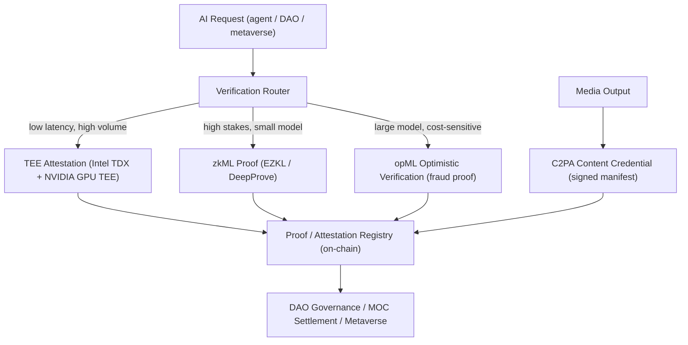

# VerifiableAI: Trustworthy Inference, Provenance, and Proofs for Onchain AI Agents

**Author:** Mossland Lab  
**Email:** [lab@moss.land](mailto:lab@moss.land)  
**Date of Initial Document Creation:** 2026-07-04  
**Status (as of 2026-07):** Research proposal / conceptual design. The Mossland integrations described below are forward-looking architecture and have not yet been implemented in production as of 2026-07.  

---

## Abstract
As autonomous AI agents begin to influence on-chain decisions—drafting proposals, scoring governance risk, and generating in-world content—the central question shifts from *"what did the AI say?"* to *"can we prove the AI actually ran the claimed model on the claimed inputs?"*  
**VerifiableAI** is a Mossland Lab framework that treats AI outputs as **first-class, verifiable claims** rather than opaque assertions.  
It organizes today's verification techniques into a single spectrum—**hardware attestation (TEEs), cryptographic proof (zkML), and optimistic verification (opML)**—and adds **content provenance (C2PA)** for AI-generated media.  
The goal is a DAO in which every AI-assisted decision carries a machine-checkable proof of integrity, complementing EcoAI's ZK **Green Proof** with an equivalent standard for *inference integrity*.

---

## 1. Introduction
On-chain AI has moved from novelty to infrastructure. Within the Mossland ecosystem, AI already touches governance risk scoring (see [`../GovernanceRisk/AI-GovRisk_EN.md`](../GovernanceRisk/AI-GovRisk_EN.md)), DAO proposal summarization (see [`../AI-DAO-Summarization/`](../AI-DAO-Summarization/)), and interactive character generation (see [`../Character_AI_Chatbot/`](../Character_AI_Chatbot/)). Each of these produces outputs that can influence token-weighted votes, treasury allocation, or user-owned assets.

This creates a **trust problem**. When an AI agent reports "this proposal carries a 0.82 governance-risk score" or "here is a neutral summary of the 40-page treasury motion," a DAO member has no cryptographic basis to distinguish an honest computation from:
- a **swapped model** (a cheaper or biased model substituted for the disclosed one),
- **tampered inputs** (a manipulated proposal text fed to the model),
- a **doctored output** (a result edited after inference), or
- **fabricated provenance** for an AI-generated image or character asset.

VerifiableAI addresses this by attaching evidence to every AI claim. The framework recognizes that no single technique fits every workload; instead it defines a **trust spectrum** ranging from fast, hardware-rooted attestation to slow, fully cryptographic proof, with an optimistic middle ground that is economically efficient at scale.

---

## 2. System Overview

The VerifiableAI pipeline routes each AI request to an appropriate verification tier based on latency budget, cost tolerance, and the stakes of the decision. High-stakes, low-frequency decisions (e.g., a treasury-moving vote) justify stronger proofs; high-frequency, low-stakes calls (e.g., a chatbot reply) use lightweight attestation.

| Module | Description | Core Technology |
| ------------------------------ | -------------------------------------------------------------------- | ------------------------------------------------- |
| **1. Verification Router**     | Selects a verification tier per request from latency/cost/stakes     | Policy engine, request metadata classifier        |
| **2. TEE Attestation Layer**   | Proves the model binary ran unmodified inside a confidential enclave | Intel TDX, NVIDIA H100/H200/Blackwell GPU TEE     |
| **3. zkML Prover**             | Generates a cryptographic proof that a specific model produced Y from X | EZKL (Halo2), Lagrange DeepProve, ONNX circuits |
| **4. opML Verifier**           | Optimistic execution with interactive fraud-proof dispute game       | ORA opML, Fraud Proof Virtual Machine (FPVM)      |
| **5. Provenance Signer**       | Attaches signed, tamper-evident provenance to AI-generated media     | C2PA 2.x Content Credentials, C2PA Trust List     |
| **6. Proof Registry**          | Anchors attestations/proofs and verification keys on-chain           | Solidity verifier contracts, event logs, IPFS     |
| **7. Settlement & Governance** | Consumes verified claims for votes, rewards, and asset minting       | Mossland DAO, MOC/MossCoin, Safe multisig         |

---

## 3. Methodology: The Verification Spectrum

VerifiableAI does not pick one technique; it maps each to the workload it fits. The three tiers trade off along the same axes: **trust root**, **cost**, **latency**, and **generality (model size)**.

### 3.1 Tier 1 — TEE Attestation (Confidential Computing)

A Trusted Execution Environment runs inference inside a hardware-isolated, encrypted enclave and emits a hardware-signed **attestation** that proves *which code and model measurement executed*. As of 2026, **Intel TDX** provides the confidential-VM (CPU) layer, while **NVIDIA Confidential Computing** extends the trust boundary onto the GPU. NVIDIA GPU TEE is supported on **H100** and **H200** (Hopper) and **B200/GB200** (Blackwell), with encrypted HBM (AES-256-GCM) and encrypted PCIe/NVLink transport. Composite attestation—binding an Intel TDX trust domain to an NVIDIA GPU—is served via **Intel Trust Authority**, and NVIDIA published a Confidential Computing deployment guide dated April 2026.

- **Strength:** near-native performance (reported overhead in the single-digit-percent range for many workloads); works for full-scale LLMs.
- **Limitation:** trust is rooted in the hardware vendor and its attestation service, not in pure mathematics; it is *attestation*, not a *proof*.

### 3.2 Tier 2 — zkML (Cryptographic Proof)

Zero-Knowledge Machine Learning compiles a model into an arithmetic circuit and produces a succinct proof that a **specific model** transformed a **specific input** into a **specific output**—verifiable by anyone with the verification key, revealing nothing else. As of 2026, **EZKL** converts ONNX models into Halo2 circuits and emits EVM-verifiable proofs; **Lagrange DeepProve** and **Polyhedra's zkPyTorch** report large speedups and were first to prove transformer-scale inference (e.g., GPT-2 / Llama-3 at seconds-to-minutes per token).

- **Strength:** the strongest guarantee—mathematical, vendor-independent, and privacy-preserving.
- **Limitation:** proving cost is still high; as of early 2026, full-scale LLM inference remains impractical for most production zkML, though image classification, fraud detection, and small scoring models are well within reach.

### 3.3 Tier 3 — opML (Optimistic Verification)

Optimistic Machine Learning assumes a submitted result is correct unless challenged. The provider posts the output on-chain; during a challenge window any validator can dispute it, triggering an **interactive fraud-proof dispute game** that bisects the computation and re-executes only the single disputed step inside a **Fraud Proof Virtual Machine (FPVM)**. As of 2026, **ORA Protocol** operates an on-chain AI oracle on opML that supports large models such as Llama-3 and Stable Diffusion.

- **Strength:** near-zero marginal proving cost and scalability to very large models; only disputes incur on-chain work.
- **Limitation:** finality is delayed by the challenge window, and security depends on at least one honest, incentivized validator being present.

### 3.4 Cross-Cutting — Content Provenance (C2PA)

For AI-*generated* media (character art, NFT assets, metaverse scenes), the relevant question is provenance, not inference correctness. **C2PA / Content Credentials** attach a cryptographically signed manifest recording origin, edits, and whether an AI/ML system was involved (via the `digitalSourceType` field). As of 2026, the active specification line is C2PA 2.x and the official C2PA Conformance Program and Trust List replaced the interim trust list on January 1, 2026; OpenAI, Google (SynthID), Adobe, and camera makers such as Canon ship C2PA support. Regulatory drivers—**EU AI Act Article 50** and **California SB 942**—require machine-readable disclosure of AI-generated content, giving provenance a compliance dimension.

### 3.5 Selection Matrix

| Technique | Trust Root | Relative Cost | Latency | Model Size Fit | Best Mossland Use |
| --------- | ------------------------- | ------------- | ---------------- | -------------- | ----------------------------------- |
| TEE       | Hardware vendor + attestation | Low       | Near real-time   | Any (full LLM) | High-volume agent & chatbot calls   |
| zkML      | Pure cryptography         | High          | Seconds–minutes  | Small–medium   | GovRisk score integrity             |
| opML      | Crypto-economic (challenge) | Very low    | Challenge window | Large          | AI-DAO summaries of long proposals  |
| C2PA      | PKI signature + trust list | Very low     | Instant          | N/A (media)    | Character / NFT content provenance  |

---

## 4. Technical Architecture

- **Model Registry & Measurement:** Each approved model is pinned by a content hash; TEE attestations and zkML verification keys reference this measurement so a swapped model is detectable.
- **Verification Router:** A policy engine maps request metadata (stakes, model size, latency budget) to a tier, defaulting high-stakes governance actions to zkML/opML.
- **On-Chain Proof Registry:** Solidity verifier contracts validate zkML proofs and opML challenge outcomes; TEE attestation quotes and C2PA manifest hashes are anchored via events, with large payloads on IPFS.
- **Off-Chain Prover Fleet:** GPU TEE nodes (Intel TDX + NVIDIA CC) run inference; a separate prover pool handles EZKL/DeepProve circuit proving asynchronously.
- **Provenance Service:** Signs C2PA manifests for all AI-generated media at creation time using a Mossland signing identity on the C2PA Trust List.

---

## 5. Blockchain Integration

VerifiableAI is the **integrity layer** for Mossland's AI-plus-blockchain stack and is designed to reuse the ecosystem's existing primitives.

- **Verifiable AI-GovRisk Scores:** Risk scores from [`../GovernanceRisk/AI-GovRisk_EN.md`](../GovernanceRisk/AI-GovRisk_EN.md) are published with a zkML proof or TEE attestation, so voters can confirm the disclosed model scored the actual proposal—turning an advisory number into a checkable claim.
- **Tamper-Proof AI Summaries for DAO Voting:** The long-document summaries from [`../AI-DAO-Summarization/`](../AI-DAO-Summarization/) are wrapped in opML, whose challenge window fits a DAO's deliberation period; any member can dispute a biased or altered summary before the vote closes.
- **Provenance for AI-Generated Character / NFT Content:** Assets from [`../Character_AI_Chatbot/`](../Character_AI_Chatbot/) are minted with an embedded C2PA Content Credential, giving each in-world character or NFT a tamper-evident origin record for marketplace trust and regulatory disclosure.
- **Complement to EcoAI's Green Proof:** Where [`../EcoAI/EcoAI_EN.md`](../EcoAI/EcoAI_EN.md) uses a ZK **Green Proof** to attest *energy/carbon* claims, VerifiableAI provides the parallel proof for *inference integrity*—together giving Mossland verifiable claims about both **how** an AI ran and **what** it computed.
- **MOC / MossCoin Utility:** MOC settles the verification economy—paying prover/attestation nodes, bonding opML validators, and slashing dishonest challengers—so the DAO treasury directly funds and governs the trust layer.

---

## 6. Expected Contributions

1. **Decision Integrity:** Every AI-assisted DAO action carries machine-checkable evidence, reducing reliance on trust in operators.
2. **Right-Sized Verification:** A tiered spectrum lets Mossland match proof strength to stakes instead of over- or under-paying for trust.
3. **Regulatory Readiness:** C2PA provenance positions Mossland ahead of EU AI Act Article 50 and similar AI-disclosure mandates.
4. **Ecosystem Cohesion:** A shared proof registry unifies GovRisk, AI-DAO summaries, Character AI, and EcoAI under one integrity standard.
5. **Metaverse Trust:** Verifiable provenance underpins user confidence in AI-generated worlds and tradable assets.

---

## 7. Conclusion

**VerifiableAI** reframes on-chain AI from *"trust the operator"* to *"verify the claim."* By organizing TEE attestation, zkML, and opML into one spectrum and adding C2PA provenance for generated media, Mossland can attach appropriate, machine-checkable evidence to every AI-assisted decision. This integrity layer complements EcoAI's Green Proof and turns AI-GovRisk scores, DAO summaries, and character/NFT content into verifiable objects. As autonomous agents take on more of the governance and creative workload, verifiability—not raw capability—becomes the differentiator for a trustworthy decentralized ecosystem.

---

## References

1. Phala — [AMD SEV vs Intel TDX vs NVIDIA GPU TEE](https://phala.com/learn/AMD-SEV-vs-Intel-TDX-vs-NVIDIA-GPU-TEE)
2. NVIDIA — [Deployment Guide for Confidential Computing (Intel TDX + GPU), April 2026](https://docs.nvidia.com/cc-deployment-guide-tdx.pdf)
3. Intel — [GPU Remote Attestation with Intel Trust Authority](https://docs.trustauthority.intel.com/main/articles/articles/ita/concept-gpu-attestation.html)
4. ICME Labs — [The Definitive Guide to ZKML (2025)](https://blog.icme.io/the-definitive-guide-to-zkml-2025/)
5. arXiv — [opML: Optimistic Machine Learning on Blockchain (2401.17555)](https://arxiv.org/abs/2401.17555)
6. ORA — [opML and the Fraud Proof Virtual Machine](https://docs.ora.io/doc/onchain-ai-oracle-oao/fraud-proof-virtual-machine-fpvm-and-frameworks/opml)
7. C2PA — [Content Credentials Explainer (Specification 2.x)](https://spec.c2pa.org/specifications/specifications/2.4/explainer/Explainer.html)
8. EyeSift — [C2PA Adoption Status 2026: Content Credentials, OpenAI & Google](https://www.eyesift.com/faq/c2pa-content-credentials-2026-cryptographic-provenance-adoption/)
9. MosslandAI Repository — [https://github.com/mossland/MosslandAI](https://github.com/mossland/MosslandAI)
