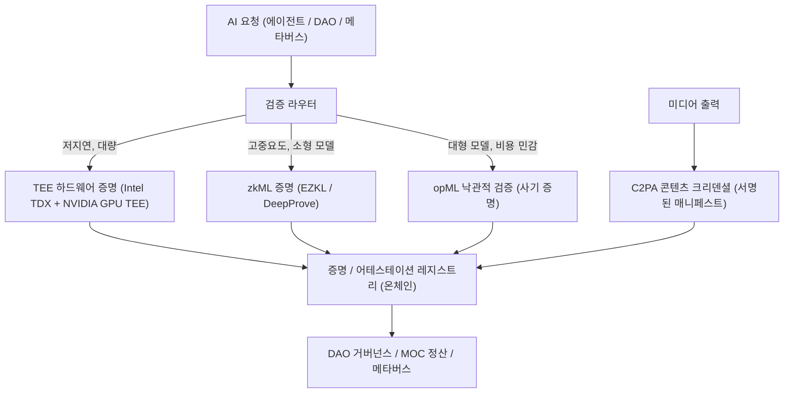

# VerifiableAI: 온체인 AI 에이전트를 위한 신뢰 가능한 추론, 출처 증명, 그리고 증명 체계

**Author:** Mossland Lab  
**Email:** [lab@moss.land](mailto:lab@moss.land)  
**Date of Initial Document Creation:** 2026-07-04  
**Status (2026-07 기준):** 연구 제안 / 개념 설계. 아래에 기술된 Mossland 통합 방안은 미래 지향적 아키텍처이며 2026-07 시점에서 프로덕션으로 구현되지 않았습니다.  

---

## 초록 (Abstract)
자율 AI 에이전트가 제안서 작성, 거버넌스 리스크 평가, 메타버스 콘텐츠 생성 등 온체인 의사결정에 영향을 미치기 시작하면서, 핵심 질문은 *"AI가 무엇이라고 말했는가?"*에서 *"AI가 명시된 입력에 대해 명시된 모델을 실제로 실행했음을 증명할 수 있는가?"*로 이동합니다.  
**VerifiableAI**는 AI 출력을 불투명한 주장이 아니라 **검증 가능한 1급(first-class) 청구(claim)**로 취급하는 Mossland Lab 프레임워크입니다.  
이 프레임워크는 오늘날의 검증 기술을 **하드웨어 증명(TEE), 암호학적 증명(zkML), 낙관적 검증(opML)**이라는 하나의 스펙트럼으로 정리하고, AI 생성 미디어를 위한 **콘텐츠 출처 증명(C2PA)**을 더합니다.  
목표는 모든 AI 보조 의사결정이 기계로 검증 가능한 무결성 증명을 수반하는 DAO이며, 이는 EcoAI의 ZK **Green Proof**를 *추론 무결성(inference integrity)*에 대한 동등한 표준으로 보완합니다.

---

## 1. 서론 (Introduction)
온체인 AI는 이제 신기술을 넘어 인프라가 되었습니다. Mossland 생태계에서 AI는 이미 거버넌스 리스크 평가([`../GovernanceRisk/AI-GovRisk_EN.md`](../GovernanceRisk/AI-GovRisk_EN.md) 참조), DAO 제안 요약([`../AI-DAO-Summarization/`](../AI-DAO-Summarization/) 참조), 대화형 캐릭터 생성([`../Character_AI_Chatbot/`](../Character_AI_Chatbot/) 참조)에 관여합니다. 이들 각각은 토큰 가중 투표, 트레저리 배분, 사용자 소유 자산에 영향을 줄 수 있는 출력을 생성합니다.

이로 인해 **신뢰 문제**가 발생합니다. AI 에이전트가 "이 제안은 0.82의 거버넌스 리스크 점수를 가진다" 또는 "여기 40페이지 트레저리 안건에 대한 중립적 요약이 있다"고 보고할 때, DAO 구성원은 정직한 계산을 다음과 같은 경우와 구분할 암호학적 근거를 갖지 못합니다.
- **모델 교체(swapped model)**: 공개된 모델 대신 더 저렴하거나 편향된 모델로 대체
- **입력 변조(tampered inputs)**: 조작된 제안 텍스트를 모델에 투입
- **출력 위조(doctored output)**: 추론 이후 결과를 편집
- **출처 조작(fabricated provenance)**: AI 생성 이미지나 캐릭터 자산의 출처 위조

VerifiableAI는 모든 AI 청구에 증거를 부착하여 이를 해결합니다. 이 프레임워크는 단일 기술이 모든 워크로드에 적합하지 않음을 인정하며, 대신 빠르고 하드웨어에 뿌리를 둔 증명부터 느리지만 완전히 암호학적인 증명까지, 그리고 대규모에서 경제적으로 효율적인 낙관적 중간 지대를 아우르는 **신뢰 스펙트럼(trust spectrum)**을 정의합니다.

---

## 2. 시스템 개요 (System Overview)

VerifiableAI 파이프라인은 지연 예산, 비용 허용치, 의사결정의 중요도에 따라 각 AI 요청을 적절한 검증 계층으로 라우팅합니다. 높은 중요도의 저빈도 결정(예: 트레저리 이동 투표)은 더 강한 증명을 정당화하며, 고빈도의 저중요도 호출(예: 챗봇 응답)은 경량 증명을 사용합니다.

| 모듈 | 설명 | 핵심 기술 |
| ------------------------------ | -------------------------------------------------------------------- | ------------------------------------------------- |
| **1. 검증 라우터**             | 지연/비용/중요도에 따라 요청별 검증 계층을 선택                        | 정책 엔진, 요청 메타데이터 분류기                  |
| **2. TEE 어테스테이션 계층**   | 모델 바이너리가 기밀 엔클레이브 내에서 변경 없이 실행되었음을 증명      | Intel TDX, NVIDIA H100/H200/Blackwell GPU TEE     |
| **3. zkML 프루버**             | 특정 모델이 X로부터 Y를 생성했다는 암호학적 증명을 생성                | EZKL(Halo2), Lagrange DeepProve, ONNX 회로        |
| **4. opML 검증기**             | 낙관적 실행과 상호작용형 사기 증명 분쟁 게임                           | ORA opML, 사기 증명 가상 머신(FPVM)               |
| **5. 출처 서명기**             | AI 생성 미디어에 서명되고 변조 감지 가능한 출처를 부착                 | C2PA 2.x 콘텐츠 크리덴셜, C2PA Trust List          |
| **6. 증명 레지스트리**         | 어테스테이션/증명과 검증 키를 온체인에 고정                            | Solidity 검증 컨트랙트, 이벤트 로그, IPFS          |
| **7. 정산 및 거버넌스**        | 검증된 청구를 투표, 보상, 자산 발행에 소비                             | Mossland DAO, MOC/MossCoin, Safe 멀티시그          |

---

## 3. 방법론: 검증 스펙트럼

VerifiableAI는 단일 기술을 선택하지 않고, 각 기술을 적합한 워크로드에 매핑합니다. 세 계층은 동일한 축, 즉 **신뢰 근원**, **비용**, **지연**, **일반성(모델 크기)**을 따라 트레이드오프를 이룹니다.

### 3.1 계층 1 — TEE 어테스테이션 (기밀 컴퓨팅)

신뢰 실행 환경(TEE)은 하드웨어로 격리되고 암호화된 엔클레이브 내에서 추론을 실행하고, *어떤 코드와 모델 측정값이 실행되었는지*를 증명하는 하드웨어 서명 **어테스테이션**을 방출합니다. 2026년 기준, **Intel TDX**는 기밀 VM(CPU) 계층을 제공하며, **NVIDIA Confidential Computing**은 신뢰 경계를 GPU로 확장합니다. NVIDIA GPU TEE는 **H100** 및 **H200**(Hopper)와 **B200/GB200**(Blackwell)에서 지원되며, 암호화된 HBM(AES-256-GCM)과 암호화된 PCIe/NVLink 전송을 제공합니다. Intel TDX 신뢰 도메인을 NVIDIA GPU에 결합하는 복합 어테스테이션은 **Intel Trust Authority**를 통해 제공되며, NVIDIA는 2026년 4월자 기밀 컴퓨팅 배포 가이드를 발행했습니다.

- **강점:** 거의 네이티브 수준의 성능(많은 워크로드에서 한 자릿수 퍼센트대의 오버헤드로 보고됨); 전체 규모 LLM에도 적용 가능.
- **한계:** 신뢰가 순수 수학이 아니라 하드웨어 벤더와 그 어테스테이션 서비스에 뿌리를 둠; 이는 *증명(proof)*이 아니라 *어테스테이션(attestation)*임.

### 3.2 계층 2 — zkML (암호학적 증명)

영지식 머신러닝(Zero-Knowledge Machine Learning)은 모델을 산술 회로로 컴파일하고, **특정 모델**이 **특정 입력**을 **특정 출력**으로 변환했다는 간결한 증명을 생성합니다. 이 증명은 검증 키를 가진 누구나 검증할 수 있으며 다른 정보는 노출하지 않습니다. 2026년 기준, **EZKL**은 ONNX 모델을 Halo2 회로로 변환하고 EVM에서 검증 가능한 증명을 방출합니다. **Lagrange DeepProve**와 **Polyhedra의 zkPyTorch**는 큰 속도 향상을 보고하며 트랜스포머 규모 추론(예: GPT-2 / Llama-3, 토큰당 초~분 단위)을 최초로 증명했습니다.

- **강점:** 가장 강력한 보장—수학적이고, 벤더 독립적이며, 프라이버시를 보존.
- **한계:** 증명 비용이 여전히 높음; 2026년 초 기준, 전체 규모 LLM 추론은 대부분의 프로덕션 zkML에서 비현실적이지만 이미지 분류, 사기 탐지, 소형 평가 모델은 충분히 실현 가능.

### 3.3 계층 3 — opML (낙관적 검증)

낙관적 머신러닝(Optimistic Machine Learning)은 제출된 결과가 이의 제기되지 않는 한 정확하다고 가정합니다. 제공자는 출력을 온체인에 게시하며, 이의 제기 기간 동안 임의의 검증자가 이를 반박할 수 있습니다. 반박은 계산을 이분 탐색하여 분쟁 대상이 된 단일 단계만을 **사기 증명 가상 머신(FPVM)** 안에서 재실행하는 **상호작용형 사기 증명 분쟁 게임**을 촉발합니다. 2026년 기준, **ORA Protocol**은 Llama-3, Stable Diffusion과 같은 대형 모델을 지원하는 opML 기반 온체인 AI 오라클을 운영합니다.

- **강점:** 한계 증명 비용이 거의 0이며 매우 큰 모델까지 확장 가능; 분쟁이 발생할 때만 온체인 작업이 필요.
- **한계:** 이의 제기 기간만큼 최종성이 지연되며, 보안은 최소 한 명의 정직하고 인센티브를 가진 검증자의 존재에 의존.

### 3.4 교차 계층 — 콘텐츠 출처 증명 (C2PA)

AI *생성* 미디어(캐릭터 아트, NFT 자산, 메타버스 장면)의 경우, 관련 질문은 추론 정확성이 아니라 출처입니다. **C2PA / 콘텐츠 크리덴셜**은 원본, 편집 이력, 그리고 AI/ML 시스템 관여 여부(`digitalSourceType` 필드를 통해)를 기록하는 암호학적으로 서명된 매니페스트를 부착합니다. 2026년 기준, 활성 사양 라인은 C2PA 2.x이며 공식 C2PA 적합성 프로그램과 Trust List가 2026년 1월 1일부로 임시 Trust List를 대체했습니다. OpenAI, Google(SynthID), Adobe, Canon 같은 카메라 제조사가 C2PA 지원을 출시했습니다. 규제 동인—**EU AI Act 제50조**와 **캘리포니아 SB 942**—은 AI 생성 콘텐츠의 기계 판독 가능한 공개를 요구하여 출처 증명에 규정 준수 차원을 부여합니다.

### 3.5 선택 매트릭스

| 기술 | 신뢰 근원 | 상대 비용 | 지연 | 모델 크기 적합성 | 최적 Mossland 활용 |
| --------- | ------------------------- | --------- | ------------- | ---------------- | ----------------------------------- |
| TEE       | 하드웨어 벤더 + 어테스테이션 | 낮음    | 거의 실시간   | 모두 (전체 LLM)  | 대량 에이전트 및 챗봇 호출          |
| zkML      | 순수 암호학               | 높음      | 초~분         | 소형~중형        | GovRisk 점수 무결성                 |
| opML      | 암호경제(이의 제기)       | 매우 낮음 | 이의 제기 기간 | 대형            | 장문 제안의 AI-DAO 요약             |
| C2PA      | PKI 서명 + Trust List      | 매우 낮음 | 즉시          | 해당 없음 (미디어) | 캐릭터 / NFT 콘텐츠 출처 증명       |

---

## 4. 기술 아키텍처

- **모델 레지스트리 및 측정값:** 승인된 각 모델은 콘텐츠 해시로 고정되며, TEE 어테스테이션과 zkML 검증 키가 이 측정값을 참조하므로 모델 교체를 탐지할 수 있습니다.
- **검증 라우터:** 정책 엔진이 요청 메타데이터(중요도, 모델 크기, 지연 예산)를 계층에 매핑하며, 고중요도 거버넌스 액션은 기본적으로 zkML/opML로 설정합니다.
- **온체인 증명 레지스트리:** Solidity 검증 컨트랙트가 zkML 증명과 opML 분쟁 결과를 검증하고, TEE 어테스테이션 인용과 C2PA 매니페스트 해시는 이벤트를 통해 고정되며 대용량 페이로드는 IPFS에 저장됩니다.
- **오프체인 프루버 플릿:** GPU TEE 노드(Intel TDX + NVIDIA CC)가 추론을 실행하고, 별도의 프루버 풀이 EZKL/DeepProve 회로 증명을 비동기로 처리합니다.
- **출처 서비스:** C2PA Trust List에 등록된 Mossland 서명 신원을 사용하여 모든 AI 생성 미디어에 대해 생성 시점에 C2PA 매니페스트를 서명합니다.

---

## 5. 블록체인 통합 (Blockchain Integration)

VerifiableAI는 Mossland의 AI+블록체인 스택을 위한 **무결성 계층**이며, 생태계의 기존 프리미티브를 재사용하도록 설계되었습니다.

- **검증 가능한 AI-GovRisk 점수:** [`../GovernanceRisk/AI-GovRisk_EN.md`](../GovernanceRisk/AI-GovRisk_EN.md)의 리스크 점수는 zkML 증명 또는 TEE 어테스테이션과 함께 게시되어, 투표자가 공개된 모델이 실제 제안을 평가했음을 확인할 수 있습니다—권고성 숫자를 검증 가능한 청구로 전환합니다.
- **DAO 투표를 위한 변조 방지 AI 요약:** [`../AI-DAO-Summarization/`](../AI-DAO-Summarization/)의 장문 요약은 opML로 감싸지며, 그 이의 제기 기간이 DAO의 숙의 기간에 부합합니다. 어떤 구성원이든 투표 마감 전에 편향되거나 변경된 요약에 이의를 제기할 수 있습니다.
- **AI 생성 캐릭터 / NFT 콘텐츠 출처 증명:** [`../Character_AI_Chatbot/`](../Character_AI_Chatbot/)의 자산은 임베디드 C2PA 콘텐츠 크리덴셜과 함께 발행되어, 각 메타버스 캐릭터나 NFT가 마켓플레이스 신뢰와 규제 공개를 위한 변조 감지 출처 기록을 갖습니다.
- **EcoAI의 Green Proof에 대한 보완:** [`../EcoAI/EcoAI_EN.md`](../EcoAI/EcoAI_EN.md)가 ZK **Green Proof**로 *에너지/탄소* 청구를 증명하는 것과 마찬가지로, VerifiableAI는 *추론 무결성*에 대한 병렬 증명을 제공합니다—함께 Mossland에 AI가 **어떻게** 실행되었는지와 **무엇을** 계산했는지 모두에 대한 검증 가능한 청구를 제공합니다.
- **MOC / MossCoin 유틸리티:** MOC는 검증 경제를 정산합니다—프루버/어테스테이션 노드에 대한 지불, opML 검증자 본딩, 부정직한 이의 제기자 슬래싱—따라서 DAO 트레저리가 신뢰 계층을 직접 재정 지원하고 거버넌스합니다.

---

## 6. 기대 기여 (Expected Contributions)

1. **의사결정 무결성:** 모든 AI 보조 DAO 액션이 기계 검증 가능한 증거를 수반하여 운영자에 대한 신뢰 의존도를 줄입니다.
2. **적정 규모 검증:** 계층화된 스펙트럼을 통해 Mossland는 신뢰에 과다·과소 지불하는 대신 증명 강도를 중요도에 맞출 수 있습니다.
3. **규제 대비:** C2PA 출처 증명은 Mossland를 EU AI Act 제50조 및 유사한 AI 공개 의무보다 앞서 위치시킵니다.
4. **생태계 통합성:** 공유 증명 레지스트리가 GovRisk, AI-DAO 요약, Character AI, EcoAI를 하나의 무결성 표준 아래 통합합니다.
5. **메타버스 신뢰:** 검증 가능한 출처 증명이 AI 생성 월드와 거래 가능한 자산에 대한 사용자 신뢰를 뒷받침합니다.

---

## 7. 결론 (Conclusion)

**VerifiableAI**는 온체인 AI를 *"운영자를 신뢰하라"*에서 *"청구를 검증하라"*로 재구성합니다. TEE 어테스테이션, zkML, opML을 하나의 스펙트럼으로 정리하고 생성 미디어를 위한 C2PA 출처 증명을 더함으로써, Mossland는 모든 AI 보조 의사결정에 적절하고 기계 검증 가능한 증거를 부착할 수 있습니다. 이 무결성 계층은 EcoAI의 Green Proof를 보완하며 AI-GovRisk 점수, DAO 요약, 캐릭터/NFT 콘텐츠를 검증 가능한 객체로 전환합니다. 자율 에이전트가 거버넌스와 창작 워크로드를 더 많이 담당함에 따라, 원시 역량이 아니라 검증 가능성이 신뢰할 수 있는 탈중앙화 생태계의 차별화 요소가 됩니다.

---

## 참고 문헌 (References)

1. Phala — [AMD SEV vs Intel TDX vs NVIDIA GPU TEE](https://phala.com/learn/AMD-SEV-vs-Intel-TDX-vs-NVIDIA-GPU-TEE)
2. NVIDIA — [Deployment Guide for Confidential Computing (Intel TDX + GPU), April 2026](https://docs.nvidia.com/cc-deployment-guide-tdx.pdf)
3. Intel — [GPU Remote Attestation with Intel Trust Authority](https://docs.trustauthority.intel.com/main/articles/articles/ita/concept-gpu-attestation.html)
4. ICME Labs — [The Definitive Guide to ZKML (2025)](https://blog.icme.io/the-definitive-guide-to-zkml-2025/)
5. arXiv — [opML: Optimistic Machine Learning on Blockchain (2401.17555)](https://arxiv.org/abs/2401.17555)
6. ORA — [opML and the Fraud Proof Virtual Machine](https://docs.ora.io/doc/onchain-ai-oracle-oao/fraud-proof-virtual-machine-fpvm-and-frameworks/opml)
7. C2PA — [Content Credentials Explainer (Specification 2.x)](https://spec.c2pa.org/specifications/specifications/2.4/explainer/Explainer.html)
8. EyeSift — [C2PA Adoption Status 2026: Content Credentials, OpenAI & Google](https://www.eyesift.com/faq/c2pa-content-credentials-2026-cryptographic-provenance-adoption/)
9. MosslandAI Repository — [https://github.com/mossland/MosslandAI](https://github.com/mossland/MosslandAI)
