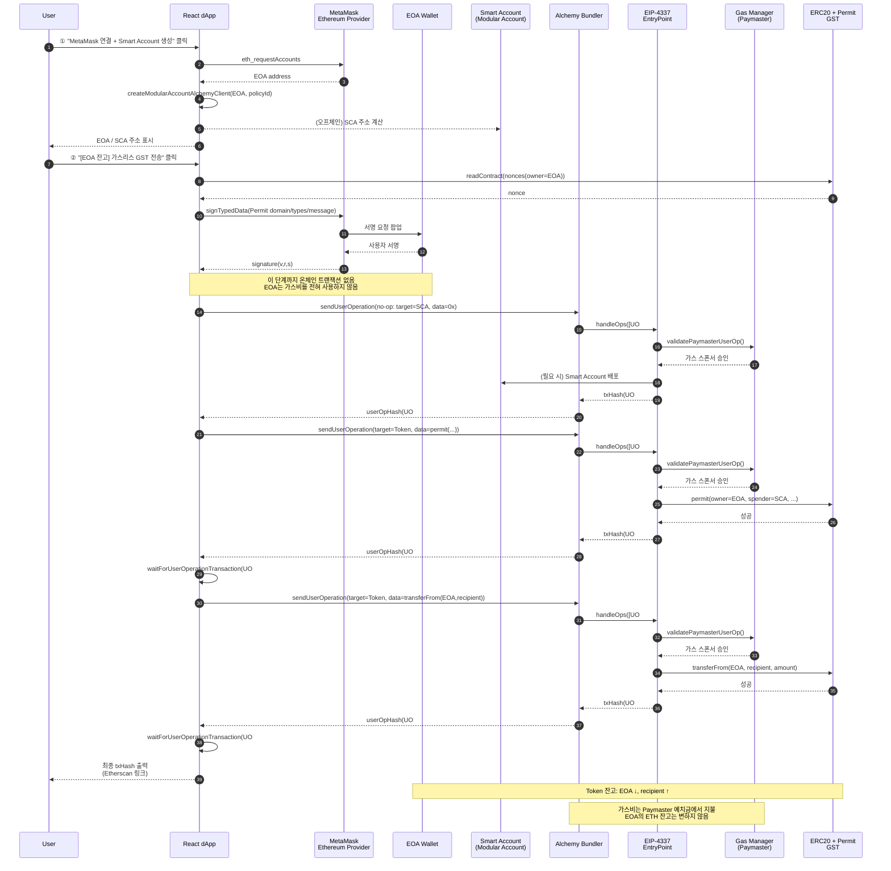
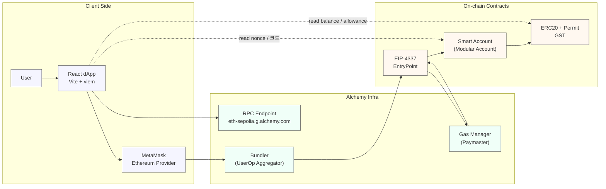

# ERC-20 가스비 스폰서십 연구 (2) – Alchemy Smart Account 기반 가스비 지원 PoC

## 1. 개요

본 문서는 **Alchemy Account Kit 및 Gas Manager**를 이용하여,

MetaMask EOA에서 **가스비를 직접 지불하지 않고 ERC-20 토큰을 전송하는 PoC** 구현 결과를 정리한다.

여기서,

> 가스비 스폰서십 / 가스비 지원이란
> 
> 
> 사용자가 ETH를 직접 지불하지 않고, Paymaster/플랫폼이
> 
> 트랜잭션 실행에 필요한 가스비를 대신 부담하는 구조를 의미한다.
> 

PoC 환경은 다음과 같다.

- **네트워크**: Ethereum Sepolia 테스트넷
- **토큰**: ERC-20 `GasSponsorTest` (기호: `GST`)
- **지갑**
    - 사용자 EOA: MetaMask 계정 (예: `0x4f1053...09D0c2f3`)
    - Smart Contract Account(SCA): Alchemy Modular Smart Account
        
        (예: `0xBF1E6A948A55fA07FD44B839B9bf02FF98cFAcFd`)
        
- **가스비 스폰서십**
    - Alchemy Gas Manager 정책 (환경 변수 `VITE_ALCHEMY_GAS_POLICY_ID`)
    - 모든 UserOperation의 가스비는 해당 정책에 의해 **스폰서(지원)** 되며,
        
        사용자 EOA의 ETH 잔고는 변하지 않는다.
        

사용자는 React 기반 dApp에서

**“[EOA 잔고] 가스리스 GST 전송 (permit 사용)”** 버튼을 클릭함으로써,

- EOA가 보유한 GST를 recipient로 전송하되,
- 온체인 가스비는 **SCA + Gas Manager(Paymaster)** 가 부담하도록

트랜잭션을 생성·전송한다. 
a7ebd8b7-adde-4c9c-829c-81a6d2a…

---

## 2. 시스템 구성 요소

### 2.1 Alchemy Account Kit 및 Gas Manager

주요 사용 패키지는 다음과 같다.

- `@account-kit/infra`
    - `sepolia`, `mainnet` 등 Alchemy에서 제공하는 Chain 프리셋
- `@account-kit/smart-contracts`
    - `createModularAccountAlchemyClient` 를 통해 Smart Account 클라이언트 생성
    - 내부적으로 **EIP-4337 EntryPoint + Bundler + Gas Manager(Paymaster)** 사용
- `@aa-sdk/core`
    - `WalletClientSigner` 를 통해 viem 기반 EOA signer를 Account Kit에 연결

### 2.2 계정 및 토큰

### EOA (Externally Owned Account)

- MetaMask에서 `eth_requestAccounts` 로 가져오는 사용자 지갑 주소.
- 이번 PoC에서는 **온체인 트랜잭션을 직접 보내지 않고**,
    
    `signTypedData` 를 통해 **EIP-712 Permit 서명만 수행**한다.
    

### Smart Contract Account (SCA)

- Alchemy Modular Smart Account
- `EOA + salt` 조합으로 deterministic 주소 생성,
    
    **첫 UserOperation 시 실제 배포**된다.
    
- 모든 UserOperation은 **SCA 기준으로 발생**하며,
    
    Gas Manager 정책이 적용된다.
    

### ERC-20 토큰 (GST)

- `permit`, `transfer`, `transferFrom`, `nonces` 인터페이스를 제공하는 ERC-20.
- EIP-2612 스타일의 Permit을 사용하여,
    
    **오프체인 서명으로 스펜더(SCA)를 승인**한다.
    

---

## 3. 주요 코드 구조

### 3.1 `alchemyClient.ts` – Smart Account 클라이언트 생성

**역할**: MetaMask EOA를 기반으로 Alchemy Smart Account 클라이언트를 생성한다.

### (1) 환경 변수 로드

```tsx
const ALCHEMY_API_KEY = import.meta.env.VITE_ALCHEMY_API_KEY as string;
const GAS_POLICY_ID = import.meta.env.VITE_ALCHEMY_GAS_POLICY_ID as string;

```

- Alchemy RPC + Bundler + Gas Manager를 포함하는 transport 구성을 위해 **API 키** 필요.
- `policyId` 로 Gas Manager 정책을 지정하여,
    
    해당 Smart Account의 UserOperation 가스비를 **스폰서**하도록 한다.
    

### (2) MetaMask 계정 요청

```tsx
const [eoaAddress] = await window.ethereum.request({
  method: "eth_requestAccounts",
}) as `0x${string}`[];

```

- 사용자가 MetaMask 팝업에서 계정 연결을 승인하면 **EOA 주소**를 획득한다.
- 이 단계는 **온체인 트랜잭션이 아니므로 가스비가 발생하지 않는다.**

### (3) viem Wallet Client 생성

```tsx
const walletClient = createWalletClient({
  account: eoaAddress,
  chain: sepolia,
  transport: custom(window.ethereum),
});
const signer = new WalletClientSigner(walletClient, "json-rpc");

```

### (4) Modular Smart Account 클라이언트 생성

```tsx
const client = await createModularAccountAlchemyClient({
  chain: sepolia,
  signer,
  transport: alchemy({ apiKey: ALCHEMY_API_KEY }),
  policyId: GAS_POLICY_ID,
});

```

- `transport: alchemy({ apiKey })` 설정을 통해
    
    **Bundler + Gas Manager** 를 사용하는 Account Kit 클라이언트 생성.
    
- 이 클라이언트를 통해 `sendUserOperation`, `waitForUserOperationTransaction` 등을 호출한다.

### (5) 반환 값

```tsx
return { client, eoaAddress };

```

- 이후 UI에서 EOA 주소와 Smart Account 주소를 동시에 표시하고,
    
    UserOperation 실행에 사용한다.
    

---

### 3.2 `App.tsx` – UI 및 비즈니스 로직

### 3.2.1 네트워크 / 토큰 설정

```tsx
const NETWORK = (import.meta.env.VITE_NETWORK || "sepolia") as "sepolia" | "mainnet";
const CHAIN = NETWORK === "mainnet" ? mainnet : sepolia;

const TOKEN = {
  address: import.meta.env.VITE_TOKEN_ADDRESS as `0x${string}`,
  name: import.meta.env.VITE_TOKEN_NAME,
  symbol: import.meta.env.VITE_TOKEN_SYMBOL,
  decimals: 18,
} as const;

```

- `.env` 에서 네트워크와 토큰 메타데이터를 분리함으로써,
    
    추후 메인넷 전환 시 **최소한의 코드 변경만으로 전환 가능**하도록 설계.
    

### 3.2.2 상태 및 공용 클라이언트

- `client`: Smart Account 클라이언트 인스턴스
- `eoaAddress`: MetaMask EOA 주소
- `scaAddress`: Smart Account 주소 (`client.getAddress()`로 획득)
- `log`: 화면 하단 로그 출력용 문자열
- `recipient`, `amount`: 전송 대상 주소와 수량

또한, Alchemy RPC용 `publicClient` 를 생성한다.

```tsx
const publicClient = useMemo(() => {
  if (!ALCHEMY_API_KEY) return null;
  return createPublicClient({
    chain: CHAIN,
    transport: http(
      `https://${CHAIN.id === 1 ? "eth-mainnet" : "eth-sepolia"}.g.alchemy.com/v2/${ALCHEMY_API_KEY}`
    ),
  });
}, []);

```

- Smart Account 배포 여부 확인(`getCode`),
    
    permit nonce 조회(`readContract`) 등에 사용한다.
    

---

## 4. 기능별 동작 설명

### 4.1 지갑 연결 및 Smart Account 준비 (`connectWallet`)

1. `getSmartAccountClient()` 호출
    - MetaMask 계정 연결
    - Alchemy Account Kit 클라이언트 생성
    - Smart Account 주소(`scaAddress`) 획득
2. 상태 업데이트 및 로그 출력
    - EOA/Smart Account 주소, 네트워크 정보를 화면에 표시
    - 이후 no-op, SCA 잔고 전송, 가스리스 전송을 순차적으로 테스트하도록 안내

이 단계에서는 **여전히 온체인 트랜잭션이 없으므로 가스비가 발생하지 않는다.**

---

### 4.2 Smart Account 배포 보장 (`ensureSmartAccountDeployed`)

Smart Account는 첫 UserOperation이 발생할 때까지

실제로는 **컨트랙트가 배포되지 않았을 수 있다.**

이를 보장하기 위해 **“no-op UserOperation”** 을 전송한다.

1. `publicClient.getCode(scaAddress)`
    - 코드가 `0x` 인 경우, 아직 컨트랙트가 배포되지 않았음을 의미.
2. 배포용 UserOperation 전송

```tsx
const { hash: deployUoHash } = await client.sendUserOperation({
  uo: {
    target: scaAddress,
    data: "0x",
    value: 0n,
  },
});
await client.waitForUserOperationTransaction({ hash: deployUoHash });

```

1. 이 UserOperation에 대한 가스비는 **Gas Manager 정책에 의해 스폰서**되며,
    
    Alchemy Dashboard에는 “Sponsored” 상태의 Operation으로 기록된다.
    

---

### 4.3 no-op UserOperation 테스트 (`sendNoopUserOp`)

- Smart Account가 이미 배포된 상태에서,
    
    `target = SCA`, `data = 0x` 로 하는 단순 UserOperation을 전송한다.
    
- end-to-end 경로(클라이언트 → Bundler → EntryPoint → SCA)가 정상인지 확인하는 용도.
- 이 UO 또한 Gas Manager에 의해 **스폰서**되며, Dashboard에 별도 Operation으로 표시된다.

---

### 4.4 SCA 잔고에서 토큰 전송 (`sendTokenFromSCA`)

- SCA가 이미 GST 잔고를 보유하고 있을 때,
    
    `transfer(recipient, amount)` 호출을 UserOperation 하나로 수행한다.
    
1. `amount` 를 `parseUnits`로 Wei 단위로 변환
2. `encodeFunctionData` 로 ERC-20 `transfer` 호출 데이터 생성
3. Smart Account 클라이언트로 UO 전송

```tsx
const { hash: userOpHash } = await client.sendUserOperation({
  uo: {
    target: TOKEN.address,
    data,
    value: 0n,
  },
});

```

- 이때 발생하는 가스비 역시 Alchemy Gas Manager 정책에 따라 **스폰서 처리**된다.

---

### 4.5 EOA 잔고에서 recipient로 가스리스 전송 (`sendGaslessFromEOA`)

이 함수가 **본 PoC의 핵심 구현**이다.

동작은 크게 **두 개의 UserOperation (permit → transferFrom)** 으로 구성된다.

### 4.5.1 프리 체크 및 Smart Account 배포

- `client`, `publicClient`, `eoaAddress`, `scaAddress`, `recipient`, `amount` 등
    
    필수 상태를 확인.
    
- `ensureSmartAccountDeployed()` 호출을 통해
    
    Smart Account가 배포되어 있는지 보장.
    

로그 예시:

```
Smart Account가 아직 배포되지 않아, 먼저 no-op UO로 배포를 진행합니다...
Smart Account 배포 완료 (userOpHash: 0x4a8e6377...5c77f8f9)

```

---

### 4.5.2 Permit에 필요한 파라미터 구성

1. 체인 ID 및 nonce 조회

```tsx
const chainId = await publicClient.getChainId();
const nonce = await publicClient.readContract({
  address: TOKEN.address,
  abi: erc20PermitAbi,
  functionName: "nonces",
  args: [eoaAddress],
}) as bigint;

```

1. 수량 및 유효 기간

```tsx
const amountWei = parseUnits(amount, TOKEN.decimals);
const deadline = BigInt(Math.floor(Date.now() / 1000) + 60 * 10); // 10분

```

1. EIP-712 도메인 / 타입 / 메시지 정의

```tsx
const domain = {
  name: TOKEN.name,
  version: "1",
  chainId,
  verifyingContract: TOKEN.address,
} as const;

const types = {
  Permit: [
    { name: "owner", type: "address" },
    { name: "spender", type: "address" },
    { name: "value", type: "uint256" },
    { name: "nonce", type: "uint256" },
    { name: "deadline", type: "uint256" },
  ],
} as const;

const message = {
  owner: eoaAddress,
  spender: scaAddress,
  value: amountWei,
  nonce,
  deadline,
} as const;

```

---

### 4.5.3 EOA의 오프체인 Permit 서명

```tsx
const walletClient = createWalletClient({
  account: eoaAddress,
  chain: CHAIN,
  transport: custom(window.ethereum),
});

const signature = await walletClient.signTypedData({
  domain,
  types,
  primaryType: "Permit",
  message,
});

```

- 이 서명은 **완전히 오프체인**에서 수행되며,
    
    EOA는 이 단계에서 **가스비를 전혀 사용하지 않는다.**
    
- 이후 `r`, `s`, `v` 를 파싱하여 `permit` 함수 파라미터로 사용.

로그 예시:

```
✅ permit 서명 완료 (EOA는 온체인 가스 사용 없음)
· signature: 0xb31b1b19d50f...

```

---

### 4.5.4 1단계: `permit` UserOperation 전송

1. `permit` 호출 데이터 생성

```tsx
const permitData = encodeFunctionData({
  abi: erc20PermitAbi,
  functionName: "permit",
  args: [owner, spender, value, deadline, v, r, s],
});

```

1. UO 전송

```tsx
const { hash: permitUoHash } = await client.sendUserOperation({
  uo: {
    target: TOKEN.address,
    data: permitData,
    value: 0n,
  },
});
await client.waitForUserOperationTransaction({ hash: permitUoHash });

```

1. 로그 및 Alchemy Dashboard

UI 로그 예시:

```
⏳ 1단계: permit(UserOperation) 전송 중...
✅ permit UO 전송 완료 (hash: 0xc4e599e1e1...614d2f50)
⏳ permit UserOperation 채굴 대기 중...
✅ permit 온체인 반영 완료

```

Alchemy Dashboard(스크린샷 3)에는

Operation hash `0xc4e599e1e1...614d2f50` 이 **Sponsored** 상태로 표시된다.

- 이 단계에서 실제 이더리움 트랜잭션이 발생하지만,
    
    **사용자 EOA의 ETH는 차감되지 않고 Paymaster 예치금에서 가스비가 지급**된다.
    

---

### 4.5.5 2단계: `transferFrom` UserOperation 전송

1. `transferFrom` 호출 데이터 생성

```tsx
const transferFromData = encodeFunctionData({
  abi: erc20PermitAbi,
  functionName: "transferFrom",
  args: [eoaAddress, recipient, amountWei],
});

```

1. UO 전송 및 최종 트랜잭션 해시 획득

```tsx
const { hash: transferUoHash } = await client.sendUserOperation({
  uo: {
    target: TOKEN.address,
    data: transferFromData,
    value: 0n,
  },
});
const txHash = await client.waitForUserOperationTransaction({
  hash: transferUoHash,
});

```

1. 로그 및 Dashboard

UI 로그 예시:

```
⏳ 2단계: transferFrom(UserOperation) 전송 중...
✅ transferFrom UO 전송 완료 (hash: 0x0698cb11ee14...561c010b)
⏳ transferFrom UserOperation 채굴 대기 중...

🎉 [EOA → recipient] 가스리스 토큰 전송 완료
· 최종 txHash: 0x748080b6...58f8se22

```

- Alchemy Dashboard에는 Operation hash `0x0698cb11e...561c010b` 가
    
    역시 **Sponsored** 상태로 기록된다.
    
- `waitForUserOperationTransaction` 결과로 반환된 `txHash` 가
    
    Etherscan 스크린샷 2의 Transaction Hash와 일치한다.
    

---

## 5. 실행 결과 분석

### 5.1 dApp UI 로그

요약하면:

1. Smart Account 미배포 상태 감지 → **no-op UO로 배포**
2. Permit 서명 완료 (오프체인)
3. permit UO 전송 및 채굴 완료
4. transferFrom UO 전송 및 채굴 완료
5. 최종 트랜잭션 해시 출력

이 로그를 통해 전체 플로우가 다음 **3개의 UserOperation** 으로 구성되어 있음을 알 수 있다.

- UO #1: no-op (배포용)
- UO #2: `permit`
- UO #3: `transferFrom`

각 UO는 서로 다른 `userOpHash` 를 가지며,

각각의 `waitForUserOperationTransaction` 호출에서

L1 트랜잭션 해시를 반환한다.


---

### 5.2 Etherscan 트랜잭션 상세

예시 트랜잭션 해시:

`0x748080b6804f004e96677bae78395e91d58395a6db1f6772e016113058f8se22`

주요 항목:

- **From**: `0x170F4967A427FE850B3E3f1c17B9a528E79f8807`
    - EIP-4337 Bundler 또는 EntryPoint를 호출하는 Aggregator 주소
    - 사용자의 EOA가 아니라 **인프라 측 주소**
- **Interacted With (To)**: `0x5FF137D4b0FDCD49DcA30c7CF57E57B8a026d2789`
    - EIP-4337 EntryPoint 컨트랙트 주소
- **Internal Transactions**
    - `0x5FF137D4...` → `0x170F4967...` 방향의 소량 ETH 이동
    - Paymaster(Gas Manager)와 Bundler/EntryPoint 사이의 정산 흐름으로,
        
        **가스비가 Paymaster 예치금에서 지급되었음을 간접적으로 보여줌**
        
- **ERC-20 Tokens Transferred**
    - From: 사용자 EOA (`0x4f1053c3...09D0c2f3`)
    - To: recipient (`0x0532a09a...82F083bdc`)
    - Amount: `100` `GasSponsorTest (GST)`
- **Value / Transaction Fee**
    - Value: `0 ETH` (사용자가 전송한 ETH 없음)
    - Transaction Fee: `0.000015644402503104 ETH`
        - 이 가스비는 **EOA에서 차감되지 않고 Paymaster에서 지급**

결론:

> 토큰 전송은 EOA 잔고에서 나갔지만, ETH 가스비는 EOA에서 차감되지 않았다.
> 
> 
> 의도한 대로 “가스리스 토큰 전송”이 동작했음을 확인할 수 있다.
> 

노란 경고 문구(“Although one or more Error Occurred [execution reverted]…”)는

내부적으로 revert를 활용하는 검증 로직 때문이며,

최종 트랜잭션 status가 `Success` 이므로 기능 동작에는 문제가 없다.


---

### 5.3 Alchemy Gas Manager 대시보드

표에는 3개의 Operation이 보인다.

- Operation hash:
    - `0x0698cb11e...561c010b` – `transferFrom` UO
    - `0xc4e599e1e...614d2f50` – `permit` UO
    - `0x4a8e637739...5c77f8f9` – no-op / 배포 UO

공통 특징:

- **Status: `Sponsored`**
    
    → 해당 UserOperation들의 가스비가 모두 정책에 의해 **스폰서(지원)** 되었음을 의미
    
- **User address**: `0xBF1E6A948A55fA07FD44B839B9bf02FF98cFAcFd`
    - Smart Account 주소가 “사용자”로 인식되고 있다.
    - Gas Manager 입장에서는
        
        “**이 SCA가 보낸 UserOperation을 정책에 따라 스폰서**”한 것.
        

이 화면을 통해,

- 몇 개의 UserOperation이 실행되었는지
- 각 UserOperation이 Gas Manager에 의해 제대로 스폰서되었는지

를 한눈에 확인할 수 있으며,

dApp 로그 및 Etherscan 정보와 연결해 전체 동작을 추적할 수 있다.


---

### 5.4 Etherscan 트랜잭션 로그를 통한 가스리스 전송 검증

아래 스크린샷은 **스마트 계정을 통해 GST 토큰을 전송한 뒤**,

송신자 EOA 주소를 Etherscan에서 조회한 결과이다.


- 상단 **Transactions 탭**
    - 별도의 ETH 전송 트랜잭션이 기록되어 있지 않다.
- 하단 **Token Transfers (ERC-20) 탭**
    - `GST 100개`가 전송된 이벤트만 기록되어 있다.

이를 통해 다시 한 번 다음을 확인할 수 있다.

- **사용자 지갑에서는 추가적인 ETH 잔고 감소 없이**
    
    (가스비를 직접 지불하지 않고)
    
- ERC-20 토큰 전송이 완료되었으며,
- 가스비는 **Alchemy Paymaster(Gas Manager)** 에 의해 **스폰서(지원)** 되었음을 의미한다.

---

## 6. 전체 동작 흐름 요약

사용자가 dApp에서

**“[EOA 잔고] 가스리스 GST 전송 (permit 사용)”** 버튼을 눌렀을 때의 전체 시퀀스는 다음과 같다.

1. **지갑 연결 (사전 작업)**
    - `connectWallet()` 호출
    - MetaMask EOA 주소 획득
    - Alchemy Modular Smart Account 생성 및 주소 획득
2. **Smart Account 배포 보장**
    - `ensureSmartAccountDeployed()` 호출
    - SCA 코드 유무 확인
    - 필요 시 **no-op UO 전송 → Smart Account 배포**
    - Gas Manager가 이 UO의 가스비를 스폰서
3. **Permit 서명 준비 및 EOA 오프체인 서명**
    - `nonces(owner)` 조회
    - `amount / deadline / chainId` 설정
    - `domain / types / message` 구성
    - `walletClient.signTypedData` 로 **EIP-712 Permit 서명**
    - 이 단계까지는 **온체인 트랜잭션 없음 (가스비 0)**
4. **Permit UserOperation 실행**
    - SCA가 `permit(owner, spender, value, deadline, v, r, s)` 호출하는 UO 전송
    - Gas Manager가 UO 가스비를 스폰서
    - Etherscan 상 EntryPoint를 통한 permit 실행 트랜잭션 기록
5. **transferFrom UserOperation 실행**
    - SCA가 `transferFrom(owner, recipient, value)` 호출하는 UO 전송
    - Gas Manager가 다시 가스비 스폰서
    - Etherscan 상 최종 트랜잭션에서:
        - From: Bundler/EntryPoint
        - ERC-20 Tokens: From EOA → To recipient (`100 GST`)
        - Transaction Fee는 Paymaster 예치금에서 지급
6. **결과**
    - `recipient` 는 GST를 수령한다.
    - EOA 주소의 GST 잔고는 감소하지만,
        
        **ETH 잔고는 변하지 않는다.**
        
    - Alchemy Dashboard에는 해당 3개의 UserOperation이
        
        모두 `Sponsored` 로 기록된다.
        

---

## 7. 시스템 흐름 및 연관성 다이어그램 (Mermaid)

### 7.1 전체 플로우 시퀀스 다이어그램

(현재 구현: no-op + permit UO + transferFrom UO)



---

### 7.2 구성 요소 및 상호 연관성 다이어그램



---

## 8. 가스비 절감을 위한 향후 개선: Permit + Transfer 헬퍼 컨트랙트

현재 PoC에서 EOA → recipient 가스리스 전송은

다음 **3개의 UserOperation** 으로 구성된다.

1. (필요 시) no-op UO – Smart Account 최초 배포
2. `permit` UO – `token.permit(owner, spender, ...)`
3. `transferFrom` UO – `token.transferFrom(owner, recipient, ...)`

`permit` 과 `transferFrom` 이 서로 다른 UO로 실행되기 때문에

각 UserOperation마다 다음 공통 비용이 **중복** 발생한다.

- UserOperation 인코딩/검증 비용
- EntryPoint 공통 로직(pre-verification, validation)
- Paymaster(Gas Manager) 훅 호출 비용
- 번들링/정산에 필요한 고정 오버헤드

### 8.1 헬퍼 컨트랙트 도입 아이디어

향후 최적화 방향:

- 별도의 **헬퍼 컨트랙트 (예: `PermitAndTransferHelper`)** 를 배포하여
- 단일 함수에서 `permit + transferFrom` 을 처리

예시:

```solidity
contract PermitAndTransferHelper {
    function permitAndTransfer(
        IERC20Permit token,
        address owner,
        address spender,        // SCA 주소
        address to,             // recipient
        uint256 value,
        uint256 deadline,
        uint8 v,
        bytes32 r,
        bytes32 s
    ) external {
        // 1) permit 실행 (토큰 approve)
        token.permit(owner, spender, value, deadline, v, r, s);

        // 2) transferFrom 실행 (실제 토큰 이동)
        IERC20(address(token)).transferFrom(owner, to, value);
    }
}

```

dApp 관점에서 변경점:

- EOA 오프체인 서명(EIP-712 Permit)은 지금과 동일.
- Smart Account는 더 이상
    - UO #1: `token.permit(...)`
    - UO #2: `token.transferFrom(...)`
- 이 아니라,
    - **단일 UserOperation** 으로
        
        `target = PermitAndTransferHelper.address`,
        
        `data = PermitAndTransferHelper.permitAndTransfer(...)`
        
        를 호출하게 된다.
        

### 8.2 예상 효과

- UserOperation 개수가 **2개 → 1개**로 줄어들어
    - EntryPoint/Paymaster 공통 오버헤드가 한 번만 발생
- 실제 ERC-20 함수 호출은 on-chain에서 여전히 `permit + transferFrom` 두 번이지만,
    - UserOperation 레벨 고정 비용
    - 번들링/검증 비용
    - Paymaster 훅 호출 비용
        
        이 줄어들어
        

> 전체 가스 소비(특히 UserOperation 레이어 기준)가
> 
> 
> 현재 구조 대비 **대략 절반 수준까지 감소**할 여지가 있다.
> 

Alchemy Dashboard에서도:

- 현재는 `permit` UO, `transferFrom` UO **두 건**이
    
    각각 `Sponsored` 로 기록되지만,
    
- 헬퍼 도입 후에는 **하나의 Sponsored Operation** 으로 간소화된다.

서비스 단계에서

- “1회 전송당 가스 스폰 비용 상한”,
- “일 단위 스폰 횟수 제한”

등을 적용할 때, 이 최적화는 정책 소모량을 체감적으로 줄여주는 중요한 포인트가 된다.

---

## 9. 정리 및 향후 확장 포인트

이번 PoC를 통해 다음 사항을 확인·검증하였다.

1. **MetaMask EOA만 가진 사용자도, 별도 ETH 충전 없이**
    
    Alchemy Smart Account(모듈러 계정) + Gas Manager(Paymaster)를 이용하면
    
    Sepolia 환경에서 GST(ERC-20) 토큰을 **가스리스 UX**로 전송할 수 있다.
    
2. **가스비는 Alchemy 인프라가 부담**
    - 사용자는 오프체인에서 서명만 수행한다.
    - 온체인에서 발생하는 `handleOps` / `permit` / `transferFrom` 실행에 필요한 가스는
        
        Alchemy Gas Manager 정책에 따라
        
        **Paymaster → EntryPoint/번들러** 로 정산된다.
        
    - Etherscan 조회 결과, 사용자 EOA 입장에서는 **추가 ETH 출금이 없는 반면**,
        
        Token Transfers 탭에는 GST 전송 이벤트가 기록되어 있어
        
        **사용자 지갑의 가스비 부담 없이 토큰 전송이 완료되었음**을 확인했다.
        
3. **현재 구조에서의 가스 소모와 최적화 여지**
    - 지금 PoC에서는 Smart Account가 `permit` 호출과 `transferFrom` 호출을
        
        **서로 다른 UserOperation** 으로 수행한다.
        
    - 추후, `permit + transferFrom` 를 한 번에 처리하는 **헬퍼 컨트랙트**를 배포하면
        
        스토리지 접근 및 호출 횟수를 줄여
        
        **가스 사용량을 대략 절반 수준까지 절감**할 수 있는 여지가 있다.
        

---

이 구조는 향후 실제 서비스에서 다음과 같이 확장 가능하다.

- **온체인 참여 UX 확장**
    - 투표 컨트랙트, DAO 거버넌스 컨트랙트, 리워드 클레임 컨트랙트 등에도
        
        동일한 패턴을 적용하여
        
        “토큰 전송뿐 아니라 **투표·참여 행위 전체를 가스리스 UX**로 제공” 가능
        
- **네트워크/토큰 전환 용이성**
    - 메인넷 전환 시에는 `.env` 의 `VITE_NETWORK`, RPC 엔드포인트,
        
        토큰 메타데이터(GST → 실제 서비스용 ERC-20 토큰)만 교체하면
        
        동일한 아키텍처를 그대로 재사용할 수 있다.
        
- **Gas Manager 정책 고도화**
    - 화이트리스트 지갑만 허용, 1일/월별 한도 설정,
        
        특정 컨트랙트/메서드만 가스비 지원 허용 등
        
        **정책 기반 가스 스폰서십**을 정의해
        
        실제 서비스 요구사항에 맞는 과금·보안 모델을 설계할 수 있다.
        
- **모니터링·운영 측면**
    - Paymaster 잔액, 가스비 지원 사용량, 실패율을 모니터링하고 알림 시스템을 연동해
        
        메인넷 운영 시에도 안정적으로 **가스비 스폰서십 서비스**를 유지할 수 있다.
        

> 요약하면, 본 PoC는
> 
> 
> “**EOA만 가진 일반 사용자가, ETH를 직접 보유하지 않아도 온체인 활동을 할 수 있는 UX**”를
> 
> Alchemy Smart Account + Gas Manager 조합으로 실현할 수 있음을 보여주었고,
> 
> 향후 메인넷·DAO 서비스로의 확장과 가스 최적화(헬퍼 컨트랙트 도입)를 위한 기반을 마련했다.
>
