# Gasless ERC-20 Transfer · Sepolia · Alchemy Account Kit

This project is a PoC that demonstrates **gasless ERC-20 token transfers** using only a MetaMask EOA.  
It combines Alchemy Account Kit (modular Smart Account), Gas Manager (Paymaster), and an ERC-20 `permit + transferFrom` pattern to provide a **gasless UX** for token transfers.

---

## 1. Overview

- **Network:** Sepolia Testnet
- **Wallet Setup**
  - EOA: MetaMask account
  - SCA: Alchemy Modular Smart Account
- **Token:** ERC-20 `GasSponsorTest (GST)` with EIP-2612-style Permit
- **Gas Model**
  - All UserOperation gas fees are sponsored by **Alchemy Gas Manager** (`policyId`)
  - The EOA’s **ETH balance does not change**, even though it sends tokens

> This repository is intended as a **research / reference PoC** for introducing gasless UX into real-world services (e.g. token transfers, on-chain voting).

---

## 2. Key Features

### Smart Account Initialization from MetaMask EOA

- Uses `@account-kit/smart-contracts`
- Connects to Alchemy Bundler + Gas Manager
- Derives a deterministic Smart Account address from an EOA

### Smart Account Deployment & Basic UserOperation

- Checks whether the Smart Account is deployed
- If not deployed, sends a **no-op UserOperation** to trigger deployment
- Verifies the full UserOperation pipeline (Bundler → EntryPoint → Paymaster)

### Token Transfer from SCA Balance

- Sends GST from the Smart Account balance to a recipient
- All gas is sponsored by Gas Manager (Paymaster)

### Gasless ERC-20 Transfer from EOA Balance (Core)

- The EOA only signs an off-chain `permit` (EIP-712)
- The Smart Account sends 2 UserOperations:
  - UO #1: `permit(owner, SCA, amount)`
  - UO #2: `transferFrom(owner → recipient)`
- **Result:** tokens move from EOA to recipient, but the EOA pays **zero ETH gas**

### Alchemy Dashboard Integration

- All UOs (`no-op / permit / transferFrom`) appear as **Sponsored** in the Alchemy Gas Manager dashboard

---

## 3. Architecture Overview (Mermaid)


---

## 4. Prerequisites

1. **Node.js 18+**
2. **MetaMask browser extension**
3. **Alchemy Account Kit / Gas Manager setup**

   - Alchemy account & app
   - API Key
   - Gas Policy ID

4. **Permit-enabled ERC-20 token (GST) on Sepolia**
5. **Sepolia test ETH** (for contracts and minimal on-chain actions during setup)

---

## 5. Environment Variables (.env)

Create a `.env` file in the project root:

```bash
# Alchemy Keys
VITE_ALCHEMY_API_KEY=your_alchemy_api_key
VITE_ALCHEMY_GAS_POLICY_ID=your_policy_id

# Network: "sepolia" or "mainnet"
VITE_NETWORK=sepolia

# ERC-20 Token Metadata
VITE_TOKEN_ADDRESS=0xYourTokenAddress
VITE_TOKEN_NAME=GasSponsorTest
VITE_TOKEN_SYMBOL=GST
```

Replace the values with your actual configuration.

---

## 6. Getting Started

```bash
# 1) Install dependencies
npm install
# or
yarn install
# or
pnpm install

# 2) Run dev server
npm run dev
# or
yarn dev
# or
pnpm dev
```

Open the app in your browser at:
👉 [http://localhost:5173](http://localhost:5173)

---

## 7. How to Use the UI

### 7.1 ① Connect MetaMask & Create Smart Account

1. Click **“1) MetaMask 연결 + Smart Account 생성”** (Connect + Create Smart Account)
2. Approve the connection in the MetaMask popup
3. The app will display:

   - Network name & chainId
   - EOA (MetaMask) address
   - Smart Account address

> Up to this point, no on-chain transaction has occurred — the user pays **zero gas**.

---

### 7.2 ② no-op UserOperation Test

1. Click **“2) no-op UserOperation 테스트”**
2. If the Smart Account is not deployed, a no-op UO triggers deployment.
3. If already deployed, a simple no-op UO is sent.
4. The log section shows `userOpHash` and `txHash`.

All gas for this UO is sponsored by Gas Manager.

---

### 7.3 ③ [SCA Balance] GST Transfer (Optional)

1. Enter **recipient address** and **amount (GST)**.
2. Click **“3) [SCA 잔고] GST 전송 (Gas Manager 스폰)”**.
3. The Smart Account transfers GST from its own balance to the recipient.
   Gas is sponsored via the Gas Manager policy.

---

### 7.4 ④ [EOA Balance] Gasless GST Transfer (Core Flow)

1. Make sure your EOA holds enough GST.

2. Enter **recipient** and **amount**.

3. Click **“4) [EOA 잔고] 가스리스 GST 전송 (permit 사용)”**.

4. Internally, the app performs:

   1. Reads `nonces(owner)` from the token
   2. Asks MetaMask to perform an off-chain EIP-712 **Permit signature** (no gas)
   3. **UserOperation #1:** Smart Account calls `token.permit(...)`
   4. **UserOperation #2:** Smart Account calls `token.transferFrom(EOA, recipient, amount)`
   5. Both UserOperations are sponsored by the Gas Manager

5. Results:

   - The recipient receives GST.
   - The EOA’s GST balance decreases.
   - **The EOA’s ETH balance stays the same.**
   - The final transaction can be inspected on Etherscan.
   - Alchemy Dashboard shows `no-op / permit / transferFrom` UOs all as **Sponsored**.

---

## 8. Internal Flow (Sequence Diagram)

```mermaid
sequenceDiagram
    autonumber
    participant User
    participant DApp
    participant MetaMask
    participant EOA
    participant SCA
    participant Bundler
    participant EntryPoint
    participant GM as Gas Manager
    participant Token as GST Token

    User->>DApp: ① Connect & Create Smart Account
    DApp->>MetaMask: eth_requestAccounts
    MetaMask-->>DApp: EOA address
    DApp-->>SCA: Compute Smart Account address (off-chain)

    User->>DApp: ② Click Gasless Transfer
    DApp->>Token: nonces(EOA)
    DApp->>MetaMask: signTypedData(Permit)
    MetaMask->>EOA: Request signature
    EOA-->>MetaMask: User signs
    MetaMask-->>DApp: signature

    DApp->>Bundler: UO #1 (optional) no-op / deployment
    Bundler->>EntryPoint: handleOps
    EntryPoint->>GM: validatePaymasterUserOp
    GM-->>EntryPoint: approve
    EntryPoint-->>Bundler: txHash

    DApp->>Bundler: UO #2: token.permit(...)
    Bundler->>EntryPoint: handleOps
    EntryPoint->>GM: validatePaymasterUserOp
    GM-->>EntryPoint: approve
    EntryPoint->>Token: execute permit

    DApp->>Bundler: UO #3: token.transferFrom(EOA, recipient)
    Bundler->>EntryPoint: handleOps
    EntryPoint->>GM: validatePaymasterUserOp
    GM-->>EntryPoint: approve
    EntryPoint->>Token: execute transferFrom

    Token-->>EntryPoint: success
    EntryPoint-->>Bundler: txHash
    Bundler-->>DApp: txHash
    DApp-->>User: Display final txHash
```



---

## 9. Future Optimization: Helper Contract for Permit + Transfer

In the current PoC, the gasless transfer from the EOA is performed via **two separate UserOperations**:

1. (Optional) no-op UO for deployment
2. **Permit UO** – `token.permit(owner, spender, ...)`
3. **transferFrom UO** – `token.transferFrom(owner, recipient, ...)`

This means the EntryPoint + Paymaster overhead runs twice for the business logic (permit + transferFrom).

### Idea: `PermitAndTransferHelper` Contract

In production, we can deploy a helper contract that wraps permit + transferFrom into a **single on-chain call**, triggered by **one UserOperation**:

```solidity
pragma solidity ^0.8.20;

interface IERC20 {
    function transferFrom(address from, address to, uint256 value) external returns (bool);
}

interface IERC20Permit {
    function permit(
        address owner,
        address spender,
        uint256 value,
        uint256 deadline,
        uint8 v,
        bytes32 r,
        bytes32 s
    ) external;
}

contract PermitAndTransferHelper {
    function permitAndTransfer(
        IERC20Permit token,
        address owner,
        address spender,   // SCA address
        address to,        // recipient
        uint256 value,
        uint256 deadline,
        uint8 v,
        bytes32 r,
        bytes32 s
    ) external {
        // 1) Permit (approve)
        token.permit(owner, spender, value, deadline, v, r, s);

        // 2) Transfer (actual token movement)
        IERC20(address(token)).transferFrom(owner, to, value);
    }
}
```

From the dApp’s perspective:

- The EOA still signs the same EIP-712 Permit off-chain.
- The Smart Account now sends **one** UO:

  - `target = PermitAndTransferHelper.address`
  - `data = permitAndTransfer(...)`

### Expected Benefits

- **UserOperations: 2 → 1** (for business logic)
- EntryPoint + Paymaster overhead is incurred only once
- Total gas usage at the UserOperation level can drop **roughly by half**
- Alchemy Dashboard becomes simpler: a single **Sponsored** operation instead of two

This optimization becomes very important when:

- You have strict daily/weekly sponsorship limits
- You care about the effective cost per gasless action for real users

---

## 10. Limitations & Notes

- This is a **PoC / research** implementation:

  - No production-grade security hardening
  - No robust quota/rate-limiting
  - Minimal error handling in the frontend

- For real-world deployment, you should additionally implement:

  - Abuse protection / fraud prevention
  - Allowlist / denylist logic
  - Monitoring & alerting for Gas Manager balance and UO failures
  - Comprehensive audits of contracts and integration logic

---
