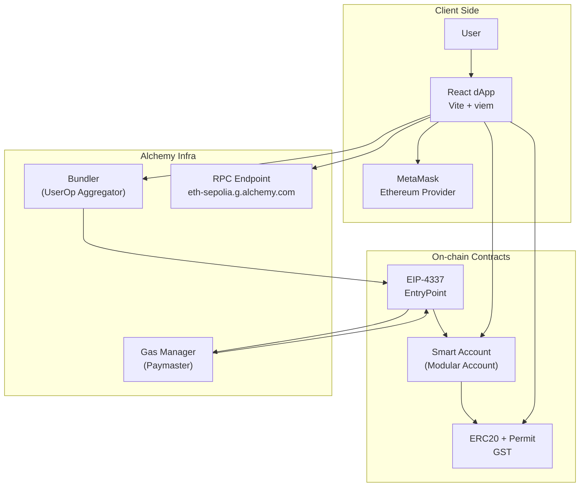
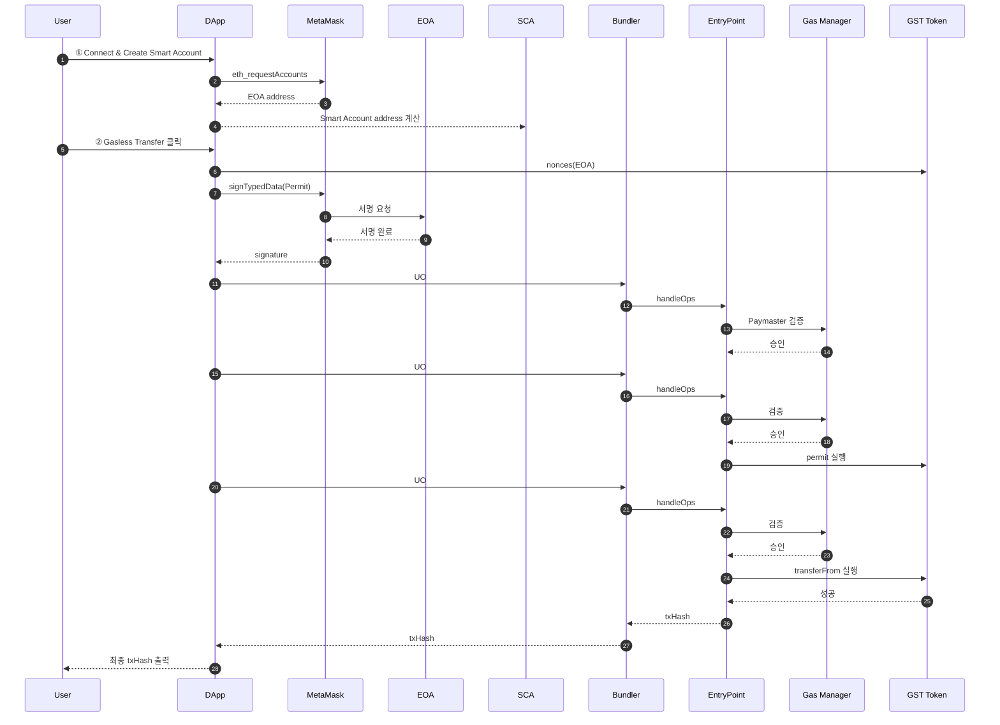

# Gasless ERC-20 Transfer · Sepolia · Alchemy Account Kit

MetaMask EOA 지갑만으로 **가스비를 직접 지불하지 않고** ERC-20 토큰을 전송하는 PoC 프로젝트입니다.
Alchemy Account Kit(모듈러 Smart Account) + Gas Manager(Paymaster) + ERC-20 `permit & transferFrom` 조합을 통해 **가스리스 토큰 전송 UX**를 구현·검증합니다.

---

## 1. 개요

- **네트워크:** Sepolia Testnet
- **지갑 구성**

  - EOA: MetaMask 계정
  - SCA: Alchemy Modular Smart Account

- **토큰:** ERC-20 GasSponsorTest(GST) — EIP-2612 Permit 지원
- **가스비 구조**

  - 모든 UserOperation 가스비는 **Alchemy Gas Manager 정책**(`policyId`)에 의해 전액 대납
  - EOA의 ETH 잔고는 변화 없음

> 본 프로젝트는 실제 서비스의 가스리스 UX 도입을 위한 연구·프로토타입 구현(PoC)입니다.

---

## 2. 주요 기능

### MetaMask EOA 기반 Smart Account 생성

- `@account-kit/smart-contracts` 사용
- Alchemy Bundler + Gas Manager 연동
- EOA 기반 deterministic SCA 주소 생성 및 자동 배포

### Smart Account 배포 및 기본 UserOperation

- 배포 여부 확인 후 필요 시 **no-op UO**로 자동 배포
- 기본 end-to-end 경로 테스트용 UO 실행

### SCA 잔고에서 GST 전송

- Smart Account가 보유한 GST를 recipient에게 전송
- 모든 가스비는 Gas Manager가 스폰

### EOA 잔고에서 가스리스 GST 전송 (핵심 기능)

- EOA는 permit 서명만 수행 (**오프체인**)
- Smart Account가 UO 2개로 처리:

  - UO #1: `permit(owner, SCA, amount)`
  - UO #2: `transferFrom(owner → recipient)`

- **EOA의 ETH 잔고 변화 없음**, 토큰만 이동

### Alchemy Dashboard 연동

- no-op / permit / transferFrom UO 3개 모두
  **Sponsored** 상태로 Dashboard에서 확인 가능

---

## 3. 아키텍처 개요 (Mermaid)



---

## 4. 사전 준비 사항

1. **Node.js 18+**
2. **MetaMask 브라우저 확장 프로그램**
3. **Alchemy Account Kit / Gas Manager 설정**

   - API Key
   - Gas Policy ID

4. **Permit 지원 ERC-20 토큰(GST) Sepolia 배포**
5. **테스트넷 ETH (Sepolia faucet)**

---

## 5. 환경 변수 설정 (.env)

```bash
# Alchemy Keys
VITE_ALCHEMY_API_KEY=your_alchemy_api_key
VITE_ALCHEMY_GAS_POLICY_ID=your_policy_id

# Network
VITE_NETWORK=sepolia

# ERC-20 Token Metadata
VITE_TOKEN_ADDRESS=0xYourTokenAddress
VITE_TOKEN_NAME=GasSponsorTest
VITE_TOKEN_SYMBOL=GST
```

---

## 6. 프로젝트 실행 방법

```bash
# Install dependencies
npm install
# or
yarn install
# or
pnpm install

# Run dev server
npm run dev
# or
yarn dev
# or
pnpm dev
```

브라우저에서:
👉 [http://localhost:5173](http://localhost:5173)

---

## 7. UI 사용 방법

### 7.1 「① MetaMask 연결 + Smart Account 생성」

- MetaMask 팝업 → 계정 연결
- React dApp이 Smart Account 주소 생성
- EOA / SCA 주소 표시

### 7.2 「② no-op UserOperation 테스트」

- Smart Account 미배포 시 자동 배포
- Bundler → EntryPoint → GM(Paymaster) 순으로 UO 실행
- 가스비는 Paymaster가 대납

### 7.3 「③ [SCA 잔고] GST 전송」

- SCA가 보유한 GST 전송
- 가스비는 Gas Manager 스폰

### 7.4 「④ [EOA 잔고] 가스리스 GST 전송」(핵심)

- 내부 동작:

  1. `nonces(owner)` 조회
  2. EOA가 permit EIP-712 서명 (**오프체인 → 가스비 0**)
  3. UO #1: SCA가 permit 실행
  4. UO #2: SCA가 transferFrom 실행

- 결과:

  - recipient는 GST 수령
  - EOA GST 감소
  - **EOA ETH 잔고 변화 없음**
  - 2개의 UO → 모두 Dashboard “Sponsored”

---

## 8. 내부 동작 플로우 (시퀀스 다이어그램)



---

## 9. 가스비 절감을 위한 향후 개선

### Permit + Transfer 헬퍼 컨트랙트 도입

현재 permit → transferFrom은 **서로 다른 UserOperation 2개**로 실행됩니다.
이 때문에 EntryPoint·Paymaster 고정 오버헤드가 2번 발생합니다.

### 개선 아이디어

별도의 헬퍼 컨트랙트로 두 동작을 **하나의 UserOperation**으로 묶기:

```solidity
contract PermitAndTransferHelper {
    function permitAndTransfer(
        IERC20Permit token,
        address owner,
        address spender,
        address to,
        uint256 value,
        uint256 deadline,
        uint8 v,
        bytes32 r,
        bytes32 s
    ) external {
        token.permit(owner, spender, value, deadline, v, r, s);
        IERC20(address(token)).transferFrom(owner, to, value);
    }
}
```

### 기대 효과

- **UserOperation 2개 → 1개**
- Paymaster/EntryPoint 처리 오버헤드 절반 감소
- Gas Manager 비용 절감
- Dashboard에서도 단일 “Sponsored Operation”으로 단순화

---

## 10. 한계 및 주의 사항

- 본 프로젝트는 PoC이며,

  - 보안 감사
  - 쿼터/리밋 정책
  - 악의적 호출 방지
  - 프로덕션 수준 예외 처리
    등이 포함되어 있지 않습니다.

- Gas Manager 정책 설정은 서비스 정책에 맞게 별도 구성해야 합니다.
