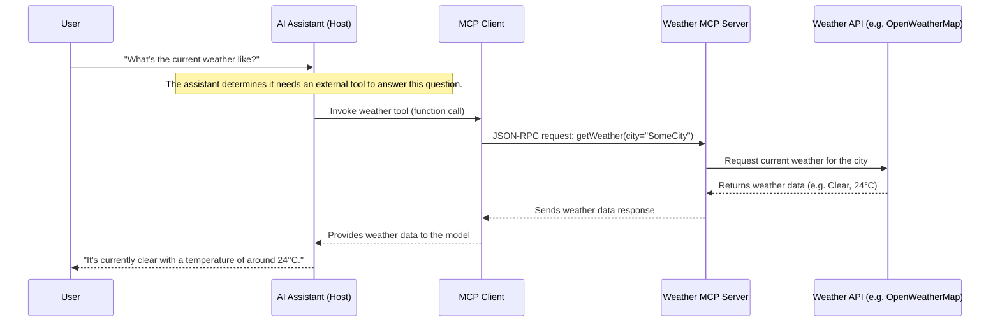

# **Anthropic’s Model Context Protocol (MCP)**

## **1. Introduction**

AI systems such as large language models have historically operated in isolation, unable to directly access up-to-date information or perform actions on external systems. This isolation – often described as the “M×N integration problem” – meant that each new AI application (of which there are M) required a custom connector to each external tool or data source (of which there are N), leading to a proliferation of one-off integrations[[4]](#reference-4). Such fragmentation made it difficult to scale AI assistants across diverse enterprise content repositories, business tools, and development environments[[1]](#reference-1). In late 2024, Anthropic introduced the **Model Context Protocol (MCP)** to tackle this challenge[[1]](#reference-1). MCP is an **open standard** that provides a universal method for connecting AI assistants with the systems where data and knowledge reside, effectively replacing isolated, bespoke integrations with a single standardized protocol[[1]](#reference-1). The concept is analogous to how the USB standard unified device connectivity: *“Think of MCP like a USB-C port for AI applications”*, offering a common interface to plug in any data source or tool[[2]](#reference-2).

By adopting MCP, the integration complexity is reduced from M×N to **M+N**[[4]](#reference-4). Tool creators build **N** MCP-compliant servers (one per external system), and AI application developers implement **M** clients (one per application), all speaking the same protocol. This decoupling streamlines development effort and ensures consistency across implementations[[4]](#reference-4). MCP’s design draws inspiration from prior standards like Microsoft’s Language Server Protocol (LSP), which similarly standardized how IDEs interact with programming language backends[[3]](#reference-3). Just as LSP enabled any editor to work with any programming language through a common protocol, MCP enables any AI agent or assistant to interface with any data source or service via a unified **model–context–protocol**.

In summary, MCP’s emergence addresses a critical gap in the AI ecosystem: it breaks LLMs out of their “information silos” by **open-sourcing a secure, two-way interface** between models and external data[[1]](#reference-1). This promises more relevant and context-rich model outputs, as assistants can now draw on live information and perform actions in real time. The following sections delve into MCP’s technical architecture, usage scenarios, benefits and limitations, and how it compares to other approaches like Retrieval-Augmented Generation (RAG) and custom tool APIs.

## **2. Architecture and Operation**

**Client–Server Model:** MCP follows a modular client–server architecture. An AI application acting as the *MCP Host* establishes connections to one or more external *MCP Servers* via an *MCP Client* component embedded in the host[[3]](#reference-3). The **host** is the user-facing AI assistant or agent (for example, the Claude desktop app, an IDE plugin, or a custom chatbot interface)[[3]](#reference-3). Inside the host, an **MCP client** module manages a 1:1 connection to a specific server – multiple clients may run in parallel if multiple servers are used, ensuring each integration is isolated[[3]](#reference-3). An **MCP server** is a lightweight external program that exposes a particular system’s functionality (e.g. a connector to Slack, GitHub, a database, or a filesystem) through the standardized protocol[[3]](#reference-3). This design cleanly separates the AI model application from the data-source implementations.

**Server Capabilities:** Each MCP server advertises a set of capabilities that it can provide to the AI model via the client. These fall into three categories defined by the MCP specification[[4]](#reference-4):

* **Tools** – Functions or operations that the model can invoke to perform an action (for example, call an external API, execute a command, or modify data). Tools are analogous to the “function calling” mechanism in LLMs, allowing the model to actively query or update external systems[[4]](#reference-4).

* **Resources** – Read-only data sources that the model can access as context. These are like documents, database queries, or other information retrieval endpoints that provide content to the model without side effects (similar to GET requests in a REST API)[[4]](#reference-4). Resources are fetched under the host application’s control (e.g. the client decides when to supply a resource to the model’s context).

* **Prompts** – Predefined prompt templates or workflows that can be injected into the model’s context to guide its behavior in certain scenarios[[4]](#reference-4). Prompts might represent instructions or patterns (for instance, a code review template) and are typically selected by the user or developer before the model generates output.

These capability types differ in how they are used and controlled. **Tools** are *model-controlled* – the AI agent decides during its reasoning to invoke a tool when needed. **Resources** are *application-controlled* – the client/host logic decides when to provide resource data to the model (for example, fetching relevant documents at query time). **Prompts** are *user-controlled*, meaning they are chosen by the user or predefined by developers to influence the model’s behavior[[3]](#reference-3).

**Protocol and Communication:** Communication between an MCP client and server is handled via a defined message protocol over flexible transports. MCP uses **JSON-RPC 2.0** as the message format for all requests, responses, and notifications[[2]](#reference-2). Each server typically specifies a **handshake** procedure when the connection starts: the client sends an initialization request and the server replies with its identity and supported capabilities (the list of tools, resources, prompts it provides)[[4]](#reference-4). This discovery step allows the host to dynamically learn what the server can do. After this setup, the host application can enable the model to utilize those capabilities. For example, the host might expose each server tool as an available function call to the LLM or display server-provided prompts for user selection. At runtime, when the LLM’s output logic decides to invoke a tool or needs a resource, the MCP client sends a JSON-RPC request to the server specifying the action and parameters. The server then **executes** the requested operation (e.g. calling an external API or retrieving data from a database) and returns the result back in a response message[[4]](#reference-4). The client receives the result and forwards it to the host/LLM, which incorporates that data into its own reasoning or user-facing answer. This request–response loop can repeat multiple times in a session as the AI interacts with various tools.

MCP’s use of JSON-RPC means it is transport-agnostic. In practice, two standard transport modes are provided: **stdio** (standard input/output streams) for local servers, and **HTTP Server-Sent Events (SSE)** for remote servers[[2]](#reference-2). A host can, for instance, spawn a server process locally and communicate via pipes, or connect to a server running on a remote endpoint via HTTP. The SSE transport supports streaming responses (allowing servers to send incremental data or progress updates to the client). Developers may also implement custom transport layers as needed, but all adhere to the same JSON-RPC message schema.

**Security and Control:** MCP is designed with security in mind, recognizing that external tools should not have unlimited access to the host environment or the model’s behavior. The one-client-per-server architecture naturally sandboxs integrations[[3]](#reference-3). Additionally, an MCP client can define **Roots** – specific allowed directories or resource scopes on the host that a server is permitted to interact with[[3]](#reference-3). For example, a filesystem server might be restricted to only a certain folder, or a database server only to certain tables. This prevents servers from reading or modifying arbitrary data on the host. Another feature, **Sampling**, reverses the usual roles by allowing the server to request the client (and its AI model) to perform a computation[[3]](#reference-3). In a sampling request, the server sends a prompt to the client asking for an LLM completion (for instance, to summarize a document or to generate text based on some template). The host retains the authority to approve or refuse such requests and controls which model is used, ensuring that an untrusted server cannot force the AI to do unwanted tasks or exceed usage limits[[3]](#reference-3). This mechanism enables servers to leverage the AI for complex processing (offloading tasks to the model) while maintaining *client-side oversight* on model usage, model selection, and data privacy. Together, these safeguards (roots, isolated clients, and client-vetted sampling) ensure that MCP integrations remain robust and secure.

### **3. Example Workflow**

To illustrate how MCP operates in practice, consider a scenario where a user asks an AI assistant: “What’s the current weather like?”. The assistant doesn’t have this knowledge in its model weights, so it needs to fetch the information from an external source (a weather API). Using MCP, the interaction would proceed as follows:

In this example, the AI assistant (Host) recognizes that a weather tool is available via MCP. It sends a request through the MCP client to the weather server, which then fetches real-time data from an external weather API. The resulting weather information (e.g., clear, 24°C) is returned to the model, which then generates a natural response for the user.

All of this happens seamlessly because the weather integration follows the MCP standard – the assistant only needs to know that the tool exists. This example demonstrates how MCP enables real-time retrieval of relevant information during a conversation.

## **4. Applications and Use Cases**

MCP’s generality enables a broad array of use cases where LLMs act as intelligent agents connected to real-world data and services. Key application domains include:

* **Enterprise Knowledge Retrieval:** AI assistants in business settings can use MCP to securely access internal knowledge bases, documents, and communications. For example, an MCP server could connect to a company’s Google Drive or Slack workspace, allowing a chatbot to search files or conversation history to answer user questions with up-to-date information[[1]](#reference-1). This helps overcome the model’s knowledge cutoff by pulling in relevant context from “where the data lives,” resulting in more accurate and context-aware responses. Organizations like Block (Square) and Apollo have integrated MCP to link their AI systems with internal data, reducing information silos and enabling more informed assistance[[1]](#reference-1).

* **Software Development Assistants:** Developer tools and IDEs leverage MCP to give coding assistants access to project-specific resources. An AI coding assistant can query code repositories, issue trackers, or documentation via MCP servers (e.g. a GitHub or Git server connector) and use that context to improve code generation and debugging. Companies such as Replit, Codeium, Zed, and Sourcegraph have collaborated on MCP integrations that let AI models retrieve relevant code snippets, search for functions or errors, and incorporate that context into their suggestions[[1]](#reference-1). This leads to more useful and correct code completions, as the model isn’t limited to its training data – it can see the actual codebase and project history on demand.

* **Web Browsing and Automation:** MCP can turn an LLM into a web agent. With a browser automation server (such as those built on Puppeteer or Playwright), a model can navigate web pages, scrape information, or perform web-based actions. Anthropic provides a Puppeteer MCP server for browsing, and Microsoft has developed a Playwright MCP server for similar browser automation tasks[[5]](#reference-5). This means a chatbot could answer a query by going out to the web to fetch the latest information, fill out forms, or interact with web applications, all through standardized MCP calls. Crucially, this is done in a controlled manner – the model asks the server to perform actions, and the results come back as data for the model to interpret.

* **Database and API Access:** Many agents need to query databases or call business APIs. Rather than hand-coding database queries into an agent, developers can use MCP servers for databases (SQL or NoSQL) to let the model fetch records or perform analytics queries in response to user prompts. Similarly, any REST API can be wrapped as an MCP server (or accessed via a generic HTTP-request tool) so that the AI can retrieve up-to-date data (e.g. stock prices, weather information) or trigger transactions. This turns a static chatbot into a dynamic assistant that can act as an interface to software systems.

* **Open-Source Extensions:** The MCP ecosystem is growing rapidly. The community has created MCP connectors for an enormous range of services and tools – from cloud platforms and productivity apps to IoT devices. As of early 2025, there were already **over 1,000** open-source MCP servers contributed by the community, along with many official integrations from tech companies[[3]](#reference-3). This library of connectors functions like an “app store” for AI capabilities: developers can pick and plug in existing MCP servers to equip their LLM-based application with new skills (search, scheduling, communications, etc.) without writing bespoke integration code. For instance, if one needs an AI assistant to analyze system logs, one could deploy a community-contributed MCP server for log data (such as the Parseable log analytics example) and immediately enable the model to query and summarize logs. This extensibility and reuse is a core benefit of the MCP approach.

In summary, MCP’s use cases span any scenario where an AI agent needs external knowledge or the ability to take actions. From answering customer support questions with data pulled from a CRM, to writing code with awareness of the project’s repository, to automating routine web tasks, the Model Context Protocol provides the connective tissue to make advanced **context-aware** and **action-oriented** AI possible.

## **5. Comparison with Related Approaches**

**MCP vs. Traditional API Integrations:** Before MCP, integrating an LLM with external tools often meant using custom APIs or plugins specific to each application. For example, one might write bespoke code for a chatbot to call a weather API or query a database. This approach is labor-intensive and brittle: each new integration is a separate project, and cross-platform compatibility is poor. OpenAI’s plugin framework, for instance, allows some standardized API calling, but it is largely confined to the OpenAI ecosystem and still requires an OpenAPI specification per tool. In contrast, MCP provides a unified, model-agnostic framework. Tools are self-describing (via the capability discovery step) and any MCP-compliant client can use any server. This significantly reduces duplicated effort. Moreover, maintenance is easier – if a service’s API changes, only the MCP server needs updating, rather than every client implementation. MCP’s standardized messaging (JSON-RPC) also means logging, debugging, and security auditing can be done in a uniform way across all tools, unlike the heterogeneous methods used in traditional integrations.

**MCP vs. Retrieval-Augmented Generation (RAG):** RAG is a technique to feed external knowledge into LLMs by retrieving documents (often via vector similarity search) and appending them to the model’s prompt. RAG is very useful for Q\&A over text corpora, but it has limitations: it only **augments the model’s context** (the model still just predicts text, not performing structured actions), and it’s essentially read-only. MCP and RAG actually address complementary aspects. RAG is great for unstructured knowledge lookup, while MCP provides structured access to live data and the ability to perform operations. MCP can subsume the function of RAG by hosting a “retrieval” server (for example, a server that given a query returns relevant documents from an index), but it also goes further – enabling the AI to **act** (e.g. create files, send messages) not just read. One can think of RAG as a subset of the broader tool-use paradigm that MCP supports. Experts note that MCP’s scope overlaps with RAG’s purpose of providing current data, and as MCP adoption grows, traditional RAG pipelines may be re-cast as MCP servers for retrieval[[7]](#reference-7). However, RAG will remain useful for cases where a lightweight solution is sufficient or where deep domain text search is needed – in fact, the two approaches can be used together (for instance, an agent might use an MCP tool to do a semantic document search, then feed the results into the model). In summary, MCP generalizes external knowledge integration (and action execution), offering a more standardized but also more involved solution compared to RAG’s focused retrieval strategy.

## **6. Advantages and Limitations**

### **Advantages**

MCP has quickly gained momentum because it offers multiple advantages over ad-hoc integration methods:

* **Unified Standard, Less Complexity:** By providing a single protocol for all model-tool integrations, MCP dramatically reduces the engineering effort to connect AI systems with new data sources[[4]](#reference-4). Developers no longer need to write custom glue code for each new service or maintain M×N integrations; instead, they can rely on the universal MCP interface. This standardization improves compatibility and interoperability across platforms[[6]](#reference-6).

* **Flexibility and Vendor-Neutrality:** MCP is model-agnostic and tool-agnostic – any LLM or AI agent that speaks the protocol can work with any compliant server. This means organizations can switch out the underlying model or add new backend tools without redesigning the integration[[6]](#reference-6). It avoids vendor lock-in on both sides (LLM providers and software vendors), supporting a more open ecosystem. For instance, the same document database MCP server could serve context to either Anthropic’s Claude or OpenAI’s GPT-based assistant with minimal changes.

* **Dynamic Discovery of Capabilities:** Unlike hard-coded tool APIs, MCP allows AI clients to **discover available tools and resources at runtime**[[6]](#reference-6). This enables more adaptive agents that can configure themselves to a new environment or user context. The model (or host application) can query what a connected data source can do and tailor its behavior accordingly, increasing adaptability.

* **Real-Time Data and Actions:** An MCP-enabled AI isn’t limited to its training data – it can fetch live, up-to-date information on demand and even take actions in external systems. This greatly improves the relevance and correctness of responses (e.g., answering with the latest data) and enables use cases like executing transactions or updating records. The bidirectional nature of MCP (read and write) goes beyond what retrieval-only methods provide[[7]](#reference-7).

* **Security and Privacy Controls:** MCP was designed with an emphasis on security: connections can be constrained by scope (using roots and permission settings) and run entirely within a company’s firewall or local machine. Sensitive data can remain on-premises; the model only sees what the MCP server provides. This addresses concerns of exposing confidential data to third-party services. Anthropic specifically built MCP to encourage “best practices for securing your data within your infrastructure”[[2]](#reference-2).

* **Reduced Maintenance Overhead:** Updates to integrations are easier – if an API changes or a new feature is needed, developers can update the MCP server implementation in one place. The clients using that server don’t need code changes as long as the protocol interface remains consistent[[6]](#reference-6). This decoupling means fewer points of failure and faster iteration. Organizations can also reuse and share MCP servers, benefitting from community improvements.

* **Growing Ecosystem:** Because MCP is open-source, a collaborative community has formed to build connectors and improve the protocol. Hundreds of integrations are freely available[[3]](#reference-3), and industry support is rising (e.g., Microsoft’s adoption and SDK support[[5]](#reference-5)). This network effect means developers can leverage existing solutions and contribute back, accelerating innovation in AI agent capabilities.

### **Limitations**

While promising, MCP is not a silver bullet and has certain limitations or challenges:

* **Requirement for Agentive Models:** Using MCP effectively requires LLMs that can decide when and how to use external tools. Not all AI models have this “agent” capability readily enabled. Often, complex prompt engineering or fine-tuning is needed to teach a model to invoke MCP tools appropriately. If the model fails to pick the right tool or parse the results correctly, the benefits of MCP diminish. In practice, frameworks that support function calling or planning (e.g., GPT-4’s function calling API or Claude’s agent loops) are needed to harness MCP.

* **Still Bound by Context Windows:** Even though MCP can provide external information, an LLM is still limited by its context window when incorporating that information. The data retrieved by an MCP server must fit into the model’s input (prompt). If the retrieved content is large (e.g., a long document or extensive query result), it may need to be summarized or truncated. This is similar to the challenge faced in RAG; MCP provides a structured way to get the data, but it doesn’t magically expand the model’s memory. Developers must manage how much info to feed the model at once.

* **Latency and Complexity:** Introducing external calls can slow down response generation. Each tool invocation or data fetch is an I/O operation that may incur network or processing delays. For the user, a chat response that requires multiple MCP calls (say, searching emails, then querying a database) will be slower than a response that the model could answer from its internal knowledge. Caching frequently used results or carefully orchestrating calls is necessary to mitigate latency. Additionally, running multiple MCP servers and ensuring they are operational adds complexity to the system architecture.

* **Ecosystem Maturity:** As of 2025, MCP is an emerging standard. While adoption is growing, not every software service has an MCP connector available, and not every AI platform natively supports MCP out-of-the-box. This means early adopters might need to write some glue code or spin up servers for less common tools. There is a risk of fragmentation if different standards compete (though MCP has significant momentum with support from major AI companies). Over time, consistency and official support should improve, but in the interim, integration effort might still be required in some cases.

* **Security Misconfiguration Risks:** Though MCP is designed with security features, improper use can introduce vulnerabilities. For example, if an MCP server is exposed to remote connections without proper authentication or if root permissions are set too broadly, malicious actors could potentially exploit the link. Developers must follow best practices (e.g., restrict network access to local MCP servers, validate origins for remote transports[[2]](#reference-2), and carefully scope roots) to avoid creating openings for attacks. Also, giving an AI the ability to execute actions via tools must be done with user oversight to prevent unintended consequences.

* **Complementary (Not Replacement) to Other Methods:** MCP excels at structured tool integration, but it doesn’t eliminate the need for other techniques like vector search in all cases. For unstructured knowledge bases or open-ended web search, traditional RAG pipelines (retrieve documents via embeddings) might still be used, potentially alongside MCP. In fact, RAG can be implemented as an MCP resource (e.g. an MCP server that interfaces with a vector database). Thus, developers must choose the right approach for the problem – MCP provides the infrastructure, but good results still depend on designing the overall solution (which data to retrieve, how to prompt the model, etc.) appropriately.

## **7. Conclusion**

The advent of the Model Context Protocol marks an important step toward more **integrated and context-aware AI**. By standardizing how AI models interface with external data and tools, MCP opens the door to assistants that can truly leverage the breadth of digital information and services available. Early results are promising – developers are rapidly building connectors, and major AI providers are embracing the protocol, indicating that MCP (or something very much like it) could become a de facto layer in the AI stack. There are still challenges ahead, from refining agent behaviors to ensuring security at scale, but MCP’s open, community-driven approach provides a strong foundation to address them. In essence, MCP moves us closer to AI systems that are not just smart in isolation, but **plugged into the world** – able to retrieve, reason, and act using real-time context. This convergence of large language models with live data and action is a key enabler for the next generation of AI applications.

## **8. References**

 1. Anthropic. *Introducing the Model Context Protocol (MCP)*. Anthropic News, Nov. 2024\. Available: https://www.anthropic.com/news/model-context-protocol

 2. Anthropic. *Model Context Protocol – Official Documentation* (v1.0), 2024\. Available: https://modelcontextprotocol.io

 3. M. Maheswaran. *MCP 101: An Introduction to Model Context Protocol*. DigitalOcean Community Tutorial, 2025\. Available: https://www.digitalocean.com/community/tutorials/model-context-protocol

 4. P. Schmid. *Model Context Protocol (MCP) – an overview*. Personal Blog, Apr. 2025\. Available: https://www.philschmid.de/mcp-introduction

 5. M. Kistler and M. Naggaga. *Microsoft partners with Anthropic to create official C\# SDK for Model Context Protocol*. Microsoft DevBlogs, Apr. 2025\. Available: https://devblogs.microsoft.com/blog/microsoft-partners-with-anthropic-to-create-official-c-sdk-for-model-context-protocol

 6. T. K. Koç. *MCP: Model Context Protocol — MCP vs. Traditional APIs & RAG*. Medium, Mar. 2025\. Available: https://medium.com/nane-limon/mcp-model-context-protocol-mcp-vs-traditional-apis-rag-81eebff65111

 7. J. Ge. *RAG vs MCP: Makes sense? Is RAG dead?* Medium, Mar. 2025\. Available: https://medium.com/@gejing/rag-vs-mcp-makes-sense-is-rag-dead-134856664cd6
